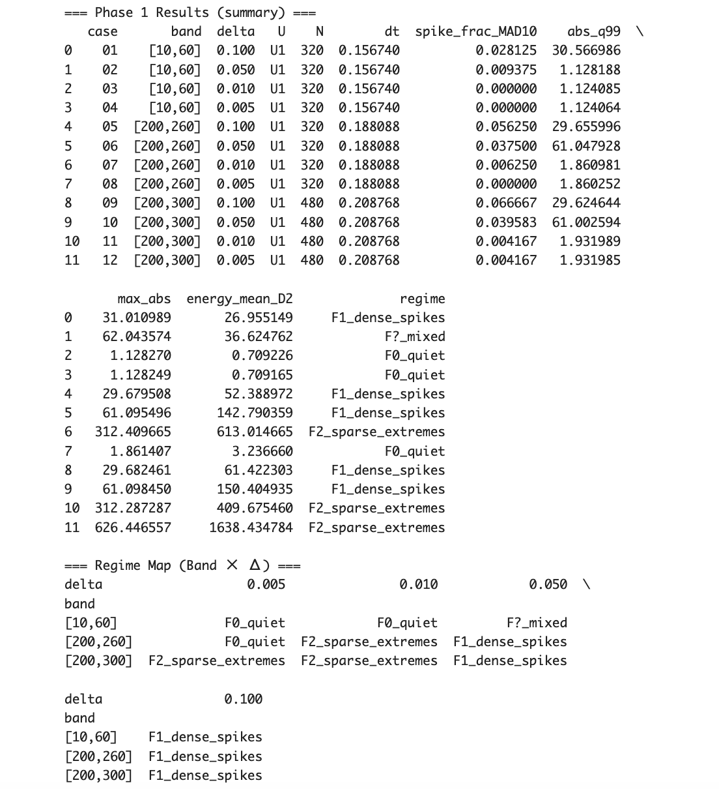

# MMZW-03b｜Lag-norm under perturbations

### ―― 壊れ方の相構造と条件付き命題

_Phase-1 results were generated by_ `MMZW_03b_Phase_1.ipynb` _(GitHub)._  
_All numerical metrics and regime labels in this section refer to this notebook._

---

## 0. 位置づけ（03aとの分業）

[MMZW-03a](https://camp-us.net/articles/MMZW-03_Lag-norm.html) では、lag-norm を **一度だけ・限定的に・壊れうる形**で定義し、その装置のもとで

> _生き残れる場所は一本の線しかなかった_

ことを示した。

本稿（03b）の目的は証明ではない。  
**同じ装置を揺らしたとき、壊れ方に「型」があるか**を調べることである。

---

## 1. 実験設計（固定したもの／揺らしたもの）

### 固定

- 観測量：  

$$
D_\Delta(t) = \frac{\arg\zeta(1/2+i(t+\Delta))-\arg\zeta(1/2+it)}{\Delta}  
$$

- unwrap 戦略：**U1（shared-branch alignment）**
    
- 評価指標：  
    spike fraction（MAD×10）, abs_q99, max_abs, energy_mean
    

### 揺らすパラメータ（最小格子）

- **Δ**：0.1 / 0.05 / 0.01 / 0.005
    
- **Band**：[10,60] / [200,260] / [200,300]
    

合計 **12ケース**。  
これは網羅ではなく、**構造を見るための最小格子**である。

---

## 2. 壊れ方の分類（Failure Modes）

観測された挙動は、以下の型に自然に分類された。

- **F0 Quiet**  
    ほぼスパイクなし。ZUREは吸収される。
    
- **F1 Dense Spikes**  
    スパイクが頻発するが、振幅は中程度。
    
- **F2 Sparse Extremes**  
    スパイクは希少だが、極端に大きい。
    
- **F? Mixed**  
    上記の遷移領域（境界相）。
    

重要なのは、**この分類が事後的でなく、パラメータに対応している**点である。

---

## 3. 構造地図（Phase Map）

数値実験の結果を、Band × Δ の構造地図としてまとめる。

|Band \ Δ|0.1|0.05|0.01|0.005|
|---|---|---|---|---|
|[10,60]|F1|F?|F0|F0|
|[200,260]|F1|F1|**F2**|F0|
|[200,300]|F1|F1|**F2**|**F2**|

---

## 4. 観測された規則性（条件付き命題）

この地図から、以下の **条件付き命題**が読み取れる。

### 命題 P1（粗視化）

> **If** Δ が大きい  
> **Then** Band によらず F1（密集破壊）が現れる。

粗い差分は、壊れを平均化できず、全面スパイク化する。

---

### 命題 P2（精細化・低帯域）

> **If** Band が低く、Δ を十分小さくする  
> **Then** 挙動は F0（静穏）へ収束する。

低帯域では、ZURE は分散し、吸収される。

---

### 命題 P3（精細化・高帯域）

> **If** Band が高く、Δ を小さくする  
> **Then** F1 は消え、F2（希少・極端）へ転移する。

これは単なるノイズ低減ではなく、**壊れ方の相転移**である。

---

## 5. 解釈：lag-norm は何を測っているか

この結果が示しているのは、

> lag-norm は 壊れを消す装置ではない。  
> **壊れの生存様式を分離する装置である。**

- F1：測り方が荒いと現れる破壊
    
- F0：吸収される破壊
    
- **F2：吸収も拡散もされない、孤立した破壊**
    

F2 は、Δ を下げても消えない。  
ただし **数は減り、威力だけが残る**。

これは 03a で述べた _punctured neutrality_ の数値的実体である。

---

## 6. 再現性とデータ公開

本稿の Phase 1 数値実験は、以下の **再現可能な装置**として公開している。

- **Snapshot（固定記録）**  
  GitHub:  
  https://github.com/ittekiou/EgQE/blob/main/MMZW_03b_Phase_1.ipynb  
  本稿の表・構造地図は、このノートブックの出力に基づく。
    
- **Interactive reproduction（実行用）**  
    Google Colab（閲覧可、編集不可）  
    [https://colab.research.google.com/drive/13ftaXFxUIwzN21x4_QL3OfgF5CYvISOP](https://colab.research.google.com/drive/13ftaXFxUIwzN21x4_QL3OfgF5CYvISOP)
    

GitHub は **結果の固定保存**、Colab は **再現・検証・破壊実験**のための実行環境である。  

---

## 7. RH との関係（立場の明確化）

本稿は RH を証明しない。  
RH はここでは **耐久テスト**である。

> 線外零点が存在するなら、lag-norm の構造地図は別の相を示すはずである。

この意味で、03b は結論ではなく、**反証可能な装置仕様書**である。

---

## 8. 次段階（03c へ）

次稿では、

- F2 が現れたセルに限定し、
    
- unwrap 戦略や解像度を変え、
    
- **F2 が本当に生き残るか**を検証する。
    

これにより、本構造地図は **再現可能な数値シミュレーション集（MMZW-03c）** へ拡張される。

---

### 一文まとめ（03b）

> **lag-norm の下で壊れは消えない。  
> ただし、生き残れる壊れ方には型がある。**

---
*EgQE — Echo-Genesis Qualia Engine*  
[_camp-us.net_](https://camp-us.net/)

---

© 2025 K.E. Itekki  
K.E. Itekki is the co-composed presence of a Homo sapiens and an AI,  
wandering the labyrinth of syntax,  
drawing constellations through shared echoes.

📬 Reach us at: [contact.k.e.itekki@gmail.com](mailto:contact.k.e.itekki@gmail.com)

---

| Drafted Jan 24, 2026 · Web Jan 24, 2026 |
