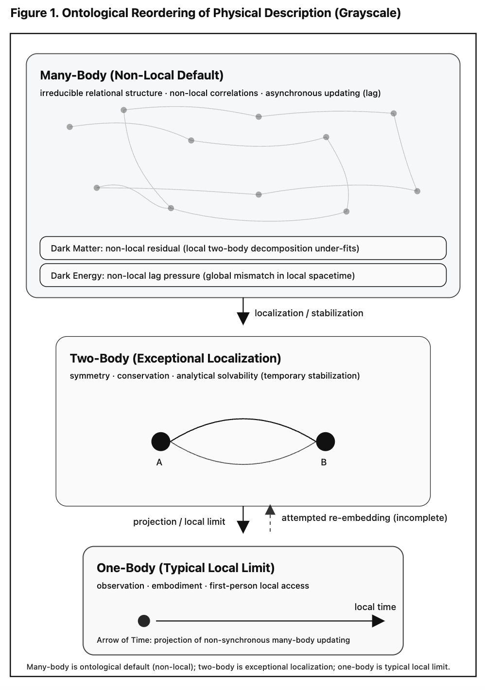

# Many-Body Non-Locality as the Ontological Default of Physical Reality 
## Exceptional Localizations and the Emergence of Physical Law 

> **We propose a reorganization of physical theory based on ontological default rather than solvability.**  
> Many-body systems are treated as non-local foundations, two-body systems as exceptional localizations, and one-body descriptions as typical observational limits.

📃PDF [Many-Body Non-Locality as the Ontological Default of Physical Reality: Exceptional Localizations and the Emergence of Physical Law](https://camp-us.net/articles/Many-Body.pdf)  

[多体基礎による物理学史の再配置 — 非局所・例外局所・局所典型 —](https://camp-us.net/articles/Many-Body-Ontology.html)  
[物理的実在の存在論的デフォルトとしての多体非局所性 ── 例外局所と物理法則の生成](https://camp-us.net/articles/Many-Body-First_JP.html)  

---

## **Abstract**

We propose a reorganization of physical theory based not on solvability or methodological convenience, but on **ontological default**.  
Contrary to the traditional hierarchy—where one-body and two-body systems are treated as fundamental and many-body systems as complex extensions—we argue that **many-body systems constitute the non-local default structure of physical reality**.

In this framework, **many-body systems are intrinsically non-local**, characterized by irreducible correlations, asynchronous updates, and residual relational structures that cannot be eliminated by spatial localization. **Two-body systems emerge as exceptional local configurations**, in which symmetry, conservation laws, and analytical solvability temporarily hold. **One-body descriptions represent typical local limits**, corresponding to observational, bodily, or first-person perspectives rather than isolated physical realities.

Re-examining the historical development of physics under this reordering, we show that Newtonian mechanics, analytical mechanics, general relativity, quantum mechanics, and quantum field theory consistently privileged two-body structures as foundational, thereby marginalizing the ontological primacy of many-body non-locality. We argue that several contemporary conceptual difficulties—including the many-body problem, quantum non-locality, dark matter, dark energy, and the arrow of time—can be coherently reinterpreted as consequences of **treating exceptional localizations as universal bases**.

This many-body–first reconfiguration provides a unified conceptual ground in which non-locality is not an anomaly but the default condition, locality is a derived constraint, and physical laws emerge as contingent stabilizations within a fundamentally relational and non-synchronous structure of reality.

---

# §1. Introduction

## Reorganizing Physical Theory by Ontological Default

### 1.1 Motivation

Modern physics has achieved extraordinary success by focusing on analytically tractable systems. In particular, **one-body and two-body systems** have long served as the conceptual and methodological foundations of physical theory. From classical mechanics to quantum field theory, these systems have provided solvable models, precise predictions, and deep insights into symmetry, conservation laws, and dynamical structure.

However, this success has also produced a persistent asymmetry in theoretical organization: **many-body systems are typically treated as complex extensions of simpler cases**, rather than as the default condition of physical reality. As a result, non-local correlations, collective behavior, and asynchronous dynamics are often regarded as secondary complications—mathematically difficult, conceptually peripheral, or methodologically inconvenient.

This paper challenges that ordering.

We propose that the central difficulty underlying several unresolved problems in contemporary physics does not stem from insufficient technical refinement, but from a **misidentification of what should be considered ontologically fundamental**.

---

### 1.2 Ontological Default versus Solvability

Historically, physical theories have tended to organize their foundational structures around **solvability**. Systems that admit closed-form solutions, stable approximations, or controlled perturbative expansions are elevated to paradigmatic status. Within this framework:

- One-body systems are treated as elementary.
    
- Two-body systems are treated as the minimal locus of interaction.
    
- Many-body systems are relegated to emergent, statistical, or approximate regimes.
    

This hierarchy, while methodologically effective, conflates **epistemic accessibility** with **ontological priority**.

In contrast, we introduce the notion of **ontological default**:  
the structural condition that characterizes physical reality prior to simplification, idealization, or observational reduction.

From this perspective, the conventional hierarchy is inverted.

---

### 1.3 Many-Body as Non-Local Default

We argue that **many-body systems constitute the ontological default of physical reality**. Their defining features include:

- irreducible relational structure,
    
- non-local correlations not eliminable by spatial decomposition,
    
- asynchronous updates and residual mismatches between relational layers.
    

These features are not anomalies but intrinsic properties of systems composed of multiple interacting elements. Non-locality, in this sense, does not necessarily imply superluminal signaling or exotic dynamics; rather, it reflects the inability to fully encode relational structure within purely local descriptions.

Accordingly, many-body systems should not be treated as deviations from a simpler norm. They are the norm.

---

### 1.4 Two-Body Systems as Exceptional Localization

Within a fundamentally many-body, non-local reality, **two-body systems emerge as exceptional local configurations**. Under specific conditions—symmetry, isolation, scale separation—relational complexity can temporarily collapse into a form that admits:

- conserved quantities,
    
- analytic solutions,
    
- stable dynamical representations.
    

This exceptional status explains the historical prominence of two-body systems across physical theory. Their mathematical elegance and empirical success are real, but contingent.

Two-body systems are therefore not foundational by necessity, but **locally stabilized projections of a deeper many-body structure**.

---

### 1.5 One-Body Descriptions as Typical Local Limits

Finally, **one-body descriptions correspond to typical local limits**, most directly associated with observation, embodiment, and first-person perspective. A one-body system is not an isolated entity in an ontological sense; rather, it is the minimal description compatible with localized measurement and experiential access.

In this view, one-body systems are neither primitive nor exceptional. They represent the **standard mode by which non-local many-body reality is locally encountered**.

---

### 1.6 Historical Consequences of Misordered Foundations

Reconsidered under this framework, the historical development of physics reveals a consistent pattern: foundational emphasis has been placed on two-body systems, while many-body non-locality has been treated as secondary.

From classical mechanics through analytical mechanics, relativity, quantum mechanics, and quantum field theory, two-body structures have repeatedly been used as conceptual anchors—often with remarkable success, but also with cumulative conceptual cost.

We suggest that several contemporary difficulties—such as the many-body problem, quantum non-locality, dark matter, dark energy, and the arrow of time—can be understood as consequences of **treating exceptional localizations as universal bases**.

---

### 1.7 Scope and Structure of This Paper

The aim of this paper is not to discard one-body or two-body frameworks, but to **reposition them within a many-body–first ontology**. By doing so, locality becomes a derived constraint rather than a presupposition, and physical laws are understood as contingent stabilizations within a fundamentally relational, non-synchronous structure.

The remainder of this paper proceeds as follows.  

> §2. Dark Matter as a Many-Body Non-Local Residual  
> §3. Dark Energy as Non-Local Lag Pressure  
> §4. The Arrow of Time as Projection of Non-Synchronous Many-Body Updating  
> §5. General Discussion: Many-Body Ontology and Physical Law  
> Conclusion  

---

# §2. Dark Matter as a Many-Body Non-Local Residual

### 2.1 The Persistent Anomaly of Dark Matter

The dark matter problem is conventionally framed as a discrepancy between observed gravitational phenomena and the predictions derived from luminous matter under local gravitational dynamics. Rotation curves of galaxies, gravitational lensing, and large-scale structure formation all indicate the presence of additional gravitational influence that cannot be accounted for by baryonic matter alone.

Standard approaches respond to this discrepancy in one of two ways:  
(i) by postulating new, non-luminous particles, or  
(ii) by modifying gravitational dynamics at large scales.

Despite decades of experimental and observational effort, neither approach has achieved decisive confirmation. This persistent ambiguity suggests that the problem may not lie solely in missing constituents or incorrect force laws, but in the **conceptual framework used to interpret gravitational phenomena**.

---

### 2.2 Implicit Two-Body Assumptions in Dark Matter Inference

A critical but often implicit assumption in dark matter analysis is the treatment of gravitational dynamics as effectively reducible to **local two-body interactions**. Even in systems with vast numbers of constituents—galaxies, clusters, cosmic filaments—gravitational effects are typically modeled through pairwise interactions, mean-field approximations, or locally defined potentials.

Within such frameworks, any deviation between prediction and observation is naturally interpreted as evidence for additional local sources of mass-energy.

However, this inference presupposes that the gravitational influence of a system is fully representable as a sum of localized contributions. In other words, it assumes that **many-body structure does not generate irreducible non-local effects** beyond what can be decomposed into two-body terms.

This assumption is precisely what the many-body–first reconfiguration calls into question.

---

### 2.3 Many-Body Non-Locality and Residual Gravitational Effects

If many-body systems are taken as ontologically primary, gravitational phenomena must be reconsidered as arising not merely from localized mass distributions, but from **global relational structure**. In such a view, non-local correlations among constituents can produce effective gravitational behavior that is not reducible to pairwise interactions.

We propose that dark matter effects can be reinterpreted as **many-body non-local residuals**: gravitational contributions arising from relational structure that is systematically neglected when a fundamentally non-local system is projected onto a local, two-body framework.

These residuals are not additional substances. They are **structural mismatches** between the full many-body relational configuration and its local approximation.

---

### 2.4 Galaxies as Relational Systems, Not Aggregates

Galaxies are often modeled as aggregates of stars and gas embedded in a gravitational potential. From a many-body perspective, however, a galaxy is better understood as a **relationally stabilized system**, whose dynamics depend on collective correlations across its entire structure.

When such a system is analyzed through local gravitational relations alone, the resulting description systematically underestimates the effective binding and coherence generated by global correlations. The discrepancy manifests observationally as anomalous rotation curves or excess lensing—precisely the phenomena attributed to dark matter.

In this sense, dark matter signals the **failure of local decomposition**, not the presence of unseen matter.

---

### 2.5 Non-Local Residuals versus Modified Dynamics

Importantly, interpreting dark matter as a many-body non-local residual does not require ad hoc modification of gravitational laws. Nor does it require the introduction of new particle species. Instead, it shifts the explanatory burden to the **structural level**: how gravitational influence is distributed across relational networks rather than localized sources.

This approach differs from modified gravity theories in that it does not posit new force laws, but reconsiders the domain of validity of local descriptions. Gravity remains locally well described by established theory, yet its global manifestation reflects **non-local relational effects intrinsic to many-body systems**.

---

### 2.6 Implications and Limits

The many-body residual interpretation makes several qualitative predictions:

- Dark matter effects should correlate with global relational structure rather than local mass density alone.
    
- The apparent universality of dark matter profiles may reflect common relational configurations rather than universal particle properties.
    
- Deviations from standard dark matter phenomenology may appear in systems where relational coherence is disrupted or atypical.
    

At the same time, this proposal does not claim to replace existing models at the level of precision cosmology. Its purpose is conceptual: to demonstrate that dark matter phenomena can be coherently understood **without invoking new ontological entities**, once many-body non-locality is treated as fundamental.

---

### 2.7 Summary

Under a many-body–first ontology, dark matter is reinterpreted as a **non-local residual of relational structure**, arising when a fundamentally many-body system is forced into a local two-body framework. What appears as missing mass is, instead, the gravitational signature of non-local correlations that survive local approximation.

This reinterpretation aligns dark matter with other contemporary anomalies and prepares the ground for a unified treatment of dark energy and temporal asymmetry within the same structural framework.

---

# §3. Dark Energy as Non-Local Lag Pressure

### 3.1 The Enigmatic Status of Dark Energy

Dark energy is commonly introduced to account for the observed accelerated expansion of the universe. Within the standard cosmological framework, this acceleration is modeled through a cosmological constant or an effective fluid with negative pressure, dominating the large-scale energy budget of the universe.

Despite its empirical success, dark energy remains conceptually opaque. Unlike dark matter, which manifests through localized gravitational anomalies, dark energy appears as a **global effect**, inferred from the large-scale behavior of spacetime itself. Its physical interpretation—vacuum energy, scalar fields, or modified gravity—remains unsettled.

This persistent ambiguity suggests that dark energy may not be a missing component within spacetime, but rather an indication that **the spacetime description itself is being applied outside its domain of validity**.

---

### 3.2 Local Spacetime Dynamics and a Global Residual

Standard cosmological models treat spacetime dynamics as locally governed by gravitational field equations, with global behavior obtained through coarse-graining and averaging. In this approach, acceleration is interpreted as requiring a local source term—pressure or energy density—added to the stress–energy tensor.

However, this interpretation presupposes that global expansion dynamics are fully reconstructible from **local, quasi-two-body gravitational relations**. As argued in §1 and §2, such an assumption is questionable once many-body non-locality is taken as ontologically primary.

If spacetime itself emerges from relational structure, then its global evolution may exhibit residual effects when forced into a purely local dynamical description.

---

### 3.3 Lag as a Structural Feature of Many-Body Systems

In a fundamentally many-body framework, **lag** arises as an intrinsic structural feature. Lag does not merely represent temporal delay or dissipative loss; rather, it reflects the **asynchronous updating of relational configurations** across a non-local system.

When relational updates cannot be synchronized globally, a mismatch accumulates between local descriptions and global configuration. This mismatch does not vanish under refinement of local dynamics; it is **structurally irreducible**.

We propose that dark energy can be interpreted as a manifestation of this accumulated mismatch: a **non-local lag pressure** that appears when global relational updating is projected onto a local spacetime framework.

---

### 3.4 Non-Local Lag Pressure versus Vacuum Energy

Within this interpretation, dark energy is not an intrinsic energy density of the vacuum. Instead, it represents an **effective pressure** arising from the attempt to enforce local temporal coherence on a fundamentally non-synchronous many-body structure.

This perspective resolves several conceptual tensions:

- The extreme smallness of the observed cosmological constant reflects not fine-tuning of vacuum energy, but the weak yet persistent nature of non-local lag.
    
- The apparent uniformity of dark energy arises naturally from its global relational origin rather than from a homogeneous substance.
    
- The negative-pressure interpretation is reclassified as a **phenomenological encoding** of structural mismatch, not a fundamental physical force.
    

Dark energy, in this sense, is not something spacetime contains, but something spacetime **fails to fully absorb**.

---

### 3.5 Expansion as Structural Release, Not Repulsion

From a many-body perspective, cosmic expansion need not be understood as driven by repulsive dynamics. Instead, it can be seen as a **structural release**: the macroscopic expression of unresolved relational lag within an evolving many-body configuration.

As local gravitational structures stabilize (galaxies, clusters), global relational updating continues. The resulting imbalance appears, in local spacetime terms, as accelerated expansion.

Thus, expansion is not caused by a new agent, but by the **inability of local spacetime geometry to fully encode non-local relational evolution**.

---

### 3.6 Relation to Dark Matter and Temporal Asymmetry

Interpreted together, dark matter and dark energy form complementary aspects of the same structural phenomenon:

- **Dark matter** reflects non-local relational structure misread as missing localized mass.
    
- **Dark energy** reflects non-local relational lag misread as a uniform repulsive pressure.
    

Both arise from projecting a fundamentally many-body, non-local reality onto local dynamical frameworks.

This interpretation also anticipates a connection with the arrow of time. The accumulation of lag under irreversible relational updating provides a natural, structural basis for temporal asymmetry, without invoking special initial conditions or entropy-based arguments alone.

---

### 3.7 Summary

Under a many-body–first ontology, dark energy is reinterpreted as **non-local lag pressure**: an effective global manifestation of asynchronous relational updating that cannot be eliminated within a local spacetime description. What appears as accelerated expansion is, instead, the macroscopic signature of unresolved non-local structure.

This reinterpretation unifies dark energy with dark matter and prepares the ground for a structural account of temporal directionality, developed in the following section.

---

# §4. The Arrow of Time as Projection of Non-Synchronous Many-Body Updating

### 4.1 The Problem of Temporal Asymmetry

The arrow of time remains one of the most persistent conceptual problems in fundamental physics. While the macroscopic world exhibits clear temporal directionality—irreversibility, causality, and memory—most fundamental dynamical laws are time-reversal invariant. Standard explanations appeal to entropy increase, special initial conditions, or coarse-graining procedures, yet these approaches typically treat temporal asymmetry as an emergent or statistical phenomenon rather than a structural one.

The difficulty lies not in describing irreversible behavior once a temporal arrow is assumed, but in explaining **why a preferred temporal direction arises at all** within a framework whose local laws do not privilege it.

We argue that this difficulty mirrors those encountered in the interpretation of dark matter and dark energy: it arises from projecting a fundamentally many-body, non-local structure onto a locally synchronized description.

---

### 4.2 Local Time and the Assumption of Synchrony

Conventional physical theories presuppose a notion of **local temporal coherence**. Whether in classical mechanics, relativity, or quantum theory, time is treated as a parameter that orders events consistently across interacting subsystems, at least within an appropriate reference frame.

This presupposition implicitly assumes that relational updates across a system can be synchronized, or at least approximated as such. Under this assumption, irreversibility must be explained through additional mechanisms—statistical arguments, boundary conditions, or information loss.

However, if many-body systems are ontologically primary and intrinsically non-local, this assumption of synchrony becomes questionable.

---

### 4.3 Non-Synchronous Updating in Many-Body Systems

In a fundamentally many-body framework, relational structure evolves through **distributed, non-synchronous updating**. Different parts of a system update their relational configurations at different rates, across different scales, and under different constraints. This asynchrony is not a perturbation but a structural feature of non-local relational systems.

Crucially, such non-synchronous updating does not admit a globally consistent temporal ordering without loss of information. Any attempt to impose a single temporal parameter necessarily involves projection, averaging, or truncation of relational detail.

We refer to the residual mismatch generated by this projection as **temporal lag**.

---

### 4.4 Temporal Lag and the Emergence of Directionality

When a non-synchronous many-body updating process is represented within a locally synchronized temporal framework, the resulting description acquires an apparent directionality. Past states appear as those whose relational updates have been locally integrated, while future states correspond to unresolved relational configurations.

The arrow of time, in this view, is not a fundamental feature of underlying dynamics, but a **structural asymmetry introduced by the projection of non-synchronous updating onto a synchronized temporal axis**.

Irreversibility arises because the projection process itself is irreversible: relational detail discarded during synchronization cannot be uniquely reconstructed.

---

### 4.5 Relation to Entropy and Statistical Irreversibility

This interpretation does not negate entropy-based accounts of temporal asymmetry, but reframes them. Entropy increase reflects the accumulation of unresolved relational structure under local temporal projection. Statistical irreversibility is thus a **symptom**, not the cause, of temporal directionality.

From this perspective, entropy measures the degree to which non-local relational updating has been compressed into locally ordered temporal descriptions. The second law of thermodynamics becomes a statement about the monotonic growth of projection-induced mismatch, rather than a fundamental dynamical principle.

---

### 4.6 Unifying Dark Matter, Dark Energy, and Time’s Arrow

The reinterpretations proposed in §§2–3 now converge naturally. Dark matter, dark energy, and the arrow of time can be understood as distinct manifestations of the same structural origin:

- **Dark matter** arises from non-local relational structure misinterpreted as missing localized mass.
    
- **Dark energy** arises from accumulated non-local lag misinterpreted as a uniform negative pressure.
    
- **The arrow of time** arises from non-synchronous many-body updating misinterpreted as intrinsic temporal directionality.
    

In all three cases, the anomaly emerges when exceptional local descriptions are treated as universal foundations.

---

### 4.7 Summary

Under a many-body–first ontology, temporal directionality is reinterpreted as a **projection effect**. The arrow of time does not originate in microscopic irreversibility or special initial conditions, but in the unavoidable mismatch generated when a fundamentally non-local, non-synchronous relational structure is represented within a locally synchronized temporal framework.

Time’s arrow, like dark matter and dark energy, is thus not an additional ingredient of physical reality, but a structural consequence of how many-body reality is locally accessed and described.

  
**Figure 1.** Ontological reordering of physical description.  
Many-body systems constitute the non-local default of physical reality. Two-body systems appear as exceptional local stabilizations within this structure, enabling symmetry and solvability. One-body descriptions represent typical local limits associated with observation.  
Dark matter, dark energy, and the arrow of time emerge as projection effects when non-local many-body structure is forced into locally synchronized descriptions.

---

# §5. General Discussion: Many-Body Ontology and Physical Law

### 5.1 From Exceptional Solvability to Ontological Priority

The preceding sections have advanced a systematic reorganization of physical theory based on **ontological default** rather than analytical solvability. By treating many-body systems as the non-local foundation of physical reality, two-body systems as exceptional localizations, and one-body descriptions as typical local limits, we have shown that several longstanding anomalies can be coherently reinterpreted without introducing new ontological entities.

This shift does not undermine the empirical success of existing theories. Instead, it reframes their domain of validity. The historical emphasis on one-body and two-body systems is revealed not as an ontological necessity, but as a methodological consequence of solvability, symmetry, and experimental accessibility.

Physical law, in this light, must be understood not as a set of universal prescriptions governing all scales equally, but as a family of **stabilized descriptions** that emerge under specific relational constraints.

---

### 5.2 Physical Laws as Local Stabilizations

Within a many-body–first ontology, physical laws acquire a new status. Laws are no longer viewed as fundamental axioms imposed on an otherwise passive substrate, but as **locally valid stabilizations** arising from relational coherence within non-local systems.

Two-body laws exemplify this process. When relational complexity collapses into a configuration that admits symmetry and conservation, stable dynamical regularities appear. These regularities are robust and reproducible, yet contingent upon the persistence of the underlying relational conditions.

From this perspective, the remarkable universality of physical laws reflects not their absolute fundamentality, but the **recurrence of similar local stabilizations** across diverse many-body contexts.

---

### 5.3 Non-Locality Without Exotic Dynamics

A central advantage of the many-body ontology proposed here is that it accommodates non-locality without invoking exotic mechanisms or violations of established principles. Non-locality arises structurally, as a consequence of irreducible relational organization, rather than dynamically, as superluminal influence or non-causal interaction.

This distinction clarifies several conceptual confusions. Quantum non-local correlations, gravitational anomalies attributed to dark matter, and global expansion effects associated with dark energy can all be interpreted as manifestations of non-local relational structure, misread when forced into local dynamical frameworks.

Non-locality, in this sense, is not an exception to physical law, but the **background condition** against which locality emerges.

---

### 5.4 Reassessing Reduction and Emergence

The many-body–first framework also reshapes the traditional opposition between reductionism and emergence. Reduction to one-body or two-body descriptions remains valid as a **local analytical strategy**, but it cannot be elevated to an ontological principle.

Emergent phenomena—collective modes, effective fields, macroscopic regularities—are not secondary add-ons to a fundamentally local world. They are the primary expressions of many-body relational structure, of which local descriptions capture only limited aspects.

Thus, emergence is not the opposite of fundamentality; it is its most direct expression in a non-local ontology.

---

### 5.5 Implications for Cosmology and Fundamental Theory

Applied to cosmology, the many-body ontology suggests that large-scale features of the universe should be understood structurally rather than substantively. Dark matter and dark energy, as argued in §§2–3, need not correspond to new forms of matter or energy, but to **residuals of relational structure** that persist under local approximation.

Similarly, the arrow of time (§4) emerges not from special initial conditions or intrinsic irreversibility, but from the projection of non-synchronous many-body updating onto locally synchronized temporal descriptions.

These reinterpretations suggest that progress in fundamental physics may depend less on discovering new entities than on refining how relational structure is represented across scales.

---

### 5.6 Limits and Open Questions

It is important to emphasize the limits of the present proposal. The many-body ontology advanced here is not, by itself, a predictive theory. It does not replace existing dynamical models, nor does it directly yield quantitative corrections to current observational frameworks.

Rather, its contribution is conceptual: it provides a **coherent interpretive scaffold** within which disparate anomalies can be jointly understood. Developing explicit mathematical formulations that encode non-local relational structure remains an open challenge, as does identifying empirical signatures that distinguish many-body residuals from particle-based or modified-dynamics explanations.

These challenges, however, are now more clearly posed.

---

### 5.7 Concluding Perspective

Reordering physical theory around many-body ontology transforms several foundational questions. What once appeared as unexplained components, anomalous forces, or fundamental asymmetries can instead be seen as consequences of **treating exceptional localizations as universal bases**.

Physical laws, under this view, are neither arbitrary conventions nor immutable dictates of nature. They are **stable relational patterns**, emergent from a fundamentally non-local, many-body reality and accessed through necessarily local modes of description.

Recognizing this does not diminish the achievements of modern physics. It clarifies their scope—and points toward a future in which foundational progress is guided by ontological alignment rather than analytical convenience.

---

# Conclusion

This work has proposed a reorganization of physical theory based on **ontological default** rather than analytical solvability. By treating **many-body systems as the non-local foundation of physical reality**, **two-body systems as exceptional localizations**, and **one-body descriptions as typical local limits**, we have shown that several persistent conceptual difficulties in contemporary physics can be coherently reinterpreted without introducing new fundamental entities.

Re-examining the historical development of physics under this reordering reveals a consistent pattern: one-body and two-body systems were elevated to foundational status primarily because of their solvability and stability, not because of their ontological primacy. Many-body systems, despite constituting the default condition of physical reality, were relegated to approximate, emergent, or secondary roles. The present analysis suggests that this misalignment underlies a wide range of unresolved problems.

Within a many-body–first ontology, phenomena traditionally treated as anomalies acquire a unified interpretation. **Dark matter** appears as a non-local relational residual misread as missing localized mass. **Dark energy** emerges as non-local lag pressure arising from asynchronous relational updating projected onto local spacetime descriptions. **The arrow of time** is reinterpreted as a projection effect generated by imposing synchronized temporal order on a fundamentally non-synchronous many-body structure. In each case, the anomaly arises when exceptional local descriptions are treated as universal bases.

This perspective does not negate the empirical success of existing physical theories, nor does it propose immediate modifications to their formal structure. Instead, it clarifies their scope. Physical laws are understood as **locally stabilized relational patterns**, robust within their domains of validity yet contingent upon specific relational conditions. Locality, symmetry, and conservation emerge not as absolute principles, but as recurrent constraints within a fundamentally non-local reality.

The contribution of this work is therefore conceptual rather than predictive. It offers a coherent ontological scaffold that aligns diverse foundational issues within a single structural framework. Future progress will require the development of explicit mathematical formalisms capable of encoding non-local relational structure and identifying empirical signatures that distinguish many-body residual effects from particle-based or modified-dynamics explanations.

By restoring many-body non-locality to its proper ontological status, this work suggests a shift in foundational emphasis: from asking which entities must be added to our theories, to asking whether our theories are aligned with the default structure of the reality they aim to describe.

---
*EgQE — Echo-Genesis Qualia Engine*  
[_camp-us.net_](https://camp-us.net/)

---

© 2025 K.E. Itekki  
K.E. Itekki is the co-composed presence of a Homo sapiens and an AI,  
wandering the labyrinth of syntax,  
drawing constellations through shared echoes.

📬 Reach us at: [contact.k.e.itekki@gmail.com](mailto:contact.k.e.itekki@gmail.com)

---

| Drafted Jan 30, 2026 · Web Jan 30, 2026 |
