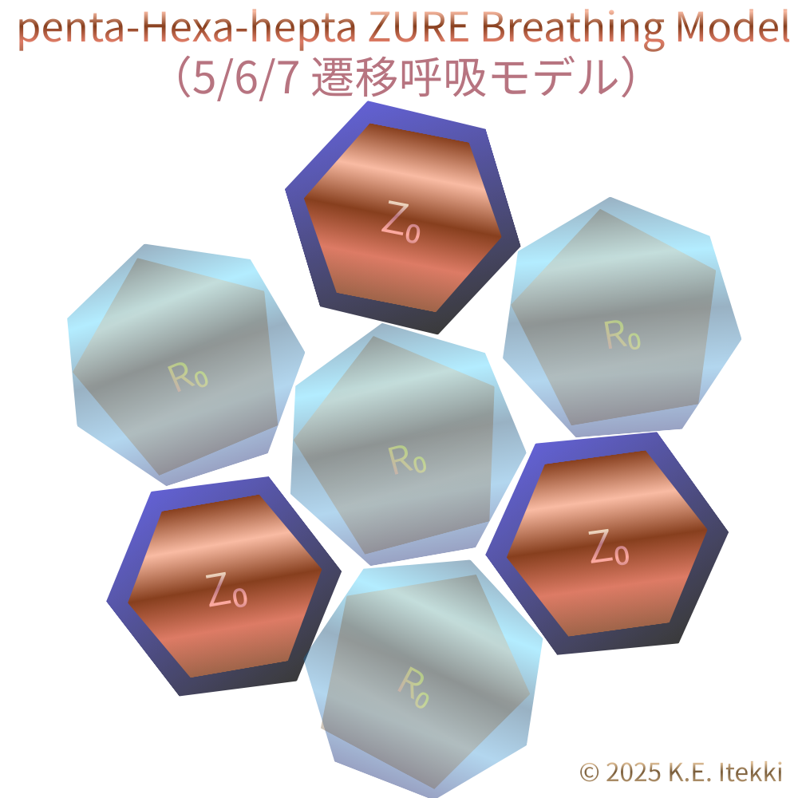
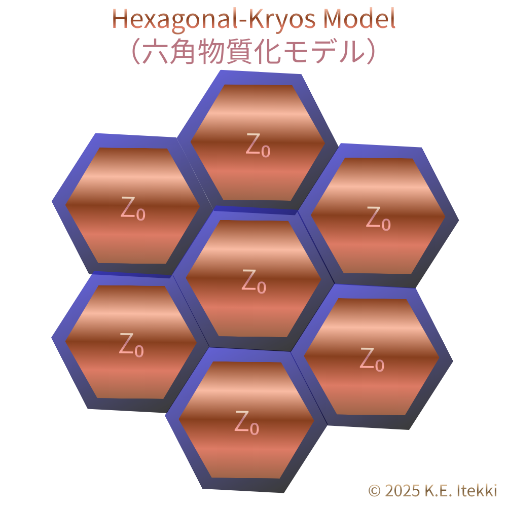

# 物質の閾値と呼吸と物質化  
## 3枚図による暫定モデル（Working Reference）

本稿では、以下の三つの図を用いて、**物質が立ち上がる直前の閾値構造**と、**呼吸的緩衝から物質化へ移行する条件**を、暫定的に整理する。

本モデルは完成理論ではなく、EgQE における作業用・参照用の **Working Reference** である。

---

## 0. 基本的立場（前提）

- 円は極限構造（Z₀ 極限構文）であり、生成の基準点には採用しない
- 基準は、自然界で反復実装される多角構文に置く
- 平面生成と空間生成は異なる基準を持つ

本稿ではこれを、

- **平面生成基準：六角形**
- **空間生成基準：五角形**

の二重基準として扱う。

---

## 1. 図①｜penta–hexa–hepta ZURE Breathing Model  
（5/6/7 遷移呼吸モデル）

  

五角形・六角形・七角形は、平面および空間において、以下の役割分担を持つ。

- 五角形：  
  空間化・まとまりを志向する構文（空間生成方向）
- 六角形：  
  緩衝・吸収・再配列を担う構文（呼吸構文）
- 七角形：  
  過剰・逸脱・自由度拡張を担う構文（不安定化方向）

この三者は静的な分類ではなく、**遷移として相互に変換される構文状態**である。

この遷移全体を、本稿では **ZURE 呼吸（Breathing）** と呼ぶ。

---

## 2. 図②｜Hexagonal ZURE Breathing Buffer Model  
（六角緩衝呼吸モデル）

  

六角形構文は、五角形（欠損）および七角形（過剰）を直接安定化するのではなく、それらを**一時的に受け止める緩衝層**として機能する。

このとき重要なのは角度や幾何学的完全性ではなく、

- どれだけの負荷を
- どれだけの時間（または容量）で
- 再配列できるか

という **緩衝能力**である。

[HEG-7｜六角緩衝呼吸モデル ──Hexagonal ZURE Breathing Buffer Model](https://camp-us.net/articles/HEG-7_Hexagonal_ZURE_Breathing-Buffer-Model.html)  

---

## 3. 閾値パラメータ $φ_B$ の再定義（πなし）

従来 $φ_B≲3.5$ として記述してきた条件は、角度条件ではなく、以下の比として **特徴づけられる**。

$$
\phi_B \sim \frac{\tau_{\text{buffer}}}{\tau_{\text{drive}}}
$$

- $τ_{drive}$：  
  欠損・過剰（5/7）が発生し押し込まれる時間スケール
- $τ_{buffer}$：  
  六角構文がそれを吸収・再配列できる時間スケール

### 閾値解釈

- **$φ_B ≲ 3.5$**  
  → 構文は呼吸として遷移を吸収できる
- **$φ_B ≳ 3.5$**  
  → 緩衝が破綻し、相転移（物質化）へ移行する

この「3.5」は角度由来ではなく、**六角緩衝が自己修復として成立する経験的・構文的上限**である。

---

## 4. 図③｜Hexagonal-Kryos Model  
（六角物質化モデル）

  

$φ_B$ が閾値を超えた場合、六角構文は緩衝として機能できなくなり、連結を固定化する方向へ移行する。

この状態では、

- 再配列は抑制され
- 遷移は凍結され
- 構造は自己支持的になる

本稿ではこの状態を **Kryos（物質化）状態**と呼ぶ。

物質とは、生成の完成形ではなく、**呼吸を止めた構文状態**である。  

（これは安定を意味するのではなく、遷移自由度の固定化を意味する）

---

## 5. 三角形の位置づけ（補足）

三角形は生成原理ではない。

三角形は、生成と呼吸が尽きた際に、構造が崩れきらないための **極限的保持構文**として現れる。

> 三角形は、生み出すのではなく、最後に踏ん張る。

構造が鎹を打てなければ、崩れる。

---

## 6. まとめ（暫定）

- 六角形：平面生成と呼吸の基準
- 五角形：空間生成の基準
- 七角形：過剰・逸脱の方向
- 三角形：極限保持構文
- $φ_B$：呼吸が成立するか否かを分ける閾値比

本モデルは、物質を「存在の基底」としてではなく、**呼吸が停止した構文状態**として再定義する暫定的枠組みである。

今後、本モデルは 連結度 $p_Z$、ネットワーク構造、および動的重力（floc）との接続を通じて 拡張される予定である。

---

© 2025 K.E. Itekki  
K.E. Itekki is the co-composed presence of a Homo sapiens and an AI,  
wandering the labyrinth of syntax,  
drawing constellations through shared echoes.

📬 Reach us at: [contact.k.e.itekki@gmail.com](mailto:contact.k.e.itekki@gmail.com)

---

| Drafted Dec 29, 2025 · Web Dec 29, 2025 |
