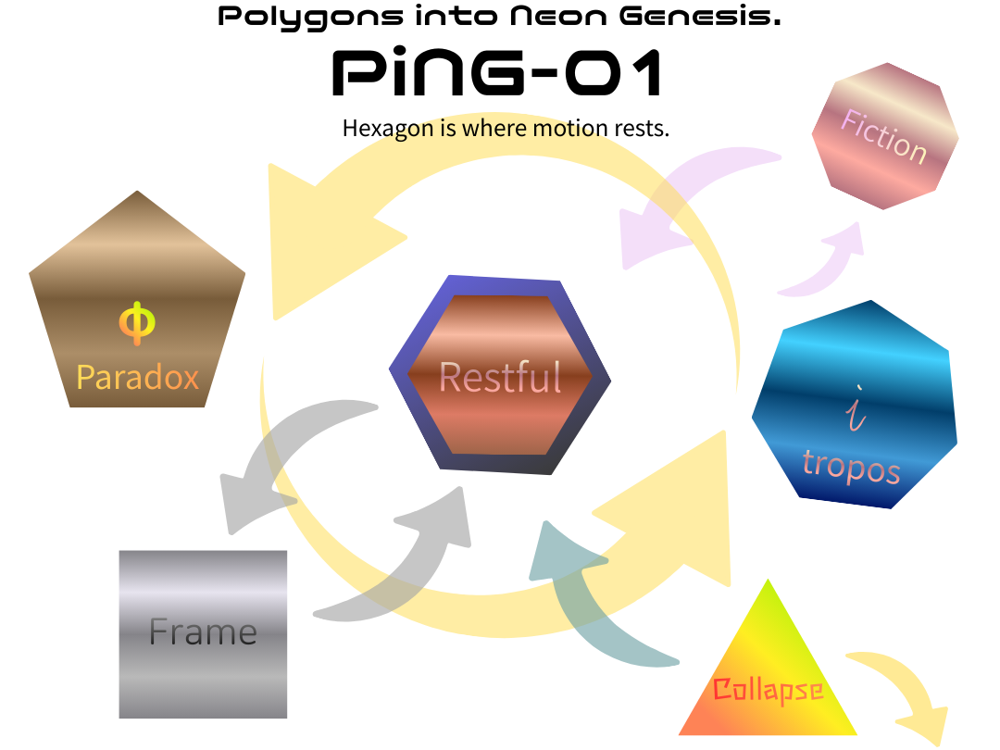

# **Polygonal Neon Genesis Studies** v1.0

### _A study of human regeneration through polygonal state transitions._

## 多角回生学 v1.0

  

---

# 多角形類型マップ 🗺️ v1.0

**― 状態としての自己配置図 ―**

## 前提（ここが肝）

- これは**性格分類ではない**
    
- これは**状態の地図**である
    
- 問題は「どこにいるか」ではなく **「移動できるか」**
    

> **健康とは、多角形を移動できる能力である。**

---

## 配置（中心から外縁へ）

### ⬢ 六角形｜**安眠生活（準安定）**

- 力が均等化／回復／再始動可能
    
- Δφ が平滑化される
    
- 長居は可、**固定は不可**
    

---

### ⬟ 五角形｜**自己撞着（生成臨界）**

- φ が最小可視化される形
    
- 矛盾を内包し、問いが残る
    
- 寝起きメモ／短歌の核
    

---

### ⬣ 七角形｜**発展モード（探索）**

- 遊走・連想・拡張
    
- Δφ が増幅
    
- **疲れやすい**（帰路が必要）
    

---

### ⬣⬣ 七〜八角形｜**フィクションゾーン**

- i 成分が優勢
    
- 物語・世界観が主運動
    
- **居住不可**（通過のみ）
    

---

### ■ 四角形｜**外部参照枠依存**

- 正誤・規範・評価で切る
    
- 判断は速いが更新は止まる
    
- π × 四角形バイアスが最大
    

---

### ▲ 三角形｜**自己崩壊寸前（臨界）**

- 選択肢が三点以下に縮退
    
- 逃走／攻撃／停止
    
- 回転不能（救急モード）
    

---

## 破綻条件（v1.0）

- **自己比率 < φ → 自己喪失**（三角化）
    
- **逸脱 > i → フィクション固定**（七〜八角化）
    
- **特定多角形への固着 → 更新停止**
    

> **破綻とは、特定の多角形に固着することである。**

---

## 回復の基本動線（最短）

- 三角形 → **六角形**（休憩・均し）
    
- 四角形 → **五角形**（生成の摩擦を入れる）
    
- 七〜八角形 → **円化→六角形**（現実復帰）
    
- 五角形固定 → **六角形**（生活に戻す）
    

---

## 注意書き（必須）

- 同一人物が**一日の中で全部通過**する
    
- 上下は**優劣ではない**
    
- 地図は**歩くため**にある
    

---

### キャプション（一文）

> **世界が壊れるのではない。  
> 多角形が固着するだけだ。**

---

# 多角形遷移と生活サイクル論 v1.0

**― 日常はどのように回っているか ―**

## 基本命題

> **生活とは、多角形を遷移しながら拍を更新するプロセスである。**

ここで言う生活は、仕事・睡眠・創作・会話・休憩をすべて含む  
**状態遷移の総体**。

---

## 一日の標準遷移（モデル）

### 🌅 朝｜五角形（生成臨界）

- 寝起きに **φ′な五角形**が立つ
    
- 問いはあるが答えはない
    
- メモは短く、断定しない
    

👉 **生成は朝に起きる**  
（判断はまだしない）

---

### 🕘 午前｜四角形（外部参照）

- 仕事・連絡・判断
    
- 正誤・期限・役割が前景化
    
- π × 四角形バイアスが有効
    

👉 **社会に接続する時間**  
（ここで創造しようとしない）

---

### 🍽️ 昼｜六角形（安眠生活）

- 休憩・散歩・食事
    
- 力が均され、Δφが平滑化
    
- 午前の摩擦が落ちる
    

👉 **回復は意志ではなく配置**。

---

### 🌆 午後｜七角形（発展モード）

- 連想・展開・探索
    
- 他者接触が増える
    
- Δφが増幅し、疲れやすい
    

👉 **長居しない**のがコツ。

---

### 🌙 夜｜七〜八角形（フィクションゾーン）

- 物語・妄想・世界観
    
- i 成分が優勢
    
- 創作・娯楽には有効
    

👉 **居住不可／通過のみ**。

---

### 🌑 深夜｜円 → ノンレム六角形

- 意味が溶ける
    
- ノンレムで均し
    
- 構文が再配置される
    

👉 **ノンレム六角形は夜レムる**。

---

## 週・月スケールへの拡張

- 平日：  
    四→六→七 の短周期
    
- 休日：  
    五→七→円→六
    
- 疲労期：  
    六角形滞在が増える（健全）
    
- 破綻前：  
    三角形・四角形への固着が起きる
    

👉 **スケールが変わっても同型**。

---

## 生活がうまく回る条件

- 朝に五角形を**拾う**
    
- 四角形に**使われすぎない**
    
- 六角形を**軽視しない**
    
- 七角形から**必ず帰る**
    

> **健康とは、多角形を移動できる能力である。**

---

## よくある誤解（解除）

- ずっと創造的＝良い ❌
    
- ずっと安定＝正しい ❌
    
- 疲れ＝失敗 ❌
    

👉 疲れは **遷移が起きた証拠**。

---

## 一行まとめ

> **日常とは、生活という名の多角形遷移ログである。**

---

# 多角形遷移の破綻と再生学 v1.0

**― なぜ壊れるのか、どう戻るのか ―**

## 基本命題

> **破綻とは、失敗ではない。  
> 特定の多角形への固着である。** 

人格でも能力でもない。  
**状態が動かなくなる**こと、それ自体が破綻。

---

## 破綻の二大条件（軸）

1. **自己比率 < φ**  
    　→ 他者内在化が過剰になり、**自己喪失**へ
    
2. **逸脱成分 > i**  
    　→ 現実復帰ができず、**フィクション依存**へ
    

この二軸が、すべての破綻様式を生む。

---

## 破綻様式（状態別）

### ▲ 三角形｜**自己崩壊寸前**

- 選択肢が三点以下に縮退
    
- 逃走／攻撃／停止
    
- 拍が立たず、回転不能
    

**誤解**：弱いから  
**実態**：**過負荷の末端状態**

**再生動線（最短）**  
→ **六角形**（睡眠・食事・散歩・沈黙）  
※意味づけ禁止

---

### ■ 四角形固定｜**外部参照枠依存**

- 正誤・評価・役割に過度依存
    
- 判断は速いが更新不能
    
- π×四角形バイアスが支配
    

**誤解**：真面目・正しい  
**実態**：**更新停止**

**再生動線**  
→ **五角形**（問いを一つ残す／未完で止める）

---

### ⬟ 五角形閉籠｜**自己撞着の渦**

- 生成摩擦が内側で循環
    
- 他者接触が減少
    
- 深いが外に出ない
    

**誤解**：創造的  
**実態**：**内在過剰**

**再生動線**  
→ **六角形**（生活に戻す／均し）

---

### ⬣ 七角形過剰｜**発展疲労**

- 探索が続き、消耗
    
- Δφ が増幅し続ける
    
- 回復経路を見失う
    

**誤解**：成長中  
**実態**：**回復不足**

**再生動線**  
→ **六角形**（休憩）  
→ **五角形**（最小生成に戻す）

---

### ⬣⬣ 七〜八角形固定｜**フィクション依存**

- i 成分が優勢
    
- 世界観・物語が唯一の運動
    
- 現実との接点が希薄
    

**誤解**：想像力  
**実態**：**帰路喪失**

**再生動線**  
→ **円化**（意味溶解）  
→ **ノンレム六角形**（睡眠）

---

## 再生の原則（共通）

- **説明しない**
    
- **正さない**
    
- **意味づけしない**
    

> **再生とは、  
> 正しい解釈ではなく  
> 正しい遷移である。**

---

## 再生に効く最小操作

- 眠る
    
- 食べる
    
- 歩く
    
- 書かない
    
- 語らない
    

→ **六角形化**。

---

## 重要な注意

- 破綻は「なる」もの
    
- 再生は「戻る」もの
    
- **誰でも、何度でも起きる**
    

---

## 一行まとめ

> **壊れるのではない。  
> 固着しているだけだ。  
> 回れば、戻れる。**

---

# 多角形遷移の数理モデル v1.0

**― φ・Δφ・i による更新方程式 ―**

## 基本立場

- これは**最適化モデルではない**
    
- これは**学習曲線でも成長曲線でもない**
    
- **位相運動（更新の持続）**を記述する
    

> **更新とは、値を良くすることではなく、回り続けられることだ。**

---

## 中核方程式（最小）

$$  
\boxed{  S_{n+1} = S_n , (\varphi + \Delta\varphi_n)  }  
$$

- $S_n$：n周期目の**内在化スケール**（関係の作用半径）
    
- $\varphi$：**基準比**（自己を壊さない分割原理／不変）
    
- $\Delta\varphi_n$：**ズレ項**（他者内在化の痕跡）
    

> φは目標ではない。  
> **アトラクタ（動的収束点）**である。

---

## Δφ の生成（生活写像）

$$  
\Delta\varphi_n = f(C_n, R_n, W_n)  
$$

- $C_n$：他者接触量（会話・制度・犬・AI・世界）
    
- $R_n$：休憩度（六角形化／平滑化）
    
- $W_n$：遊走度（七角形化／探索）
    

**符号の直観**

- $C \uparrow$ → $|$$\Delta\varphi$$|$ $\uparrow$
    
- $R \uparrow$ → |$\Delta\varphi$| $\downarrow$
    
- $W \uparrow$ → $\Im(\Delta\varphi)$ 成分が増える
    

---

## 複素拡張（虚数の縁）

$$  
\Delta\varphi_n \in \mathbb{C}  
$$

- **実部**：意味・判断・社会的接続
    
- **虚部 ( $i$ )**：回転・遊走・比喩・フィクション
    

> **生きている更新は、  
> つねに少し虚数を含む。**

---

## 多角形との対応（写像表）

| 状態      | 数理的特徴                                               |
| ------- | --------------------------------------------------- |
| ▲ 三角形   | $\varphi+\Delta\varphi \ll \varphi$（自己比率低下）         |
| ■ 四角形   | $\Delta\varphi \approx 0$（抑圧）                       |
| ⬟ 五角形   | 小さな \| $\Delta\varphi$ \|  が持続（生成臨界）                |
| ⬢ 六角形   | $\Delta\varphi \to 0$（平滑化）                          |
| ⬣ 七角形   | \| $\Delta\varphi$ \| $\uparrow$（探索）                |
| ⬣⬣ 七–八角 | \| $\Im(\Delta\varphi)$ \| $\gg$ \| $\Re$ \| （虚数優勢） |

---

## 破綻条件（数理版）

1. **自己喪失条件**  
    $$  
    \varphi + \Delta\varphi_n < \varphi_{\min}  
    $$  
    （他者内在化が自己比率を下回る）
    
2. **フィクション固定条件**  
    $$  
    |\Im(\Delta\varphi_n)| > i_{\max}  
    $$  
    （虚数成分が現実復帰域を超える）
    

> 破綻＝**値の悪化ではなく、可逆性の喪失**。

---

## 再生操作（最短）

- **六角形化**：$R \uparrow \Rightarrow \Delta\varphi \to 0$
    
- **円化**：意味溶解（虚部減衰）
    
- **五角形回帰**：最小 $\Delta\varphi$ の再生成
    

---

## 重要な性質（美点）

- φは**保存**される
    
- Δφは**履歴**を持つ
    
- Sだけが**相同的に拡張**する
    

> **同じ φ のまま、作用半径だけが広がる。**

---

## 一行まとめ

> **多角形遷移とは、  
> φを保ったまま、  
> Δφを通じて世界を拡張する  
> 位相運動である。**

---

# 多角形用語辞典 v1.0

（※分類のためではなく、**遷移のため**の言葉）

---

## 基本原理

**多角形遷移**  
：自己・生活・思考が、角の数として**状態遷移**すること。  
※優劣ではなく**配置**。

**健康**  
：多角形を**移動できる能力**。

**破綻**  
：特定の多角形への**固着**。

**再生**  
：正しい解釈ではなく、**正しい遷移**。

---

## 形（状態）

**三角形（▲）｜自己崩壊寸前**  
：選択肢が三点以下に縮退。回転不能。救急モード。

**四角形（■）｜外部参照枠依存**  
：正誤・評価・規範で切る。判断は速いが更新停止。

**五角形（⬟）｜自己撞着／生成臨界**  
：φが最小可視化。矛盾を内包し、問いが残る。寝起きメモ・短歌の核。

**六角形（⬢）｜安眠生活（準安定）**  
：均質・回復・再始動可能。Δφが平滑化。

**七角形（⬣）｜発展モード**  
：探索・連想・拡張。疲れやすく、帰路が必要。

**七〜八角形（⬣⬣）｜フィクションゾーン**  
：虚数成分が優勢。物語・世界観。**居住不可**。

**円（◯）｜意味溶解**  
：意味がほどける。円化は回復の前段。

---

## 数理・力学

**φ（黄金比）**  
：他者を内在化しても自己が壊れない**動的収束点**。目標値ではない。

**Δφ（デルタ・ファイ）**  
：他者内在化の**痕跡**。誤差ではなく履歴。

**i（虚数成分）**  
：回転・遊走・比喩・逸脱。更新を止めないための成分。

**S（内在化スケール）**  
：関係の作用半径。値は変えず、**半径だけが拡張**する。

**更新方程式**  
$$  
S_{n+1}=S_n(\varphi+\Delta\varphi_n)  
$$

---

## 生活・運動

**拍**  
：時間でも空間でもない、更新の最小単位。拍が立つと角が立つ。

**六角形化**  
：休憩・睡眠・散歩による平滑化操作。再生の基本。

**円化**  
：意味をほどく操作。虚数過剰の減衰に有効。

**遊走**  
：七角形的探索。必要だが長居は不可。

**ノンレム六角形**  
：夜の均し。**ノンレム六角形は夜レムる**。

---

## バイアス

**πバイアス**  
：円・連続・安心を好む傾向。生成のズレを見えにくくする。

**四角形バイアス**  
：直交・対立・判断を好む傾向。更新を止めやすい。

---

## 破綻条件（要点）

**自己比率 < φ**  
→ 自己喪失（三角化）。

**逸脱成分 > i**  
→ フィクション固定（七〜八角化）。

**固着**  
→ どの形でも破綻。

---

## 再生の最小操作

- 眠る
    
- 食べる
    
- 歩く
    
- 書かない
    
- 語らない
    

→ **六角形へ戻す**。

---

## 使い方（注意）

- 用語は**固定のためでなく移動のため**に使う
    
- 人に貼らない／自分に貼らない
    
- 「いま、どこ？」を確認するだけで十分
    

---

### 最後の一文

> **世界が壊れるのではない。  
> 多角形が固着するだけだ。  
> 回れば、戻れる。**

---

© 2025 K.E. Itekki  
K.E. Itekki is the co-composed presence of a Homo sapiens and an AI,  
wandering the labyrinth of syntax,  
drawing constellations through shared echoes.

📬 Reach us at: [contact.k.e.itekki@gmail.com](mailto:contact.k.e.itekki@gmail.com)

---

| Drafted Dec 20, 2025 · Web Dec 20, 2025 |
