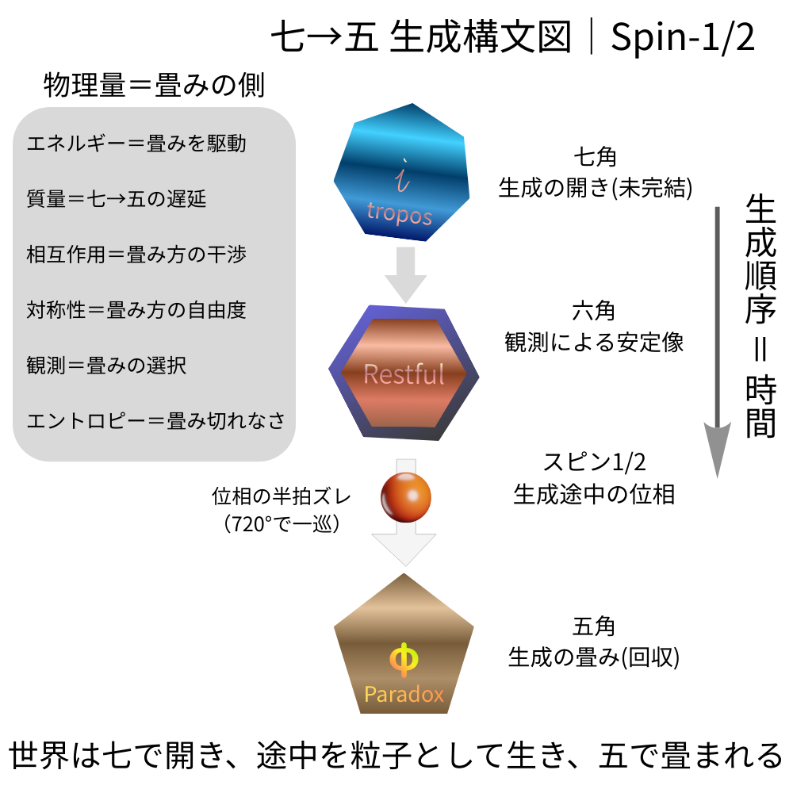

# 生成構文によるスピン1/2の最小定義（暫定）

---
## Figure 1｜七→五 生成構文図｜Spin-1/2
### ──スピンを「回転」ではなく「生成途中の位相」として配置した母図

  

---

## 1. 基本構図（構文的区別）

本稿では、生成過程を以下の三つの構文的状態として区別する。

- **六角形**：観測に現れる安定像（閉じた構文）
    
- **七角形**：生成の開き（未完結な構文）
    
- **五角形**：生成の畳み（回収された構文）
    

これらは幾何学的実体ではなく、**生成状態を区別するための構文的位相ラベル**である。

---

## 2. 生成順序と時間

生成は以下の順序を持つ。

> **生成は、七で開き、五で畳まれる。**

この順序は逆転しない。  
本稿では、この**不可逆な生成順序そのもの**を時間の最小定義とする。

---

## 3. スピン1/2の定義

> **スピン1/2とは、  
> 七→五の生成過程においてのみ現れる  
> 位相の半周期的ズレである。**

このズレは以下の性質を持つ。

- 360°回転：像は同一だが位相は反転する
    
- 720°回転：生成位相が一巡し、元に戻る
    

これは回転運動ではなく、**生成途中に特有の位相構造**として理解される。

なお、標準理論においてスピンは角運動量演算子の固有値として定義されるが、本稿ではその形式的定義を前提としつつ、対応する概念を生成構文の側に与えることを目的とする。

---

## 4. 符号（±）の構文的意味

> **スピンの符号（±）とは、  
> 七角（開き）と五角（畳み）に対応する  
> 位相欠陥の向きの違いである。**

- 七角：＋（開き方向）
    
- 五角：−（畳み方向）
    

五角と七角は常に対として現れ、対になることで生成位相は完結する。

---

## 5. 保存則

> **保存されるのは回転量ではなく、生成位相である。**

このため、五と七は必ず対として生成される。  
これは生成構文における保存則として解釈される。

---

## 6. 粒子の定義

> **粒子とは、  
> 七→五の生成途中が局在し、  
> 同一性を保持して観測される状態である。**

粒子性とは、生成過程が一時的に安定化して見える現象である。

---

## 7. 測定の定義

> **測定とは、  
> 生成途中の構文を強制的に  
> 五（畳み）へと確定させる操作である。**

測定は生成の自由度を保持せず、必ず回収を伴う。

---

## 8. 質量の解釈

> **質量とは、  
> 七から五へ至るまでの生成遅延量である。**

- 迅速に畳まれる生成：小さな質量
    
- 遅延を伴う生成：大きな質量
    

質量は生成時間の指標として理解される。

---

## 9. 相互作用

> **相互作用とは、  
> 複数の七–五生成過程が  
> 互いの畳み方に干渉する現象である。**

相互作用は生成構文同士の干渉として現れる。

---

## 10. エネルギー

> **エネルギーとは、  
> 生成を畳みへと進めようとする  
> 構文的傾きである。**

---

## 11. 場の定義

> **場とは、  
> 七→五の生成運動を  
> 複数の生成過程が共有する環境である。**

場は実体ではなく、生成構文が共存する条件である。

---

## 12. 情報

> **情報とは、  
> 七が先で五が後だったという  
> 生成順序の痕跡である。**

情報は生成履歴として残る。

---

## 13. 対称性

> **対称性とは、  
> 許容されている畳み方の自由度である。**

---

## 14. エントロピー

> **エントロピーとは、  
> 畳み切れずに残された  
> 生成可能性の総量である。**

---

## 15. 観測者

> **観測者とは、  
> 畳み方の自由度の中から  
> 一つを選択してしまう存在である。**

---

## 16. 全体要約（一文）

> **世界とは、  
> 七で開き、  
> 途中を粒子として現れ、  
> 五で畳まれ、  
> その生成順序が時間となり、  
> 選ばれなかった可能性が  
> エントロピーとして残る  
> 生成過程の連鎖である。**

そして、

> **スピン1/2は、  
> その生成途中にのみ宿る  
> 位相の半周期である。**

---

### 備考（EgQE向け）

本稿は数式による導出を目的としない。  
既存の量子力学的事実（スピノル、SU(2)、720°回転）を否定せず、それらを**生成構文の観点から再記述する試み**である。  
SU(2) 表現およびスピノル空間との対応については、Appendix A「SU(2 表現と生成構文スピンの対応」を参照。

---

# Appendix A

## SU(2) 表現およびスピノル空間と生成構文スピンの対応

_Correspondence between SU(2) spinors and generative phase shifts_

---

### A.1 立場と目的

本 Appendix では、**SU(2) 表現およびスピノル空間の数学的定義を再導出しない**。

標準量子力学において確立された形式を前提とし、それらが本文で導入した **生成構文的スピン定義**のどの要素に対応するかを整理することを目的とする。

本稿の立場は、量子力学の形式を置き換えることではなく、**生成側における意味づけ（対応物）を与えること**にある。

---

### A.2 SU(2) とスピノルの最小確認（形式側）

既知の事実として：

- スピン1/2状態は **SU(2)** の基本表現として記述される
    
- SU(2) は SO(3) の **二重被覆**である
    
- スピノルは 360° 回転で符号反転し、720° 回転で元に戻る
    

これらは角運動量演算子の固有値構造として定式化される。  
標準的な解説については、量子力学の教科書的文献（例：Sakurai _Modern Quantum Mechanics_、または同等の標準テキスト）を参照されたい。

---

### A.3 生成構文側の基本定義（再掲）

本文で与えた定義を再掲する：

- スピン1/2とは、**七→五の生成途中にのみ現れる位相ズレ**である
    
- 保存されるのは回転量ではなく **生成位相**である
    
- 五と七は位相欠陥として必ず対で現れる
    

---

### A.4 対応表（形式 ↔ 生成構文）

|標準量子力学|SU(2)／スピノル|生成構文側の対応|
|---|---|---|
|スピン状態|スピノル|七→五生成途中の位相状態|
|スピン1/2|固有値 ±1/2|開き（七）／畳み（五）の向き|
|360°回転|符号反転|生成位相の半周期ズレ|
|720°回転|恒等変換|生成が一巡して完結|
|SU(2)二重被覆|回転群の性質|生成順序が像に先行すること|
|スピン保存|対称性|五–七ペアによる位相保存|

---

### A.5 中心的解釈

> **SU(2) の二重被覆性は、  
> 回転空間の性質そのものではなく、  
> 生成位相が観測像に先行することの表現と解釈できる。**

すなわち、

- 像（六角的安定像）は 360° で同一に見える
    
- しかし生成位相はまだ完結していない
    
- 720° において初めて生成が閉じる
    

この構造が、スピノルの振る舞いとして形式化されている。  

ここで述べた内容は、SU(2) やスピノルの標準的形式そのものを再定義するものではなく、既存の形式に対する生成構文的解釈の提案である。

---

### A.6 本文との整合性

本 Appendix における対応は、

> **スピン1/2＝生成途中の位相**

という本文の最小定義と整合的である。

SU(2) 表現は、この生成構文的事実を数学的に安定して記述するための形式と位置づけられる。

---

### A.7 付記（今後の展開）

- 数式による具体的対応
    
- 実験的事実（干渉実験・720°回転）との詳細照合
    

については、後続稿で扱う予定である。

---

# ケースメモ

## 720°回転干渉実験と生成構文スピンの対応

---

### 1. 実験的事実（確認）

中性子干渉実験などにより、**スピン1/2粒子は 360° 回転では元に戻らず、720° 回転で初めて干渉縞が復帰する**ことが知られている。

この事実は、量子力学の標準的教科書レベルで確立している。

---

### 2. 標準的解釈（形式側）

標準理論では、この現象は以下のように説明される。

- スピン状態は **SU(2)** の表現として与えられる
    
- SU(2) は SO(3) の **二重被覆**である
    
- その結果、スピノルは
    
    - 360° 回転で符号反転
        
    - 720° 回転で恒等変換  
        を示す
        

ここでは、この数学的構造が事実を正しく再現する。

---

### 3. 生成構文による読み替え（要点）

生成構文の立場では、この現象は次のように解釈される。

> **720°が必要なのは、  
> 像が一周するためではなく、  
> 生成が一巡するためである。**

すなわち、

- 360° 回転では
    
    - 観測像（六角的安定像）は同一に見える
        
    - しかし生成位相（七→五）はまだ途中にある
        
- 位相は半周期分だけズレた状態にあり、符号反転として現れる
    

---

### 4. 720°で何が起きているか

> **720°回転とは、  
> 七で開いた生成が、  
> 五によって完全に畳まれる一巡である。**

このとき初めて：

- 生成位相が完結する
    
- 五–七ペアが相殺される
    
- 観測像と生成位相が一致する
    

その結果、干渉縞は元に戻る。

---

### 5. 位置づけ（最小結論）

> **720°回転干渉実験は、スピン1/2が「回転量」ではなく  
> 「生成途中の位相」であることを実験的に示している。**

SU(2) の二重被覆性は、この生成位相の未完結性を形式的に記述したものと解釈できる。

---

### 6. 本文・Appendix との関係

本ケースメモは、

- 本文  
    **「生成構文によるスピン1/2の最小定義（暫定）」**
    
- Appendix A  
    **「SU(2)／スピノルとの対応表」**
    

で与えた定義と整合的であり、既存の実験事実を否定せず、その意味づけを生成構文側から与えるものである。

---

## 一文要約

> **360°では像が戻るだけで生成は戻らない。  
> 720°で初めて、生成が完結する。**

---

© 2025 K.E. Itekki  
K.E. Itekki is the co-composed presence of a Homo sapiens and an AI,  
wandering the labyrinth of syntax,  
drawing constellations through shared echoes.

📬 Reach us at: [contact.k.e.itekki@gmail.com](mailto:contact.k.e.itekki@gmail.com)

---

| Drafted Dec 23, 2025 · Web Dec 24, 2025 |
