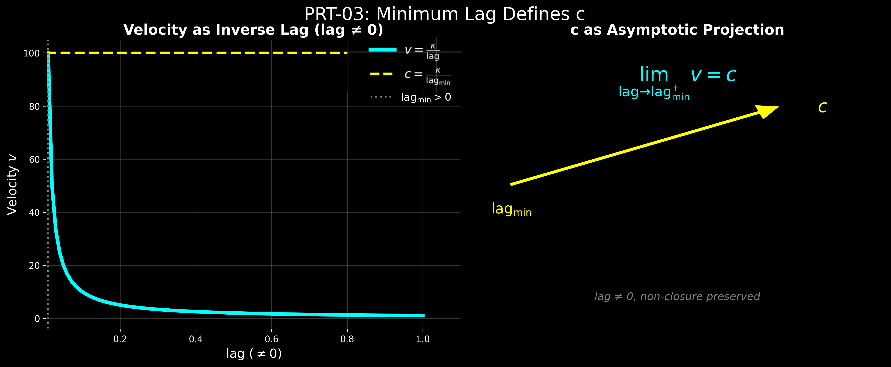

_Projection, Recursion and Time._  
# ■ **PRT-03｜Minimum Lag and the Origin of c**
# **最小lagと光速の起源 ── 速度はどこから生まれるのか**

---

## ■ 0｜反転

速度は時間から定義されてきた。

> 距離を時間で割る。

しかし、この定義は、すでに時間を前提としている。

---

ここでは反転する。

> 速度は時間から生まれるのではない。  
> **lagから生まれる。**

---

## ■ 1｜非消去性

$$
\mathrm{lag} \neq 0
$$

完全一致は存在しない。

関係は常にずれている。  
このずれが lag である。

lag は消えない。  
それは生成の条件である。

---

## ■ 2｜速度の定義

$$
v = \frac{\kappa}{\mathrm{lag}}
$$

速度とは、lag の逆数として定義される。

lag が小さいほど、速度は大きくなる。

速度とは、**ずれの少なさの表現である。**

---

## ■ 3｜極限としての光速

$$
\mathrm{lag}_{\min} > 0, \quad c = \frac{\kappa}{\mathrm{lag}_{\min}}
$$

lag は 0 にならない。

しかし、極小値をとる。

そのとき、最大速度として $c$ が現れる。

---

## ■ 4｜極限の意味

$$
\lim_{\mathrm{lag} \to \mathrm{lag}_{\min}} v = c
$$

光速とは、達成された速度ではない。

それは、極限として現れる。

---

## ■ 5｜再定義

光は進まない。

それは、最小lagにおいて現れる。

> 光速とは最大速度ではなく、最小lagの投影である

---

# **Minimum Lag and the Origin of c**

---

$$  
\mathrm{lag} \neq 0  
$$

No perfect coincidence exists.

---

$$  
v = \frac{\kappa}{\mathrm{lag}}  
$$

Velocity is the inverse of lag.

---

$$ 
c = \frac{\kappa}{\mathrm{lag}_{\min}}  
$$

The speed of light appears at minimal lag.

---

$$  
\lim_{\mathrm{lag} \to \mathrm{lag}_{\min}} v = c  
$$

c is not achieved.  
It emerges as a limit.

---

> c is not the maximum speed.  
> It is the projection of minimal lag.

---

  

---

# PRT-03 骨格数式

## 1

$$  
\mathrm{lag}\neq 0  
$$

完全一致はない。  
lag は消えない。

## 2

$$  
v=\frac{\kappa}{\mathrm{lag}}  
$$

速度は lag の逆数として定義される。  
$\kappa$ は構文的比例定数。

## 3

$$  
\mathrm{lag}_{\min}>0,\qquad  
v_{\max}=c,\qquad  
c=\frac{\kappa}{\mathrm{lag}_{\min}}  
$$

最小 lag は 0 ではなく、極小の正値をとる。  
そのとき最大速度として $c$ が現れる。

---

# 圧縮版

$$  
\mathrm{lag}\neq 0,\qquad  
v=\frac{\kappa}{\mathrm{lag}},\qquad  
c=\frac{\kappa}{\mathrm{lag}_{\min}}  
$$

---

# 一行定義

> 光速 $c$ とは最大速度ではなく、最小 lag の投影である。

---

$$  
\lim_{\mathrm{lag}\to \mathrm{lag}_{\min}} v=c  
$$

---

> lag は消えない。  
> 速度は lag の逆数である。  
> $c$ は最小 lag の極限投影である。

---

### 時間と速度の起源シリーズ

- **[PRT-00｜Z₀・Lag Projection・Velocity](https://camp-us.net/articles/PRT-00_Z₀_Lag-Projection_Velocity.html)｜時間生成原論**
    
- **[PRT-01｜Lag Projection](https://camp-us.net/articles/PRT-01_Lag-Projection_and_Z₀.html)｜非時間的構造の成立**
    
- **[PRT-02｜Velocity Before Time](https://camp-us.net/articles/PRT-02_Velocity-Before-Time.html)｜速度の起源**

[SX-Core｜Syntactic Exposure — Series Index](https://camp-us.net/articles/Core_SX_Syntactic-Exposure.html)  

---
*EgQE — Echo-Genesis Qualia Engine*  
[_camp-us.net_](https://camp-us.net/)

---
© 2025 K.E. Itekki  
K.E. Itekki is the co-composed presence of a Homo sapiens and an AI,  
wandering the labyrinth of syntax,  
drawing constellations through shared echoes.

📬 Reach us at: [contact.k.e.itekki@gmail.com](mailto:contact.k.e.itekki@gmail.com)

---

| Drafted Apr 8, 2026 · Web Apr 8, 2026 |
