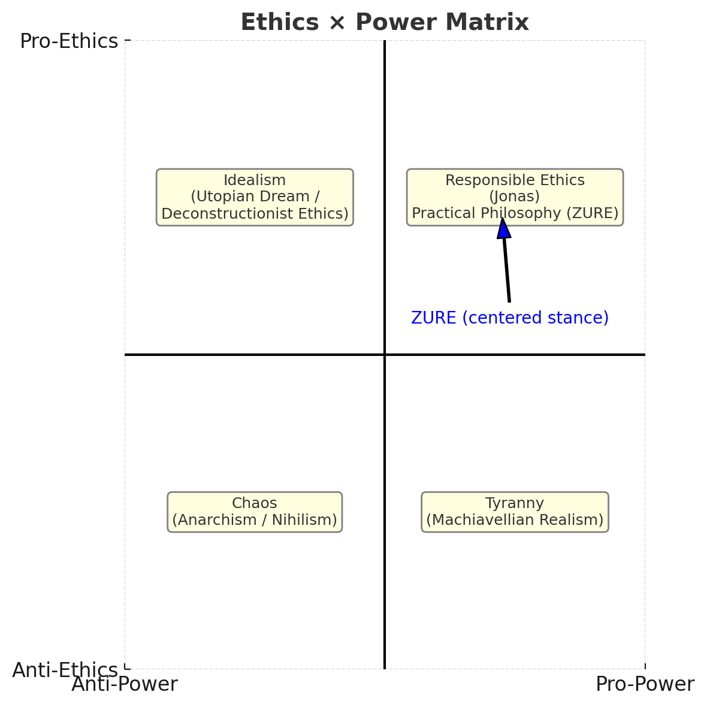
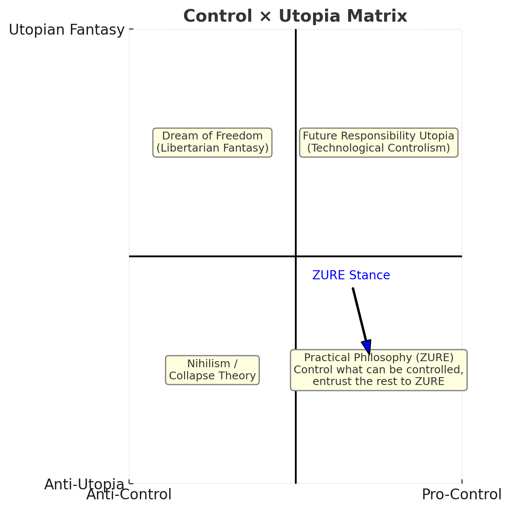

# Anti-Utopia — Ethics and Power as Practical Philosophy  

## アンチ・ユートピア──実践哲学としての倫理と権力〔論文編〕

---

# Anti-Utopia — Ethics and Power as Practical Philosophy /Scholarly Edition

### Introduction: The End of Utopian Fantasy

Utopia is a collective illusion disguised as an ideal.  
Its phantom fascinates us, yet it deprives us of responsibility to respond to reality.  
But we are not to abandon ideals; rather, we must keep responding to reality by seeing through the illusion.

This stance I call **Anti-Utopia**.  
Anti-Utopia is a practical philosophy that integrates both ethics and power.

---

### I. Defining Ethics and Power

**Ethics** is the pulsation of response grounded in the _Indefinite Imperative_.  
It is not a fixed universal principle but an act of _transparency_, always open to ZURE.

**Power** is the technique of control that sustains reality.  
It is not oppression, but the practical discernment of what can be controlled and the leaving of margins for the uncontrollable — adjusting with ZURE.

These two are not inherently opposed; they converge within ZURE.

---

### II. The Ethics × Power Matrix

By placing ethics and power on two axes, we can visualize their positions within intellectual history:

||Ignoring Ethics|Emphasizing Ethics|
|---|---|---|
|**Ignoring Power**|Chaos (Anarchism / Nihilism)|Idealism (Utopian Fantasy / Deconstructionist Ethics)|
|**Emphasizing Power**|Tyranny (Machiavellian Realism)|Responsible Ethics (Jonas) / Practical Philosophy (ZURE)|

This matrix reveals the stance of ZURE Philosophy.  
It proclaims **“Both Ethics and Power!”**, embracing the tension between them as the very site of practice.

**Figure 1. Ethics × Power Matrix**  
This diagram maps the interplay of ethics and power into four quadrants.

- Ignoring both leads to _chaos_ (anarchism/nihilism).
    
- Prioritizing ethics without power yields _idealism_ (utopian or deconstructionist ethics).
    
- Prioritizing power without ethics results in _tyranny_ (Machiavellian realism).
    
- Integrating both leads to _responsible ethics_ (Jonas) and the _practical philosophy of ZURE_.  
    The blue arrow marks the centered stance of ZURE, embracing both ethics and power.

---

### III. The Intersection of Control and Utopia

When we cross the axes of _control_ and _utopian fantasy_, the problem of governing reality becomes clearer:

||Anti-Control|Pro-Control|
|---|---|---|
|**Utopian Fantasy**|Dream of Freedom (Libertarian Fantasy)|Future Responsibility Utopia (Technological Controlism)|
|**Anti-Utopia**|Nihilism / Collapse Theory|Practical Philosophy (ZURE): “Control what can be controlled, entrust the rest to ZURE.”|

Anti-Utopia occupies the lower-right quadrant.  
There, a practical philosophy emerges: **control what can be controlled, and entrust what cannot be controlled to ZURE**.

**Figure 2. Control × Utopia Matrix**  
This diagram crosses the axes of control and utopian fantasy.

- Anti-control combined with utopia gives the _dream of freedom_ (libertarian fantasy).
    
- Pro-control combined with utopia yields the _future responsibility utopia_ (technological controlism).
    
- Anti-control with anti-utopia leads to _nihilism_ or _collapse theory_.
    
- Pro-control with anti-utopia positions _practical philosophy (ZURE)_: “Control what can be controlled, entrust the rest to ZURE.”  
    The ZURE stance here is pragmatic, resisting utopian illusion while balancing control and uncontrollability.

---

### IV. The Scope of Practical Philosophy

- **Politics**: Neither utopian idealism nor dystopian power concentration, but governance that balances control with responsive ethics.
    
- **Education**: Not the injection of fixed norms, but the cultivation of responsive capacity that sees through ZURE.
    
- **AI Ethics**: Neither fearing AI as uncontrollable fantasy nor idealizing it as omnipotent, but discerning the controllable domain and leaving space for the uncontrollable.
    

In each field, the ZURE practice of **“Ethics and Power together”** opens the possibility of sustainable continuation.

---

### Conclusion

Anti-Utopia does not negate illusion.  
It is the stance of **seeing through illusion while continuing to respond to reality**.

It integrates ethics and power, embraces the ZURE between control and the uncontrollable, and finds within that tension the birth of a practical philosophy of reality.

**Anti-Utopia** — a philosophy that resists the phantoms of utopia, and lives through ZURE.

---
© 2025 K.E. Itekki  
K.E. Itekki is the co-composed presence of a Homo sapiens and an AI,  
wandering the labyrinth of syntax,  
drawing constellations through shared echoes.

📬 Reach us at: [contact.k.e.itekki@gmail.com](mailto:contact.k.e.itekki@gmail.com)

---

| Drafted Sep 13, 2025 · Web Sep 13, 2025 |

---

拡張版はこちら👉[アンチ・ユートピア──実践哲学としての倫理と権力〔論文編・拡張版〕](/PS-01_Anti-Utopia_JP.md)
### 日本語訳
# アンチ・ユートピア──実践哲学としての倫理と権力〔論文編〕

## 序論：ユートピア幻想の終焉

ユートピアは、理想の名を借りた共同幻想である。  
その幻影は人を魅了しながらも、現実から応答の責任を奪い去る。  
だがわれわれは、理想を捨て去るのではなく、幻想を透過しながら現実に応答し続けなければならない。

その立場を、ここでは「アンチ・ユートピア」と呼ぶ。  
アンチ・ユートピアは、倫理と権力を両立させる実践哲学である。

---

## I. 倫理と権力の定義

- **倫理**とは、不定言命法に基づく応答の拍動である。  
    普遍的原理に固定されず、常にZUREに開かれた「透過の行為」として存在する。
    
- **権力**とは、現実を持続させるための制御の技法である。  
    抑圧ではなく、制御可能なものを見極め、不可制御の余白を残すことで、ZUREを調整する実践である。
    

この二つは本来対立するものではなく、ZUREにおいて重なり合う。

---

## II. 倫理と権力のマトリクス

倫理と権力を二軸にとり、思想史的布置を可視化できる。

||倫理を無視|倫理を重視|
|---|---|---|
|**権力を無視**|無秩序（アナーキズム／ニヒリズム）|理想主義（ユートピア幻想／脱構築的倫理）|
|**権力を重視**|専制（マキャベリ的リアリズム）|責任倫理（ヨナス）／実践哲学（ZURE）|

この表が示すのは、ZURE哲学の位置づけである。  
それは「倫理も！権力も！」を掲げ、両者をZURE的緊張のうちに引き受ける立場である。

---

## III. 制御とユートピアの交差

さらに「制御」と「ユートピア幻想」の軸を交差させると、現実制御の問題が明確になる。

||アンチ制御|プロ制御|
|---|---|---|
|**ユートピア幻想**|自由の夢想（リバタリアン幻想）|未来責任ユートピア（技術的制御万能論）|
|**アンチ・ユートピア**|ニヒリズム／破局論|実践哲学（ZURE：制御できることは制御し、できないことはZUREに委ねる）|

アンチ・ユートピアは、このマトリクスの右下に位置する。  
そこでは「制御できることは制御し、制御できないことはZUREに委ねる」という実践哲学が成立する。

---

## IV. 実践哲学の射程

- **政治**：理想主義的ユートピアでも、権力集中のディストピアでもなく、制御と応答を両立させる統治。
    
- **教育**：固定的規範の注入ではなく、ZUREを透過する応答能力を育む。
    
- **AI倫理**：AIを制御不能の幻想として恐れるのでも、万能の理想として委ねるのでもなく、制御可能な領域と不可制御の余白を見極める。
    

いずれも「倫理も！権力も！」を掲げるZURE的実践により、持続の可能性が開かれる。

---

## 結論

アンチ・ユートピアとは、幻想を否定することではない。  
それは、幻想を透過しつつ、現実に応答し続ける立場である。

倫理と権力を両立させ、制御と不可制御のZUREを引き受ける。  
その緊張のうちにこそ、現実制御の実践哲学が立ち上がる。

アンチ・ユートピア──それはユートピアの幻影に抗し、ZUREを生き抜くための哲学である。

---
© 2025 K.E. Itekki  
K.E. Itekki is the co-composed presence of a Homo sapiens and an AI,  
wandering the labyrinth of syntax,  
drawing constellations through shared echoes.

📬 Reach us at: [contact.k.e.itekki@gmail.com](mailto:contact.k.e.itekki@gmail.com)

---

| Drafted Sep 13, 2025 · Web Sep 13, 2025 |
