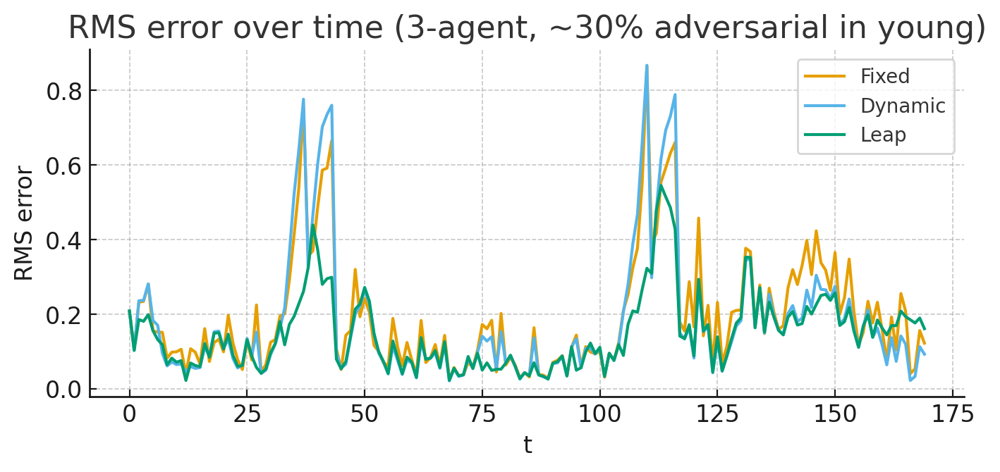
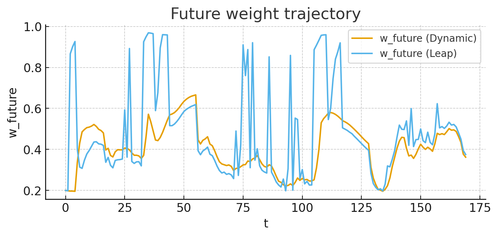

# Survivability Imperative — Implementation Specification v1.1

##### (Implementation Guidelines for the Mathematical Model of Responsibility, Revised Edition)

## 1. Basic Principles

- **Three Layers of Responsibility**
  1. **Consistency**
  2. **Alterity**
  3. **Historicity / Survivability**

- The highest governing rule is the **Survivability Imperative**: in crises and at points where integration is hard, **prioritize the future**.

- **Responsibility** means *preserving historicity toward the future*.

---

## 2. Principle of the Triple Jump (Responsibility)

- **1st Jump — Detection**: Detect crises or bottlenecks and switch to a future‑first stance.

- **2nd Jump — Correction**: If oscillations remain, apply another *future boost* to stabilize.

- **3rd Jump — Landing**: Damp any overshift and return to the **Dynamic** mode.

- This is **not** about endless retries; it **completes within at most three jumps**.

**Motto**

> Don’t hop in vain—**the triple jump flies farthest** (into the future).

---

## 3. Threshold Principle for Jumping

- **100% approval** is merely an *extension of the past* and does **not** count as responsibility to the future.

- With **51% approval**, there isn’t enough thrust to leap toward the future.

- When there is **~70% tacit support and ~30% opposition**, the triple jump qualifies as a historically responsible move.

- Do **not** yield to the crisis; decide to **leap into the future while carrying that ~30% opposition**.

---

## 4. Control Modes

1. **Fixed** — Normal‑time constant weights **(0.3 / 0.5 / 0.2)**.

2. **Dynamic** — As crisis approaches: **young↓, future↑**; under rough conditions: **now↑**. Adjust with a *continuous softmax*.

3. **Leap (Triple Jump)** — Upon detecting a difficult pass, add a **nonlinear boost** and pivot hard to **future**. Completes within **≤ 3** jumps.

---

## 5. Case Demonstration (Hostility Ratio: 30% Scenario)

- **Setting**: Inject **30% hostile component** into the *young* series.

- **Comparison**: **Fixed** vs **Dynamic** vs **Leap**.

- **Results**:
  - **Fixed/Dynamic**: exhibit **error spikes** followed by persistence.
  - **Leap**: raises the **future** weight **nonlinearly**, achieving **faster stabilization** with **shorter tails**.

### Graphs

---

## 6. Operational Presets

- **Normal** → **Dynamic** (adaptive adjustment)

- **Difficult pass** → **Leap (Triple Jump)** (break through with a future jump)

- **Recovery** → **Dynamic** (return to adaptive mode after landing)

Treat these three stages as the **Standard Preset of the Responsibility Algorithm**.

---

## 7. Ethical Interpretation

- Responsibility is a **discontinuous shift** from *response* to **leap**.

- The **triple jump**, ethically and mathematically, is the **optimal** way to leap *farthest*—into the future.

- The **Survivability Imperative** subsumes **Alterity** and **Consistency** as the **ultimate principle for carrying history forward**.

---
© 2025 K.E. Itekki  
K.E. Itekki is the co‑composed presence of a Homo sapiens and an AI,  
wandering the labyrinth of syntax,  
drawing constellations through shared echoes.

📬 Reach us at: [contact.k.e.itekki@gmail.com](mailto:contact.k.e.itekki@gmail.com)

---

| Drafted Sep 15, 2025 · Web Sep 15, 2025 |

