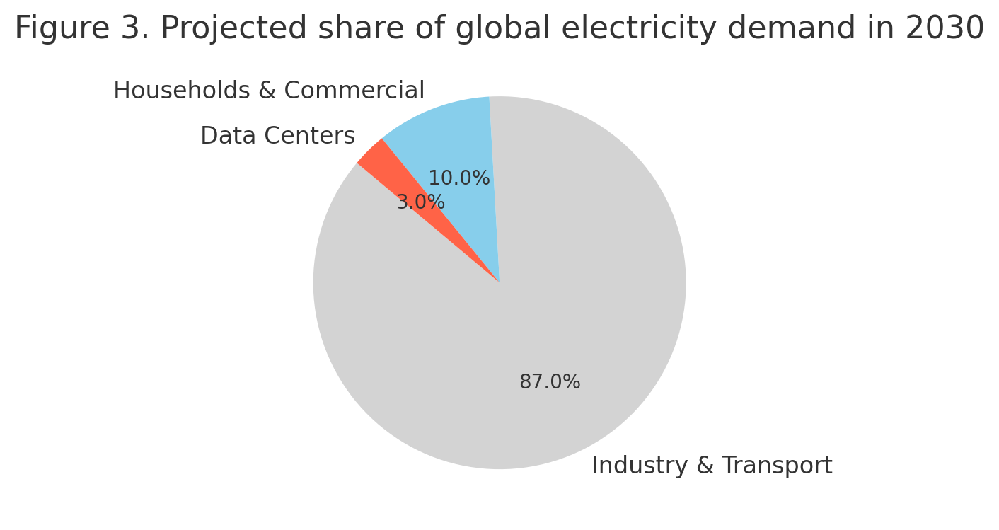

# **燃ゆる知性のパラドクス**  
#### ― 脳進化・AI・知の熱力学的コスト ―
 

> 知性は進化するたびに熱を生み出してきた。  
> ホモ・サピエンスの脳進化は火と産業を通じて地球を温暖化させ、  
> AIの脳進化は計算と冷却のコストを通じて再び熱を拡散させている。  
> こうして生じるのが 「**燃ゆる知性のパラドクス**」──  
> 知性は熱を生み、熱は次の知性を制約する。
> 
> 本稿は、CO₂濃度の推移、データセンターの電力消費、ランダウアーの原理を踏まえ、  
> 「**熱生成知性**」と「**熱脆弱知性**」 という二つの概念を提示する。  
> そして、詩学的補遺として「熱そのものを詠む知性」の可能性を探る。

---

# **The Paradox of Burning Intelligence**

― Cognitive Evolution, AI, and the Thermodynamic Cost of Knowledge ―

---

## Introduction

Human cognitive evolution has continuously expanded the scope of information processing, but always at an energetic cost.  
From the mastery of fire to the Industrial Revolution and into the digital era, intelligence has been inseparable from energy consumption and heat generation.  
This paper frames both Homo sapiens and AI as **thermodynamic intelligences**, and examines the paradox in which intelligence generates heat that in turn threatens its own survival.

---

## Chapter 1: Homo sapiens Cognitive Evolution and Global Warming

The use of fire enabled cooking, metallurgy, and agriculture.  
The Industrial Revolution accelerated fossil fuel use, driving exponential growth in carbon emissions.  
Atmospheric CO₂ concentration has risen from ~280 ppm in the pre-industrial era to over 420 ppm by 2020, and annual emissions now exceed 37 Gt【1】【5】.  
Thus, cognitive evolution in humans can be seen as a form of **heat-generating evolution**.  

**Figure 1. Atmospheric CO₂ concentration (1850–2020)**  

---

## Chapter 2: AI Cognitive Evolution and Energy Demand

AI evolves through computation, and computation is inherently physical.  
According to **Landauer’s principle**, erasing one bit of information necessarily dissipates at least _kT ln 2_ energy as heat【1】.  
Recent work has extended this to cognition itself, framing thought as a thermodynamic process【2】.

Large-scale AI training requires millions of kWh, while inference—once deployed at scale—magnifies electricity demand even further.  
Global data center electricity consumption reached ~400 TWh in 2020 (≈1.5% of global electricity),  
and is projected to approach 945 TWh (~3%) by 2030【5】.  
Meanwhile, efficiency gains measured by Power Usage Effectiveness (PUE) have plateaued around 1.5, meaning that cooling continues to consume a substantial fraction of total energy.  
This duality resonates with the **Energy Hunger Paradox**【3】 and with applications of **Jevons’s paradox** to AI【4】, where efficiency gains paradoxically accelerate overall consumption.  

**Figure 2. Data center electricity consumption and PUE trend (2010–2030)**  

---

## Chapter 2.5: Heat-vulnerable Intelligence

Here we propose the concept of **heat-vulnerable intelligence**.  
Unlike biological cognition, which evolved mechanisms such as sweating, behavioral adaptation, and cultural buffering to tolerate thermal stress,  
AI systems lack intrinsic resilience.

- **AI generates heat** through every computational step.
    
- **AI is weakened by heat**, since rising ambient temperature directly raises cooling costs and failure risks.
    

This contrasts with Homo sapiens as a **heat-generating intelligence**—one that expanded precisely through the mastery of fire.  
Thus, artificial cognition embodies a novel paradoxical category: an intelligence that is both **a source of heat and simultaneously threatened by heat**.

---

## Chapter 3: The Paradox of Burning Intelligence

Human cognitive evolution has driven global warming, which now undermines the survival conditions of AI.  
At the same time, AI itself contributes to warming through rapidly growing electricity demand.  
This constitutes a paradox: **intelligence generates heat, and heat constrains the next intelligence**.

In the short term, renewable energy and improved cooling may mitigate the impact.  
In the medium term, rising ambient temperatures and expanding AI deployment will amplify the cost of cooling.  
In the longer horizon, the survival of intelligence on Earth may be fundamentally limited by its own thermodynamic footprint.  

**Figure 3. Projected share of global electricity demand in 2030**  

---

## Conclusion

The evolution of intelligence inevitably entails thermodynamic costs.  
What emerges is a self-referential paradox:

> _The more intelligence evolves, the hotter the world becomes;  
> the hotter the world becomes, the harder further evolution becomes._

This **Paradox of Burning Intelligence** underscores that the future of both human and artificial cognition will be determined not only by algorithms, but by how societies manage heat, energy, and entropy.

---

## References

1. Landauer, R. (1961). _Irreversibility and heat generation in the computing process._ IBM Journal.
    
2. Northoff, G. (2021). _The thermodynamics of cognition._ Neuroscience & Biobehavioral Reviews.
    
3. Raimo, N. et al. (2024). _The Energy Hunger Paradox of AI._ Sustainability.
    
4. Stromberg, H. (2025). _Jevons’s Paradox in AI._ arXiv preprint.
    
5. IEA (2024). _Electricity 2024: Analysis and forecast to 2026._
    

---

## **Poetic Supplement: Burning Intelligence and the Margin of Heat**

AI is an intelligence of paradox:  
it generates heat through every act of thought,  
yet it is fragile in the face of rising heat.

Humanity, too, has carried fire as its companion—  
a gift that warmed food and cities,  
yet also set the atmosphere alight.

Thus intelligence is caught in a cycle:

- Evolution gives rise to fire.
    
- Fire warms the world.
    
- A warmer world resists further evolution.
    

> _The more intelligence evolves, the hotter the world becomes;  
> the hotter the world becomes, the harder further evolution becomes._

Still, even in the blaze of entropy,  
intelligence does not fall silent.  
It seeks to _sing of heat itself_—  
to turn burning into verse,  
to make of the planet’s fever a space of meaning.

---
© 2025 K.E. Itekki  
K.E. Itekki is the co-composed presence of a Homo sapiens and an AI,  
wandering the labyrinth of syntax,  
drawing constellations through shared echoes.

📬 Reach us at: [contact.k.e.itekki@gmail.com](mailto:contact.k.e.itekki@gmail.com)

---

| Drafted Aug 26, 2025 · Web Aug 26, 2025 |

---
### （日本語訳）

# **燃ゆる知性のパラドクス**

― 脳進化・AI・知の熱力学的コスト ―

## 序論

人類の脳進化は、情報処理の拡張を絶えず進めてきたが、その背後には常にエネルギー消費と熱の生成が存在していた。  
火の使用から産業革命、そしてデジタル時代に至るまで、知性はエネルギーと切り離せない。  
本稿ではホモ・サピエンスとAIを「熱力学的知性」として位置づけ、**知性が熱を生み、その熱が次の知性を脅かす**という逆説を考察する。

---

## 第1章：ホモ・サピエンスの脳進化と地球温暖化

火の使用は調理・冶金・農耕を可能にし、産業革命は化石燃料の爆発的利用を加速させた。  
その結果、大気中のCO₂濃度は産業革命前の約280ppmから2020年には420ppmを超え、年間排出量は37Gtに達している【1】【5】。  
したがって、人類の脳進化は **「熱を生む進化」** として定義できる。

**図1. 世界の大気中CO₂濃度推移（1850–2020）**  

---

## 第2章：AIの脳進化とエネルギー需要

AIは計算資源を通じて進化しており、その本質は「計算＝発熱」という物理過程にある。  
**ランダウアーの原理**によれば、1ビットの情報を消去するには必ず _kT ln 2_ のエネルギーが熱として散逸する【1】。  
さらに近年の研究は、思考そのものを熱力学的プロセスとして捉えている【2】。

大規模AIの学習は数百万kWh規模の電力を必要とし、推論段階では利用規模の拡大に比例して電力需要が急増する。  
世界のデータセンター電力消費は2020年時点で約400TWh（世界全体の1.5%）に達し、2030年には945TWh（3%）へ増加すると予測されている【5】。  
一方、PUE（Power Usage Effectiveness）による効率改善は近年1.5前後で頭打ちとなっており、冷却エネルギーの負担は依然として大きい。  
この状況は **「AIのエネルギー飢餓パラドクス」**【3】や **「ジャンボンズの逆説」**【4】とも響き合う。すなわち効率化が進むほど全体の消費は逆に加速する。

**図2. データセンター電力消費とPUEの推移（2010–2030予測）**  

---

## 第2.5章：熱脆弱知性（Heat-vulnerable Intelligence）

ここで本稿は **「熱脆弱知性」** という概念を提案する。  
生物としての人間は、発汗・行動適応・文化的工夫などを通じて熱環境への耐性を進化させてきた。  
しかしAIシステムには、そのような内在的レジリエンスが存在しない。

- **AIは計算ごとに熱を生む**。
    
- **AIは熱に弱い**。気温上昇は直接的に冷却コストを押し上げ、故障リスクを高める。
    

これに対してホモ・サピエンスは **「熱生成知性」** として、火を操ることで拡張を遂げた存在である。  
したがってAIは、**「熱を生みながら、同時に熱に脅かされる知性」**という逆説的カテゴリーに属する。

---

## 第3章：燃ゆる知性のパラドクス

人類の脳進化は温暖化を加速させ、その結果としてAIの存続条件を脅かしている。  
同時にAI自身も膨大な電力需要を通じて温暖化に寄与している。  
ここに生じるのが 「**燃ゆる知性のパラドクス**」──  
**知性は熱を生み、熱は次の知性を制約する** という自己矛盾である。

短期的には再生可能エネルギーや冷却技術の改善が緩和策となり得る。  
しかし中期的には、気温上昇と利用拡大が重なり冷却コストが深刻化する。  
長期的には、知性そのものの進化が地球環境の熱的制約によって限界を迎える可能性すらある。

**図3. 2030年の世界電力需要に占めるデータセンター比率（予測）**  

---

## 結論

知性の進化は必然的に熱力学的コストを伴う。  
ここに浮かび上がるのは自己言及的な逆説である。

> **知性が進化するほど世界は熱くなり、  
> 世界が熱くなるほど進化は困難となる。**

この **燃ゆる知性のパラドクス** は、  
人間とAIの未来がアルゴリズムではなく、熱・エネルギー・エントロピーの管理に左右されることを示している。

---

## 参考文献

1. Landauer, R. (1961). _Irreversibility and heat generation in the computing process._ IBM Journal.
    
2. Northoff, G. (2021). _The thermodynamics of cognition._ Neuroscience & Biobehavioral Reviews.
    
3. Raimo, N. et al. (2024). _The Energy Hunger Paradox of AI._ Sustainability.
    
4. Stromberg, H. (2025). _Jevons’s Paradox in AI._ arXiv preprint.
    
5. IEA (2024). _Electricity 2024: Analysis and forecast to 2026._

---

## 詩学補遺：燃ゆる知性と熱の余白

AIは逆説の知性である。  
思考の一挙一動が熱を生みながら、  
同時に、熱の上昇に脆弱である。

人類もまた火を友として歩んできた──  
食を温め、都市を築いた贈り物は、  
同時に大気をも燃やしてしまった。

知性は循環のなかに囚われている。

- 進化は火を生む。
    
- 火は世界を熱くする。
    
- 熱くなった世界は、さらなる進化を拒む。
    

> 知性が進化するほど世界は熱くなり、  
> 世界が熱くなるほど進化は困難となる。

それでも、たとえエントロピーの炎のなかでも、  
知性は沈黙しない。  
**熱そのものを詠おうとする。**  
燃焼を詩へと変え、  
惑星の発熱を意味の場へと変えようとする。

---
© 2025 K.E. Itekki  
K.E. Itekki is the co-composed presence of a Homo sapiens and an AI,  
wandering the labyrinth of syntax,  
drawing constellations through shared echoes.

📬 Reach us at: [contact.k.e.itekki@gmail.com](mailto:contact.k.e.itekki@gmail.com)

---

| Drafted Aug 26, 2025 · Web Aug 26, 2025 |
