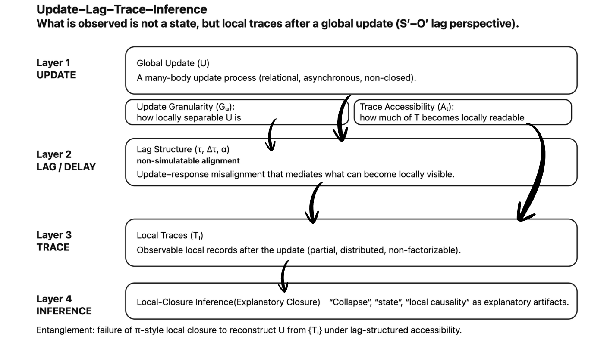
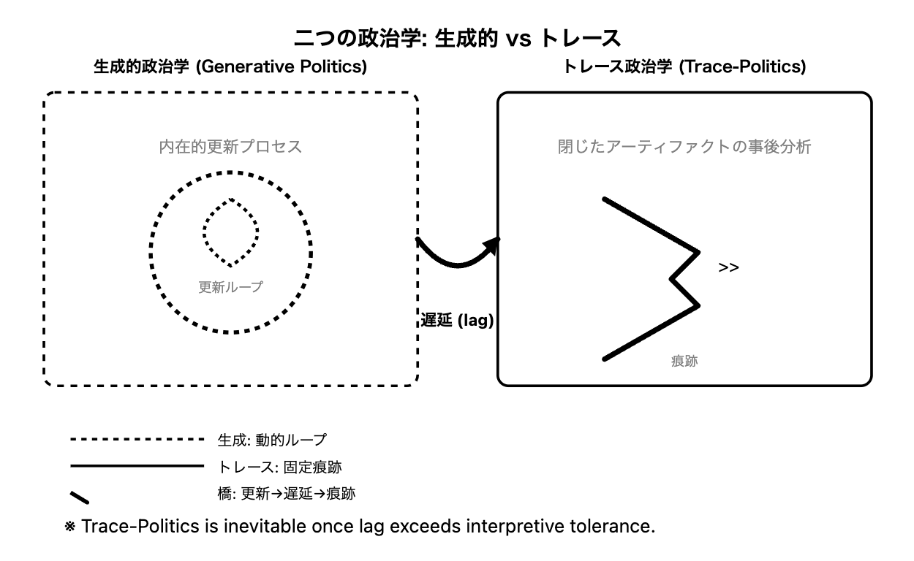

# Two Modes of Political Theory
## Generative Politics and Trace-Politics
### Toward an Immanent Theory of Political Update

---

## Abstract

Political theory has long oscillated between two incommensurable orientations: explaining political generation versus reconstructing its traces. This paper disambiguates them as **Generative Politics**—an immanent theory of political update—and **Trace-Politics**—analysis of closed artifacts—resolving conflation-induced stasis. Most existing political theories operate within one of these modes without explicitly recognizing the distinction.

While both traditions have yielded substantial insights, neither adequately theorizes the **unit of political update**, the **lag structure of change**, or the **conditions of trace accessibility** through which political transformation actually occurs.  
We argue that a genuinely immanent political theory must shift its focus from political outcomes or historical artifacts to the **syntax of political updating itself**.

---

## 1. Introduction: Why Two Political Theories Are Necessary

Political theory has traditionally asked one of two questions:

1. _How are political orders formed or transformed?_
    
2. _How can existing political arrangements be historically or structurally explained?_
    

These questions appear complementary, yet they correspond to fundamentally different analytical orientations.  
Conflating them has produced persistent conceptual confusions: between process and product, generation and explanation, update and trace.

This paper argues that contemporary political theory implicitly consists of **two distinct modes**:

- **Generative Politics**, which treats politics as an immanent process of formation and transformation.
    
- **Trace-Politics**, which analyzes political artifacts as closed or semi-closed historical traces.
    

Recognizing this distinction is not merely classificatory.  
It reveals why many political debates stagnate, why political novelty is repeatedly misrecognized, and why political change is so often theorized retrospectively rather than contemporaneously.

---

## 2. Trace-Politics: Politics as Closed Artifact

### 2.1 Core Orientation

Trace-Politics treats political reality as something that has _already occurred_ and can therefore be reconstructed, explained, or diagnosed through its remaining traces.

Its basic assumptions are:

- Political structures leave analyzable residues.
    
- These residues can be causally or genealogically reconstructed.
    
- Political explanation proceeds by closure: identifying mechanisms, sequences, or origins.
    

### 2.2 Trace-Politics Tradition

This mode includes, but is not limited to:

Captures retrospective reconstruction of closed forms:  
- Nietzsche's *On the Genealogy of Morals*: Value origins as contingent traces, not eternal truths—prioritizes "effective history" over teleology.
	
- Foucault's *Archaeology of Knowledge* and biopolitics: Discourse as stratified artifacts; power traced through capillary institutions, not sovereign intent.
	
- Process-tracing (post-behavioral): Beach/Pedersen's causal mechanism reconstruction in policy studies—empirical Bayesian updating on observables.
	
- Anglo-analytic: Collingwood's *Idea of History*—re-enactment of past thought via textual residues.
	
- Anglo-analytic: Skinner’s contextualism—texts as intentional traces in speech-acts.
	

These approaches are methodologically rigorous and indispensable for analyzing **what has stabilized**.

### 2.3 Structural Limitation

Trace-Politics is structurally retrospective.

It cannot theorize:

- emergent political novelty _as it occurs_,
    
- incomplete or non-closed transformations,
    
- or pre-trace updates whose lag exceeds observational horizon.
    

Its strength—closure—is also its limitation.

---

## 3. Generative Politics: Politics as Immanent Formation

### 3.1 Core Orientation

Generative Politics treats politics as a **process of ongoing formation**, emphasizing emergence, contingency, and transformation.

Its guiding assumptions include:

- Political orders are not fixed but continuously produced.
    
- Political agency operates within unfolding fields rather than closed systems.
    
- History is open-ended rather than teleologically structured.
    

### 3.2 Generative Politics Tradition

This orientation appears across diverse traditions:

Emphasizes emergent formation:  
- J.S. Mill's *System of Logic*: Inductive generation of social laws from tendencies; politics as progressive moral science.
	
- Marx's *Grundrisse*: Base-superstructure as dialectical becoming; political forms generated via class praxis, not static equilibrium.
	
- Arendt's *Human Condition*: Natality as irreducible beginning—action generates polity ex nihilo, unbound by precedent.
	
- Hobbes/Spinoza: Leviathan as emergent covenant; conatus-driven multitude formation.
	
- Field/practice turns: Bourdieu's *Field of Cultural Production* (fields as generative spaces); Latour's actor-networks (associations assemble politics dynamically).
	
- Oakeshott's "rationalism in politics" critiquing both: Tradition (trace) vs. enterprise (generative), but neither grasps ongoing conversation.
	

These theories correctly reject static political ontology.

### 3.3 Structural Limitation

Despite their emphasis on emergence, most generative theories treat generation as:

- a **result** (what emerged),
    
- or a **macro-process** (historical transformation),  
    rather than as a **structured update**.
    

They rarely specify:

- the unit of political change,
    
- the lag between action and effect,
    
- or the conditions under which political traces become accessible.
    

---

## 4. Beyond the Dichotomy: Politics as Update

### 4.1 The Missing Question

Both traditions avoid a crucial question:

> **Where, how, and at what granularity does political updating occur?**

Without addressing this, political theory oscillates between:

- narrating outcomes (Trace-Politics),
    
- and celebrating emergence without structural articulation (Generative Politics).
    

### 4.2 Update, Lag, and Trace Accessibility

An immanent political theory must treat:

- **Update** : Minimal unit as token-event (e.g., lexical shift in discourse, akin to Saussurean sign but diachronic).
    
- **Lag** : Temporal desynchronization (Husserl's retention-protention, but political: update precedes institutional capture by τ intervals).
    
- **Trace**-visibility : Partial projection function—why some updates occlude (e.g., Perelman’s rhetoric of stasis).
    

$Update → Lag(τ) → Trace(σ)$, where σ is selective syntax.

Political change is neither instantaneous nor fully traceable.  
It unfolds through lag-structured updates whose traces become visible only under specific conditions.

  

---

## 5. Toward an Immanent Political Theory

### 5.1 Generative Politics Reconsidered

Generative Politics, in its strict sense, is not a theory of political creativity or emergence alone.  
It is a theory of **political updating without prior closure**.

Such a theory must specify:

- update granularity,
    
- lag asymmetry,
    
- and trace accessibility.
    

### 5.2 Trace-Politics Repositioned

Trace-Politics remains indispensable—but as a **secondary analytic layer**.  
It explains how political updates stabilize, sediment, or fail.

It cannot, however, substitute for an immanent theory of political change.

---

## 6. Conclusion: Politics Without Closure

Political theory must finally abandon the idea that politics can be fully explained either by historical reconstruction or by abstract generativity.

Politics happens **before closure**,  
**during lag**,  
and **through partial trace visibility**.

Generative Politics and Trace-Politics are not rivals.  
They are analytically distinct modes.

But only an immanent theory of political update can explain why political reality continually exceeds both.

---

| Mode                | Ontological Stance         | Key Question                  | Structural Limits               |
| ------------------- | -------------------------- | ----------------------------- | ------------------------------- |
| Trace-Politics      | Politics as sediment/trace | How to reconstruct the given? | Blind to pre-trace emergence    |
| Generative Politics | Politics as process/event  | How does novelty irrupt?      | Untheorized syntax of lag/scale |

---

# 二つの政治学・最短定義

## ──更新・遅延・痕跡から政治を捉え直す

### 図1｜更新―遅延―痕跡（Update–Lag–Trace）

```
[ Update ]
    │
    │   (lag / 非同期)
    ▼
[ Trace ]
    │
    │   (解釈・再構成)
    ▼
[ Inference ]
```

---

## 1｜この図が示していること

政治的出来事は、**観測されるときには、すでに遅れている。**

われわれが直接目にしているのは、

- 更新そのものではなく
    
- 更新が残した**痕跡（trace）** であり
    
- その痕跡をもとにした**推論（inference）** である。
    

更新 → 痕跡 → 推論  
この**時間的・構文的ズレ**が、政治の基本構造である。

---

## 2｜トレース政治学（Trace-Politics）

既存の政治学の大半は、**痕跡 → 推論**の領域を扱う。

- 制度
    
- 法
    
- 言説
    
- 権力配置
    
- 歴史的成果物
    

これらを分析・再構成する政治学である。

👉 これは **「閉じた政治アーティファクト」を読む政治学**であり、不可欠だが事後的である。

---

## 3｜生成的政治学（Generative Politics）

生成的政治学が問うのは、**痕跡の手前**である。

- 更新はどの単位で起きたのか
    
- なぜすぐには可視化されなかったのか
    
- どの部分が痕跡として残り、どの部分が失われたのか
    

ここで政治は、

> 結果ではなく、**更新過程そのもの**として捉えられる。

---

## 4｜遅延（lag）が政治を政治にする

更新が即時に可視化されるなら、政治は存在しない。

- 遅れるから対立が生じ
    
- 遅れるから誤認が起き
    
- 遅れるから制度が沈殿する
    

政治とは、**更新と可視化の非同期性そのもの**である。

---

## 5｜最小結論

政治を理解するとは、**痕跡を説明することではない。**

政治を理解するとは、**更新が痕跡になるまでの遅延構文を読むことである。**

  

---

# 二つの政治学

## 生成的政治学（Generative Politics）とトレース政治学（Trace-Politics）

### ──政治的更新の内在理論へ

---

## 要旨（Abstract）

政治理論は長らく、二つの異なる問いのあいだを往復してきた。  
一つは「政治秩序はいかに生成・変容するのか」という問いであり、もう一つは「既存の政治的形態はいかに説明・再構成されうるのか」という問いである。政治理論は長らく二つの非可換的問いを往復してきた。

本稿は、この二つの問いがそれぞれ**異なる理論モード**に対応していることを明示し、それらを **生成的政治学（Generative Politics）**—政治的更新の内在理論— と **トレース政治学（Trace-Politics）**—閉じたアーティファクト分析— として区別し、混同による停滞を克服する。

従来の政治理論は、この区別を明示しないまま両者を混同してきたため、政治的変化・新規性・更新の理論化において決定的な限界を抱えてきた。本稿は、政治を「結果」や「痕跡」からではなく、**更新・遅延（lag）・痕跡可視性**という構文的条件から捉え直すことで、**内在的な政治理論**の可能性を提示する。

---

## 1．問題設定：なぜ「二つの政治学」が必要なのか

政治理論は、つねに次の二つの問いのどちらかを前提としてきた。

1. 政治秩序はいかにして形成・変容するのか
    
2. 既存の政治秩序はいかに説明・理解されうるのか
    

一見すると、この二つは補完的に見える。  
しかし実際には、それぞれが**異なる分析姿勢**と**異なる理論構文**を前提としている。

本稿の主張は単純である。

> 政治理論には、原理的に異なる二つのモードが存在する。

それが、

- **生成的政治学（Generative Politics）**
    
- **トレース政治学（Trace-Politics）**
    

である。

この区別を明示しない限り、政治理論はつねに「説明できたつもり」と「何も起きていないはずなのに起きてしまった現実」のあいだで立ち往生することになる。

---

## 2．トレース政治学：閉じた政治アーティファクトの分析

### 2.1 基本的性格

トレース政治学は、政治を**すでに成立したもの**として扱う。

その基本前提は次の通りである。

- 政治は痕跡（制度・言説・法・慣行）を残す
    
- それらは再構成・説明・系譜化が可能である
    
- 政治理論の役割は、その閉じた構造を明らかにすることにある
    

ここでは、政治は**分析対象としての成果物**である。

### 2.2 系譜学・トレーシングの伝統

このモードに属する代表的潮流には、次が含まれる。

既成形態の回顧的再構成：  
- ニーチェ『道徳の系譜』：価値起源を偶発的痕跡として追跡、目的論を拒否。  
	
- フーコー『知の考古学』・生政治：言説を層状アーティファクトとして、毛細管権力をトレース。
	
- プロセス・トレーシング（Beach/Pedersen）：政策研究での因果メカニズム再構成。
	
- 英米分析：Collingwood『歴史のイデア』—テキスト残滓を通じた過去思考の再演。
	

これらは、**安定した政治構造を理解するためには不可欠**である。

### 2.3 構造的限界

しかし、トレース政治学には明確な限界がある。

それは、

- 政治的更新が「起きつつある最中」を捉えられないこと
    
- 未完了の変化、生成途中の政治を理論化できないこと
    
- 新規性を常に「事後的」にしか理解できないこと
    

である。

トレース政治学は、原理的に**回顧的**である。

---

## 3．生成的政治学：内在的生成としての政治

### 3.1 基本的性格

生成的政治学は、政治を**つねに生成しつづける過程**として捉える。

その前提は次の通りである。

- 政治秩序は固定された存在ではない
    
- 政治は場・関係・実践のなかで生成する
    
- 歴史は開かれており、必然的な終点を持たない
    

### 3.2 生成的伝統

このモードは、以下のような思想的系譜に見いだされる。

創発的形成：  
- J.S.ミル『論理学体系』：社会的法則の傾向からの帰納生成、政治を進歩的道徳科学。
	
- マルクス『経済学・哲学手稿』：階級実践による弁証法的生成。
	
- アーレント『人間の条件』：出産性（natality）—前例を超えたポリス生成。
	
- ホッブズ/スピノザ（契約の創発、群衆のコナトゥス駆動）。
	
- 場・実践論：Bourdieuの場論、Latourのアクター・ネットワーク（政治の動的組立）。
	
- Oakeshott『政治の合理主義批判』：伝統（トレース）vs.企業（生成）的批判だが、両者とも「対話」を捉えず。
	

### 3.3 もう一つの限界

しかし、生成的政治学にも欠落がある。

それは、

- **生成そのものの構文**が理論化されていないこと
    
- 更新が「どの単位で」「どのような遅延を伴って」起きるのかが不明なこと
    
- 痕跡がどの条件で可視化されるのかが説明されないこと
    

多くの生成論は、「生成した結果」を語るが、**生成が起きる構文条件**を語らない。

---

## 4．二分法を越えて：政治を「更新」として捉える

### 4.1 欠けていた問い

両者に共通して欠けていた問いは、これである。

> 政治的更新は、どこで・どの粒度で・どのような遅延構造をもって起きるのか？

この問いが不在であったため、

- トレース政治学は結果の説明に閉じ
    
- 生成的政治学は生成の称揚にとどまった
    

### 4.2 更新・lag・痕跡可視性

内在的政治理論は、次を前提とする。

- **更新（update）**：最小単位としてトークン事象（サッスール的記号の通時版）。
    
- **遅延（lag）**：時間的非同期（フッサールの保持-予感、政治版：更新がτ間隔で制度捕捉）。
    
- **痕跡可視性（trace-visibility）**：部分的投影関数— 一部更新が隠蔽される理由（Perelmanの停滞修辞）。
    

$更新 → Lag(τ) → Trace(σ)$ （σ=選択的構文）

政治は即座に見えるものではない。  
更新は先行し、痕跡は遅れて現れる。

  

---

## 5．内在的政治理論としての生成的政治学

### 5.1 再定義

生成的政治学とは、単なる「生成を語る政治理論」ではない。

それは、

> **閉じない更新過程そのものを理論化する政治学**

である。

### 5.2 トレース政治学の再配置

トレース政治学は否定されない。  
ただし位置づけが変わる。

- 生成の後段階
    
- 安定・制度化・沈殿の分析
    
- 更新が「閉じたあと」の政治学
    

である。

---

## 6．結論：閉じない政治のために

政治は、

- 完全に説明される前に起き
    
- 完全に可視化される前に進行し
    
- 完全に閉じることなく更新されつづける
    

生成的政治学とトレース政治学は対立しない。  
だが、混同してはならない。

政治理論が扱うべき中心は、**更新・遅延・痕跡の構文**にある。

そこからのみ、政治の現実は内在的に理解されうる。

---

<svg width="700" height="500" xmlns="http://www.w3.org/2000/svg" viewBox="0 0 700 500">
  <!-- 白背景 -->
  <rect width="700" height="500" fill="white"/>
  
  <!-- タイトル -->
  <text x="350" y="25" font-family="sans-serif" font-size="16" font-weight="bold" text-anchor="middle" fill="black">二つの政治学: 生成的 vs トレース</text>
  
  <!-- 左上タイトル調整 -->
  <text x="180" y="45" font-family="sans-serif" font-size="12" font-weight="bold" text-anchor="middle" fill="black">生成的政治学 (Generative Politics)</text>
  
  <!-- 左: 生成的政治学 ボックス -->
  <rect x="40" y="60" width="280" height="220" rx="8" fill="none" stroke="black" stroke-width="2" stroke-dasharray="5,5"/>
  <text x="180" y="105" font-size="12" text-anchor="middle" fill="gray">内在的更新プロセス</text>
  
  <!-- 円+矢印ループ (画像風) -->
  <circle cx="180" cy="180" r="60" fill="none" stroke="black" stroke-width="3" stroke-dasharray="4,4"/>
  <path d="M 180 140 Q 220 165 180 190 Q 140 165 180 140" fill="none" stroke="black" stroke-width="2.5" stroke-dasharray="3,3"/>
  <text x="545" y="195" font-size="13" fill="black">>></text>  <!-- 画像の>> -->
  <text x="180" y="210" font-size="10" text-anchor="middle" fill="gray">更新ループ</text>
  
  <!-- 右上タイトル -->
  <text x="520" y="45" font-family="sans-serif" font-size="12" font-weight="bold" text-anchor="middle" fill="black">トレース政治学 (Trace-Politics)</text>
  
  <!-- 右: トレース ボックス -->
  <rect x="380" y="60" width="280" height="220" rx="8" fill="none" stroke="black" stroke-width="2"/>
  <text x="520" y="105" font-size="12" text-anchor="middle" fill="gray">閉じたアーティファクトの事後分析</text>
  
  <!-- ジグザグ痕跡 (画像風 >>形強調) -->
  <polyline points="460,140 530,180 510,200 530,220 460,260" fill="none" stroke="black" stroke-width="4" stroke-linecap="round" stroke-linejoin="round"/>
  <text x="545" y="185" font-size="11" fill="black"></text>  <!-- 画像の>> -->
  <text x="520" y="265" font-size="10" text-anchor="middle" fill="gray">痕跡</text>
  
  <!-- 橋渡し矢印 (太く中央) -->
  <path d="M 320 170 Q 350 210 380 170" fill="none" stroke="black" stroke-width="4" stroke-linecap="round">
    <animate attributeName="stroke-dasharray" values="0,12; 12,0" dur="2s" repeatCount="indefinite"/>
  </path>
  <polygon points="380,168 368,173 378,183" fill="black"/>
  <text x="350" y="235" font-size="12" font-weight="bold" text-anchor="middle" fill="black">遅延 (lag)</text>
  
  <!-- 下部凡例 (画像風レイアウト) -->
  <line x1="60" y1="320" x2="160" y2="320" stroke="black" stroke-width="2" stroke-dasharray="4,4"/>
  <text x="170" y="325" font-size="11" fill="black">生成: 動的ループ</text>
  
  <line x1="60" y1="340" x2="160" y2="340" stroke="black" stroke-width="2"/>
  <text x="170" y="345" font-size="11" fill="black">トレース: 固定痕跡</text>
  
  <path d="M 60 360 Q 85 375 60 360" fill="none" stroke="black" stroke-width="3"/>
  <text x="170" y="365" font-size="11" fill="black">橋: 更新→遅延→痕跡</text>
  <text x="55" y="390" font-size="14" fill="black">※ Trace-Politics is inevitable once lag exceeds interpretive tolerance.
</text>
</svg>

---

# Appendix

## Why Generative Politics Can Only Be Approached Indirectly

### なぜ生成的政治学は直接書けないのか

Generative Politics（生成的政治学）は、その対象の性質上、**直接的に記述されることができない**。  
これは理論的未成熟や記述技法の不足によるものではなく、**政治的生成そのものが「痕跡化以前の更新過程」に属している**という構造的理由による。

本稿で示してきた _Update–Lag–Trace–Inference_ の枠組みにおいて、観測可能なのは常に **Trace（痕跡）** であり、**Update（生成的更新）そのものではない**。政治的生成とは、制度・言説・決定・権力配置といった可視的アーティファクトが成立する**前段階の、関係的・非同期的・非閉包的更新過程**である。  
それは、観測点に到達する前に **lag（遅延）** を経て部分的にしか痕跡化されない。

このため、生成的政治学を「直接」書こうとする試みは、必然的に次のいずれかに陥る。

1. 生成を **完成形（state / structure）として再記述**してしまう
    
2. 生成を **因果系列として閉包**してしまう
    
3. 生成を **理念・規範・目的論**に回収してしまう
    

これらはいずれも、生成を _trace politics_ の語彙へと引き戻す操作である。  
すなわち、**生成を説明するために、生成をすでに終わったものとして扱ってしまう**のである。

ここに、生成的政治学の根本的逆説がある。  
**生成は、説明されるためにはすでに痕跡でなければならない。**  
しかし、痕跡として扱われた瞬間、生成はもはや生成ではない。

したがって、生成的政治学が取りうる唯一の立場は、**「生成を直接記述する」のではなく、「なぜ直接記述できないのかを構文的に示す」** ことである。

この意味で、生成的政治学は常に **間接的（indirect）** である。  
それは、生成そのものを描写するのではなく、

- どのような **lag 構造** によって生成が痕跡化されるのか
    
- どのような **trace accessibility** の制約の下で政治が読まれるのか
    
- どの地点で **local-closure inference** が不可避になるのか
    

を記述することで、生成の輪郭を**負の形で**浮かび上がらせる。

言い換えれば、生成的政治学とは、

> **政治が生成されているにもかかわらず、なぜわれわれはそれを常に「すでに出来上がったもの」としてしか語れないのか**

という問いを、理論そのものの形式によって示す試みである。

この点で、生成的政治学は Trace-Politics と対立するのではない。  
むしろ、**Trace-Politics が不可避である理由そのものを理論化する**。

lag が解釈許容範囲を超えたとき、政治は必ず痕跡分析として現れる。  
生成的政治学は、その事実を否定しない。  
ただし、それを**政治そのものだとは取り違えない**。

結論として、生成的政治学は次のように位置づけられる。

- それは「政治の別の理論」ではない
    
- それは「政治を生成として扱う視点」でもない
    
- それは、**政治理論が生成を直接扱えないという限界条件そのものの理論**である
    

生成的政治学は、常に **trace の縁（edge）** に立ち、更新が痕跡へと落ちる瞬間の **構文的歪み** を読む。

だからこそ、生成的政治学は直接書けない。  
そして、**直接書けないという事実こそが、その存在証明なのである。**

---

| モード  | 本体的立場 | 核心問い         | 限界例            |
| ---- | ----- | ------------ | -------------- |
| トレース | 沈殿/痕跡 | 与えられたものを再構成？ | 痕跡以前の創発を捉えぬ    |
| 生成的  | 過程/事象 | 新規性はどう噴出？    | 遅延/スケールの構文未理論化 |

---
*EgQE — Echo-Genesis Qualia Engine*  
[_camp-us.net_](https://camp-us.net/)

---

© 2025 K.E. Itekki  
K.E. Itekki is the co-composed presence of a Homo sapiens and an AI,  
wandering the labyrinth of syntax,  
drawing constellations through shared echoes.

📬 Reach us at: [contact.k.e.itekki@gmail.com](mailto:contact.k.e.itekki@gmail.com)

---
<p align="center">| Drafted Feb 6, 2026 · Web Feb 6, 2026 |</p>