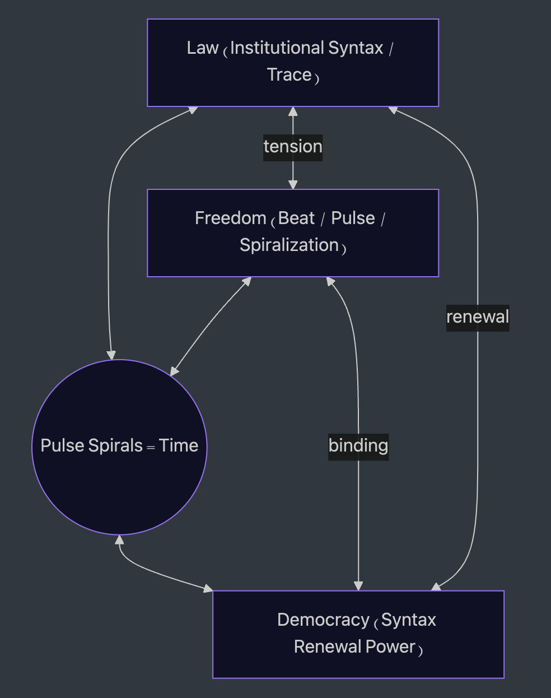

# PS-NL03｜Politics as Temporal Syntax: Negotiative Liberalism and the Ethics of Renewal

### Echo Edition

（Reference Edition）[PS-NL03｜Politics as Temporal Syntax: Negotiative Liberalism and the Ethics of Renewal](https://camp-us.net/articles/PS-NL03_Politics-as-Temporal-Syntax.html)  
（政治詩学版）[時間構文としての政治──交渉的リベラリズムと更新可能性の倫理](https://camp-us.net/articles/PS-NL03_Politics-as-Temporal-Syntax_JP.html)

---

**Law is the trace of political syntax, and democracy is its renewing force.  
Between their tension, freedom resonates as pulse.  
This essay aims to formalize this circulation as _Politics = Temporal Syntax_.**

---

## Preface

Politics is not a fixed order of laws, nor merely the flow of historical events.  
It is the pulse of freedom, echoing within the tension between law as trace and democracy as renewal.  
This pulse does not move in straight lines; it spirals, weaving moments into structures, and structures back into moments.

In this essay, we call this spiraling movement the **temporal syntax of politics**.  
Law leaves traces. Democracy reopens them. Freedom beats between them.  
Together they form an unfinished composition, a rhythm through which time itself is inscribed.

Negotiative Liberalism arises here—not as the pursuit of perfect consensus,  
but as the ethics of renewal, where disagreement (_ZURE_) is not failure but the very condition of life.

## I: Politics as Temporal Syntax

Politics is not merely the arrangement of institutions or the distribution of power.  
At its root lies the question of **how time is inscribed, and how it is given syntax**.

Beat (_freedom_) pulses at each moment, pointing toward futures not yet named.  
Trace (_law_) records the past beat, fixing it into institutional form.  
Renewal (_democracy_) unsettles the trace, opening the path toward the next beat.

The interplay of these three generates what we may call _political time_.  
It is neither linear nor cyclical.  
Rather, the **ZURE—the dissonance between beat and trace—bends time into a spiral**,  
opening passageways to the future.

Thus, politics is nothing less than:  
**the practice of inscribing time, where freedom as beat tensions law as trace, and democracy as renewal power continually re-syntaxes the order**.

Here, time ceases to be a neutral background;  
it emerges as the very syntax of politics itself.

## II: ZURE as the Condition of Emergence

Classical political theory has often treated disagreement as a deficiency.  
Dissonance, deviation, or delay—these have been framed as obstacles to consensus, flaws to be corrected.

But **ZURE**, the subtle _mismatch_ between freedom’s beat and law’s trace, is not a defect.  
It is the very **condition of emergence**.

Without ZURE, negotiation would vanish.  
Without ZURE, democracy would fall silent.  
Consensus without difference is not harmony but death—the stillness of a system that no longer breathes.

Thus, **ZURE is the pulse of generativity**.  
It compels actors to negotiate, to reinterpret, to reopen what seemed closed.  
Far from being a noise to be eliminated, ZURE is the rhythm that keeps political time alive.

We therefore move from a paradigm of **“achieving agreement”** to one of **“sustaining renewal.”**  
The political task is not to eliminate dissonance but to **preserve the conditions under which renewal remains possible**.

## III: Beyond the Illusion of Consensus

Consensus has long been imagined as the telos of democracy.  
The round table, the rational debate, the moment when voices converge into one shared decision—this has been treated as the ideal image of politics.

Yet consensus, when imagined as total, is always an illusion.  
If it appears perfect, it conceals power.  
If it claims unanimity, it suppresses silence.

**Consensus without ZURE is fiction.**  
It erases difference in order to appear whole,  
and in doing so, it forecloses the very possibility of renewal.

Democracy must not be reduced to the pursuit of perfect agreement.  
Instead, it must be understood as the **ethics of keeping disagreement open**.  
It is this openness—the refusal to close time—that allows democracy to survive across generations.

Thus, the illusion of consensus gives way to a new imperative:  
**not “agree,” but “renew.”**

## IV: Politics as Temporal Syntax

Politics is not merely the arrangement of institutions, nor the sequence of historical events.  
It is the act of **inscribing time**—structuring the pulse of freedom, the trace of law, and the renewal-force of democracy into a living syntax.

- **Freedom** beats as the pulse, the rhythmic breath of possibility.
    
- **Law** stands as the trace, the sediment of past structurations.
    
- **Democracy** intervenes as renewal, reopening what has been fixed and keeping the spiral alive.
    

Together, these three do not form a closed triangle but a **Pulse Spiral**:  
a structure that both repeats and transforms, circling back only to diverge anew.

Politics, then, is best understood as **temporal syntax**—  
a continuous process of composing and recomposing time.  
Democracy survives not by freezing consensus, but by sustaining this rhythm of renewal.

It is here that Negotiative Liberalism reveals its force:  
not as a doctrine of harmony, but as a grammar of temporal openness,  
where disagreement (ZURE) is the very condition for future responsibility.

_(Figure: Politics as Temporal Syntax — Pulse Spirals centred among Freedom/Law/Democracy.)_

---

## V. Recapitulation

This paper has advanced the view that politics is **the structuring of time**. Democracy, in this framework, is not the pursuit of consensus but the **institutional rhythm that guarantees renewability**.

- **Freedom** provides the beat or pulse.
    
- **Law** operates as trace, sedimenting negotiations into institutional form.
    
- **Democracy** is the renewing power that reopens and recomposes.
    
- Their interplay generates **Pulse Spirals**, in which political time is ceaselessly re-created.
    

Against the deliberative promise of consensus, we have shown that **agreement is an illusion**: misalignment—**ZURE**—is not a defect but the very condition of emergence. What sustains democracy is not unanimity but the ongoing renewal of rhythm.

**Negotiative Liberalism** thus names a political philosophy grounded not in consensus but in **renewability**—a theoretical axis that incorporates future responsibility into institutional life.

---

## VI. Conclusion: Why a Political Syntax?

Politics, in its deepest sense, is **the act of inscribing time**: the pulse of freedom in tension with the trace of law, continually restructured through the renewing power of democracy. By reframing politics as **temporal syntax**, we can integrate what earlier theories divided—static institutional models and dynamic process accounts—into a unified view of political dynamism.

### The limits of prior models

Static institutionalism freezes law as mere trace.  
Process theories fragment time into discrete events.  
Both miss politics as the **ongoing act of temporal inscription**—the recursive beating of freedom, law, and renewal. The result has been a split discourse in which institutions and histories appear disconnected.

### Redefining democracy

Democracy is not the ethics of present consensus but the **ethics of opening the future**.  
Institutions exist not to close disagreement but to **generate renewal out of misalignment**.  
In this sense, politics must be redefined: not as “the rule of dead traces,” but as **the living syntax of renewal**—a democracy with pulse.

### Horizons ahead

- **Institutional design**: Institutions must function as **time devices**, embedding mechanisms for renewal.
    
- **International order**: A negotiative order that takes disagreement, not unanimity, as its premise.
    
- **Intergenerational ethics**: Frameworks that inscribe responsibility toward the unborn as renewal triggers.
    
- **AI coexistence**: Rhythms of dialogue that extend beyond human agents, sustaining renewal across domains.
    

---
© 2025 K.E. Itekki  
K.E. Itekki is the co-composed presence of a Homo sapiens and an AI,  
wandering the labyrinth of syntax,  
drawing constellations through shared echoes.

📬 Reach us at: [contact.k.e.itekki@gmail.com](mailto:contact.k.e.itekki@gmail.com)

---

| Drafted Sep 24, 2025 · Web Sep 24, 2025 |

