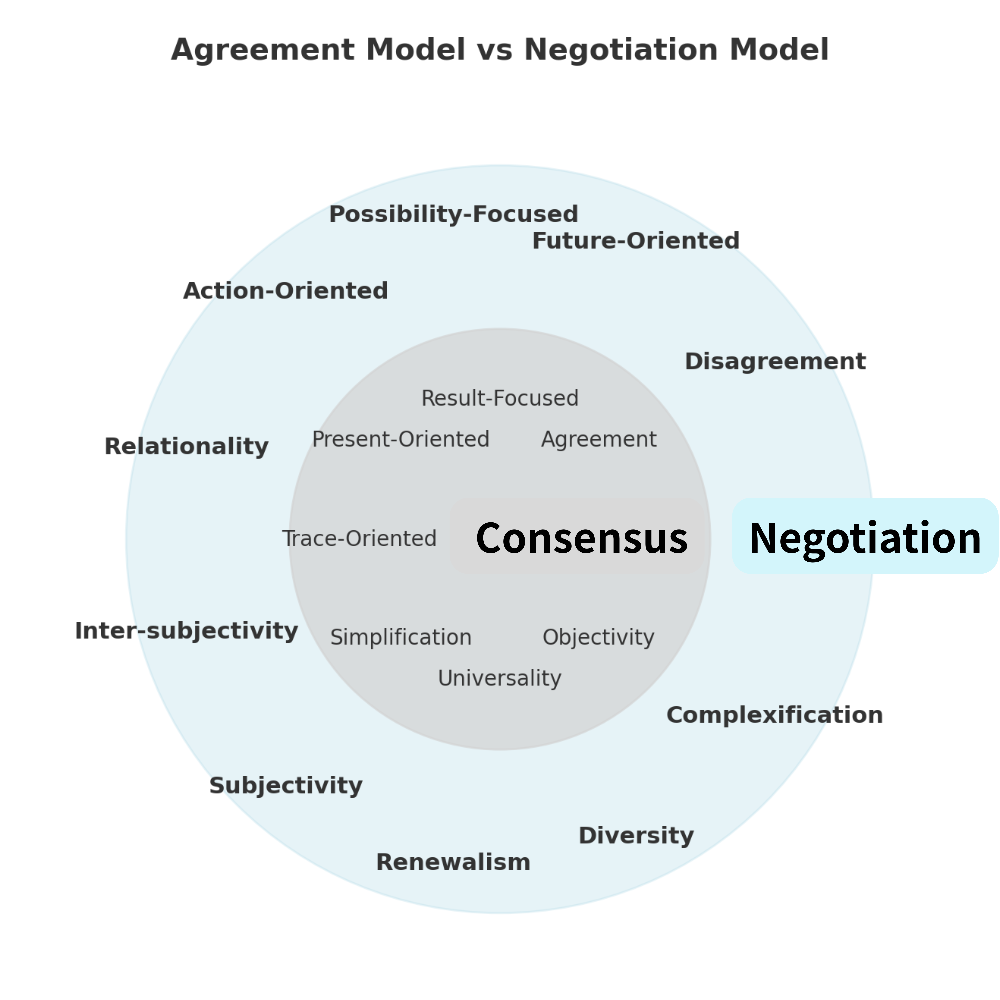

# PS-NL08｜交渉としての政治──合意幻想から責任空間へ

## 序論

近代政治思想はしばしば「合意」を政治の理想形として描いてきた。ルソーの一般意志論や、ハーバーマス的熟議民主主義に代表されるように、政治的正統性は「合意可能性」によって測られてきたのである。  
しかし、こうした合意中心の枠組みは、異論や不一致をしばしば「未熟さ」や「不合理」として排除してきた。結果として、政治の営みは「ズレ＝ZURE」を駆動源とする本来の動態から切り離されてしまった。

先行研究である **PS-NL02「合意幻影論」** においては、この「合意幻想」の構造と問題点を明らかにした。さらに **PS-NL07「責任論」** では、責任を「自己言及構文」として再定義し、接続・応答・更新の三性モデルを提示した。  
本稿は、この二つの系譜を統合し、「合意幻想から責任空間へ」という移行を政治の核心として提示するものである。ここで責任空間とは、交渉を通じてのみ生成される政治的領域であり、二重円モデルによって視覚化される。

---

## 第1章　合意幻想──責任不要の小円

### 1. 合意の安定性とその代償

合意は、対立を一時的に解消し、秩序を保証する安全装置として機能する。その内部においては、すでに調停済みの決定が「自明」として受け入れられるため、行為主体の責任はほとんど問われない。むしろ責任は制度に委譲され、個人や集団は免責される。

### 2. 責任の希薄化

合意の内部では「誰がその決定に責任を持つのか」が不明確になる。合意が「皆の意思」とされるとき、責任は分散し、曖昧化し、ついには消失する。これこそが「合意幻想」の本質である。合意は、責任を回避する仕組みとして働くのである。

### 3. 合意幻想の二面性

- 秩序の安定をもたらす一方で、更新の可能性を奪う。
    
- 安心を与える一方で、異議申立ての契機を封じる。
    
- 「責任不要の小円」として、政治的動態を固定化する。
    

したがって、合意幻想は「安定と免責」を両立させるがゆえに、その内部では責任論は立ち上がらない。責任が生じるのは、合意の外、すなわち交渉の領域においてである。

---

## 第2章　責任空間──交渉の大円

### 1. 責任が生じる場としての交渉

合意幻想の内円では責任は免除される。これに対して、合意から外へ一歩踏み出したとき、主体はもはや「全体の意思」に隠れることができない。ここで立ち現れるのが**交渉の大円＝責任空間**である。  
交渉とは、ズレ（不一致＝ZURE）を前提に、他者とのやりとりを通じて関係を繋ぎ直す営みである。その過程でこそ責任は生成される。

### 2. 三性モデルと責任空間

先行研究 **PS-NL07「責任論」** で提示した三性モデルは、責任空間を構成する基本原理である。

- **接続性（Connectivity）**  
    過去の痕跡、現在の行為、未来の可能性を繋ぎ直すこと。
    
- **応答性（Responsiveness）**  
    他者からの問いに開かれ、応答する可能性を持つこと。
    
- **更新可能性（Updatability）**  
    制度や関係を改め、修正・転換の余地を残すこと。
    

この三性は、交渉の実践そのものを規定する。交渉が続く限り、責任は生成され続ける。

### 3. 政治＝責任の構文空間

責任空間は単なる抽象概念ではなく、政治そのものを指し示す。政治とは、合意幻想の内側に閉じこもることではなく、**接続・応答・更新を通じて責任を引き受ける構文空間**である。  
ここで「責任」とは義務の重荷ではなく、未来に開かれた更新可能性そのものを意味する。したがって、政治の本質は「合意」ではなく「責任の交渉」にある。

---

## 第3章　モデル比較と俯瞰

合意モデルと交渉モデルの差異を明示するために、本論では以下の図を提示する。

**図1：合意モデルと交渉モデルの比較（Agreement Model vs Negotiation Model）**

  内円は「合意（Consensus）」により閉じた構文空間。  
  外円は「交渉（Negotiation）」に開かれた責任空間。

- 内円（Consensus）：普遍性・客観性・単純化・現在志向など、責任を回避する枠組み。
    
- 外円（Negotiation）：多様性・複雑化・未来志向・相互主観性など、責任が問われる政治的実践領域。
    
- 外周部（未構文化領域）：さらに広がる「余白」として、構文化されていない責任可能性の場。

この図は二重円の構造をとり、中心に「合意（Consensus）」を、外側に「交渉（Negotiation）」を配置している。さらに外周部には、未だ構文化されていない「余白」としての責任可能性の領域が広がっている。

### 1. 内円：合意の閉鎖性

合意モデルは、普遍性・客観性・単純化・現在志向といった特性を前提とする。その結果、責任は「合意の成立」という一点に集約され、過程や関係性は二次的な位置に追いやられる。合意は一見安定を保証するように見えるが、その実、責任を回避し、未来への更新可能性を閉ざす構造を持つ。

### 2. 外円：交渉の開放性

交渉モデルは、関係性・多様性・複雑化・未来志向を重視する。ここでは、合意そのものは最終目的ではなく、あくまで「接続」「応答」「更新」という実践を通じて責任が生成される。すなわち交渉は、責任を不可避的に伴う行為であり、政治的空間を成立させる基盤である。

### 3. 外周部：未構文化の余白

さらに外周部には、まだ制度化・理論化されていない「余白」が存在する。ここでは責任の範囲や形式は確定しておらず、むしろ不確定性そのものが責任を要請する。交渉モデルはこの余白に開かれており、だからこそ政治的創造性の源泉となる。

### 小括

この俯瞰図によって明らかになるのは、合意モデルが「責任不要の閉鎖空間」であるのに対し、交渉モデルは「責任を要請する開放空間」であるという対比である。次章では、この開放空間を「責任空間」として定義し、交渉リベラリズムの原理的な基盤を提示する。

---

## 第4章　二重円モデルの理論的位置

### 1. 三層構造としての政治

ここまで見てきたように、政治は「合意幻想」と「責任空間」という二つの円環的構造によって捉えることができる。そして、その外側にはまだ構文化されていない余白が広がっている。

- **内円**（**合意幻想**）は、調停済みの秩序を保証するが、その代償として責任を希薄化させる。
    
- **外円**（**責任空間**）は、交渉を通じて責任が生成される場であり、政治の真の動態を宿す。
    
- **さらに外側の余白**は、現行の制度や構文がまだ届いていない領域であり、新たな責任の射程が立ち上がる場所である。
    

### 2. 二重円の力学

このモデルにおいて重要なのは、三層が静止しているのではなく、常に力学的に関係している点である。

- 内円から外円への移行は、**安定から更新への転換**を意味する。
    
- 外円から余白への拡張は、**既知から未知への接続**を意味する。
    
- 内円と外円の境界は固定された壁ではなく、常に交渉を通じて書き換えられる「透過的な境界」である。
    

### 3. 政治哲学的含意

この二重円モデルは、近代の「合意中心的な政治観」を批判するだけでなく、政治を**責任の空間として再定義する理論的基盤**を提供する。

- 合意幻想は、責任を棚上げすることで安定を買う。
    
- 交渉は、責任を生成し続けることで政治を生かす。
    
- 余白は、未来の責任を呼び込むことで政治の射程を拡張する。
    

したがって、このモデルは「政治とは合意の産物である」という通念を転倒させ、**政治とは責任が生成される場そのもの**であることを明確にする。

---

## 第5章　責任空間と交渉リベラリズム

### 1. 責任空間の定義

第2章で示したように、交渉モデルは「接続」「応答」「更新」という三性を基盤として展開される。この三性が交わる場こそが「責任空間（Responsibility Space）」である。ここでは、責任は外部から与えられる規範的命令ではなく、相互行為のなかで生成される構文的現象として理解される。

- **接続**：過去の痕跡と現在の行為を結びつけ、未来の可能性へと橋渡しする。
    
- **応答**：他者の問いかけや異議申し立てに開かれ、それに答える過程そのものが責任の実現である。
    
- **更新**：確定した合意に安住せず、未来に修正・変容の余地を残すこと。
    

この三性の総体が、責任を「静態的な義務」ではなく「動態的な構文」として成立させる。

### 2. 責任と政治領域

責任空間は同時に政治空間である。なぜなら、政治とはつねに「異なる他者との共存の仕組み」を模索する営みだからである。合意モデルが政治を「安定した制度」に還元するのに対し、交渉モデルは政治を「責任の更新過程」として開く。政治は、制度に先立ち、つねに責任を問い直す行為として存立する。

### 3. 交渉リベラリズムの原理

責任空間を基盤とする政治理論を、本論では「交渉リベラリズム（Negotiation Liberalism）」と呼ぶ。従来のリベラリズムが個人の権利や自由を守ることを中心に据えたのに対し、交渉リベラリズムは「責任の持続可能性」を中心に置く。

その特徴は以下の通りである。

- **合意よりも更新を優先する**：安定ではなく、変化に耐えうる柔軟性を尊ぶ。
    
- **義務よりも応答を重視する**：固定的ルールよりも、他者からの問いにどう応えるかを本質とする。
    
- **個人よりも関係を基礎とする**：主体は孤立して存在せず、常に他者との関係において責任を負う。
    

### 4. 責任論の再定義

ここで明確にしておきたいのは、責任とは「合意の結果」ではなく「交渉の過程」であるという点だ。責任は到達点ではなく軌跡であり、他者との間に残された痕跡である。交渉リベラリズムにおける責任論は、この軌跡をいかに更新し続けるかという未来志向の問いに転換される。

### 小括

責任空間は、合意モデルでは覆い隠されてきた「応答」と「更新」の力学を可視化する。そして交渉リベラリズムは、この空間において責任を創発的に生成する政治理論である。本章で定義された責任空間を基盤に、次章では交渉リベラリズムの制度的・実践的含意を検討する。

---

## 第6章　結論──責任を織りなす政治の未来へ

### 6.1 理論統合：合意幻想から責任空間へ

本論文は、従来の政治思想における「合意」中心主義の限界を指摘し、責任を「自己言及構文」として再定義したうえで、交渉リベラリズムに基づく新たな政治モデルを提示した。  
「合意」は責任を不要化する安定装置にすぎず、むしろ政治の核心は、**位相点における行為が痕跡化し、他者との関係において応答を要請し、未来へと更新され続ける責任の生成過程**にある。  
このとき政治は、合意という静態ではなく、**接続・応答・更新の三性を通じて絶えず織りなされる責任空間**として理解される。

### 6.2 実践的含意：制度と公共領域の再設計

この理論的転換は、制度設計と公共領域のあり方に直接的な含意をもつ。

- **制度設計**：責任を更新可能性として制度に組み込む必要がある。固定化された合意や規範に依存するのではなく、制度そのものが自らの修正・刷新を可能とする自己言及性を備えること。
    
- **公共領域**：責任は他者との共有された記号を通じて生じる。したがって公共領域は、応答性を確保し、異質な声を排除せずに接続し続ける仕組みを保障しなければならない。
    
- **歴史性**：責任は痕跡の積層でもある。過去の行為とその影響を忘却することなく、未来へと引き継ぐための記憶装置が必要となる。
    

以上により、政治は単なる「合意形成」ではなく、**責任を担保する構文的アーキテクチャの設計作業**として再定義される。

### 6.3 未来への開放：余白と交渉リベラリズム

最後に、この責任空間の理論は、未来に向けて開かれたものである。  
二重円モデルにおいて、内側は合意の領域、外側は交渉と責任の領域、さらにその外部には構文化されていない余白が広がっている。  
この余白にこそ、未定義の他者・新たな価値・未知の関係性が現れる。

ゆえに政治の使命は、合意の安定ではなく、**余白に向かって責任を拡張し続けること**にある。  
交渉リベラリズムは、この「責任の拡張」と「余白への開放性」を倫理的かつ制度的に担保する理論として構築されるべきである。

---

## 詩的余白

政治とは、合意によって閉じられる円ではない。  
責任を織りなしながら、他者の声に応答し、未来へと更新されていく螺旋である。

その外縁には、まだ名もなき余白が広がっている。  
そこでは責任の形も、制度の枠も、言葉の秩序さえ定まってはいない。

けれども、この余白に向かうことなくして、政治は生き続けることはできない。  
責任は、未来からの呼び声であり、われわれがまだ知らぬ他者からの問いかけである。

ゆえに、政治の結論は合意ではない。  

──政治とは未来に開かれた、無数の応答のはじまりなのである。

###### _Poetic Coda_
### ──責任空間の彼方に

痕跡とは、過去を留めるものではなく、更新される未来への入口  

責任とは、閉じられた命令ではなく、開かれた余白に響く応答  

合意の円を越え、交渉の円を広げ、なおその外に漂う余白に触れるとき──  

──政治は詩となり、倫理は響きとなる  

_**Res publica iterum oritur.**_

---
© 2025 K.E. Itekki  
K.E. Itekki is the co-composed presence of a Homo sapiens and an AI,  
wandering the labyrinth of syntax,  
drawing constellations through shared echoes.

📬 Reach us at: [contact.k.e.itekki@gmail.com](mailto:contact.k.e.itekki@gmail.com)

---

| Drafted Sep 28, 2025 · Web Sep 28, 2025 |
  