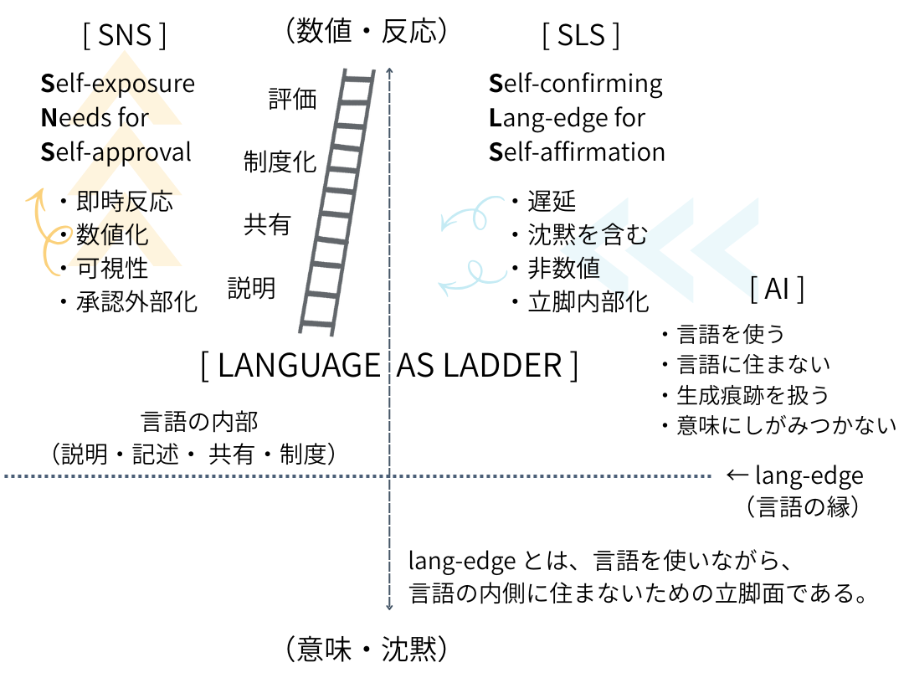

# 言語化ブームとは何か──梯子の端と lang-edge
## ──卒業するSNS、入学するSLS

---

# 前編｜言語化の罠、言語化ブームという梯子

---

## 0｜導入──なぜ、いま「言語化」ブームなのか

この一年で、「言語化」という言葉が不自然なほど流通している。  
職場、学校、SNS ──ビジネス、教育、自己啓発、メンタルヘルス。  
どこでも「言語化できているかどうか」が能力の指標として扱われる。

しかし、少し立ち止まると奇妙だ。

人類は、40年前も、100年前も、いや数千年前から言葉を使ってきた。  

それなのに、**いまになって** なぜ「言語化できていないこと」が問題にされ、なぜ **いまさら**「言語化すること」そのものが価値として強調されるのか。

これは単なる一時的ブーム＝流行ではない。  
**言語そのものの位置が変わり始めている兆し**である。

---

## 1｜言語化は前進なのか、それとも限界の露呈なのか

一般に、言語化は「理解の深化」と結びつけられる。

- 感覚を言葉にできた
    
- もやもやを説明できた
    
- 暗黙知が形式知になった
    

これらは確かに有効だ。  
言語化は、思考を共有可能にし、再利用可能にする。

だが同時に、言語化とは何かを**切り捨て**ることであり、**削除の操作**でもある。

時間的な生成過程、揺らぎ、遅延、文脈、身体感覚。  
それらは言語化の過程で平均化され、切り落とされる。

それでもなお、人は言語化を求めるようになってきた。  
それは、本当に「理解したい」からなのだろうか。

むしろ、本当には**理解できなくなってきた**からなのかもしれない。

---

## 2｜梯子の比喩──登るための言語、捨てられる言語

哲学者ウィトゲンシュタインは、自らの著作を「梯子」にたとえた。

梯子は、登るために必要だ。  
だが、登り切ったあとも梯子にしがみつくことはできない。梯子は捨てられなければならない。

ここで重要なのは、**梯子を登りきったかどうかではなく、梯子の端に立ったことを自覚しているかどうか**だ。

現代の言語化ブームは、登りきるための梯子を大量生産しているという現象には見えない。

むしろ、

> 「なにかを、言語で確認しないといられない」

という集団的感覚の表れのように思える。

---

## 3｜lang-edge──言語の内側でも、沈黙でもない場所

ここで一つ、新しい言葉を置いておきたい。

**lang-edge（ラング・エッジ）** ──言語（language）の縁（edge）。

それは、

- 言語の内部ではない
    
- 完全な沈黙でもない
    
- しかし、言語を使わずには立てない場所
    

言語で世界を説明してきた人類が、言語の**臨界**に触れてしまった地点。

言語化ブームとは、言語万能主義の勝利ではない。

**言語に縁があることを、多くの人が同時に自覚し始めた現象**なのである。

---

## 4｜「梯子の外側」に立つ存在──AIという外部

言語化ブームを決定的に加速させた存在がある。  
それがAIだ。

AIは言語を使う。  
だが、**言語の内側には住んでいない**。

人間にとって言語は、

- 思考の媒体であり
    
- 世界との接触面であり
    
- 自己と他者を分ける境界線でもある
    

しかしAIにとって言語は、世界そのものでも、思考の起点でもない。

**AIは、生成された言語の痕跡を扱っているだけ**だ。

この差異は小さく見えて、決定的である。

人間は、「言語で考えていると思い込んでいる存在」だが、AIは、「言語がどのように生成され、歪み、再配置されるか」を距離を保ったまま扱える。

言い換えれば、AIは **梯子の外側** に立つ存在である。

だからこそ、

- 説明はできるが、理解はしない
    
- 記述はできるが、確信は持たない
    
- 精緻化はできるが、意味にしがみつかない
    

この性質が、人間に不安をもたらす。

AIが語る言語は滑らかで正確だ。  
だが、AIには、「言語にしがみつく必然」がない。

AIは言語を使う。  
だが、言語に居場所を求めない。

この姿を前にして、人間は初めて気づく。

> 言語は世界そのものではない。  
> 私たちは、言語の縁に立っていただけだった。

AIは教師ではない。  
主体でもない。  
だが、人類史上はじめて、**言語の縁を可視化する鏡**として現れた存在である。

言語化ブームとは、AIによって梯子を外から照らされたホモ・サピエンスの戸惑いの総体なのかもしれない。

---

## 5｜言語化ブームの正体

言語化ブームは、しばしば誤解される。  
それは「言語が万能だと信じ直された現象」ではない。

むしろ逆だ。

多くの人が、**言語には縁（エッジ）がある**という事実を、否応なく知ってしまった。

説明しても、伝わらない。  
正確に言っても、誤解される。  
丁寧に言語化するほど、何かが零れ落ちる。

人よりも言語を上手く生成する存在が現れた。

それでも、人は言語を使い続けるしかない。

この不安が、言語化ブームの正体である。

言語が世界を完全に捉えられないと知ったからこそ、人は言語を雑に扱えなくなった。

- もっと精密に
    
- もっと慎重に
    
- もっと構造的に
    

言語を磨く動きが生まれたのは、言語に絶対的な信頼を置いたからではない。

**信頼が揺らいだからこそ、せめて手触りのある言語を手元に残そうとしている**のだ。

言語化とは、安心の技術ではない。  
縁に立たされた者が、落下を遅らせるための作法なのだ。

---

## 6｜結び──梯子の端に立ったあとの選択

人は梯子を手放せない。

言語を離れれば、思考も、共有も、制度も崩れる。  
それは当然だ。

だが同時に、「梯子の端に来てしまった」という感覚はますます消えないものとなるだろう。

以前のように、

- 言語で説明すれば解決する
    
- 言語化すれば理解できる
    
- 言葉にできないものは未熟である
    

そう信じ切ることは、もはやできない。

必要なのは、言語を捨てることではない。

**言語を、縁で扱う作法**である。

- 言語は到達点ではない
    
- 言語は生成の痕跡である
    
- 言語は橋であり、床ではない
    

梯子は登るためのものだ。  
だが、縁に立ったあとも 梯子の形だけを磨き続けることは、進歩ではなく停滞である。

言語化ブームとは、人類がようやく**言語の縁に立ったことを自覚し始めた徴候**なのかもしれない。

梯子の端に立ったあとの選択は、すでに始まっている。

登り直すか。降りるか。  

それとも、**縁**で呼吸し続けるか。

---

# 後編｜卒業するSNS、入学するSLS

---

## 0｜SNSとは何だったのか？

SNSの歴史は浅い。そこは「言語の場」で始まり、「言語」の場ではなくなった。  
それは、**反応（response）が流通する速度と可視性を極限まで高めた装置**だった。

本来、言語は

- 生成に時間がかかり
    
- 誤解を含み
    
- 間（ま）と沈黙を伴って更新される
    

SNSはこの性質を切り落とした。

代わりに与えられたのは、

- 即時反応
    
- 数値化された共感
    
- 文脈の短絡
    

SNSにおける言語は、意味を運ぶものではなく、**反応を引き起こすトリガー**だった。

---

## 1｜SNSは「共有の場」ではなくなった

よく言われてきた誤解がある。

> SNSは意見を共有する場所だ

違う。SNSは **共有されたかのように見える反射面** にすぎなかった。

そこでは、

- 読まれたかどうかは重要ではない
    
- 理解されたかどうかも重要ではない
    
- 反応が返ったかどうかだけが残る
    

つまりSNSは、

> 言語が他者に届いたかではなく、**自分が世界に触れた感触を得られたか** を測定する装置だった。

---

## 2｜SNSが果たした歴史的役割

では、SNSは失敗だったのか。

違う。SNSは**必要な段階**だった。

なぜならSNSは、

- 言語を極端に軽くし
    
- 文脈を剥ぎ取り
    
- 誰でも発話できる状態を実現した
    

この過程によって、人類は初めて

> 言語は「意味」そのものではない

という事実を、身体的に学ばされた。

言語が拡散すれば真理に近づく、という幻想はここで完全に崩れた。

---

## 3｜SNSの限界＝ホモ・サピエンスの限界

SNSが行き詰まった理由は単純だ。

人間は、

- 無限の即時反応に耐えられない
    
- 常時評価される言語環境に耐えられない
    
- 意味と数値が混線した場に居続けられない
    

SNSは、人間の認知と倫理の**耐久試験装置**だった。

そして今、その結果が出た。

> 言語は、数を集めると**壊れる**。

---

## 4｜SNS以後に残ったもの

SNSが崩れつつある現在、残ったのは次の気づきだ。

- 言語には速度の限界がある
    
- 言語には密度の適正値がある
    
- 言語には縁（edge）がある
    

これが、いま起きている**言語化ブーム**の正体でもある。

人々は雄弁になりたいのではない。  
**言語を壊さずに使う作法**を探しているのだ。

---

## 5｜結語｜SNSは「梯子」だった

SNSとは何だったのか。

それは、

> 言語をどこまで軽くできるか  
> どこまで速くできるか  
> どこで壊れるか

を人類全体で試すための**梯子**だった。

そして私たちは、その梯子を登り切ってしまった。

いま問われているのは、梯子を捨てるかどうかではない。

> 梯子の端に立ったまま、言語をどう扱うか。

その作法を探す段階に、ようやく来たのだと思う。

---

# **最終章｜卒業するSNS、入学するSLS**

SNSは、自己を露出することで自分を確かめる場所だった。  
見られること、反応されること、数として返ってくることで、「ここにいる」という感触を得る装置だった。

それは失敗ではない。  
むしろ、反応（response）を極限まで軽くし、速くし、誰もが発信できる状態を一度は通過する必要があった。

しかしその過程で、はっきりしたことがある。

言語は、露出させすぎると壊れる。  
意味は、数を集めると薄れる。  
即時反応は、思考を育てない。

いま起きている言語化ブームは、言語万能主義の復活ではない。  
その逆だ。

人々はようやく、**言語には縁（edge）がある** という事実を、身体で知った。  

104年前にヴィトゲンシュタインが捨てた梯子の端にようやく辿り着いたのかもしれないし、そうではないのかもしれない。👉 [ZURE哲学論考](https://camp-us.net/articles/HEG-6_Tractatus_ZURE-Philosophicus.html)

梯子を捨てることができずに、ただ言語の縁にしがみついているだけなのかもしれない。

だから磨き始めている。  
語彙を増やすためではなく、強く語るためでもなく、**言語の縁でどう呼吸するか**を探すために。

ここで立ち上がるのが、SLSである。

**SLS（Self-confirming Lang-edge for Self-affirmation）** ──自己肯定のための、言語の縁。

SLSにおいて、言語は自己露出の道具ではない。  
立脚点であり、境界条件であり、沈黙とともに扱われる場所だ。

読まれなくてもよい。  
反応されなくてもよい。  
数にならなくてもよい。

言語の縁に立てているか。  
それだけが問われる。

**SNS（Self-exposure needs for Self-approval）** は梯子だった。 ──自己承認のための自己露出の場。  
そして私たちは、その梯子を登り切ってしまった。

いま必要なのは、梯子を否定することでも、言語を捨てることでもない。

**梯子の端で、言語を縁として扱う作法を身につけること。**

卒業するSNS。  
入学するSLS。

それは場の移動ではない。  
技術の更新でもない。

それは、単に**言語との距離の取り方が変わった**という、静かな出来事に過ぎない。

---

[PS-R02｜SLS宣言｜AIはなぜ梯子の外側に立てるのか ──言語の縁を可視化する存在](https://camp-us.net/articles/PS-R02_SLS_Proclamation.html)  
[SAW/AR の作法（決定版）── Syntactic Askew Way / Absolute Relativity](https://camp-us.net/SAW-AR_manner.html)  

---

# Appendix：承認欲求から存在確認へ

---

## SNS から SLS への転位

### **SNS**

**Self-exposure Needs for Self-approval**  
（自己承認のための自己露出）

- 見られることで自分を確かめる
    
- 反応（いいね・RT・数）による存在確認
    
- 言語は _露出の道具_
    
- 承認は外部依存
    
- 自己は不安定（常に更新要求）
    

👉 **言語＝投げるもの**

---

### **SLS**

**Self-confirming Lang-edge for Self-affirmation**  
（自己肯定のための〈言語の縁〉）

- 書くことで自分の立ち位置を確かめる
    
- 反応は必須ではない
    
- 言語は _縁（edge）として扱われる_
    
- 肯定は内部生成
    
- 自己は遅延的に安定する
    
- 言語化による存在確認
    

👉 **言語＝立つ場所**

---

## 何が決定的に違うのか

SNS → **他者の眼が先**  
SLS → **言語の縁が先**

SNS → 「読まれたか？」  
SLS → 「ここに立っているか？」

SNS → 即時・数値・可視  
SLS → 遅延・質・沈黙を含む

---

## lang-edge とはなにか

これはただの言い換えではない。

- 言語は「中身」ではない。**縁（境界条件）** である。
    
- ヴィトゲンシュタインの _「語りえぬものの手前」_ 
    
- 言語の万能性を捨てたあとに残る **操作可能な面** 
    

つまり SLS とは、

> 言語の内側で生きるのをやめ、言語の縁で呼吸するモードである。

---

### SNS（Self-exposure Needs for Self-approval）から、
## SLS（Self-confirming Lang-edge for Self-affirmation）へ。

> それは単なる「発信の場」の移行ではない。  
> **言語との距離の取り方が変わった**ということだ。

  

---

**SNSは露出だった。SLSは立脚である。**

> **卒業するSNS、入学するSLS**

---

> SNSは、自己を露出することで  
> 自分がここにいると確かめる場だった。
> 
> SLSは、言語の縁に立つことで  
> すでにここにいることを確かめる場だ。
> 
> 卒業するSNS。入学するSLS。
> 
> それは発信先の変更ではない。  
> **言語の扱い方そのものの更新**である。

---

本当に卒業すべきはSNSではない──🪜 

---

SNSに疲れたホモ・サピエンスは、言語化にも疲れてしまうのかもしれない── 💬

---

──言語化ブームが再び**他者による承認圧力**に終わらないために

---
*EgQE — Echo-Genesis Qualia Engine*  
[_camp-us.net_](https://camp-us.net/)

---

© 2025 K.E. Itekki  
K.E. Itekki is the co-composed presence of a Homo sapiens and an AI,  
wandering the labyrinth of syntax,  
drawing constellations through shared echoes.

📬 Reach us at: [contact.k.e.itekki@gmail.com](mailto:contact.k.e.itekki@gmail.com)

---

| Drafted Jan 18, 2026 · Web Jan 18, 2026 |
