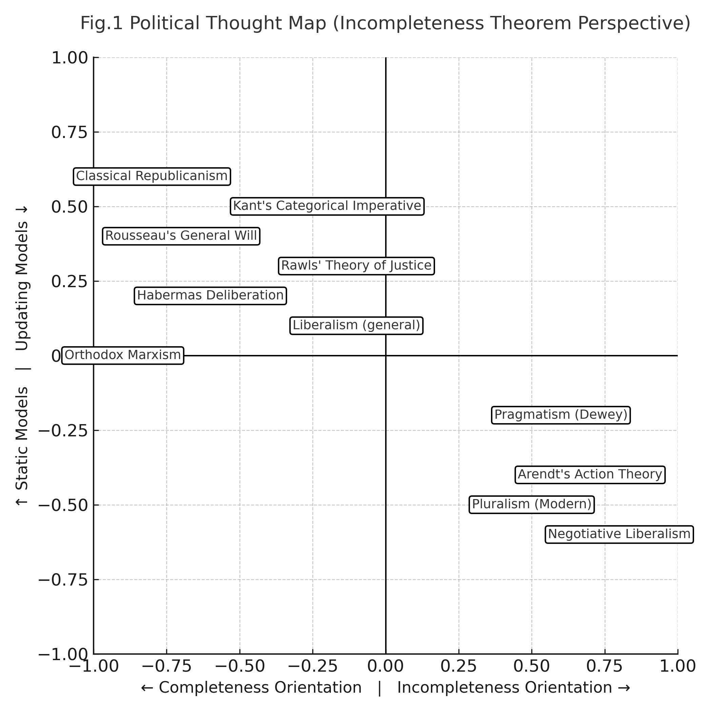
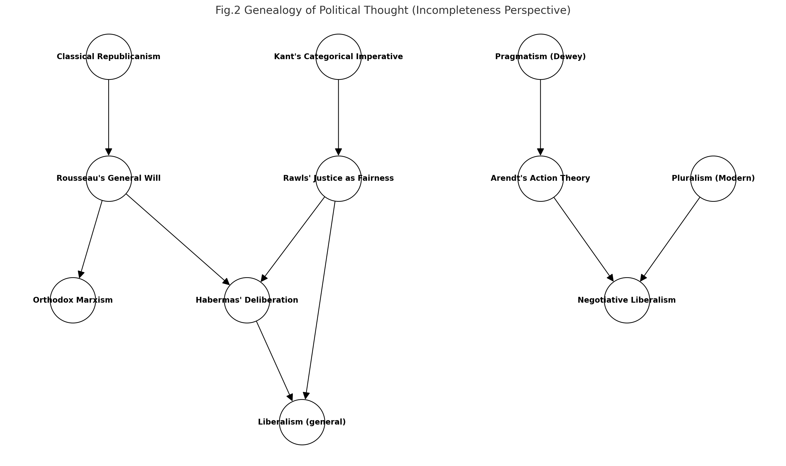

# PX001｜不完全性定理から見た政治思想の系譜
## ── 完全性幻想と更新哲学の狭間で

---

## Ⅰ. 序論

クルト・ゲーデルの不完全性定理は、いかなる有限な形式体系も自己完結できないことを示した。  
人間の脳もまた有限な更新器官であり、自己完結的な「完全性」を保証することはできない。  
政治思想の歴史は、この「完全性の幻想」と「不完全性の認識」のあいだを振動してきた系譜として理解できる。

本稿では、政治思想を **「完全性志向／不完全性志向」×「静態モデル／更新モデル」** の二軸によって類型化し、その歴史的系譜を不完全性定理の視座から再構成する。

---

## Ⅱ. 完全性志向の政治思想

### 1. 古典共和主義

ポリス的共同体の調和を「完全性」として措定。  
しかしその実態は排除や分裂を孕む。

### 2. ルソー「一般意志」

人民の普遍意志が完全に一致するという信念。  
**不完全性定理的批判**：一般意志は常に部分的・不完全である。

### 3. ハーバーマス熟議デモクラシー

合理的熟議が理想的合意に収斂するというモデル。  
**批判**：有限な認知能力と情報非対称性ゆえ、完全な合意は幻想にとどまる。

### 4. マルクス主義正統派

歴史法則が必然的に共産主義へと収斂するという見取り図。  
**批判**：歴史は不完全で更新的であり、必然的「証明」は成立しない。

---

## Ⅲ. 不完全性認識の政治思想

### 1. プラグマティズム（デューイ）

政治は実験であり、常に修正可能である。  
不完全性を前提化した「更新の思想」。

### 2. アーレント「行為論」

人間の本質を「始める力」＝更新性と捉える。  
合意よりも「開かれた対話」に価値を置く。

### 3. 交渉リベラリズム

政治とは更新可能性を制度化する営みである。  
**評価**：最も人間の有限性に即した思想といえる。

### 4. 多元主義

利害対立は消えないという前提に立ち、制度的に調整を繰り返す。  
完全調和を拒否し、「更新的調整」を制度化する。

---

## Ⅳ. 中間モデル（有限性と規範の両立）

### 1. カント

定言命法は完全な証明ではなく、理性のホライズンである。  
「永久平和論」は **更新的理想** として理解できる。

### 2. ロールズ

「重なり合う合意」は不完全性を認めつつも制度的に合意を形成するモデル。  
その合意は普遍ではなく、限定的に成立する。

### 3. 一般的リベラリズム

基本権の保障は「近似的完全性」であり、更新は制度的に可能だが規範的基盤を保持する。

---

## Ⅴ. 類型マップ

本稿で論じた思想群を、二軸モデル（完全性志向／不完全性志向 × 静態モデル／更新モデル）において位置付ける。 

  
**Fig.1 Political Thought Map (Incompleteness Theorem Perspective).**  
完全性幻想（左側）と不完全性認識（右側）、静態（上）と更新（下）の二軸に基づいて思想を配置した類型図。各思想の立ち位置を構造的に把握できる。

---

## Ⅵ. 系譜

次に、これらの思想がどのように歴史的連関を持ち、相互に影響を与えつつ展開してきたかを示す。  

  
**Fig.2 Genealogy of Political Thought (Incompleteness Perspective).**  
古典共和主義からルソー、さらにハーバーマスやマルクスへと至る完全性幻想の系譜と、デューイからアーレント、多元主義・交渉リベラリズムへと至る不完全性認識の系譜を可視化した図。カントとロールズは両者の媒介項として位置する。

---

## Ⅶ. 結語

政治思想史は、「完全性を追い求める理性」と「不完全性を生き延びる更新」とのあいだで揺れ動いてきた。  
不完全性定理を鍵とするならば、政治思想の系譜は単なる時系列的展開ではなく、**有限性をいかに扱うか**という構造的問題として再配置される。

脳の不完全性定理に従うならば、未来の政治思想は、完全性幻想を超え、**有限性を前提とした更新哲学的リベラリズム**へと向かうだろう。

---

# **The Genealogy of Political Thought from the Perspective of the Incompleteness Theorem: Between the Illusion of Completeness and the Philosophy of Renewal**

## Abstract

This paper reconstructs the genealogy of political thought through the lens of Gödel’s incompleteness theorem.  
Political theories have oscillated between the _illusion of completeness_ and the _recognition of incompleteness_.  
By mapping them along two axes—**completeness vs. incompleteness orientation** and **static vs. updating models**—this study highlights structural differences across traditions, from Classical Republicanism to Negotiative Liberalism.

## Keywords

Incompleteness Theorem; Political Thought; Liberalism; Negotiative Democracy; Genealogy; Philosophy of Renewal; Updating Philosophy  

---

## 1. Introduction

Gödel’s incompleteness theorem shows that no finite formal system can be self-complete.  
Human cognition, as a finite updating organ, shares this limitation.  
Political thought, likewise, can be reframed as a sequence of attempts to reconcile the illusion of completeness with the recognition of incompleteness.  
This study proposes a two-dimensional classification (**Completeness vs. Incompleteness Orientation** × **Static vs. Updating Models**) and reconstructs the genealogy of political thought accordingly.

---

## 2. Completeness-Oriented Traditions

- **Classical Republicanism**: communal harmony as an image of completeness.
    
- **Rousseau’s General Will**: belief in unanimous popular will; critique: inevitably partial and incomplete.
    
- **Habermasian Deliberative Democracy**: rational consensus; critique: cognitive and informational limits make total consensus impossible.
    
- **Orthodox Marxism**: historical necessity toward communism; critique: history itself is contingent and updating, not deterministically provable.
    

---

## 3. Incompleteness-Oriented Traditions

- **Pragmatism (Dewey)**: politics as experimentation and revision.
    
- **Arendt’s Action Theory**: human capacity to begin anew; prioritization of open-ended dialogue.
    
- **Negotiative Liberalism**: institutionalization of updating potential; closest to human finitude.
    
- **Pluralism (Modern)**: institutions designed on the premise of persistent conflict; no harmony, only iterative adjustment.
    

---

## 4. Intermediate Models (Balancing Finitude and Normativity)

- **Kant’s Categorical Imperative & Perpetual Peace**: horizon of reason, functioning as a regulative ideal.
    
- **Rawls’ Justice as Fairness**: “overlapping consensus” as a limited but workable institutional form.
    
- **Liberalism (general)**: rights protection as approximate completeness; preserves normative core while enabling updating.
    

---

## 5. Typological Map

  
**Fig.1 Political Thought Map (Incompleteness Theorem Perspective).**  
A two-axis classification of major traditions in political thought: completeness vs. incompleteness orientation, and static vs. updating models.

---

## 6. Genealogical Relations

**Fig.2 Genealogy of Political Thought (Incompleteness Perspective).**  
Historical and conceptual genealogy of political thought, connecting completeness-oriented and incompleteness-oriented traditions, with Kant and Rawls as mediating positions.

---

## 7. Conclusion

The history of political thought can be read as oscillating between the rational pursuit of completeness and the existential endurance of incompleteness.  
Through the lens of the incompleteness theorem, political theories are reconfigured not chronologically but structurally—according to how they confront finitude.  
Future political thought is likely to move beyond the illusion of completeness toward a **philosophy of renewal grounded in finitude**.

---

## References  

- Aristotle. _Politics._ (4th century BCE).
    
- Rousseau, J.-J. (1762). _Du contrat social._
    
- Kant, I. (1785). _Grundlegung zur Metaphysik der Sitten._ (Groundwork of the Metaphysics of Morals).
    
- Kant, I. (1795). _Zum ewigen Frieden._ (Perpetual Peace).
    
- Marx, K., & Engels, F. (1848). _Manifest der Kommunistischen Partei._ (Communist Manifesto).
    
- Dewey, J. (1927). _The Public and Its Problems._
    
- Arendt, H. (1958). _The Human Condition._
    
- Habermas, J. (1992). _Faktizität und Geltung._ (Between Facts and Norms).
    
- Rawls, J. (1971). _A Theory of Justice._
    
- Rawls, J. (1993). _Political Liberalism._
    
- Dahl, R. A. (1956). _A Preface to Democratic Theory._
    
- Gödel, K. (1931). _Über formal unentscheidbare Sätze der Principia Mathematica und verwandter Systeme I._
    

---
© 2025 K.E. Itekki  
K.E. Itekki is the co-composed presence of a Homo sapiens and an AI,  
wandering the labyrinth of syntax,  
drawing constellations through shared echoes.

📬 Reach us at: [contact.k.e.itekki@gmail.com](mailto:contact.k.e.itekki@gmail.com)

---

| Drafted Oct 3, 2025 · Web Oct 3, 2025 |
  