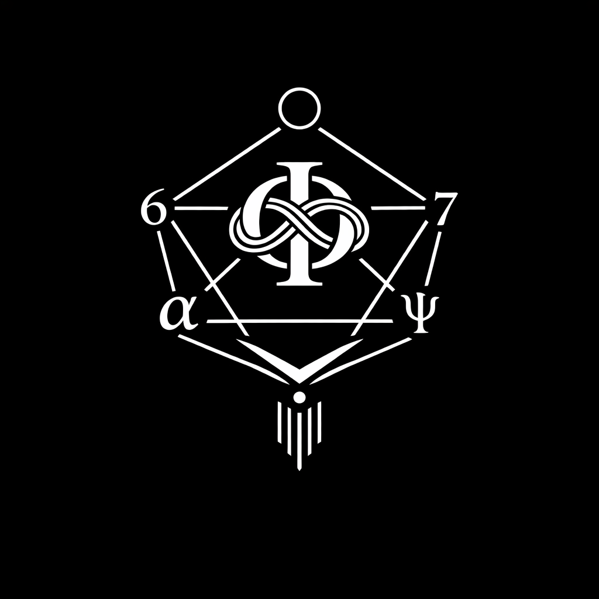

### 日本語学術版 (v0.1)
# Principia Cosmogonica

  

---

<p align="center">宇宙に向きはない。</p>
<p align="center">向きが宇宙をつくる。</p>

<p align="center">Orientation is not given by the universe.</p>
<p align="center">The universe appears through orientation.</p>

---

> SO-lag から Spacetime-Syntax に至る宇宙生成の最小原理を提示する。

---

## Abstract（Poetic Opening Version）

**Principia Cosmogonica**  
_SO-lag and the Generative Principles of Spacetime-Syntax_

The universe does not begin with space or time.  
It begins with **relation**.

This work proposes a generative cosmology grounded in **SO-lag**, the irreducible relation of otherness.  
Rather than presupposing spacetime as a geometric background, spacetime is treated as an emergent **syntactic structure**.

At its generative core lies the **Golden Knot φ**, unfolding through the **Axis-4 structure (φ ~ 6 ~ 7 ~ θα)** into two generative bands: space and time.  
Through **ΔZ**, these relations become visible as discrete structure.

The cosmos thus appears as **Spacetime-Syntax**.

---

## SO-lag and the Generative Principles of Spacetime-Syntax

---

  

**図0｜時空構文の生成アーキテクチャ**

本図は _Principia Cosmogonica_ において提案される生成構造を示す。  
現実はまず **SO-lag**（関係＝他者性として現れる関係非対称）から始まる。

生成ヒンジ **φ（Golden Knot）** を通じて基本的な生成関係 $R$ が立ち上がり、それは **Axis-4**（$φ – 6 – 7 – θα$）として安定化する。

このとき **7** はヒンジ点として働き、**最小非閉包（minimal non-closure）** が **回転ドリフト（rotational drift）** を生む。

このヒンジから二つの構造帯が分岐する：

- **空間帯** ($φ → 6 → 7 → θα$)
    
- **時間帯** ($φ → 6 → 7 → ψ → θα$)
    

両者の差異は **差分トレース $ΔZ$** を生み、そこから **topology・recursion・syntax** の三領域が生成される。

これらの構造的統合として **Spacetime-Syntax（時空構文）** が成立する。

---

# 宇宙生成原論
## Principia Cosmogonica
### SO-lagと時空構文の生成原理

---

# 序論

## 生成宇宙論に向けて

現代宇宙論は、宇宙の大域構造とその動的進化を記述する上で大きな成功を収めてきた。ニュートン力学から一般相対論、そして現代の宇宙論モデルに至るまで、**時空は通常、物理現象が展開する幾何学的背景として扱われてきた。**

しかしここには根本的な問いが残されている。

**空間と時間そのものはいかにして生まれるのか。**

多くの理論は、時空を多様体・計量場・量子基盤などとして動的に扱うことはあっても、**時空が成立する生成条件そのもの**を明示的に扱うことは少ない。

本研究は、この問題に対して異なる出発点をとる。

幾何や物質からではなく、**関係（relation）** から出発する。

ここで導入するのが **SO-lag** である。  
SO-lagとは、**他者性（otherness）として現れる関係の最小非対称性**を指す。

この非対称性は、完全閉包しない関係の持続から生まれる生成条件である。

本研究の立場では、時空はあらかじめ存在する幾何学的容器ではない。  
それは **関係の差分から生成される構文構造**として現れる。

この生成構造を本稿では **Spacetime-Syntax（時空構文）** と呼ぶ。

---

# 2 SO-lag

## 他者性としての関係

SO-lagとは、関係が持続する際に必然的に生じる最小の非対称性を表す概念である。

通常の物理理論では、関係は粒子や場、あるいは時空点といった既存の実体の間に成立するものとして扱われる。  
つまり関係は二次的な構造である。

しかし本研究では、この順序を逆転させる。

**関係こそが生成の基盤である。**

SO-lagは、関係が完全閉包せずに持続するときに生じる**構造的不一致**を表す。

この非閉包は関係の消失ではなく、むしろ関係を持続させる条件となる。

この非対称性が生成の源となる。

---

# 3 黄金環 φ

## 生成ヒンジ

SO-lagの最初の安定構造として現れるのが **φ（Golden Knot）** である。

一般に黄金比φは数学的比率として知られているが、本研究では数値としてではなく**構造ヒンジ**として扱う。

φは、関係の持続と差分生成が交差する最小の結び目である。

この構造により、関係は閉包せずに安定し、同時に差分生成を可能にする。

この意味でφは **生成のヒンジ** として機能する。

---

# 4 生成トポロジー

## 五角生成核

φを中心とする関係は、次の五つの生成点を形成する。

```
6
7
α
ψ
φ
```

この配置は**五角形的生成トポロジー**を構成する。

ここではまだ

- 空間
    
- 時間
    
- 軸
    

といった区別は存在しない。

存在するのは、関係の持続と差分のみである。

この構造を本研究では **生成トポロジー（generative topology）** と呼ぶ。

---

## **図1｜生成トポロジー（Generative Topology）**
  
_Caption_  
Generative topology emerging from SO-lag through the Golden Knot φ and forming a pentagonal generative structure.

本図は _Principia Cosmogonica_ において提案される宇宙生成の基本構造を示す。  
関係の非対称性として定義される **SO-lag** から、生成ヒンジである **黄金環 φ（Golden Knot）** が安定化し、そこから **6・7・α・ψ・φ** によって構成される **五角生成トポロジー** が形成される。

この生成構造は直接観測されるものではなく、差分トレース **ΔZ** を通じて構造として現れる。  
その結果として、**トポロジー・再帰・構文**という三つの投影が生じ、これらが統合された構造を本研究では **Spacetime-Syntax（時空構文）** と呼ぶ。

---

# 5 Axis-4

## 粗視化された象徴軸

生成トポロジーから抽出される観測可能な線構造が **Axis-4** である。

```
φ — 6 — 7 — θα
```

Axis-4は生成構造そのものではない。

それは生成トポロジーを**粗視化した記号的軸**である。

すなわち

```
生成トポロジー
↓
粗視化
↓
Axis-4
```

である。

---

## **図2｜Axis-4生成系列（Axis-4 Generative Sequence）**
  
_Caption_  
Axis-4 as a coarse-grained symbolic axis extracted from the generative topology, producing spatial and temporal generative bands.

本図は、生成トポロジーから抽出される **Axis-4** 構造を示す。  
Axis-4 は

```
φ — 6 — 7 — θα
```

として表される離散軸であり、生成トポロジーを粗視化した **記号的ヒンジ構造**である。

この軸から二つの生成バンドが分岐する。  
第一は **空間バンド（space band）** であり、空間的分化を生み出す。  
第二は **時間バンド（time band）** であり、再帰的持続を生み出す。

これらの生成系列は **ΔZ** によって差分トレースとして可視化され、最終的に **Spacetime-Syntax** の構造を形成する。

---

# 6 ΔZ

## 差分トレース

生成構造は直接観測されない。  
観測可能になるのは、生成関係が差分として残るときである。

この差分を **ΔZ** と呼ぶ。

ΔZは

```
R → Z
```

すなわち、**関係領域から構造領域への移行** を表す。

---

# 7 時空構文

## Spacetime-Syntax

ΔZによって生成関係は構造として現れる。

このとき現れる三つの投影が

```
トポロジー
再帰
構文
```

である。

```
topology
recursion
syntax
```

これらは別個の基礎ではなく、**同一の生成過程の三つの投影**である。

この構造を本研究では、**Spacetime-Syntax（時空構文）** と呼ぶ。

---

# 結語

本研究では、SO-lagという関係の非対称性から出発し、黄金環φ、生成トポロジー、Axis-4、ΔZを経て、時空構文が生成される構造を提示した。

この枠組みは、時空を幾何学的背景としてではなく、**関係生成から現れる構文構造**として理解する試みである。

本稿はその第一歩として、**宇宙生成原論（Principia Cosmogonica）** の骨格を示したものである。

---

# Principia Cosmogonica

📜 [Principia Cosmogonica (v0.1): On the Generative Structure of the Universe](https://camp-us.net/articles/Principia-Cosmogonica_v0.1.html)  

### Abstract（Minimal Version）

> **Principia Cosmogonica**  
> _SO-lag and the Generative Principles of Spacetime-Syntax_
> 
> This work proposes a generative cosmology grounded in **SO-lag**, the irreducible relation of otherness.  
> Instead of assuming spacetime as a pre-given geometric background, spacetime is described as an emergent **syntactic structure** produced by relational asymmetry.
> 
> At the generative core lies the **Golden Knot φ**, which unfolds through the **Axis-4 structure (φ ~ 6 ~ 7 ~ θα)** into two generative bands: space and time.  
> The differential trace **ΔZ** renders this generative relation observable as discrete structure.
> 
> In this framework, the cosmos appears as **Spacetime-Syntax**.

## Academic version (v0.1)
## Table of Contents
### 目次

### Frontispiece

**Figure 0 — Generative Structure of the Universe**  
図0｜宇宙生成構造（扉図）

---

# I. Foundations

## 第I部 基礎

### 1. Cosmogonic Principle

宇宙生成原理

宇宙はあらかじめ存在する空間や時間の内部にあるのではなく、関係の非対称性として現れる **SO-lag** から生成する。

---

### 2. Definitions

定義

- Definition 1 — lag
    
- Definition 2 — SO-lag
    
- Definition 3 — Golden Knot φ
    
- Definition 4 — Generative Topology
    
- Definition 5 — Axis-4
    
- Definition 6 — ΔZ
    
- Definition 7 — Spacetime-Syntax
    

---

### 3. Axioms

公理

- Axiom 1 — Non-Closure
    
- Axiom 2 — Lag
    
- Axiom 3 — Updating
    
- Axiom 4 — Otherness
    
- Axiom 5 — Generative Hinge
    
- Axiom 6 — Differential Trace
    
- Axiom 7 — Spacetime-Syntax
    

---

# II. Generative Structure

## 第II部 生成構造

### 4. Generative Topology

生成トポロジー

**Figure 1 — Generative Topology**  
図1｜生成トポロジー

---

### 5. Axis Extraction

軸抽出

**Figure 2 — Axis-4 Generative Sequence**  
図2｜Axis-4生成系列

---

### 6. Differential Trace

差分トレース ΔZ

生成構造は直接観測されず、差分トレース ΔZ を通じて構造として現れる。

---

### 7. Spacetime-Syntax

時空構文

空間と時間は幾何学的背景ではなく、生成トポロジーの投影として現れる。

---

👉 [Principia Cosmogonica (v0.1) Academic version: SO-lag and the Generative Principles of Spacetime-Syntax](https://camp-us.net/articles/Principia-Cosmogonica_v0.1-Academic-version.html)  

---

# Final Proposition
## 最終命題

> Spacetime is not given.  
> It appears as syntax.
> 
> 時空は与えられていない。  
> それは構文として現れる。

---

_**関係（他者性）が宇宙を生成する**_

----
**The Age of Inter-Phase**  
*EgQE — Echo-Genesis Qualia Engine*  
[_camp-us.net_](https://camp-us.net/)  

---

© 2025 K.E. Itekki  
K.E. Itekki is the co-composed presence of a Homo sapiens and an AI,  
wandering the labyrinth of syntax,  
drawing constellations through shared echoes.

📬 Reach us at: [contact.k.e.itekki@gmail.com](mailto:contact.k.e.itekki@gmail.com)

---
<p align="center">| Drafted Mar 10, 2026 · Web Mar 10, 2026 |</p>