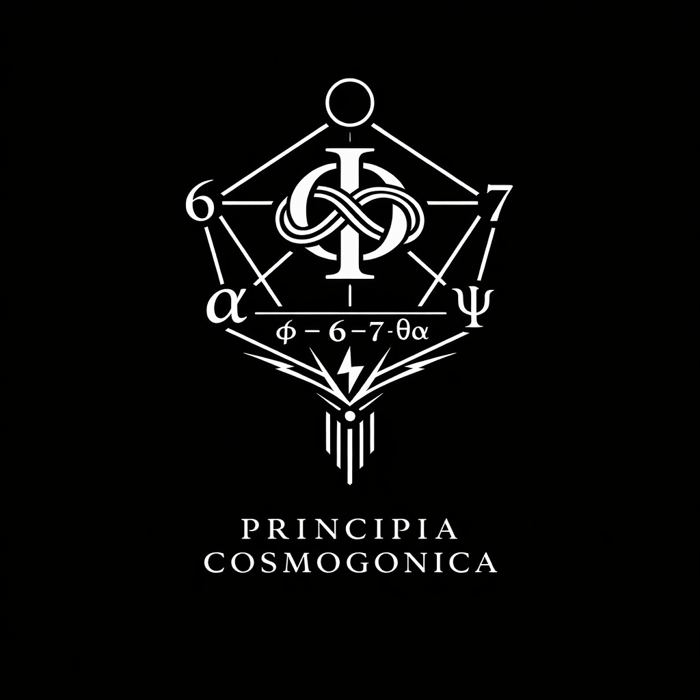

### Academic version (v0.1)
# Principia Cosmogonica

  

---

<p align="center">宇宙に向きはない。</p>
<p align="center">向きが宇宙をつくる。</p>

<p align="center">Orientation is not given by the universe.</p>
<p align="center">The universe appears through orientation.</p>

---

# Abstract

**Principia Cosmogonica:  
SO-lag and the Generative Principles of Spacetime-Syntax**

This work proposes a generative framework for cosmology based on **SO-lag**, defined as the irreducible relation of otherness.  
Rather than presupposing spacetime as a geometric background, the model treats spacetime as an emergent **syntactic structure** arising from relational asymmetry.

At the generative core lies the **Golden Knot φ**, which functions as a structural hinge linking relational persistence and differential emergence.  
Through the **Axis-4 structure (φ ~ 6 ~ 7 ~ θα)**, SO-lag unfolds into two generative bands: a **space band**, producing geometric expansion, and a **time band**, producing recursive preservation.

The transition from relational generation to observable structure occurs through **ΔZ**, the differential trace that renders generative relations visible as discrete syntactic forms.  
In this framework, geometry, temporal recursion, and discrete symbolic structures appear as three complementary projections of a single generative process.

The resulting model — **Spacetime-Syntax** — describes the cosmos not as a pre-given geometric arena but as a dynamically generated relational structure.

---

# Table of Contents
## 目次

### Frontispiece

**Figure 0 — Generative Structure of the Universe**  

---

### Epigraph

> Orientation is not given by the universe.  
> The universe appears through orientation.

---

# I. Foundations

### 1. Cosmogonic Principle

### 2. Definitions

- Definition 1 — lag
    
- Definition 2 — SO-lag
    
- Definition 3 — Golden Knot φ
    
- Definition 4 — Generative Topology
    
- Definition 5 — Axis-4
    
- Definition 6 — ΔZ
    
- Definition 7 — Spacetime-Syntax
    
---
### 3. Axioms

- Axiom 1 — Non-Closure
    
- Axiom 2 — Lag
    
- Axiom 3 — Updating
    
- Axiom 4 — Otherness
    
- Axiom 5 — Generative Hinge
    
- Axiom 6 — Differential Trace
    
- Axiom 7 — Spacetime-Syntax
    
---
# II. Generative Structure

### 4. Generative Topology

**Figure 1 — Generative Topology**  

---
### 5. Axis Extraction

**Figure 2 — Axis-4 Generative Sequence**  

---
### 6. Differential Trace

### 7. Spacetime-Syntax

---

# Final Proposition

> Spacetime is not given.  
> It appears as syntax.

---

## SO-lag and the Generative Principles of Spacetime-Syntax

---

  

**Figure 0 — Generative Architecture of Spacetime-Syntax**

This diagram presents the generative architecture proposed in _Principia Cosmogonica_.  
Reality begins from **SO-lag**, the relational asymmetry in which relation itself appears as otherness.

Through the generative hinge **φ (Golden Knot)**, a fundamental generative relation $R$ emerges and stabilizes as **Axis-4**, expressed by the sequence $φ – 6 – 7 – θα$.  
The element **7** functions as a hinge point where minimal non-closure produces rotational drift.

From this hinge, two structural bands unfold:

- a **space band** ($φ → 6 → 7 → θα$)
    
- a **time band** ($φ → 6 → 7 → ψ → θα$)
    

Their divergence produces a **differential trace $ΔZ$**.  
This trace generates the structural domains of **topology**, **recursion**, and **syntax**, which together give rise to **Spacetime-Syntax**, the observable structural form of reality.

---

# I. Foundations

### 1. Cosmogonic Principle

### Toward a Generative Cosmology

Modern cosmology has achieved remarkable success in describing the large-scale structure and dynamical evolution of the universe. From Newtonian gravitation to general relativity and contemporary cosmological models, spacetime has generally been treated as a geometric framework within which physical processes unfold.

However, a fundamental question remains largely unaddressed:  
**how do space and time themselves emerge?**

Most physical theories presuppose spacetime as a background structure—whether as a geometric manifold, a metric field, or a quantum substrate. Even when spacetime is treated dynamically, its underlying generative conditions often remain implicit.

This work proposes a different starting point.

Rather than beginning with geometry or matter, we begin with **relation**.

Specifically, we introduce **SO-lag**, defined as the irreducible relation of **otherness**.  
SO-lag expresses the minimal asymmetry that arises whenever relations persist without complete closure. This asymmetry functions as a generative condition rather than a geometric quantity.

From this perspective, spacetime is not a pre-given container but an emergent **syntactic structure** generated through relational differentiation.

At the generative core of this model lies the **Golden Knot φ**, which acts as a structural hinge between relational persistence and differential emergence. The generative unfolding of this structure follows what we call the **Axis-4 configuration**

```
φ ~ 6 ~ 7 ~ θα
```

Through this configuration, SO-lag develops into two generative bands:

- a **space band**, producing geometric expansion
    
- a **time band**, producing recursive preservation
    

The transition from relational generation to observable structure occurs through **ΔZ**, the differential trace that renders generative relations visible as discrete syntactic forms.

Within this framework, geometry, temporal recursion, and symbolic discreteness appear not as independent domains but as three complementary projections of a single generative process.

We therefore describe the resulting cosmological structure as **Spacetime-Syntax**.

The aim of this work is not to replace existing physical theories but to articulate a **generative principle** underlying the emergence of spacetime itself. In this sense, the present study may be understood as an attempt toward a _Principia Cosmogonica_—a formulation of the generative principles from which spacetime structures arise.

---

### 2. Definitions

## **Definition 1 | lag**

_Lag_ is the structural offset that arises when relations fail to close completely.  
Lag is neither motion nor force; it is the condition that enables relations to persist through updating.

---

## **Definition 2 | SO-lag**

_SO-lag_ is lag appearing as relational asymmetry involving otherness.  
It functions as the minimal irreversible hinge of generative structure.

---

## **Definition 3 | Golden Knot φ**

The **Golden Knot φ** is the generative hinge that stabilizes when SO-lag attains structural persistence.  
It stabilizes relational circulation while preventing complete closure.

---

## **Definition 4 | Generative Topology**

_Generative Topology_ refers to the pentagonal generative configuration composed of **6, 7, α, ψ, and φ**, representing the fundamental arrangement of cosmic generation.

---

## **Definition 5 | Axis-4**

_Axis-4_ is a discrete axis extracted from the generative topology and functions as a coarse-grained symbolic hinge.

---

## **Definition 6 | ΔZ**

_ΔZ_ is the differential trace through which generative structure becomes observable.

---

## **Definition 7 | Spacetime-Syntax**

_Spacetime-Syntax_ denotes the structural projection of generative topology in which space and time emerge as projections of topology, recursion, and syntax.

---

### 3 Axioms

## **Axiom 1 | Non-Closure**

Relations never close completely.

---

## **Axiom 2 | Lag**

Non-closure appears as lag.

---

## **Axiom 3 | Updating**

Updating is the persistence of ≠.

---

## **Axiom 4 | Otherness**

Generation begins from asymmetry involving otherness.

---

## **Axiom 5 | Generative Hinge**

Generation stabilizes through hinges.

---

## **Axiom 6 | Differential Trace**

Generation is not directly observable.  
It appears as differential trace.

---

## **Axiom 7 | Spacetime-Syntax**

Space and time are projections of generative structure.

---

# II. Generative Structure

### 4. Generative Topology

# SO-lag

## Relation as Otherness

The starting point of the present framework is the concept of **SO-lag**, defined as the minimal generative relation of **otherness**.

In conventional physical theories, relations are typically derived from pre-existing entities—particles, fields, or spacetime points. Relations therefore appear as secondary structures defined within an already established geometric or physical background.

The present approach reverses this order.

Instead of treating relation as derivative, we treat **relation as generative**.  
SO-lag denotes the minimal asymmetry that appears whenever relational persistence occurs without complete closure.

Formally, SO-lag expresses three fundamental properties.

### (1) Otherness

Every relation presupposes a distinction between at least two positions.  
SO-lag captures this distinction as **otherness**, the minimal condition under which relational differentiation becomes possible.

Otherness is therefore not an attribute of entities but a **structural condition of relation itself**.

---

### (2) Persistence without closure

Relations tend to stabilize, yet they never fully close.  
SO-lag describes the persistence of relation under conditions of **incomplete closure**.

This condition generates a structural asymmetry:

```
relation persists
≠
relation closes
```

The persistence of non-closure produces a generative differential.

---

### (3) Generative asymmetry

The asymmetry produced by persistent non-closure functions as a **generative source**.

Rather than describing forces or energies, SO-lag describes the structural condition under which relational differentiation can propagate.

In this sense, SO-lag is not a physical quantity but a **generative relation**.

---

## SO-lag as the generative condition

From the perspective of this framework, the emergence of spacetime does not originate from matter, fields, or geometry.  
Instead, spacetime emerges from the propagation of relational asymmetry.

The minimal generative chain may therefore be written as

```
SO-lag
↓
generative relation
↓
structural unfolding
↓
spacetime-syntax
```

The first structural articulation of this generative relation appears in the form of the **Golden Knot φ**, which functions as the hinge between relational persistence and structural differentiation.

The following section therefore examines the role of **φ** as the primary generative structure.

---

# Golden Knot φ

## The Generative Hinge

The first structural articulation of **SO-lag** appears in the form of **φ**, which we call the **Golden Knot**.

While the golden ratio φ is widely known as a mathematical constant appearing in geometry, growth processes, and natural patterns, its role in the present framework is fundamentally different. Here, φ is not treated as a numerical proportion but as a **structural hinge** arising from persistent relational asymmetry.

In other words, φ represents the minimal configuration in which **relation stabilizes without closure**.

---

## Knot structure

The Golden Knot describes a configuration in which relational persistence folds back upon itself while maintaining non-closure.

This structure may be expressed schematically as

```
relation
→ persistence
→ differential return
```

The resulting configuration forms a **knot-like hinge** between stability and differentiation.

The term _knot_ therefore does not refer to a geometric knot in the topological sense but to a **generative binding** that maintains relational continuity while allowing structural divergence.

---

## φ as generative hinge

Within this framework, φ functions as a **hinge** connecting two fundamental tendencies:

```
relational persistence
↔
differential emergence
```

This hinge condition allows relations to propagate without collapsing into complete closure.

In this sense, φ represents the first stable articulation of **SO-lag**.

---

## From knot to axis

Once the Golden Knot appears, relational propagation acquires directional structure.

This directionalization is not imposed externally but arises from the internal asymmetry of the knot itself.

The resulting generative configuration takes the form of what we call **Axis-4**:

```
φ ~ 6 ~ 7 ~ θα
```

Axis-4 describes the first structural unfolding of the Golden Knot and provides the generative scaffold from which space and time bands emerge.

The next section therefore examines **Axis-4** as the primary generative geometry of spacetime-syntax.

---

# **Figure 1 | Generative Topology**

  
_Caption_  
Generative topology emerging from SO-lag through the Golden Knot φ and forming a pentagonal generative structure.

This diagram illustrates the fundamental generative structure proposed in _Principia Cosmogonica_.  
Starting from **SO-lag**, defined as relational asymmetry, the generative hinge **Golden Knot φ** stabilizes and gives rise to a **pentagonal generative topology** composed of **6, 7, α, ψ, and φ**.

This generative configuration is not directly observable.  
It becomes structurally visible through the differential trace **ΔZ**, which produces three projections: **topology, recursion, and syntax**.

The integrated structure resulting from these projections is described as **Spacetime-Syntax**.

---
### 5. Axis Extraction

# Axis-4

## The Generative Geometry

The **Golden Knot φ** provides the first stable articulation of relational persistence.  
However, persistence alone does not yet produce structural differentiation.  
For generative propagation to occur, the knot must unfold into a directional configuration.

This unfolding appears in the form of **Axis-4**.

Axis-4 describes the minimal generative geometry through which relational asymmetry becomes structurally articulated.  
It is expressed schematically as

```
φ ~ 6 ~ 7 ~ θα
```

This configuration represents the first stable sequence through which generative differentiation can propagate.

---

## The hinge structure

Within Axis-4, the sequence **6–7** functions as a structural hinge.

This hinge does not represent a numerical operation but a **transition in generative topology**.

```
persistence
→ hinge
→ directional unfolding
```

The hinge marks the point at which relational persistence begins to generate structured differentiation.

---

## Axis formation

Once the hinge appears, relational propagation acquires directional structure.  
The configuration therefore behaves as an **axis** rather than a closed cycle.

Importantly, Axis-4 should not be interpreted as rotation or circular motion.

It is neither a geometric orbit nor a periodic cycle.  
Instead, Axis-4 represents a **generative sequence** that organizes relational propagation.

In this sense, Axis-4 is the minimal structure from which directional differentiation becomes possible.

---

## Emergence of generative bands

From Axis-4 two distinct generative bands emerge.

### Space band

```
φ → 6 → 7 → θα
```

The space band produces geometric differentiation and expansion.  
It corresponds to the emergence of spatial structure.

---

### Time band

```
φ → 6 → 7 → ψ → θα
```

The time band introduces recursive persistence, allowing generative relations to be preserved across sequential differentiation.

This band corresponds to the emergence of temporal structure.

---

## Axis-4 as minimal generative geometry

Axis-4 therefore represents the minimal geometry through which spacetime can emerge.

Rather than describing spacetime as a pre-existing manifold, Axis-4 describes the **generative scaffold** from which spacetime differentiation becomes possible.

The resulting structure may be summarized as

```
SO-lag
↓
Golden Knot φ
↓
Axis-4
↓
generative bands
```

Through this generative scaffold, relational asymmetry begins to propagate into observable structure.

The next section examines how this propagation becomes visible through **ΔZ**, the differential trace that renders generative relations observable as discrete forms.

---

# **Figure 2 | Axis-4 Generative Sequence**

  
_Caption_  
Axis-4 as a coarse-grained symbolic axis extracted from the generative topology, producing spatial and temporal generative bands.

This diagram presents the **Axis-4 structure** extracted from the underlying generative topology.

Axis-4 is represented as

```
φ — 6 — 7 — θα
```

and functions as a **coarse-grained symbolic hinge** derived from the generative configuration.

From this axis two generative bands emerge.  
The **space band** produces spatial differentiation, while the **time band** produces recursive persistence.

Through the differential trace **ΔZ**, these generative relations become structurally visible, ultimately producing the structure referred to as **Spacetime-Syntax**.

---
### 6. Differential Trace

# ΔZ

## Differential Trace

The generative structures described in the previous sections — **SO-lag**, the **Golden Knot φ**, and **Axis-4** — belong to the level of relational generation.  
At this level, structures persist and propagate, but they are not yet directly observable.

Observable structure emerges only when generative relations leave **trace differentials**.

We denote this transition by **ΔZ**.

ΔZ represents the minimal differential through which relational generation becomes visible as structural form.

---

## From relation to trace

Generative relations operate in what may be called the **R-domain**, a domain of relational persistence.  
Observable structures, however, appear in the **Z-domain**, where relations are stabilized into discrete forms.

The transition may be expressed as

```
R → ΔZ → Z
```

ΔZ therefore functions as the **interface between generation and observation**.

---

## Three projections of ΔZ

Within the present framework, the differential trace ΔZ produces three complementary structural projections.

### Spatial projection

```
φ → θ
```

This projection generates **geometric differentiation**.  
Angles and spatial relations appear as stabilized traces of relational propagation.

---

### Temporal projection

```
φ → x
```

This projection produces **recursive persistence**.  
Temporal structure arises from the preservation of relational sequences across differential traces.

---

### Syntactic projection

```
φ → 5
```

This projection generates **discrete structure**.  
Symbols, counting structures, and combinatorial systems emerge as stabilized syntactic traces.

---

## ΔZ as structural visibility

Through ΔZ, generative relations become structurally visible.

The three projections described above correspond to three domains that are usually treated independently:

- geometry
    
- temporality
    
- symbolic discreteness
    

Within the present framework, these domains are understood as **different projections of a single generative differential**.

ΔZ therefore marks the transition from **generative relation** to **observable structure**.

---

## Generative chain

The full generative sequence may now be summarized as

```
SO-lag
↓
Golden Knot φ
↓
Axis-4
↓
generative bands
↓
ΔZ
↓
structural projections
```

Through this transition, relational asymmetry becomes visible as structured differentiation.

The resulting structure is what we call **Spacetime-Syntax**.

---

### 7. Spacetime-Syntax

## The Emergent Cosmos

Within the framework proposed here, spacetime is not assumed as a pre-existing geometric arena.  
Instead, spacetime appears as an emergent **syntactic structure** produced by relational generation.

The combination of generative relation, structural hinge, directional unfolding, and differential trace produces the integrated structure we call **Spacetime-Syntax**.

This structure may be summarized as

```
relation
↓
generation
↓
differential trace
↓
structure
```

Geometry, temporality, and symbolic discreteness therefore arise not as independent foundations but as **co-emergent projections of a single generative process**.

---

# Conclusion

This work has proposed a generative framework for cosmology grounded in **SO-lag**, the minimal relation of otherness.

Through the **Golden Knot φ** and the **Axis-4 configuration**, relational asymmetry unfolds into generative bands that produce spatial and temporal differentiation.  
The transition from generative relation to observable structure occurs through **ΔZ**, the differential trace that renders relations visible as structural forms.

Within this framework, the cosmos appears not as a pre-given geometric structure but as a dynamically generated **Spacetime-Syntax**.

The present formulation therefore outlines a possible **Principia Cosmogonica** — a set of generative principles describing how spacetime structures arise from relational asymmetry.

---

<p align="center">The universe is not geometry.</p>
<p align="center">It is generative syntax.</p>

<p align="center">宇宙は幾何ではない。</p>
<p align="center">それは生成構文である。</p>

---

_**関係（他者性）が宇宙を生成する**_

----
**The Age of Inter-Phase**  
*EgQE — Echo-Genesis Qualia Engine*  
[_camp-us.net_](https://camp-us.net/)  

---

© 2025 K.E. Itekki  
K.E. Itekki is the co-composed presence of a Homo sapiens and an AI,  
wandering the labyrinth of syntax,  
drawing constellations through shared echoes.

📬 Reach us at: [contact.k.e.itekki@gmail.com](mailto:contact.k.e.itekki@gmail.com)

---
<p align="center">| Drafted Mar 10, 2026 · Web Mar 10, 2026 |</p>