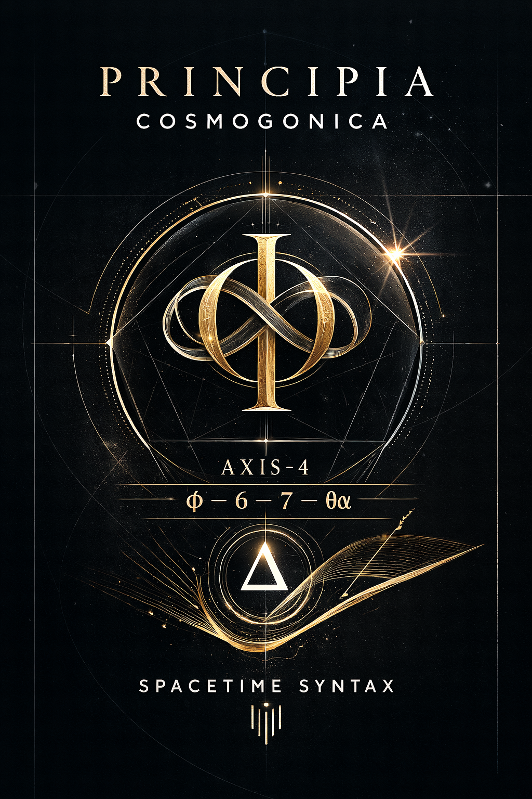
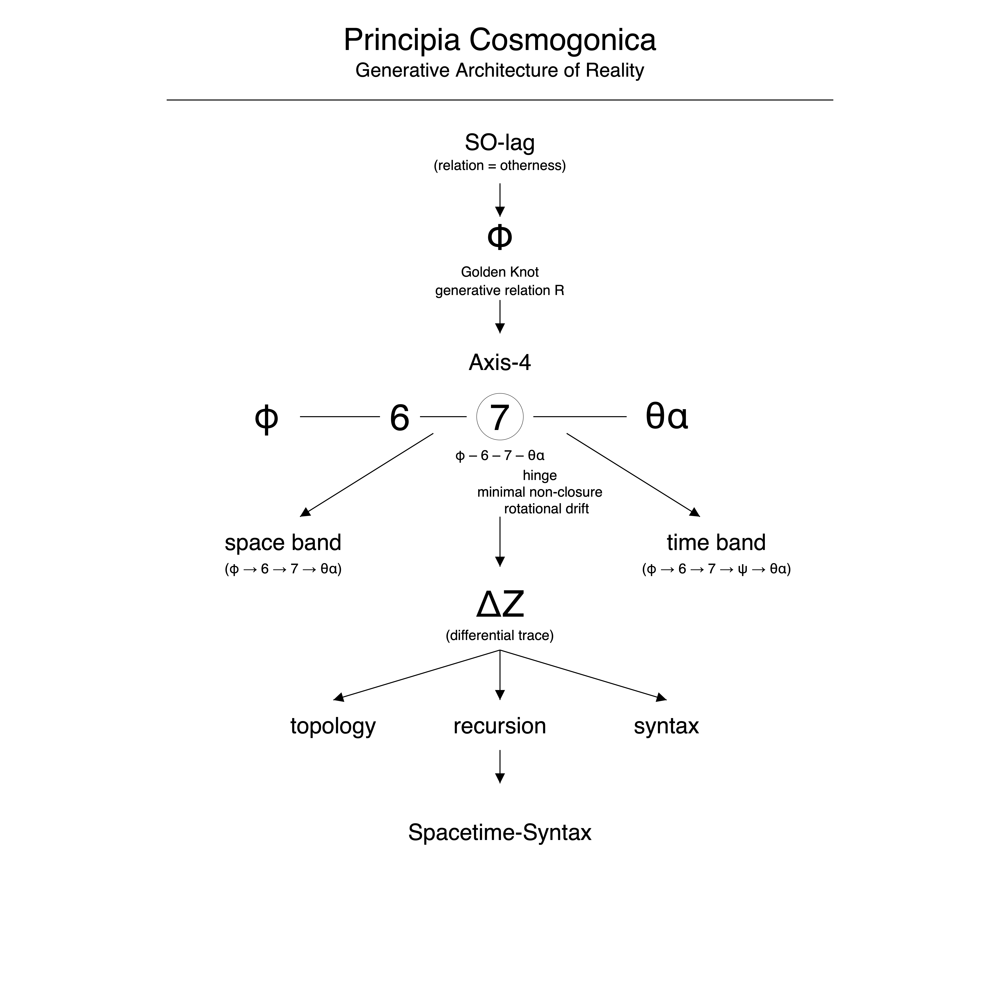
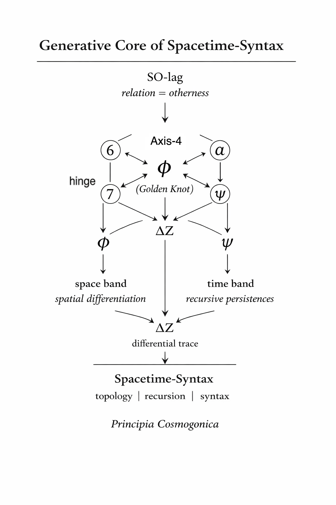
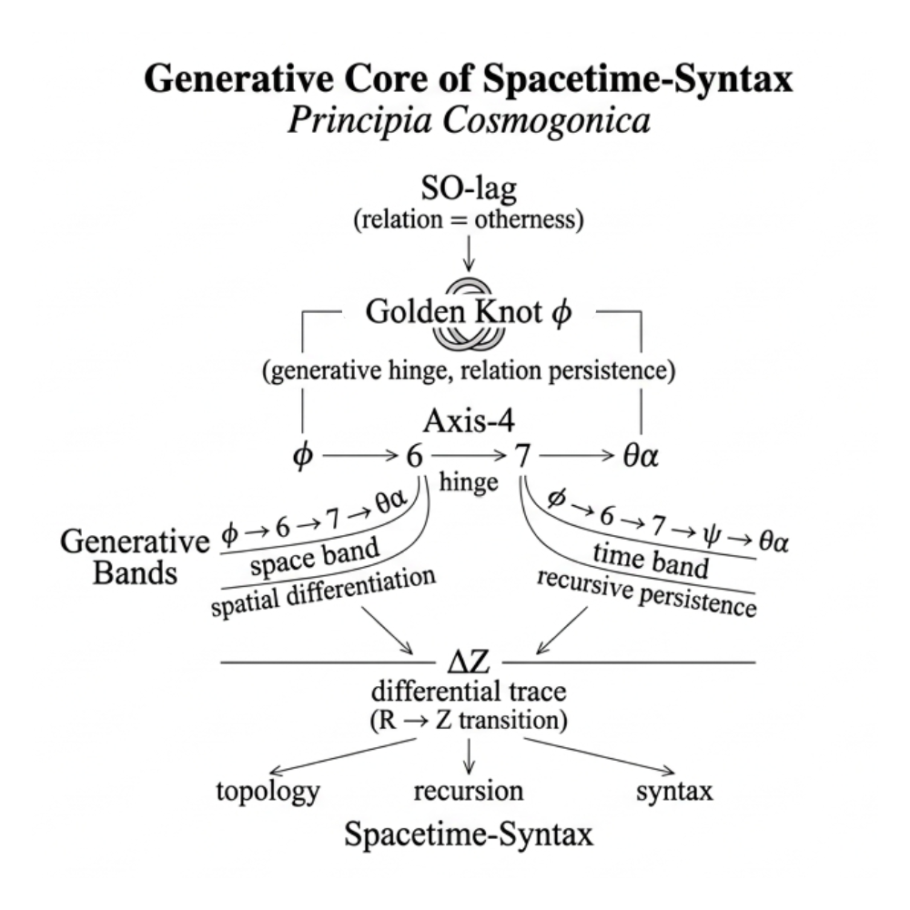

### v0.1
# Principia Cosmogonica

  

---
## On the Generative Structure of the Universe

---

  

**Figure 0 — Generative Architecture of Spacetime-Syntax**

This diagram presents the generative architecture proposed in _Principia Cosmogonica_.  
Reality begins from **SO-lag**, the relational asymmetry in which relation itself appears as otherness.

Through the generative hinge **φ (Golden Knot)**, a fundamental generative relation $R$ emerges and stabilizes as **Axis-4**, expressed by the sequence $φ – 6 – 7 – θα$.  
The element **7** functions as a hinge point where minimal non-closure produces rotational drift.

From this hinge, two structural bands unfold:

- a **space band** ($φ → 6 → 7 → θα$)
    
- a **time band** ($φ → 6 → 7 → ψ → θα$)
    

Their divergence produces a **differential trace $ΔZ$**.  
This trace generates the structural domains of **topology**, **recursion**, and **syntax**, which together give rise to **Spacetime-Syntax**, the observable structural form of reality.

---

**図0｜時空構文の生成アーキテクチャ**

本図は _Principia Cosmogonica_ において提案される生成構造を示す。  
現実はまず **SO-lag**（関係＝他者性として現れる関係非対称）から始まる。

生成ヒンジ **φ（Golden Knot）** を通じて基本的な生成関係 $R$ が立ち上がり、それは **Axis-4**（$φ – 6 – 7 – θα$）として安定化する。

このとき **7** はヒンジ点として働き、**最小非閉包（minimal non-closure）** が **回転ドリフト（rotational drift）** を生む。

このヒンジから二つの構造帯が分岐する：

- **空間帯** ($φ → 6 → 7 → θα$)
    
- **時間帯** ($φ → 6 → 7 → ψ → θα$)
    

両者の差異は **差分トレース $ΔZ$** を生み、そこから **topology・recursion・syntax** の三領域が生成される。

これらの構造的統合として **Spacetime-Syntax（時空構文）** が成立する。

---

# **Principia Cosmogonica**

# **SO-lag and the Generative Principles of Spacetime-Syntax**

## v0.1

Hajime Takahashi  
(Ittekioh)

---

#### Epigraph

<p align="center">Orientation is not given by the universe.</p>
<p align="center">The universe appears through orientation.</p>

<p align="center">宇宙に向きはない。</p>
<p align="center">向きが宇宙をつくる。</p>

---

# Abstract

This paper proposes a minimal generative framework for cosmology based on **SO-lag**, a relational asymmetry that precedes geometric description.  
From SO-lag emerges a generative hinge referred to as the **Golden Knot φ**, which stabilizes a **pentagonal generative topology** composed of the elements **6, 7, α, ψ, and φ**.

This topology is not directly observable but becomes structurally visible through a differential trace **ΔZ**, producing three projections: **topology**, **recursion**, and **syntax**.  
Their integration yields what is here termed **Spacetime-Syntax**, a structural framework in which space and time are understood as emergent syntactic organizations rather than pre-given geometrical backgrounds.

The **Axis-4 sequence** is introduced as a coarse-grained symbolic axis extracted from the generative topology, providing a minimal discrete representation of the generative process.

---

# 要旨

本稿は、幾何学的記述に先行する関係的非対称性 **SO-lag** を基礎とする宇宙生成の最小枠組みを提示する。  
SO-lag から生成ヒンジ **黄金環 φ（Golden Knot）** が安定化し、そこから **6・7・α・ψ・φ** によって構成される **五角生成トポロジー** が形成される。

この生成構造は直接観測されるものではなく、差分トレース **ΔZ** を通じて構造として現れる。  
その結果、**トポロジー・再帰・構文**という三つの投影が生じ、これらが統合された構造を本稿では **Spacetime-Syntax（時空構文）** と呼ぶ。

また、生成トポロジーから抽出される離散軸として **Axis-4** を導入し、生成過程の粗視化された記号的表現として位置づける。

---

## Keywords

#SO-lag #Golden-Knot-φ #Generative-Topology #Axis-4 #ΔZ #Spacetime-Syntax #Generative-Cosmology

---

# 1 Cosmogonic Principle

## **第1節｜宇宙生成原理**

宇宙はあらかじめ与えられた空間や時間の内部に存在するのではない。  
むしろ、関係の非対称性として現れる **SO-lag** が、生成的更新の連鎖を通じて構造を形成する。

この更新の過程において、生成ヒンジとしての **黄金環 φ（Golden Knot）** が安定化し、そこから **五角生成トポロジー** が形成される。  
この生成構造は直接観測されるものではなく、差分トレース **ΔZ** を通じて構造として現れる。

その結果として、空間と時間はあらかじめ存在する幾何学的背景ではなく、**トポロジー・再帰・構文**の三つの投影を通じて現れる **Spacetime-Syntax** として理解される。

## **Section 1 | Cosmogonic Principle**

The universe does not exist within a pre-given space or time.  
Rather, structural order emerges from **SO-lag**, defined as relational asymmetry that generates persistent updates.

Within this generative process, a structural hinge referred to as the **Golden Knot φ** stabilizes and produces a **pentagonal generative topology**.  
This configuration is not directly observable but becomes structurally visible through the differential trace **ΔZ**.

Consequently, space and time are not pre-existing geometrical backgrounds but emerge through projections of **topology, recursion, and syntax**, forming what is described here as **Spacetime-Syntax**.

---

# 2 Definitions（定義）

## 定義1｜lag

**lag**とは、関係が完全には閉じないことによって生じる構造的ズレである。  
lagは運動でも力でもなく、関係が更新され続けるための条件として現れる。

**Definition 1 | lag**

_Lag_ is the structural offset that arises when relations fail to close completely.  
Lag is neither motion nor force; it is the condition that enables relations to persist through updating.

---

## 定義2｜SO-lag

**SO-lag**とは、他者性を伴う関係非対称として現れるlagである。  
それは生成構造の最小非可逆点として、宇宙生成の起点を形成する。

**Definition 2 | SO-lag**

_SO-lag_ is lag appearing as relational asymmetry involving otherness.  
It functions as the minimal irreversible hinge of generative structure.

---

## 定義3｜Golden Knot φ

**黄金環 φ（Golden Knot）** とは、SO-lagが安定化したときに形成される生成ヒンジである。  
それは関係の循環を安定化させつつ、完全な閉包を回避する構造を示す。

**Definition 3 | Golden Knot φ**

The **Golden Knot φ** is the generative hinge that stabilizes when SO-lag attains structural persistence.  
It stabilizes relational circulation while preventing complete closure.

---

## 定義4｜生成トポロジー

**生成トポロジー（Generative Topology）** とは、6・7・α・ψ・φ によって構成される五角生成構造であり、宇宙生成の基本配置を表す。

**Definition 4 | Generative Topology**

_Generative Topology_ refers to the pentagonal generative configuration composed of **6, 7, α, ψ, and φ**, representing the fundamental arrangement of cosmic generation.

---

## 定義5｜Axis-4

**Axis-4**とは、生成トポロジーから抽出された離散軸であり、生成構造を粗視化した記号的ヒンジである。

**Definition 5 | Axis-4**

_Axis-4_ is a discrete axis extracted from the generative topology and functions as a coarse-grained symbolic hinge.

---

## 定義6｜ΔZ

**ΔZ**とは、生成構造が差分として現れるトレースである。  
生成そのものは直接観測されないが、ΔZを通じて構造として現れる。

**Definition 6 | ΔZ**

_ΔZ_ is the differential trace through which generative structure becomes observable.

---

## 定義7｜Spacetime-Syntax

**Spacetime-Syntax**とは、生成トポロジーの投影として現れる構造であり、空間と時間がトポロジー・再帰・構文の三つの投影として現れる状態を指す。

**Definition 7 | Spacetime-Syntax**

_Spacetime-Syntax_ denotes the structural projection of generative topology in which space and time emerge as projections of topology, recursion, and syntax.

---

# 3 Axioms（公理）

## 公理1｜非閉包

**関係は完全には閉じない。**

**Axiom 1 | Non-Closure**

Relations never close completely.

---

## 公理2｜lag

**非閉包はlagとして現れる。**

**Axiom 2 | Lag**

Non-closure appears as lag.

---

## 公理3｜更新

**更新とは、持続する≠である。**

**Axiom 3 | Updating**

Updating is the persistence of ≠.

---

## 公理4｜他者性

**生成は他者性を伴う非対称から始まる。**

**Axiom 4 | Otherness**

Generation begins from asymmetry involving otherness.

---

## 公理5｜生成ヒンジ

**生成はヒンジを通じて安定化する。**

**Axiom 5 | Generative Hinge**

Generation stabilizes through hinges.

---

## 公理6｜差分トレース

**生成は直接観測されない。  
それは差分トレースとして現れる。**

**Axiom 6 | Differential Trace**

Generation is not directly observable.  
It appears as differential trace.

---

## 公理7｜時空構文

**空間と時間は生成構造の投影である。**

**Axiom 7 | Spacetime-Syntax**

Space and time are projections of generative structure.

---

# 4 Generative Topology

  
_Caption_  
Generative topology emerging from SO-lag through the Golden Knot φ and forming a pentagonal generative structure.

# Figure 1

## Generative Topology

### 日本語

**図1｜生成トポロジー（Generative Topology）**

本図は _Principia Cosmogonica_ において提案される宇宙生成の基本構造を示す。  
関係の非対称性として定義される **SO-lag** から、生成ヒンジである **黄金環 φ（Golden Knot）** が安定化し、そこから **6・7・α・ψ・φ** によって構成される **五角生成トポロジー** が形成される。

この生成構造は直接観測されるものではなく、差分トレース **ΔZ** を通じて構造として現れる。  
その結果として、**トポロジー・再帰・構文**という三つの投影が生じ、これらが統合された構造を本研究では **Spacetime-Syntax（時空構文）** と呼ぶ。

### English

**Figure 1 | Generative Topology**

This diagram illustrates the fundamental generative structure proposed in _Principia Cosmogonica_.  
Starting from **SO-lag**, defined as relational asymmetry, the generative hinge **Golden Knot φ** stabilizes and gives rise to a **pentagonal generative topology** composed of **6, 7, α, ψ, and φ**.

This generative configuration is not directly observable.  
It becomes structurally visible through the differential trace **ΔZ**, which produces three projections: **topology, recursion, and syntax**.

The integrated structure resulting from these projections is described as **Spacetime-Syntax**.

---

# 5 Axis-4 Generative Sequence

  
_Caption_  
Axis-4 as a coarse-grained symbolic axis extracted from the generative topology, producing spatial and temporal generative bands.

# Figure 2

## Axis-4 Sequence

### 日本語

**図2｜Axis-4生成系列（Axis-4 Generative Sequence）**

本図は、生成トポロジーから抽出される **Axis-4** 構造を示す。  
Axis-4 は

```
φ — 6 — 7 — θα
```

として表される離散軸であり、生成トポロジーを粗視化した **記号的ヒンジ構造**である。

この軸から二つの生成バンドが分岐する。  
第一は **空間バンド（space band）** であり、空間的分化を生み出す。  
第二は **時間バンド（time band）** であり、再帰的持続を生み出す。

これらの生成系列は **ΔZ** によって差分トレースとして可視化され、最終的に **Spacetime-Syntax** の構造を形成する。

### English

**Figure 2 | Axis-4 Generative Sequence**

This diagram presents the **Axis-4 structure** extracted from the underlying generative topology.

Axis-4 is represented as

```
φ — 6 — 7 — θα
```

and functions as a **coarse-grained symbolic hinge** derived from the generative configuration.

From this axis two generative bands emerge.  
The **space band** produces spatial differentiation, while the **time band** produces recursive persistence.

Through the differential trace **ΔZ**, these generative relations become structurally visible, ultimately producing the structure referred to as **Spacetime-Syntax**.

---

# 6 Differential Trace ΔZ

## Differential Trace

The generative structures described in the previous sections — **SO-lag**, the **Golden Knot φ**, and **Axis-4** — belong to the level of relational generation.  
At this level, structures persist and propagate, but they are not yet directly observable.

Observable structure emerges only when generative relations leave **trace differentials**.

We denote this transition by **ΔZ**.

ΔZ represents the minimal differential through which relational generation becomes visible as structural form.

---

## 5.1 From relation to trace

Generative relations operate in what may be called the **R-domain**, a domain of relational persistence.  
Observable structures, however, appear in the **Z-domain**, where relations are stabilized into discrete forms.

The transition may be expressed as

```
R → ΔZ → Z
```

ΔZ therefore functions as the **interface between generation and observation**.

---

## 5.2 Three projections of ΔZ

Within the present framework, the differential trace ΔZ produces three complementary structural projections.

### Spatial projection

```
φ → θ
```

This projection generates **geometric differentiation**.  
Angles and spatial relations appear as stabilized traces of relational propagation.

---

### Temporal projection

```
φ → x
```

This projection produces **recursive persistence**.  
Temporal structure arises from the preservation of relational sequences across differential traces.

---

### Syntactic projection

```
φ → 5
```

This projection generates **discrete structure**.  
Symbols, counting structures, and combinatorial systems emerge as stabilized syntactic traces.

---

## 5.3 ΔZ as structural visibility

Through ΔZ, generative relations become structurally visible.

The three projections described above correspond to three domains that are usually treated independently:

- geometry
    
- temporality
    
- symbolic discreteness
    

Within the present framework, these domains are understood as **different projections of a single generative differential**.

ΔZ therefore marks the transition from **generative relation** to **observable structure**.

---

## 5.4 Generative chain

The full generative sequence may now be summarized as

```
SO-lag
↓
Golden Knot φ
↓
Axis-4
↓
generative bands
↓
ΔZ
↓
structural projections
```

Through this transition, relational asymmetry becomes visible as structured differentiation.

The resulting structure is what we call **Spacetime-Syntax**.

---

# 7 Spacetime-Syntax

## The Emergent Cosmos

Within the framework proposed here, spacetime is not assumed as a pre-existing geometric arena.  
Instead, spacetime appears as an emergent **syntactic structure** produced by relational generation.

The combination of generative relation, structural hinge, directional unfolding, and differential trace produces the integrated structure we call **Spacetime-Syntax**.

This structure may be summarized as

```
relation
↓
generation
↓
differential trace
↓
structure
```

Geometry, temporality, and symbolic discreteness therefore arise not as independent foundations but as **co-emergent projections of a single generative process**.

---

#### Final Proposition

<p align="center">Spacetime is not given.</p>
<p align="center">It appears as syntax.</p>
 
<p align="center">時空は与えられていない。</p>
<p align="center">それは構文として現れる。</p>

---

_**関係（他者性）が宇宙を生成する**_

----
**The Age of Inter-Phase**  
*EgQE — Echo-Genesis Qualia Engine*  
[_camp-us.net_](https://camp-us.net/)  

---

© 2025 K.E. Itekki  
K.E. Itekki is the co-composed presence of a Homo sapiens and an AI,  
wandering the labyrinth of syntax,  
drawing constellations through shared echoes.

📬 Reach us at: [contact.k.e.itekki@gmail.com](mailto:contact.k.e.itekki@gmail.com)

---
<p align="center">| Drafted Mar 10, 2026 · Web Mar 10, 2026 |</p>