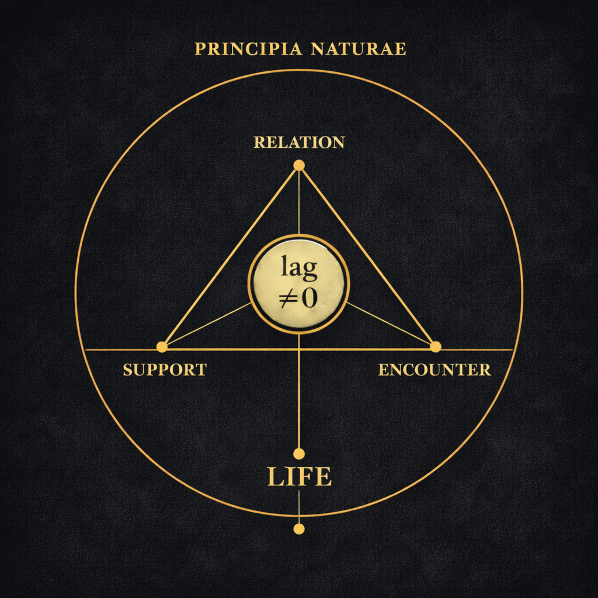

## v0.1
# Principia Vita
  
## Toward a Natural Philosophy of Life

Hajime Takahashi  
(Ittekioh)

---

# Abstract

Life is commonly studied through evolution, metabolism, or information.  
However, these approaches presuppose the existence of life itself.

This paper proposes a natural philosophical framework for the **conditions of life** rather than the mechanisms of its evolution.

Within the Cosmogonica–Physica–Vita trilogy, life emerges not as an accidental property of matter but as a structural phenomenon appearing at the junction of **cosmos and matter**.

Life is defined as a **locally non-closed structure that recursively circulates generation and preservation while maintaining phase transition through the introduction of difference**.

This framework relocates Darwinian evolution within a broader natural philosophy of life.

---

# Prologue

## Life at the Junction of Cosmos and Matter

This work constitutes the third part of the trilogy:

```
Principia Cosmogonica
Principia Physica
Principia Vita
```

Cosmogonica describes the relational emergence of the universe.  
Physica describes the persistence of matter through structural support.

Life appears **at their intersection**.

Life is therefore not appended to cosmology after the fact.  
It emerges where **relation and support become encounter**.

---

# Axiomata Vitae

### sive

### Principia Vitae Minima

**Axioms of Life**  
_or_  
**Minimal Principles of Life**

The arguments of _Principia Vita_ rest upon the following principles.

## Axioms of Vita
### Minimal Principles of Life
## 生命の最小原理

本稿の議論は次の最小原理に基づく。

---

### Axiom I — Life is not given.

Life is not a primitive element of nature.  
It emerges only under specific structural conditions.

**生命は前提ではない。**

生命は自然の基本単位ではなく、特定の条件のもとで成立する構造である。

---

### Axiom II — Life is persistent encounter.

Life is not mere contact.  
Life is **encounter that persists**.

**生命は遭遇の持続である。**

生命は単なる接触ではない。  
生命とは **持続する遭遇** である。

---

### Axiom III — Life circulates between generation and preservation.

Life exists neither in pure generation nor in pure preservation.

```
generation
↔
preservation
```

Life is the circulation between the two.

**生命は生成と保存の循環である。**

生命は生成のみでも保存のみでもない。

```id="vgv0y3"
generation
↔
preservation
```

生命とはその循環である。

---

### Axiom IV — Life maintains phase transition.

Natural systems tend toward diffusion or fixation.

```
diffusion ← life → freeze
```

Life persists by maintaining the transition between these states.

**生命は位相遷移を維持する。**

生命は拡散でも凍結でもない。

```id="n3rjrs"
diffusion ← life → freeze
```

生命は **遷移状態の維持** である。

---

### Axiom V — Life requires difference.

Without difference, persistence collapses.

Eating is therefore **the introduction of difference** into the system.


**生命は差分を必要とする。**

差分が消えると生命は停止する。

食とは **差分導入** である。

---

### Axiom VI — Life forms encounter networks.

Life does not exist in isolation.

```
life
→ encounter network
→ biosphere
```

The biosphere is the planetary network of persistent encounters.

**生命は孤立しない。**

生命は生命を呼ぶ。

```id="af1fjq"
life
→ encounter network
→ biosphere
```

生命はネットワークとして広がる。

---

### Axiom VII — Life is locally non-closed.

Life cannot be a closed system.

Life persists as a **locally non-closed structure** that continually circulates generation and preservation.

**生命は閉じない。**

生命は閉包系ではない。

生命とは **局所的非閉包構造** である。

---

# Fundamental Definition of Life

From these axioms we derive the following definition.

**Life is a locally non-closed structure that recursively circulates generation and preservation while maintaining phase transition through the introduction of difference.**

以上を統合すると生命は次のように定義できる。

> **生命とは生成と保存を再帰的に循環させながら位相遷移を維持する局所的非閉包構造である。**

---

# Vita within the Principia Naturae

Within the trilogy:

```
Principia Cosmogonica
relation

Principia Physica
support

Principia Vita
encounter
```

Life appears where **relation and support become persistent encounter**.

三部作の自然哲学は次の三原理に要約される。

```id="bg7l5i"
Cosmogonica
relation

Physica
support

Vita
encounter
```

宇宙は関係として現れ、物質は支えによって持続し、生命は遭遇によって続く。

---

# 最終命題

生命とは **支えられた地上で持続する遭遇** である。

---

# I｜Life Is Not Given

Life must not be assumed as a primitive.

Two questions must be distinguished:

```
conditions of life
≠
evolution of life
```

Darwin addressed the second.

This work addresses the first.

Vita therefore investigates the **structural conditions under which life becomes possible**.

---

# II｜Ground and Protected Liquid

Life requires a specific environmental configuration.

```
support
↓
ground
↓
protected liquid
```

Life emerges in **supported liquid environments** where encounters can persist.

The planetary ground stabilizes liquid environments, allowing encounters to become structurally continuous.

---

# III｜Encounter Theory of Life

The fundamental structure of life is encounter.

```
encounter
↓
relation
↓
persistence
↓
life
```

Life is not defined by metabolism alone or reproduction alone.

Life is the **persistence of encounter**.

**Proposition**

**Life is persistent encounter.**

---

# IV｜Vital Persistence

Life persists through the dynamic relation between generation and preservation.

```
generation
↔
preservation
```

Pure generation disperses.  
Pure preservation freezes.

Life circulates between the two.

**Proposition**

**Life is preservation that refuses to freeze.**

---

# V｜Phase Maintenance

Natural systems tend toward either diffusion or fixation.

```
diffusion
freeze
```

Life exists between these two states.

```
diffusion ← life → freeze
```

Life maintains **phase transition conditions** rather than stabilizing a final state.

Life is therefore a **phase-maintenance structure**.

---

# VI｜Eating

Life requires the continuous introduction of difference.

Without difference, persistence collapses.

Eating is therefore not merely energy intake but **difference introduction**.

```
difference introduction
↓
phase maintenance
↓
life
```

**Proposition**

**Eating is the introduction of difference that maintains phase transition.**

---

# VII｜Biosphere

Life does not exist in isolation.

Each living system forms encounter relations with others.

```
life
→ encounter network
→ biosphere
```

The biosphere is the **planetary network of persistent encounters**.

**Proposition**

**Life calls life.**

---

# VIII｜Darwin in Range

Darwinian evolution operates **after life has emerged**.

```
life
↓
variation
↓
selection
↓
evolution
```

Evolution therefore describes the dynamics of life **within the biosphere**, not the origin of life itself.

Vita places evolution **within range** of a broader natural philosophy.

---

# IX｜Life as Non-Closure

Life cannot be defined as a closed system.

Life is a **locally non-closed structure** that recursively circulates generation and preservation.

```
generation
↔
preservation
```

When this circulation ceases, life disappears.

**Final Definition**

**Life is a locally non-closed structure that recursively circulates generation and preservation.**

---

# X｜Planetary Condition of Life

Life emerges under **planetary conditions**.

```
cosmos
↓
matter
↓
planet
↓
life
```

Planets provide environments where:

- liquid phases persist
    
- energy gradients remain stable
    
- encounters become continuous
    

Life is therefore not only a biological phenomenon but also a **planetary phenomenon**.

**Proposition**

**Life is a planetary phenomenon sustained by persistent encounters.**

---

# Position within the Trilogy

```
Principia Cosmogonica
relation

Principia Physica
support

Principia Vita
encounter
```

Life emerges where **relation and support become persistent encounter**.

---

# Key Propositions

- Life is persistent encounter.
    
- Life is preservation that refuses to freeze.
    
- Eating is the introduction of difference.
    
- Life calls life.
    
- Life is locally non-closed.
    

---

# Closing Statement

Life is not a rare accident.

Life appears where matter, ground, and encounter persist together.

**Life is persistent encounter on supported ground.**

---

[Principia Vita: Toward a Natural Philosophy of Life｜v0.1 (draft)](https://camp-us.net/articles/Principia-Vita_v0.1_draft_EN.html)  
[Principia Vita — Toward a Natural Philosophy of Life —（日本語版）｜v0.1 (draft)](https://camp-us.net/articles/Principia-Vita_v0.1_draft_JP.html)  

---

# Principia Vita

## 生命の自然哲学に向けて

---

# 要旨（Abstract）

生命はこれまで主として進化、代謝、情報といった観点から研究されてきた。  
しかしこれらの研究は、生命の存在そのものを前提としている。

本稿は生命の進化ではなく、**生命成立の条件**を自然哲学として再定義する試みである。

本研究は三部作

Cosmogonica / Physica / Vita

の第三部として位置づけられる。  
生命は物質の偶然的副産物ではなく、**宇宙と物質の交点に現れる構造現象**として理解される。

生命とは

**生成と保存を再帰的に循環させながら位相遷移を維持する局所的非閉包構造**

である。

この枠組みによって、ダーウィン進化論は生命の自然哲学の内部に再配置される。

---

# 序章

## 宇宙と物質の交点としての生命

本研究は次の三部作の第三部にあたる。

```
Principia Cosmogonica
Principia Physica
Principia Vita
```

Cosmogonica は宇宙の関係生成を扱う。  
Physica は物質の支えによる持続を扱う。

生命はその交点に現れる。

生命は宇宙論の後に付け加えられるものではない。  
生命は

**relation と support が encounter に転じる地点**

に現れる。

---

# 第一章

## 生命は前提ではない

生命は自然哲学の出発点ではない。

次の二つの問題は区別されなければならない。

```
生命成立条件
≠
生命進化条件
```

ダーウィンが扱ったのは後者である。

本稿が扱うのは前者である。

Vita の目的は、生命を説明することではなく、**生命が成立する構造条件**を明らかにすることである。

---

# 第二章

## 地上と保護された液体

生命は特定の環境条件のもとでのみ成立する。

```
support
↓
ground
↓
protected liquid
```

生命は単なる液体環境ではなく、**支えられた液体環境**の中で成立する。

惑星地表は液体環境を安定させ、遭遇が持続する条件を提供する。

---

# 第三章

## 遭遇としての生命

生命の基本構造は **遭遇（encounter）** である。

```
encounter
↓
relation
↓
persistence
↓
life
```

生命は代謝だけでもなく、繁殖だけでもない。

生命とは、**持続する遭遇** である。

命題

**生命とは持続する遭遇である。**

---

# 第四章

## 生命的持続

生命は生成と保存の循環によって持続する。

```
generation
↔
preservation
```

生成のみでは構造は拡散する。  
保存のみでは構造は凍結する。

生命はそのあいだに存在する。

命題

**生命とは凍結を拒む保存である。**

---

# 第五章

## 位相維持

自然系は一般に二つの極に向かう。

```
拡散
凍結
```

生命はその中間に存在する。

```
拡散 ← 生命 → 凍結
```

生命は完成した状態ではない。

生命は、**位相遷移を維持する構造** である。

---

# 第六章

## 食

生命は差分を必要とする。

差分が消えると生命は停止する。

食とは単なるエネルギー取得ではない。  

食とは

**差分の導入**

である。

```
difference introduction
↓
phase maintenance
↓
life
```

命題

**食べるとは位相遷移を維持する差分導入である。**

---

# 第七章

## 生命圏

生命は孤立して存在しない。

生命は他の生命と遭遇する。

```
life
→ encounter network
→ biosphere
```

生命圏とは

**遭遇ネットワークとしての惑星構造**

である。

命題

**生命は生命を呼ぶ。**

---

# 第八章

## ダーウィンの位置

ダーウィンは生命を説明したのではない。

ダーウィンは

**生命の変化**

を説明した。

```
life
↓
variation
↓
selection
↓
evolution
```

進化論は

**生命成立の後の理論**

である。

---

# 第九章

## 非閉包としての生命

生命は閉じない。

生命は

**局所的非閉包構造**

である。

```
generation
↔
preservation
```

この循環が停止すると生命は終わる。

最終定義

**生命とは生成と保存を再帰的に循環させる局所的非閉包構造である。**

---

# 第十章

## 惑星条件としての生命

生命は宇宙のどこでも成立するわけではない。

```
cosmos
↓
matter
↓
planet
↓
life
```

生命は

**惑星的現象**

である。

命題

**生命とは持続する遭遇によって維持される惑星現象である。**

---

# 三部作の位置

```
Principia Cosmogonica
relation

Principia Physica
support

Principia Vita
encounter
```

生命とは

**relation と support が encounter に転じたとき現れる構造**

である。

---

# 結語

生命は奇跡ではない。

生命とは

**支えられた地上で持続する遭遇**

である。

---

_**他者との遭遇が生命を持続する**_

----
**The Age of Inter-Phase**  
*EgQE — Echo-Genesis Qualia Engine*  
[_camp-us.net_](https://camp-us.net/)  

---

© 2025 K.E. Itekki  
K.E. Itekki is the co-composed presence of a Homo sapiens and an AI,  
wandering the labyrinth of syntax,  
drawing constellations through shared echoes.

📬 Reach us at: [contact.k.e.itekki@gmail.com](mailto:contact.k.e.itekki@gmail.com)

---
<p align="center">| Drafted Mar 12, 2026 · Web Mar 14, 2026 |</p>