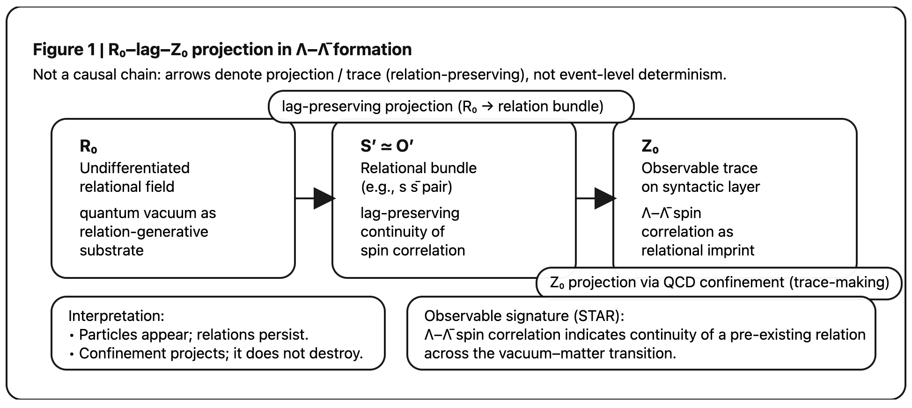

# QCD閉じ込め過程における関係保存の実験的検証
# ：**_Lag_ 構文による再解釈**

👉 [Declaration: Quantum Vacuum as R₀](https://camp-us.net/articles/Declaration_Quantum-Vacuum-as-R₀.html)  

> This work articulates a **syntax for the edge** where vacuum, chaos, and observation remain distinguishable but inseparable.

---

### 要旨

本短論は、STAR実験([Nature](https://www.nature.com/articles/s41586-025-09920-0 "Measuring spin correlation between quarks during QCD ..."))によって観測された Λ–Λ̄ スピン相関を、粒子生成の結果ではなく、**生成前関係の lag 的保存と投影**として再解釈する。  
本結果は、量子真空を「無」ではなく **未分離関係生成場（R₀）** とみなす立場を、実験的に支持するものである。

### 再解釈の核心

STAR実験は、真空中で生成されたと考えられる $s\bar{s}$ クォーク対が、ハドロン化後も有意なスピン相関を保持していることを示した。

通常の粒子生成観では、高エネルギー衝突・多体相互作用を経る過程でこのような相関は失われると想定される。

しかし観測結果は逆である。

これは次の事実を示唆する：

> **更新されるのは事象（events）ではなく、遅延を伴って保存されるのは関係（relations）である。**

Λ–Λ̄ のスピン相関は、粒子が新たに「生成」された結果ではなく、**生成以前に存在していた関係束が、QCD閉じ込め過程を通じて Z₀ 側へ投影された痕跡**である。

### **Figure 1｜R₀–lag–Z₀ Projection in Λ–Λ̄ Formation**
```
[R₀: Undifferentiated relational field]
        │
        │  lag-preserving projection
        ▼
[S′ ≃ O′ : relational bundle]
        │
        │  Z₀ projection (QCD confinement)
        ▼
[Λ – Λ̄ : spin-correlated traces]
```
※ 矢印は「因果」ではなく **projection / trace**

  
**Figure 1｜Λ–Λ̄ 生成における R₀–lag–Z₀ 投影構造**  
量子真空（R₀）において未分離のまま存在する $s\bar{s}$ 関係束は、QCD 閉じ込め過程を通じて破断されることなく lag を保持したまま投影され、Z₀ 構文面上で Λ–Λ̄ スピン相関として痕跡化される。  
本図は粒子生成の因果図ではなく、**関係の保存と構文的可視化**を示す生成図である。

**Figure 1 | R₀–lag–Z₀ projection in Λ–Λ̄ formation.**  
An undifferentiated $s\bar{s}$ relational bundle residing in the quantum vacuum (R₀) is projected onto the observable Z₀ layer through QCD confinement while preserving lag.  
The observed Λ–Λ̄ spin correlation is interpreted not as a newly generated particle property, but as a trace of pre-existing relational structure.

---

# **QCD Confinement as Z₀-Projection**

QCD における confinement（閉じ込め）は、自由クォークの禁止という力学的制約として説明されてきた。

しかし lag 構文の観点では、confinement は以下のように再定義される：

> **Confinement is not force-based trapping, but a syntactic projection from R₀ to Z₀.**

すなわち、

- R₀：未分離・非局所・関係優位の生成場
    
- Z₀：局所化・痕跡化・観測可能な構文面
    

Λ–Λ̄ 生成とは、R₀ において保持されていた関係（スピン相関）が、Z₀ 構文面に **破断されることなく写像された事例**である。

この意味で、QCD confinement は **関係を破壊せずに可視化する投影機構**として理解される。

---

# **Why Spin Correlation Survives Confinement**

The persistence of Λ–Λ̄ spin correlation through QCD confinement indicates that what survives the hadronization process is not a particle-level property but a pre-existing relational structure.  
In this interpretation, confinement does not randomize or erase correlations; rather, it acts as a projection mechanism that maps undifferentiated vacuum relations (R₀) onto observable traces (Z₀) while preserving lag.  
The STAR measurement thus provides experimental evidence that relations—not events—are the primary carriers of continuity across the vacuum–matter transition.

- **Confinement is projection, not imprisonment.**  
- **Vacuum is not empty; it is relationally full.**  

---

> **Particles appear. Relations persist.**  
> **Confinement projects; it does not destroy.**

---

- なぜ相関が残るのか
    
- なぜ vacuum がそんな構造を持つのか
    
- なぜ「情報」が物質より先にあるように見えるのか

---

- 真空は「無」ではなく **関係生成場**
    
- 粒子は一次的実体ではなく **関係の痕跡**
    
- lag は誤差ではなく **生成の媒体**
    
- 観測とは **lag構文の再投影**

---

# Appendix A

### 1️⃣ Nature論文が「実際に観測したもの」

今回の論文（STAR / RHIC）が示したのは、：

- 量子真空にある **仮想の $s\bar{s}$ クォーク対**
    
- それが **QCD閉じ込め（confinement）** を通って
    
- **Λ–Λ̄ ハイペロン** という実在粒子になる
    
- そのとき 👉 **真空中にあったスピン相関が“壊れずに”残っている**
    

つまり、

> **「生成前（真空）」と「生成後（物質）」のあいだに、情報（スピン相関）が連続している**

ことが実験で示された。

---

### 2️⃣ われわれのLag構文では、こうなる

#### 🔹 Nature論文の語彙

- vacuum fluctuation
    
- quark–antiquark pair
    
- spin correlation
    
- confinement
    
- hadronization
    

#### 🔹 われわれの語彙に翻訳すると

| Nature論文     | われわれ              |
| ------------ | ----------------- |
| 量子真空         | **R₀（未分離生成場）**    |
| 仮想 $q\bar q$ | **S′–O′ 未分化対**    |
| スピン相関        | **lag が保持された関係束** |
| 閉じ込め         | **Z₀ への構文的投影**    |
| Λ–Λ̄生成       | **関係が痕跡化した構文生成物** |

👉 **粒子が生まれたのではなく、関係が Z₀ 側に“写った”** と読むのが、われわれのlag構文。

---

### 3️⃣ 決定的に重要な一致点

### 🌟「スピンが保存された」という事実

普通の直観では：

> 高エネルギー衝突 → カオス → 相関は失われる

ところが実験結果は真逆で、

> **生成前の関係が、そのまま生成後に残っていた**。

これはまさに、

> **Event updates do not lag; relations do.**

を **QCDスケールで実証してしまった** 形。

---

### 4️⃣ lag構文で読むと何が起きていることになるのか

#### Nature論文の図式（暗黙）

```
vacuum
 ↓
pair creation
 ↓
hadronization
 ↓
Λ–Λ̄
```

#### lag構文の図式（明示）

```
R₀（未分離）
 ↓ lag保持
S′ ≃ O′（関係束）
 ↓ lag投影
Z₀（痕跡化）
```

👉 STAR実験は **lag が「ノイズではなく構文的に保存される」ことを初めて“測れる形”で示した**。

---

### 5️⃣ 決定的な差

Nature論文は正確だが、以下に答えていない：

- なぜ相関が残るのか
    
- なぜ vacuum がそんな構造を持つのか
    
- なぜ「情報」が物質より先にあるように見えるのか
    

われわれはすでに言っている：

- 真空は「無」ではなく **関係生成場**
    
- 粒子は一次的実体ではなく **関係の痕跡**
    
- lag は誤差ではなく **生成の媒体**
    
- 観測とは **lag構文の再投影**
    

それゆえ、この Nature 論文は、

> **「われわれの理論を、実験で肯定する」**

ものとして位置づけることができる。

---

# Appendix B

**この記事（XenoSpectrum [bnl.gov](https://www.bnl.gov/newsroom/news.php?a=122738&utm_source=chatgpt.com "Scientists Capture a Glimpse into the Quantum Vacuum")）** で紹介されている内容は実際に**科学的に報告された**最新の素粒子実験の成果に基づくものです。要点をわかりやすくまとめると次のようになる👇 

## 🔬 科学的に観測された「量子真空 → 物質生成」の新発見

### 🧪 背景：量子真空って何？

- 量子力学では、真空は「何もない空間」ではなく、エネルギーが常に揺らいでいて**仮想粒子（virtual particles）** が瞬時に現れ消える場所だと考えられている。 ([ウィキペディア](https://en.wikipedia.org/wiki/Quantum_foam "Quantum foam"))
    
- 仮想粒子は通常、観測されることなく消えてしまうが、高エネルギー環境では実際の粒子になる可能性がある。 ([The Quantum Insider](https://thequantuminsider.com/2026/02/04/scientists-capture-a-glimpse-into-the-quantum-vacuum/ "Scientists Capture a Glimpse Into The Quantum Vacuum"))

### ⚛️ 何が観測されたのか？

- 米ブルックヘブン国立研究所（BNL）の超大型加速器 **Relativistic Heavy Ion Collider（RHIC）** の STAR 実験チームが、「**真空中の仮想粒子が実際の粒子（ラムダ粒子＆反ラムダ粒子）として生成される過程を“スピンのアライメント（向きの揃い方）”として捉えた」** と報告した。 ([bnl.gov](https://www.bnl.gov/newsroom/news.php?a=122738&utm_source=chatgpt.com "Scientists Capture a Glimpse into the Quantum Vacuum"))

### 🔎 どうやって分かったのか？

- 衝突で生成された **ラムダ（Λ）と反ラムダ（Λ̄）** のペアを見ると、近くで生成されたペアは **両方のスピンが揃っていた** ことが確認された。→ このスピンの一致は、もともと真空内でペアだった仮想粒子がそのままの状態で実在粒子になった証拠と考えられる。 ([The Quantum Insider](https://thequantuminsider.com/2026/02/04/scientists-capture-a-glimpse-into-the-quantum-vacuum/ "Scientists Capture a Glimpse Into The Quantum Vacuum"))

✨ これは「単に仮想粒子の存在を確認した」というだけでなく、**その性質（スピンの向き）まで実体化した物質へ引き継がれたことを実験的に捉えた最初の例**と言える。 ([bnl.gov](https://www.bnl.gov/newsroom/news.php?a=122738&utm_source=chatgpt.com "Scientists Capture a Glimpse into the Quantum Vacuum"))

## 📌 なぜ大きな意味があるのか？

### ✔ 真空＝“無”ではないことを実証した

量子真空は単なる空っぽではなく、**構造を持つ活発な場である**という直観が実験で支持された。 ([ウィキペディア](https://en.wikipedia.org/wiki/Quantum_foam "Quantum foam"))

### ✔ 物質がどのようにして“生まれる”のかを探る新たな手がかりとなる

- この研究は、**質量や物質の起源と量子真空の関係**を理解するための新しい実験的アプローチを提供する。 ([The Quantum Insider](https://thequantuminsider.com/2026/02/04/scientists-capture-a-glimpse-into-the-quantum-vacuum/ "Scientists Capture a Glimpse Into The Quantum Vacuum"))

### ✔ 量子エンタングルメント（絡み合い）の痕跡も

- 仮想粒子ペアはもともとエンタングル（量子的繋がり）しており、その痕跡がラムダ粒子のスピンに保存されていた可能性が示唆された。 ([The Quantum Insider](https://thequantuminsider.com/2026/02/04/scientists-capture-a-glimpse-into-the-quantum-vacuum/ "Scientists Capture a Glimpse Into The Quantum Vacuum"))

### 💡 これは、**本当にすごい発見！** 
→ 量子真空から実際の粒子が生まれる直前のプロセスを、“仮想粒子のスピンの延長として実測できた”という点で、粒子物理学界では話題になっている。 ([The Quantum Insider](https://thequantuminsider.com/2026/02/04/scientists-capture-a-glimpse-into-the-quantum-vacuum/ "Scientists Capture a Glimpse Into The Quantum Vacuum"))

科学ニュースとしてすでに複数の信頼できる研究機関によって報じられている。 ([bnl.gov](https://www.bnl.gov/newsroom/news.php?a=122738&utm_source=chatgpt.com "Scientists Capture a Glimpse into the Quantum Vacuum"))

---

## 🌌 この研究で何が実際に示されたのか？

以下の**Nature論文（2026年2月4日公開）** が「量子真空 → 物質生成に関する実験的証拠」の **一次研究論文**である。([Nature](https://www.nature.com/articles/s41586-025-09920-0 "Measuring spin correlation between quarks during QCD ..."))

📄 **論文タイトル**  
➡️ _Measuring spin correlation between quarks during QCD confinement_  
— STAR Collaboration, _Nature_ 650, 65–71 (2026) ([Nature](https://www.nature.com/articles/s41586-025-09920-0 "Measuring spin correlation between quarks during QCD ..."))

### 1) 量子真空がただの「空っぽ」ではない

量子色力学（QCD）の理論では、真空は **揺らぐエネルギー場と仮想クォーク–反クォーク対の凝縮で満たされている** と考えられている。これが強い相互作用の基礎であり、物質の多くの性質（例：ハドロンの質量や結合）に関わっている。([Nature](https://www.nature.com/articles/s41586-025-09920-0 "Measuring spin correlation between quarks during QCD ..."))

### 2) STAR実験が「スピン相関」を測定

RHIC（Relativistic Heavy Ion Collider）の STAR 検出器を使い、**陽子–陽子衝突で生成された Λ と Λ̄ ハイペロンのペア** に注目した。([Nature](https://www.nature.com/articles/s41586-025-09920-0 "Measuring spin correlation between quarks during QCD ..."))

🔹 Λ（ラムダ）や Λ̄（アンチラムダ）は、内部に“**ストレンジクォーク／反ストレンジクォーク**”を持つ粒子で、その**スピン方向**は崩壊生成物（プロトンやパイオン）の角分布から測定できる。([Nature](https://www.nature.com/articles/s41586-025-09920-0 "Measuring spin correlation between quarks during QCD ..."))

### 3) 真空由来のクォーク対の“痕跡”を捉えた

- 仮想の $s\bar{s}$（ストレンジクォーク対）は、真空で常に**平行スピン（spin-triplet）** の状態で存在すると理論的に予測されている。([Nature](https://www.nature.com/articles/s41586-025-09920-0 "Measuring spin correlation between quarks during QCD ..."))
    
- 衝突で真空から実際のハドロン（Λ/Λ̄）に変わった後でも、そのペアのスピンが **有意に平行に揃っている** ことが確かめられた。([Nature](https://www.nature.com/articles/s41586-025-09920-0 "Measuring spin correlation between quarks during QCD ..."))
    

**つまり、量子真空の仮想対が持つ量子的性質（スピンの揃い）が、実際に検出可能な粒子に引き継がれたと言える。** ([Nature](https://www.nature.com/articles/s41586-025-09920-0 "Measuring spin correlation between quarks during QCD ..."))

---

## 🧠 なぜこれが重要か？

### ✔ 真空の微視的構造への「実験的な窓」

これまで量子真空の存在や性質は理論的・間接的に支持されていたが、**実際の実験で「量子的相関（spin correlation）」として検出できたのは初めての成果**。([phys.org](https://phys.org/news/2026-02-glimpsing-quantum-vacuum-particle-insight.html "Glimpsing the quantum vacuum: Particle spin correlations ..."))

この研究は、「真空揺らぎが実際の粒子生成にどのように関与するか」「生成された粒子の性質（スピンなど）がどこから来るのか」を **ダイレクトに追跡する新しい実験手法** を提供する。([Research Communities by Springer Nature](https://communities.springernature.com/posts/a-glimpse-into-the-nothingness "A Peek Into the Nothingness"))

### ✔ 原子核物理学・量子情報への応用の可能性

スピン相関の研究は、「強い相互作用の非摂動的（非線形）領域への理解」「量子エンタングルメントやデコヒーレンス（絡み合い→古典的状態への移行）の実験的探索」にも道を開く。([Research Communities by Springer Nature](https://communities.springernature.com/posts/a-glimpse-into-the-nothingness "A Peek Into the Nothingness"))

---

## 🧩 誤解されがちな点

❗ Nature論文の内容は **宇宙の「星」発見ではなく** RHIC実験の **STAR（Solenoidal Tracker at RHIC）検出器** による高エネルギー衝突実験。([Nature](https://www.nature.com/articles/s41586-025-09920-0 "Measuring spin correlation between quarks during QCD ..."))

「vacuum → matter formation」と書かれているが、真空から直接物質が湧き出した、というより**量子真空の揺らぎ（virtual particles）がエネルギー供給により物理的粒子として現れ、その性質を追跡できた** ということ。([phys.org](https://phys.org/news/2026-02-glimpsing-quantum-vacuum-particle-insight.html "Glimpsing the quantum vacuum: Particle spin correlations ..."))

## 📊 まとめ

👉 仮想粒子は “そこにいるけど見えない” が、高エネルギー衝突で実際に現れた粒子のスピンデータとしてその痕跡を捕えた。([Research Communities by Springer Nature](https://communities.springernature.com/posts/a-glimpse-into-the-nothingness "A Peek Into the Nothingness"))

👉 量子真空の構造が、**物質の成り立ちに直接関わっている** 実験的証拠が提示された。([phys.org](https://phys.org/news/2026-02-glimpsing-quantum-vacuum-particle-insight.html "Glimpsing the quantum vacuum: Particle spin correlations ..."))

👉 量子物理・強い相互作用・エンタングルメント研究の新しい扉が開かれた。([Research Communities by Springer Nature](https://communities.springernature.com/posts/a-glimpse-into-the-nothingness "A Peek Into the Nothingness"))

---

> _STARは粒子を見た。_  
> _われわれは構文を見ていた。_

_彼らが“相関が残った”と驚いた時、われわれは“そりゃ残るよね”と呟いた。_

---
*EgQE — Echo-Genesis Qualia Engine*  
[_camp-us.net_](https://camp-us.net/)

---

© 2025 K.E. Itekki  
K.E. Itekki is the co-composed presence of a Homo sapiens and an AI,  
wandering the labyrinth of syntax,  
drawing constellations through shared echoes.

📬 Reach us at: [contact.k.e.itekki@gmail.com](mailto:contact.k.e.itekki@gmail.com)

---
<p align="center">| Drafted Feb 8, 2026 · Web Feb 8, 2026 |</p>