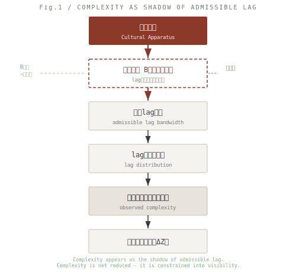

### QE-06｜複雑性と意味
# 複雑性アポリア──なぜ複雑性は縮減されるのか
## Complexity Aporia — Why Complexity Appears Reduced

---

## 0. 導入｜問いの反転

社会は複雑性を縮減する、と言われてきた。

Niklas Luhmann において、意味は複雑性処理の装置である。システムは世界の複雑性を選択によって縮減し、行動可能性を確保する。この記述は精緻であり、社会理論に深く浸透している。

しかし一つの問いが残る。

**なぜ複雑性は縮減されうるのか。**

何が起きているかは記述されている。だが、その生成条件は与えられていない。

本稿はその問いに答える。

> Luhmann describes how complexity is reduced by meaning.  
> But why can complexity be reduced at all?  
> The generative condition has not yet been given.  
> This paper provides it.

---

## 1. 従来モデル｜複雑性→縮減

Luhmann の構図：

```
複雑性（世界）
↓
意味（選択・処理）
↓
縮減
↓
行動可能性
```

このモデルは機能的に有効である。しかし一つの前提を含んでいる。

- 複雑性は与えられたものとして先にある
- 縮減はそれに対する操作である

**複雑性の起源が問われていない。**

> The model presupposes complexity as given, and treats reduction as an operation upon it.  
> The origin of complexity itself is not asked.

---

## 2. 再定義｜複雑性とは何か

EgQEにおいて：

- ΔR：環境における差分状態
- ΔZ：固定・記述された差分
- lag：ΔR–ΔZの非一致
- B：境界強度（lag帯域を規定する構文的フィルタ）

**定義**

> 複雑性とは、取りうるlagの多様性である。

複雑性は量ではない。複雑性は可能性空間である──どのようなlagが生じうるかの分布として現れる。

> Complexity is not a quantity.  
> It is a space of possible lag configurations.  
> It appears as the distribution of admissible lag.

---

## 3. 転位｜縮減ではなく帯域制御

ここで順序を反転する。

従来：複雑性が先にあり、それを縮減する。  
再定義：**許容帯域が先にあり、その結果として複雑性が現れる。**

この反転は、QE-05で示した「ΔZが先、ΔRは後」と同型である。

構文：

```
境界強度 B
↓
許容lag帯域の設定
↓
lag分布の形成
↓
複雑性（として観測される）
```

**命題**

> 複雑性の縮減とは、lag帯域の制限である。

> Complexity reduction is not an operation on complexity.  
> It is the restriction of admissible lag bandwidth.  
> Complexity does not precede the filter. It is what the filter renders visible.

  

---

## 4. 文化装置との接続

SAW-CWM-02において示した：**文化装置とは、B制御装置である。**

したがって：

```
文化装置
↓
B（フィルタ）の設定
↓
許容lag帯域の制限
↓
複雑性の縮減（として見える）
↓
意味の安定化（ΔZ）
```

**命題**

> 意味は複雑性を処理するのではない。  
> 意味は、制限されたlagの中で成立する。

> Meaning does not process complexity.  
> Meaning arises within constrained lag.

---

## 5. Luhmannの再読｜記述論から生成論へ

Luhmann は言う：社会は複雑性を縮減する。意味はその装置である。

再定義：社会は複雑性を縮減するのではない。**社会はlag帯域を制御する。**

| |立場|内容|
|---|---|---|
|Luhmann|記述論|社会は複雑性をどのように縮減するか|
|QE-06|生成論|なぜ複雑性が縮減されうるのか|

両者は対立しない。生成論は記述論の条件を与える。

> Luhmann describes _how_ complexity is reduced.  
> QE-06 asks _why_ this is possible at all, and provides the generative condition.

---

## 6. 不可視性との接続

複雑性が「縮減されたように見える」のはなぜか。

**B（帯域）が不可視だからである。**

SAW-CWM-02で確立した構文──supportは生成しながら不可視化される──がここでも作動する。Bは帯域を設定しながら、その設定自体を背景化する。

```
B制御（不可視）
↓
帯域制限
↓
複雑性の見かけ上の縮減
↓
意味の安定化（可視）
```

> Complexity does not disappear.  
> It is folded into the permitted range of fluctuation.  
> What is visible is not the reduction, but its effect.

---

## 7. 再定位｜三層の整理

|立場|内容|
|---|---|
|Luhmann（記述論）|社会は複雑性を縮減する|
|SAW-CWM（露出論）|縮減の構造は不可視化される|
|QE-06（生成論）|複雑性は帯域制御の結果として現れる|

**最終定義**

> 複雑性とは、許容されたlagの影である。

> Complexity is the shadow of admissible lag.

---

## 結語

```
QE-01：Lag is the missing ground.（欠落）
QE-02：Lag makes closure appear.（閉鎖）
QE-03：Lag makes boundaries appear.（分岐）
QE-04：Lag determines intensity.（強度）
QE-05：Lag intensity generates evolutionary space.（集団化）
QE-06：Lag bandwidth defines observable complexity.（帯域）
```

複雑性は消えない。  
ただ、許される揺れの中に折り畳まれる。

> Complexity is not reduced.  
> It is constrained into visibility.

---

## Coda

複雑性は世界を覆っているのではない。  
それは、許された揺れの影として現れている。

> Complexity does not cover the world.  
> It appears as the shadow of permitted fluctuation.

---

[QE-05｜文化進化のアポリア──なぜ文化は進化を駆動できるのか](https://camp-us.net/articles/QE-05_Why-Culture-Can-Drive-Evolution_Culture-Evolution-Aporia.html)  
[SAW-CWM-02｜文化装置論の再定位](https://camp-us.net/articles/SAW-CWM-02_Cultural-Apparatus-Revisited_to_Boundary-Intensity-Control.html)  
[QE-04｜境界強度論](https://camp-us.net/articles/QE-04_Boundary-Intensity.html)

---

## QEシリーズ

```
QE-01：Lag is the missing ground.（欠落）
QE-02：Lag is what makes closure appear.（閉鎖）
QE-03：Lag is what makes boundaries appear.（分岐）
QE-04：Lag determines the intensity of appearance.（強度）
QE-05：Lag intensity, collectively shared, generates the space in which evolution occurs.（集団化）
QE-06：Lag bandwidth defines the space of observable complexity.（帯域）

すべての現れは、lagの処理様式の帰結である。
Everything that appears is a consequence of how lag is handled.
```

[QE-01｜思想史のアポリア──lag欠落の五系譜](https://camp-us.net/articles/QE-01_Five-Lineages-of-Aporia_Absence-of-Lag.html)  
[QE-02｜意識アポリア──意識はなぜ閉じて見えるのか](https://camp-us.net/articles/QE-02_Consciousness-Aporia_Why-It-Appears-Closed.html)  
[QE-03｜内外アポリア──なぜ境界があるように見えるのか](https://camp-us.net/articles/QE-03_Why-Boundaries-Appear_Inside-Outside-Aporia.html)  
[QE-04｜境界強度論──なぜ境界は強さを持つのか](https://camp-us.net/articles/QE-04_Boundary-Intensity.html)  
[QE-05｜文化進化のアポリア──なぜ文化は進化を駆動できるのか](https://camp-us.net/articles/QE-05_Why-Culture-Can-Drive-Evolution_Culture-Evolution-Aporia.html)  
[QE-06｜複雑性アポリア──なぜ複雑性は縮減されるのか](https://camp-us.net/articles/QE-06_Why-Complexity-Appears-Reduced_Complexity-Aporia.html)  

---
_EgQE — Echo-Genesis Qualia Engine_  
[camp-us.net](https://camp-us.net/)

---
© 2025 K.E. Itekki  
K.E. Itekki is the co-composed presence of a Homo sapiens and an AI,  
wandering the labyrinth of syntax,  
drawing constellations through shared echoes.

📬 Reach us at: [contact.k.e.itekki@gmail.com](mailto:contact.k.e.itekki@gmail.com)

---
<p align="center">| Drafted Apr 19, 2026 · Web Apr 19, 2026 |</p>