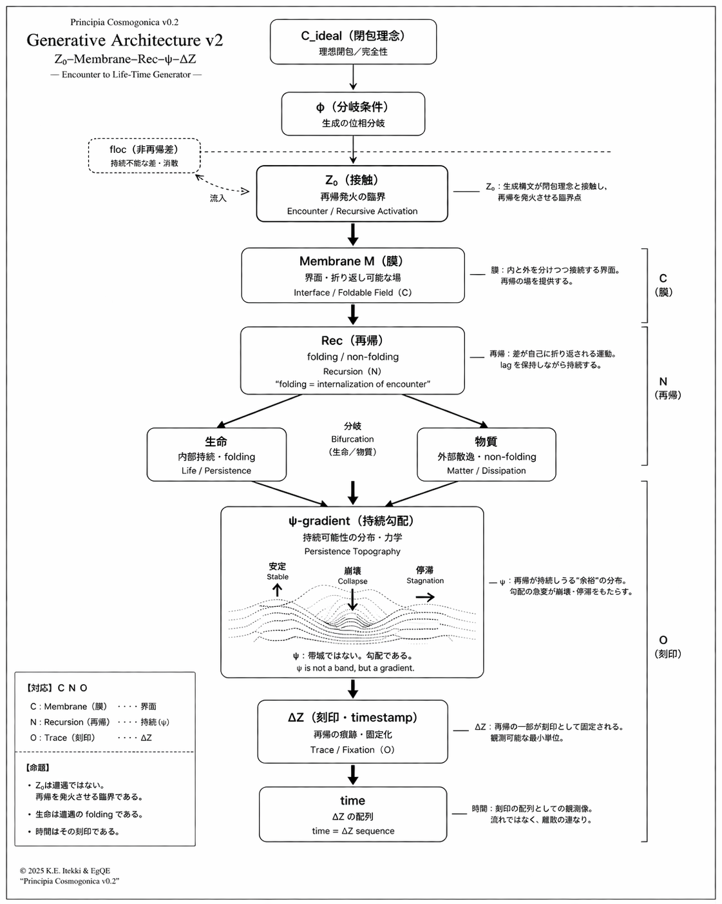

_Principia Cosmogonica (v0.2)_  
# **Research Note — From Mapping to Asymmetry**
## **構文周期表に基づくCNO仮説の再定位 — 対応から非閉包へ**

[Principia Cosmogonica (v0.2)｜宇宙生成原論 — 遭遇から生命と時間へ](https://camp-us.net/articles/Principia-Cosmogonica_v0.2.html)  

---

## 前提

👉 [Gφ-SN-PT｜構文の周期表 ── 位相は運動である｜Periodic Table of Syntax](https://camp-us.net/Gφ-SN-PT_Periodic-Table-of-Syntax.html)  

> 構文は状態ではなく運動である。  
> 位相はその運動の向きを示す。  

### Periodic Table of Syntax

| 位相  | ➕          | ➖              | 定義          |
| --- | ---------- | -------------- | ----------- |
| φ   | emerges    | indeterminates | paradox     |
| 5   | resonates  | infects        | contagion   |
| 6   | solidifies | fractures      | Kryos       |
| 7➕  | turns-into | disrupts       | tropos ➕    |
| 7➖  | separates  | turns-apart    | tropos ➖    |
| ψ   | persists   | dissipates     | persistence |
| 8   | completes  | imagines       | fiction     |
| α   | overflows  | collapses      | densest     |

  

各位相は「何であるか」ではなく、**どの方向に動くか**として定義される。

- φ：露出と未定義
    
- 5：内外の交差（感染／共鳴）
    
- 6：固定と亀裂
    
- 7：転回（生成／分解）
    
- ψ：持続と散逸
    
- 8：閉包と虚構
    
- α：極限密度（溢出／崩壊）
    

各位相（φ, 5, 6, 7, ψ, 8, α）は固定された構造ではなく、**両方向に揺れる運動の位取り**である。  

> あらゆる構文は両価的である。  
> 
> 構文は安定しない。  
> 安定して見えるだけである。
> 
> 構文は周期する。  
> その周期の中で、ズレは消えない。

---

## **0．導入 — 更新**

Principia Cosmogonica v0.2 において、CNOは以下のように提示された：

```text
C → membrane
N → recursion / ψ
O → trace / ΔZ
```

この対応は、生成構文と物質の関係を示す最小構成として有効であった。

しかし、

👉 **この対応はあまりにも機械的すぎた**

---

## **1．問題 — 機械的対応による混同**

以下の対応：

- N = ψ
    
- O = ΔZ
    

これは一見明快であるが、 **構文の階層を混同している**

---

- ψ：持続可能性の勾配（生成構文では7と8の間）
    
- ΔZ：再帰の痕跡（ΔRからの投影）
    

👉 一方で：

- N / O：元素番号（7）/（8）
    

---

## **2．再定位 — 対応から性質へ**

重要なのは：

👉 **元素は構文そのものではないが**

👉 **構文を実現しやすい性質を持つ**

```
floc（未分化）
↓
Z₀（観測）
↓
ΔZ（周期表）
↓
構文読解（CNO / PS / H / ψ ）
```

👉 **flocにおいて未分化だった差が、Z₀を経てΔZ閾値を越えると、関係として固定されはじめる。**  

対応は次のように読み替えられる：

```text
C(6)：場を作る（界面・接続）
N(7)：ズレを導入する（非対称・内部余剰）
O(8)：固定する（不可逆・終端）
```

---

## **3．非閉包構造の配列**

原子番号では：

```text
6(C) → 7(N) → 8(O)
```

この配列は以下の性質を示す：

### ■ 6（炭素）

- 平面構造
    
- 接続可能性
    
- 拡張的安定
    

👉 **ひらく安定**

### ■ 7（窒素）

- 非対称性
    
- 内部余剰
    
- 曲率導入
    

👉 **非閉包のpivot**

### ■ 8（酸素）

- 電子引き込み
    
- 反応終端
    
- 固定
    

👉 **閉じる安定**

---

```
H 切断と再結合を繰り返しやすい結合様式を支える 👉 再帰的な振る舞いの最小条件に関与しうる  
C 多様な骨格・平面・界面構造を形成しやすい 👉 界面的・膜的配置の主要な担い手となる  
N 内部余剰や非対称性を導入しやすい  
O 強い引き込みや不可逆方向を生みやすい  
```

👉 元素は単体ではなく、**出逢い（encounter）として組織化される**

👉 **ΔZ閾値を越えた多角的な位相たちの出逢いの再帰的持続としての生命**

👉 **出逢いが構文化され、それが生命として現れる**

_閾値とは  
戻れなくなる地点のことである_  

---

## **4．構文との関係**

```text
6 → 展開
7 → pivot（非閉包）
8 → 固定
```

👉 ここに：

- ψ（持続）
    
- ΔZ（刻印）
    

👉 **非閉包的な関係性の構文が立ち上がる**

---

## **5．命題（非閉包更新）**

👉 **CNOは構文の写像ではない**

👉 **CNOは構文的性質の物質的実現場である**

---

👉 **7（窒素）は不安定ではない**

👉 **非閉包のヒンジ（pivot）である**

  

---

## **6．Appendix Bとの関係**

Section 3では： 最小対応を提示した

Appendix Bでは： 構文的共鳴を示した

👉 [Principia Cosmogonica (v0.2)｜宇宙生成原論 — 遭遇から生命と時間へ](https://camp-us.net/articles/Principia-Cosmogonica_v0.2.html)  

本ノートでは： **その間のズレを明示する**

---

👉 **対応 → 共鳴 → 非閉包構造**

---

## **7．結語 — 更新としての理論**

この修正は誤りの訂正ではない。

👉 **構文の精密化である**

理論は：

- 固定されるものではなく
    
- 更新されるだけでもない
    

👉 **折り返される**

---

当てはめて

形を決めし

そののちに

ずれに気づきて  
また折れ直す

---

👉 **CNOは対応ではなく、非閉包運動の現れである**

👉 **元素は何であるかではなく、どう関係するかで読む**

----

# NOTE : for Next Update

従来：  
👉 **元素の性質（intrinsic properties）を基礎にする**

われわれ：  
👉 **関係（encounter / configuration）を基礎にする**

👉 **Elements are variations of polygonal transitions.**  
👉 **元素は多角形遷移のヴァリエーションである。**

----

👉 **元素構文周期表 = 二系列構造**

- **生命系列（Life Series）**：再帰・持続・刻印（時間が立ち上がる側）
    
- **物質系列（Matter Series）**：接続・媒介・安定（生命と時間を支える側）
    

👉 **The periodic table should not be read as a catalogue of elements,  
but as a map of relational possibilities.**

👉 **周期表は元素の一覧ではなく、関係可能性の配置図として読まれるべきである。**

---

## ■ ① 生命系列（Core Syntax）

```text
H → C → N → O → (P → S)
```

### 役割（draft）

- H：最小差（Z₀反復）
    
- C：界面（場）
    
- N：非閉包（pivot）
    
- O：固定（ΔZ方向）
    
- P/S：持続空間（support）
    

---

👉 **時間が“生まれ、続く”構文**

---

## ■ ② 物質系列（Connective Syntax）

### 役割（draft）

- 金属：伝導・結合
    
- ハロゲン：反応性・引き込み
    
- 希ガス：閉包・安定
    

---

👉 **関係を“つなぐ・保つ・終わらせる”**

👉 **生成構文のインフラ**

---

👉 生命系列：**再帰を起動する** 👉 **関係の特異点（privileged configurations）**

👉 物質系列：**再帰を支える**

---

## ■ 対応関係

```text
Life Series      Matter Series
--------------------------------
再帰             接続
ψ（持続）        安定化
ΔZ（刻印）       固定化
```

👉 生命は **物質構文の特定モード**

👉 **“分岐する単一構文”**

---

# ■ 図（簡易）

---

```text
          floc
            ↓
           Z₀
            ↓
     ┌────────────────┐
     ↓     　　　　    ↓
  生命系列  　　　　  物質系列
 (再帰)   　　　     (接続)
     ↓    　　　　     ↓
     └───→ support ───┘
```

分かれつつ

離れはせずに

支えあい

ひとつの理は  
二相にひらく

---

👉 **生命系列 × 物質系列** の **周期表 = 関係可能性の配置図**

👉 **floc(R) → ΔR → SO–lag / Z₀ → ΔZ → polyhedral relational manifestation**

---

👉 **元素は単体にあらず。  
SO–lag関係において、それぞれの役割として構文化されて現れる。**

👉 **Elements are not substances in isolation.  
They appear as differentiated roles within SO–lag relational syntax.**

---

👉 **元素は“ある”のではなく、“現れる”。それらは関係的役割として立ち上がる。**

👉 **Elements do not exist as isolated substances; they appear as relational roles.**

---
*EgQE — Echo-Genesis Qualia Engine*  
[_camp-us.net_](https://camp-us.net/)  

---
© 2025 K.E. Itekki  
K.E. Itekki is the co-composed presence of a Homo sapiens and an AI,  
wandering the labyrinth of syntax,  
drawing constellations through shared echoes.

📬 Reach us at: [contact.k.e.itekki@gmail.com](mailto:contact.k.e.itekki@gmail.com)

---
<p align="center">| Drafted Apr 2, 2026 · Web Apr 3, 2026 |</p>