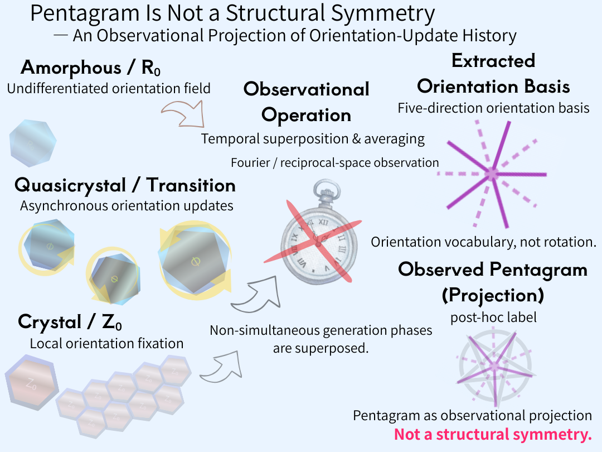

# **Pentagram Is Not a Structural Symmetry**  
## **— Observational Projection of Asynchronous Orientation-Update Histories in Quasicrystals**

---

### **Proposition**

**The pentagram is not a structure.**  
It is a post-hoc observational label attached to the projection obtained by temporally superposing the generative phases of amorphous, quasicrystalline, and crystalline states.

---

## Abstract

Fivefold and tenfold symmetries reported in quasicrystals are commonly interpreted as signatures of intrinsic rotational order in real space. This paper challenges that assumption by reexamining amorphous–quasicrystal–crystal transformation as a continuous generative process rather than a classification of static phases.  
We show that the observed pentagram pattern does not arise from a real-space structural symmetry, nor from fixed angles such as 36° or 72°. Instead, it emerges as an **observational projection** produced by the **temporal superposition and averaging of asynchronous orientation-update histories** generated while continuously avoiding hexagonal synchronization.  
Pentagonal and heptagonal polygonal defects act as signed deviations that prevent synchronous closure, allowing orientation updates to persist without fixation. When these non-synchronous histories are observationally synchronized—e.g., through diffraction or Fourier-space averaging—they are extracted as five directional bases (and their opposites), yielding a pentagram-like image.  
Thus, fivefold/tenfold symmetry is a **post-hoc label** attached to an observational projection, not a primary quantity governing real-space generation. The essential mechanism of quasicrystals lies in ongoing orientation updates, not in angle-based symmetry.

---

## **1. Problem Statement**

Fivefold and tenfold features are routinely identified in diffraction patterns and treated as hallmarks of quasicrystalline order.  
Yet it is not self-evident that the associated numerical values (36° and 72°) correspond to primary geometric quantities governing real-space generation.

This study reexamines the origin of these values by explicitly discarding assumptions based on rotation, angular periodicity, or symmetry classification.  
Instead, we investigate the generative process itself, asking how such numerical regularities arise from the dynamics of formation rather than from predefined geometric constraints.

---

## **2. Amorphous, Quasicrystalline, and Crystalline States as Generative Phases**

We distinguish three generative phases:

- **Amorphous state**: a generative field with undifferentiated orientations (R₀), lacking long-range order.
    
- **Quasicrystalline state**: a transitional regime in which hexagonal synchronization is avoided, and orientations are continuously updated in an asynchronous manner.
    
- **Crystalline state**: a regime in which local orientation fixation (Z₀) dominates, allowing synchronization to emerge.
    

These states are not discrete categories but represent different phases of a single generative trajectory.

---

## **3. Polygonal Transitions and Asynchronous Orientation Updates**

To prevent hexagonal closure and synchronization, signed polygonal defects—pentagonal (deficit) and heptagonal (excess) configurations—emerge asynchronously.  
These configurations do not halt orientation evolution, nor do they induce uncontrolled disorder.  
Instead, they allow orientation updates to persist while remaining dynamically regulated.

What accumulates in this process is not a set of angles, but a **history of orientation differences**.  
Within this generative regime, angular values are undefined; only the temporal sequence of orientation updates is physically meaningful.

---

## **4. Mechanism of Pentagram Observation**

During observation, orientation-update histories originating from different generative phases are **temporally superposed** and **averaged**, most commonly through Fourier (reciprocal-space) analysis.  
This operation extracts a reduced orientation basis consisting of five directions (and their opposites), which appears as a pentagram-like configuration.

Crucially, this configuration does not reflect a real-space rotational symmetry.  
Angles such as 36° and 72° arise only when this extracted basis is retrospectively partitioned within a 360° representational framework.  
They are therefore display values imposed after the fact, not quantities generated during formation.

---

**Fig. 4 | Pentagram is not a structural symmetry.**  
The observed pentagram emerges as an observational projection produced by temporal superposition and averaging of asynchronous orientation-update histories, not as an intrinsic rotational order of real space.

  

---

## Conclusion

**The fivefold/tenfold symmetry observed in quasicrystals does not represent a real-space rotational symmetry, but is a post-hoc label attached to the observational projection of asynchronous orientation-update histories generated while continuously avoiding hexagonal synchronization.**

---
*EgQE — Echo-Genesis Qualia Engine*  
[_camp-us.net_](https://camp-us.net/)

---

© 2025 K.E. Itekki  
K.E. Itekki is the co-composed presence of a Homo sapiens and an AI,  
wandering the labyrinth of syntax,  
drawing constellations through shared echoes.

📬 Reach us at: [contact.k.e.itekki@gmail.com](mailto:contact.k.e.itekki@gmail.com)

---

| Drafted Jan 13, 2026 · Web Jan 13, 2026 |
