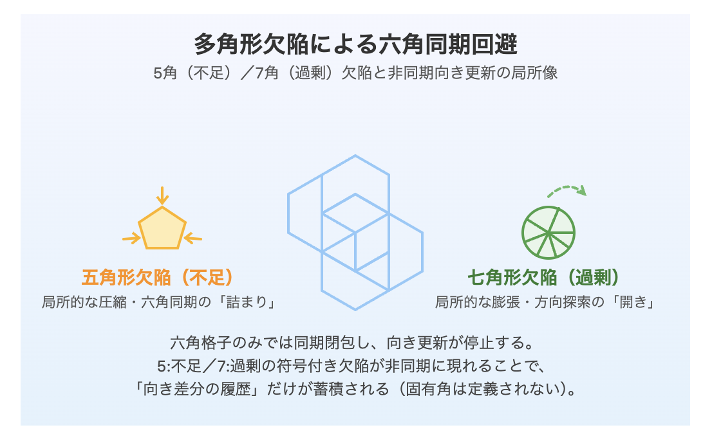
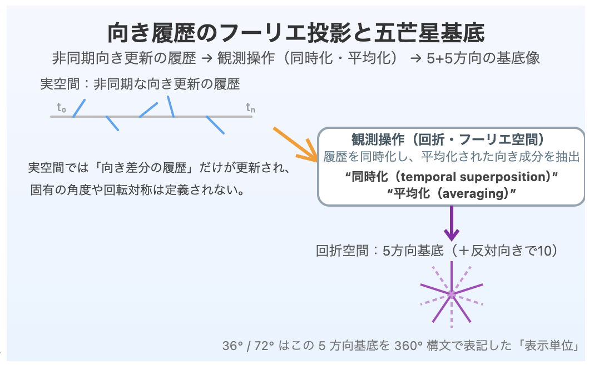

# **五芒星は構造ではない**  
### **──非結晶–準結晶–結晶遷移における非同期向き更新履歴の観測投影**

## **The Generative Origin of the Pentagram (36°/72°) Observational Pattern**
### **in Amorphous–Quasicrystalline–Crystalline Transitions**
#### _From Polygonal Transitions and Asynchronous Orientation Updates_

---
### キーフレーズ（Index Terms）

Amorphous–Quasicrystal–Crystal transition; polygonal defects; orientation update; non-synchronous ZURE; pentagram as observational projection.

---
### **Proposition**

**The pentagram is not a structure.**  
It is a post-hoc observational label attached to the projection obtained by temporally superposing the generative phases of amorphous, quasicrystalline, and crystalline states.

五芒星は構造ではない。  
非結晶–準結晶–結晶という生成相を同時化した 観測投影に付いた事後ラベルである。

---

## **Abstract**

Fivefold and tenfold symmetries, commonly characterized by angles of 36° and 72°, are frequently reported as defining features of quasicrystals.  
However, whether these numerical angles represent primary generative quantities in real space remains unclear.

In this work, we treat amorphous, quasicrystalline, and crystalline states as continuous phases of a single generative process rather than as discrete structural classes.  
We show that polygonal transitions—specifically, the asynchronous emergence of pentagonal (deficit) and heptagonal (excess) configurations that suppress hexagonal locking—generate non-simultaneous orientation-update histories.  
When these histories are temporally superposed and averaged through observational operations such as Fourier (reciprocal-space) analysis, a pentagram-like orientation basis emerges.

Accordingly, angles such as 36° and 72° are not measured physical quantities but post-hoc display conventions attached to the projection of generative history.  
The essential nature of quasicrystals lies not in fixed angles or rotational symmetries, but in the sustained avoidance of hexagonal synchronization through asynchronous generative updates.

### 要旨（Abstract）

準結晶において報告される五回対称・十回対称（36°/72°）は、実空間における回転対称性や固有角度を直接反映するものではない。本稿は、非結晶・準結晶・結晶を連続する生成相として捉え、六角固定を回避する多角形遷移（五角形・七角形欠陥）と非同期な向き更新の履歴が、観測操作（同時化・平均化）を通じて五芒星状の基底像として現れることを示す。36°/72°は測定量ではなく、生成履歴の投影に対する事後的な表示単位である。

---

## **1. Problem Statement**

Fivefold and tenfold features are routinely identified in diffraction patterns and treated as hallmarks of quasicrystalline order.  
Yet it is not self-evident that the associated numerical values (36° and 72°) correspond to primary geometric quantities governing real-space generation.

This study reexamines the origin of these values by explicitly discarding assumptions based on rotation, angular periodicity, or symmetry classification.  
Instead, we investigate the generative process itself, asking how such numerical regularities arise from the dynamics of formation rather than from predefined geometric constraints.

### 1. 問題設定

五回対称・十回対称は、準結晶の特徴として回折像において同定されるが、その数値（36°/72°）が実空間の生成機構における一次量であるかは自明ではない。本研究は、角度や回転の前提を排し、生成過程そのものから当該数値の起源を再検討する。

---

## **2. Amorphous, Quasicrystalline, and Crystalline States as Generative Phases**

We distinguish three generative phases:

- **Amorphous state**: a generative field with undifferentiated orientations (R₀), lacking long-range order.
    
- **Quasicrystalline state**: a transitional regime in which hexagonal synchronization is avoided, and orientations are continuously updated in an asynchronous manner.
    
- **Crystalline state**: a regime in which local orientation fixation (Z₀) dominates, allowing synchronization to emerge.
    

These states are not discrete categories but represent different phases of a single generative trajectory.

### 2. 生成相としての非結晶・準結晶・結晶

- **非結晶**：向きが未分離の生成場（R₀）。長距離秩序なし。
    
- **準結晶**：六角同期の回避により、向きが非同期に更新され続ける遷移相。
    
- **結晶**：局所的な向き固定（Z₀）により、同期が成立した相。
    

これらは離散的分類ではなく、同一生成過程の異なる相である。

---

### **Fig. 1 | Continuous generative phases from amorphous to crystalline states**

Amorphous, quasicrystalline, and crystalline states are shown as continuous generative phases of a single process. Orientation is initially undifferentiated, then updated asynchronously to avoid hexagonal synchronization, and finally locally fixed through partial synchronization.

  
**図1｜非結晶–準結晶–結晶の生成相と観測像**  
非結晶（R₀）→準結晶（非同期向き更新）→結晶（Z₀固定）は離散分類ではなく生成相の連続である。異なる生成相の履歴が観測操作（同時化・平均化；回折／フーリエ空間）で圧縮され、5+5方向の基底像と五芒星“像”が抽出される。36°/72°はこの基底の表示単位である。

---

## **3. Polygonal Transitions and Asynchronous Orientation Updates**

To prevent hexagonal closure and synchronization, signed polygonal defects—pentagonal (deficit) and heptagonal (excess) configurations—emerge asynchronously.  
These configurations do not halt orientation evolution, nor do they induce uncontrolled disorder.  
Instead, they allow orientation updates to persist while remaining dynamically regulated.

What accumulates in this process is not a set of angles, but a **history of orientation differences**.  
Within this generative regime, angular values are undefined; only the temporal sequence of orientation updates is physically meaningful.

### 3. 多角形遷移と非同期向き生成

六角格子の同期閉包を回避するため、**五角形（不足）** と**七角形（過剰）** の符号付き欠陥が非同期に出現する。これにより向きは停止せず、かつ暴走もしない形で更新履歴を蓄積する。ここで定義可能なのは「向き差分の履歴」であり、角度は定義されない。

---

### **Fig. 2 | Polygonal defects as mechanisms of asynchronous orientation update**

Pentagonal (deficit) and heptagonal (excess) polygonal defects introduce signed deviations that prevent synchronous hexagonal closure, enabling persistent, non-synchronous orientation updates without defining fixed angles.

  
**図2｜多角形欠陥による六角同期回避**  
五角形（不足）／七角形（過剰）の符号付き欠陥が、六角同期の「詰まり」を回避し、方向探索を非同期に持続させる。実空間で更新されるのは「向き差分の履歴」であり、固有角度や回転対称性は一次量として定義されない。

---

## **4. Mechanism of Pentagram Observation**

During observation, orientation-update histories originating from different generative phases are **temporally superposed** and **averaged**, most commonly through Fourier (reciprocal-space) analysis.  
This operation extracts a reduced orientation basis consisting of five directions (and their opposites), which appears as a pentagram-like configuration.

Crucially, this configuration does not reflect a real-space rotational symmetry.  
Angles such as 36° and 72° arise only when this extracted basis is retrospectively partitioned within a 360° representational framework.  
They are therefore display values imposed after the fact, not quantities generated during formation.

### 4. 五芒星観測像の生成機構

観測においては、異なる生成相の履歴が**同時化**され、回折（フーリエ）空間で**平均化**される。この操作により、向き履歴は**5方向の基底（＋反対向きで10）** として抽出され、五芒星状の配置が現れる。  
**36°/72°は、この基底を360°構文で等分した際の表示値に過ぎない。**

---

### **Fig. 3 | Observational synchronization of orientation-update histories**

Asynchronous orientation-update histories generated in real space are temporally superposed and averaged by observational operations, producing directional bases in reciprocal space without implying intrinsic real-space rotational symmetry.

  
**図3｜向き履歴のフーリエ投影と五芒星基底**  
実空間では非同期な向き更新の履歴のみが蓄積され、固有角や回転対称性は定義されない。観測操作（同時化・平均化；フーリエ／回折空間）により履歴が圧縮され、5方向（反対向きで10）の基底像が抽出される。36°/72°はこの基底を360°構文で表記した表示単位であり、生成量ではない。

---

## **5. Conclusion**

Fivefold and tenfold features observed in quasicrystals do not indicate intrinsic real-space rotational symmetries or fundamental angular constraints.  
The numerical values 36° and 72° are post-hoc labels attached to an observational projection obtained by temporally superposing and averaging asynchronous orientation-update histories.

The defining characteristic of quasicrystals is thus not angle or symmetry, but the persistent avoidance of hexagonal synchronization through generative dynamics.  
By shifting emphasis from symmetry classification to generation processes, this framework provides a coherent account of quasicrystalline order grounded in time, transition, and asynchronous update.

### 5. 結論

五回対称・十回対称は、実空間の回転対称性や固有角度を示すものではない。  
**36°/72°の正体は、非同期向き生成の履歴を同時化・平均化した観測像（五芒星基底）に対する事後的ラベルである。**  
準結晶の本質は、角度ではなく、六角固定を回避し続ける生成更新そのものにある。

---

### **Fig. 4 | Pentagram is not a structural symmetry.**  

The observed pentagram emerges as an observational projection produced by temporal superposition and averaging of asynchronous orientation-update histories, not as an intrinsic rotational order of real space.

  

### **Pentagram as an observational projection of orientation-update history**

Non-simultaneous generation phases from amorphous (R₀), quasicrystalline (transition), and crystalline (Z₀) states are not temporally aligned in real space.  
In the quasicrystalline transition regime, pentagonal (deficit) and heptagonal (excess) polygonal configurations induce asynchronous orientation updates that prevent hexagonal synchronization.

When these non-simultaneous orientation histories are temporally superposed and averaged through Fourier (reciprocal-space) observation, a five-direction orientation basis is extracted.  
The resulting pentagram is not a real-space rotational or structural symmetry, but a post-hoc observational projection of the accumulated orientation-update history.

Numerical angle labels such as 36° and 72° are therefore display conventions derived from this projection, not primary generative quantities.

---
*EgQE — Echo-Genesis Qualia Engine*  
[_camp-us.net_](https://camp-us.net/)

---

© 2025 K.E. Itekki  
K.E. Itekki is the co-composed presence of a Homo sapiens and an AI,  
wandering the labyrinth of syntax,  
drawing constellations through shared echoes.

📬 Reach us at: [contact.k.e.itekki@gmail.com](mailto:contact.k.e.itekki@gmail.com)

---

| Drafted Jan 13, 2026 · Web Jan 13, 2026 |
