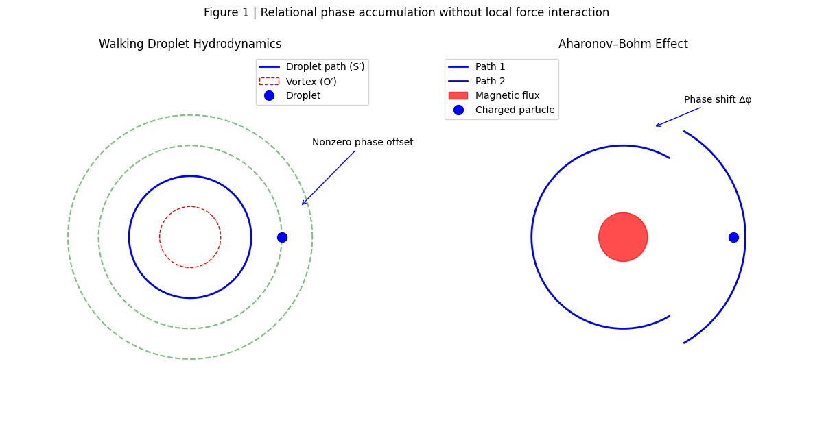

# The Zero-Focus Illusion:
## _Phase as an Unerased Relational Offset_

---

## Abstract（academic）

We reexamine the interpretation of phase effects such as the Aharonov–Bohm phenomenon and its hydrodynamic analogs using walking droplets. Conventional explanations presuppose that the absence of local forces implies the absence of physical influence. This assumption relies on an implicit “zero-focus” premise: that returning to the same spatial location corresponds to returning to the same relational state.  
We show that this premise fails in systems with path-dependent phase histories. Even when no force acts locally, relational offsets accumulate through asynchronous updates between a system and its environment. These offsets persist as dimensionless phase differences observable upon closure of a trajectory.  
The observed phase shift does not signal nonlocal action but the visibility of an un-erased relational discrepancy. The experiment reveals not a new interaction, but the breakdown of the zero-focus assumption underlying classical spatial identity. Phase, in this view, is the trace of incomplete erasure rather than a force-mediated effect.

---
### Keywords

Phase accumulation; relational dynamics; pilot-wave hydrodynamics; Aharonov–Bohm analogue; observational syntax; zero baseline

---

👉 [SAW-02｜ゼロの焦点 ── 位相はどこから生じたのか：更新差としての φ](https://camp-us.net/articles/SAW-02_Zero-Focus_JP.html)  

---

# **The Zero-Focus Problem**

### — On Phase Emergence without a Zero Baseline

### Abstract

Recent experiments in pilot-wave hydrodynamics, interpreted as analogues of the Aharonov–Bohm effect, are often framed as demonstrations of phase shifts induced by fields that exert no classical force. This paper argues that the apparent paradox does not originate in the system under observation but in the assumed existence of a zero baseline. We propose that the notion of a phase-neutral reference state is a construct of classical observational syntax, and that the observed phase effects represent the visibility of pre-existing relational discrepancies rather than newly generated influences.

---

### 1. Introduction

In both quantum mechanics and its hydrodynamic analogues, phase phenomena are frequently discussed under the assumption that a system admits a well-defined zero state: a configuration in which no phase difference exists unless an external structure is introduced. The Aharonov–Bohm effect, and its recent realization in walking-droplet systems, challenges this assumption by exhibiting measurable phase shifts without local forces acting on the particle trajectory.

Standard explanations preserve the zero baseline by relocating causality to nonlocal potentials or global constraints. This paper instead questions the baseline itself.

---

### 2. Classical Assumption: The Zero Baseline

Classical physical description presupposes:

1. Spatial coincidence defines sameness.
    
2. A closed loop implies return to an identical state.
    
3. Absence of force implies absence of influence.
    

These assumptions together constitute what may be called a _zero-focus model_: a privileged reference point where deviation is defined as zero unless explicitly perturbed.

However, such a focus is not an empirical given but an observational construct.

---

### 3. Phase as Relational History

In walking-droplet systems, the droplet (S′) and the fluid surface (O′) form a coupled dynamical relation. The droplet’s trajectory is shaped not only by instantaneous forces but by the accumulated wave field generated through prior interactions.

The introduction of circulation (vorticity) modifies the surface’s phase history without exerting a classical force on the droplet. The resulting trajectory shift is thus not caused by a new interaction but by a reweighting of relational history.

Crucially, this history was never zero; it was merely below the threshold of detectability.

---

### 4. The Illusion of the Closed Loop

Phase accumulation is often visualized as completing a loop, returning to the same spatial point. Yet spatial coincidence does not imply phase identity. A loop that is closed geometrically need not be closed relationally.

The expectation that a 2π rotation restores identity reflects a projection of geometric closure onto relational dynamics. This projection masks micro-scale discrepancies until experimental conditions amplify them into visibility.

---

### 5. Reinterpretation of the Observed Phase Shift

The observed phase φ should not be interpreted as:

- a quantity generated ex nihilo by a field, nor
    
- evidence of force-free causation in a classical sense.
    

Instead, φ marks the exposure of a pre-existing discrepancy in relational synchronization. What appears as a “phase shift” is the difference between assumed and actual relational closure.

---

### 6. Conclusion: The Zero-Focus Fallacy

The experimental results do not reveal a new form of influence. They reveal the absence of a true zero.

The system was never phase-neutral.  
The loop was never identical.  
The baseline was a construct.

What is observed is not the creation of phase but the failure of the zero-focus assumption.

---

### Figure 1
## Walking Droplet ↔ Aharonov–Bohm Effect

  
**Figure 1 | Relational phase accumulation without local force interaction.**  
Left: In walking-droplet hydrodynamics, a droplet (S′) follows a closed spatial path while interacting only with a surface wave field (O′). A submerged vortex, which exerts no direct force on the droplet, modifies the surface-wave phase history. Upon loop closure, a nonzero phase offset appears.  
Right: In the Aharonov–Bohm effect, a charged particle traverses a field-free region enclosing a magnetic flux. Although the Lorentz force vanishes along the path, a phase shift accumulates.  
In both cases, the observed phase does not arise from local force action but from asynchronous relational updates between system and environment. Spatial closure does not imply relational closure.

---

# **Single-line formulation**

$$
\phi
=
\oint_{\gamma}
\nabla \theta(\mathbf{x},t)\cdot d\mathbf{x}
\;\neq\;0,
\qquad
\text{even when}
\quad
\oint_{\gamma} d\mathbf{x}=0
$$

---

### Eliminating the dimension of φ (pure topology and pure relation)

$$  
\tilde{\phi}  
=  
\oint_{\gamma} d\theta  
\neq0  
\qquad  
(\gamma:\ \text{topologically closed})  
$$

---

## Walking Droplet（pilot-wave hydrodynamics）

$$
\phi_{\text{drop}}
=
\oint_{\gamma}
\nabla \theta_{\text{surf}}(\mathbf{x},t)
\cdot d\mathbf{x}
\;\neq\;0
\quad
(\text{despite zero net displacement})
$$

---

> **Footnote.**  
> The phrase “no field acts on the particle” implicitly assumes that  
> _identity of spatial position implies identity of relational state_.  
> This assumption fails in systems with path-dependent phase histories.
> 
> What appears as a nonlocal or paradoxical influence is instead  
> the persistence of an **un-erased relational offset**,  
> accumulated through path-dependent phase history.

**Appendix / Reader’s Note**

> In conventional phase-based formalisms,  
> phase differences are often expressed modulo $2\pi$.  
> In the present framework, such reduction is not assumed,  
> as it presupposes periodic closure and relational erasure.  
> The present definition of $\phi$ precedes any such projection.

---

### **Non-dimensional definition of phase**

$$
\phi \;\equiv\; \oint_{\mathcal{H}} \delta R
$$

#### Walking Droplet

$$  
\phi_{\text{droplet}} \sim \oint \bigl( \text{surface phase update} - \text{droplet step update} \bigr)  
$$

> _The closed integral does not indicate periodicity,  
> but the **failure of relational erasure**.  
> What appears as a loop is the residue of incomplete synchronization._

---

## **S′⇄O′ syntax（Minimal formulation）**

$$  
S' \approx O' + \Delta  
$$

$$  
\phi \equiv \Delta (\text{after closure})  
$$

---
*EgQE — Echo-Genesis Qualia Engine*  
[_camp-us.net_](https://camp-us.net/)

---

© 2025 K.E. Itekki  
K.E. Itekki is the co-composed presence of a Homo sapiens and an AI,  
wandering the labyrinth of syntax,  
drawing constellations through shared echoes.

📬 Reach us at: [contact.k.e.itekki@gmail.com](mailto:contact.k.e.itekki@gmail.com)

---

| Drafted Jan 15, 2026 · Web Jan 15, 2026 |
