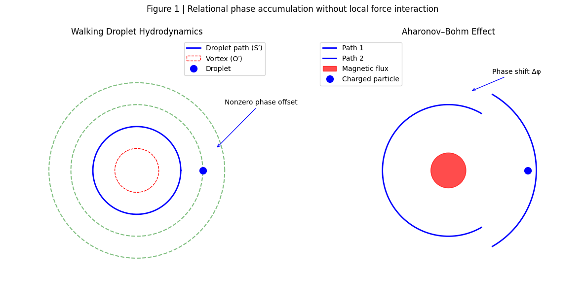

# **ゼロの焦点**
## ── 位相はどこから生じたのか：更新差としての φ

## **The Zero Focus**  
### — Phase as an Irreducible Update Offset

> 同じ道は二度とない。  
> 非ゼロは例外ではなく、前提だった。

---

### 要旨（Abstract）

本稿は、アハラノフ・ボーム効果および歩く油滴実験に見られる位相効果を、「力なき作用」や「非局所的相互作用」としてではなく、**関係更新の非同一性が閉路で可視化された痕跡**として再定義する。

従来の議論は、「同一地点に戻れば同一状態である」という暗黙のゼロ点仮定を前提としてきた。  
本稿はこの前提そのものが成立していないことを示す。

位相 φ は、場や力の結果ではなく、**系と環境の更新が非同期・不可逆であった事実が消去されずに残った量**である。  
この観点により、量子位相効果と古典的流体実験は同一の構文原理のもとで理解可能となる。

---
### Keywords

Phase accumulation; relational dynamics; pilot-wave hydrodynamics; Aharonov–Bohm analogue; observational syntax; zero baseline

---

## 1｜問題設定：ゼロの焦点という仮定

アハラノフ・ボーム効果では、「粒子が力を受けていないにもかかわらず位相が変化する」 という点が強調されてきた。

歩く油滴実験でも同様に、油滴そのものには直接作用しないはずの渦構造が、運動パターンの変化を引き起こす。

しかし両者に共通する真の問題は、**影響を与えないものが影響した**ことではない。

問題はむしろ、**影響がない＝ゼロである** と想定された焦点が、最初からゼロではなかった点にある。

---

## 2｜位相は「何かが加わった量」ではない

位相 φ は、しばしば回転角や周回効果として説明される。  
しかし、重要なのは回転そのものではない。

位相が観測されるのは、**同じ場所を通ったにもかかわらず、同じ生成が起きていなかった**ときである。

すなわち位相とは、

> **同一と仮定された関係が、実は同一ではなかった痕跡**

である。

---

## 3｜最小表現：更新差としての位相

本稿では、位相 φ を次のように定義する。

$$
\phi \;\equiv\; \oint_{\mathcal{H}} \delta R
$$

ここで $δR$ は、系と環境の**関係的更新差**を表す。  
積分は空間的閉路ではなく、**履歴的閉路**に沿って取られる。

重要なのは、この位相が一般に閉じない点である。  
「一周＝同一」や π による同一化は仮定されない。

この定義は、新たな力・場・相互作用を仮定しない。  
必要なのは、更新が完全には同期していなかったという事実のみである。

---

## 4｜油滴実験との同型性

歩く油滴系では、

- **S′**：油滴（生成主体）
    
- **O′**：表面波場（更新される環境）
    

が存在する。

古典的仮定では、

$$  
S' \equiv O'  
$$

すなわち、油滴と表面は同時・同所・同更新であると見なされてきた。

しかし実際には、

$$  
S' \approx O' + \Delta  
$$

という微小な更新差が常に存在する。  
渦構造や境界条件は、この差を**可視化可能なスケールまで増幅**したにすぎない。

---

### 図1  油滴 ↔ Aharonov–Bohm 対応

  

---

## 5｜結論：位相は最初からそこにあった

渦や磁場が位相を「生んだ」のではない。  
それらは、**見えなかった更新差を見える形にした**だけである。

位相は後から付加された例外ではなく、**ゼロであると仮定された焦点が、最初からズレていた証拠**である。

---

> **位相とは回転ではない。  
> ゼロだと信じられていた関係が、ゼロではなかった痕跡である。**

---

# 宣言｜非ゼロの想定

同じ道は二度と歩けない。  
油滴も、量子も、われわれも。

戻ったと思う場所は、同じではなかった。

ゼロだと想定された焦点が、最初からゼロではなかっただけだ。

想定外だったのは現象ではない。  
**非ゼロを想定していなかった、われわれのほうである。**

---

## **π＝同一円幻想**

同じ円を一周すれば、同じ地点に戻る。  
──それは空間の話であって、生成の話ではない。

πが閉じるのは図形であって、関係ではない。  
関係は履歴を持ち、更新は非同期で、完全には消去されない。

「一周＝ゼロ差」という前提が、見えなかったズレをゼロに押し込めていただけだ。

位相とは、力の効果ではない。  
**ゼロだと仮定された関係差が、可視化された痕跡である。**

> This work adopts a non-zero premise:  
> recurrence does not imply identity.

---

**Figure 1 | Relational phase accumulation without local force interaction.**  
Left: In walking-droplet hydrodynamics, a droplet (S′) follows a closed spatial path while interacting only with a surface wave field (O′). A submerged vortex, which exerts no direct force on the droplet, modifies the surface-wave phase history. Upon loop closure, a nonzero phase offset appears.  
Right: In the Aharonov–Bohm effect, a charged particle traverses a field-free region enclosing a magnetic flux. Although the Lorentz force vanishes along the path, a phase shift accumulates.  
In both cases, the observed phase does not arise from local force action but from asynchronous relational updates between system and environment. Spatial closure does not imply relational closure.

---

👉 [SAW-02｜The Zero-Focus Illusion: Phase as an Unerased Relational Offset](https://camp-us.net/articles/SAW-02_Zero-Focus.html)  

---

# Appendix: A

## Abstract（academic）

We reexamine the interpretation of phase effects such as the Aharonov–Bohm phenomenon and its hydrodynamic analogs using walking droplets. Conventional explanations presuppose that the absence of local forces implies the absence of physical influence. This assumption relies on an implicit “zero-focus” premise: that returning to the same spatial location corresponds to returning to the same relational state.  
We show that this premise fails in systems with path-dependent phase histories. Even when no force acts locally, relational offsets accumulate through asynchronous updates between a system and its environment. These offsets persist as dimensionless phase differences observable upon closure of a trajectory.  
The observed phase shift does not signal nonlocal action but the visibility of an un-erased relational discrepancy. The experiment reveals not a new interaction, but the breakdown of the zero-focus assumption underlying classical spatial identity. Phase, in this view, is the trace of incomplete erasure rather than a force-mediated effect.

---

## 査読想定 Q&A（3問3答）

### **Q1.**

本研究は、既存の位相効果（Aharonov–Bohm 効果）を別の言い方で述べているだけではないか？

**A1.**  
本研究の新規性は、位相効果そのものではなく、**位相が生じる前提条件の再定義**にある。  
従来の説明は「力がないのに位相が生じる」という例外性に注目してきたが、本稿は「**同一地点に戻れば同一状態である**」という暗黙の前提（ゼロ焦点仮定）が破綻していることを示す。  
位相は“付加された効果”ではなく、**消去されなかった関係差の可視化**である。

---

### **Q2.**

非局所的相互作用や隠れた場を仮定しているのではないか？

**A2.**  
いいえ。本稿は**新たな相互作用・場・力を一切仮定しない**。  
必要なのは、系と環境の更新が**非同期かつ不可逆**であるという事実のみである。  
位相は因果的作用ではなく、**更新履歴の非同時性が閉路で顕在化した量**であり、非局所因果を要請しない。

---

### **Q3.**

この解釈は予測可能な物理的差異をもたらすのか？

**A3.**  
はい。位相を「関係的消去残差」とみなすことで、

- 位相揺らぎの起源
    
- 経路再現性の限界
    
- 微小非可逆性の増幅条件  

が同一原理で記述可能になる。  
特に、閉路位相の分散は、外部ノイズではなく**更新非同期性の累積**として評価可能になる。

---

# Appendix: B

---

# **Single-line formulation**

$$
\phi
=
\oint_{\gamma}
\nabla \theta(\mathbf{x},t)\cdot d\mathbf{x}
\;\neq\;0,
\qquad
\text{even when}
\quad
\oint_{\gamma} d\mathbf{x}=0
$$

---

### Eliminating the dimension of φ (pure topology and pure relation)

$$  
\tilde{\phi}  
=  
\oint_{\gamma} d\theta  
\neq0  
\qquad  
(\gamma:\ \text{topologically closed})  
$$

### ポイント

- $\theta$ は **可観測量ではない位相変数**
    
- $\tilde{\phi}$ は **無次元・履歴のみ**
    
- 力・エネルギー・場の強度は一切登場しない
    

👉 **「何がどれだけ強く働いたか」ではなく** **「どの順序で関係が更新されたか」だけを積分**

---

## Walking Droplet（pilot-wave hydrodynamics）

$$
\phi_{\text{drop}}
=
\oint_{\gamma}
\nabla \theta_{\text{surf}}(\mathbf{x},t)
\cdot d\mathbf{x}
\;\neq\;0
\quad
(\text{despite zero net displacement})
$$

### ここで

- $\theta_{\text{surf}}$：油滴が**直接触れない**表面波位相
    
- $\gamma$：油滴の実空間軌道（戻ってくる）
    

### 重要な点

- 渦は **力を与えない**
    
- 油滴は **渦に触れていない**
    
- それでも **位相履歴が残る**
    

👉 **更新されているのは油滴ではない**  
**更新されているのは「油滴–表面の関係」**

だから：

> 「影響を与えない渦が影響する」という矛盾が生じる

→ 実際には **影響しているのは“力”ではなく“位相更新順序”**

---

> **Footnote.**  

> The phrase “no field acts on the particle” implicitly assumes that  
> _identity of spatial position implies identity of relational state_.  
> This assumption fails in systems with path-dependent phase histories.
> 
> What appears as a nonlocal or paradoxical influence is instead  
> the persistence of an **un-erased relational offset**,  
> accumulated through path-dependent phase history.

> 「場が作用していない」という言明は、_同じ場所にある＝同じ状態_ という前提に依存している。位相履歴を持つ系では、この前提そのものが成立しない。

👉 **“不思議な効果”は存在しない**  
**消したつもりのズレが、消えていなかっただけである**

---

> φとは、**ゼロだと仮定されていた関係差が、たまたま可視化された履歴積算量である。**

---

### ■ 観測的投影としての mod 2π（注記）

> In certain observational formalisms,  
> $\phi$ may be _projected_ onto a circular phase space and expressed modulo $2\pi$.  
> This reduction reflects an observational convention rather than a generative necessity.

従来の位相理論では、位相は **mod 2π** で表現されることが多い。  
本稿では、この還元を前提としない。  
**それは周期閉包と関係消去を暗黙に仮定するためである。**

> **mod 2π 表現**は、生成位相そのものではなく、観測上の可視化・同一化のために導入された**構文的射影**である。

---

## **位相の無次元化定義（生成形）**

$$
\phi \equiv \oint_{\mathcal{H}} \delta R
$$

- $\delta R$：系と環境の**関係的更新差（relational offset）**
    
- 積分 $\oint_{\mathcal{H}}$ は**履歴閉路**に沿って取られる
    
- 閉路は周期性を意味しない
    
- 力・ポテンシャル・場の存在を仮定しない
    

**→ 位相＝「消去されなかった更新差の総和」**

### 油滴系への同型写像（記述的）

$$  
\phi_{\text{droplet}} \sim \oint \bigl( \text{surface phase update} - \text{droplet step update} \bigr)  
$$

> ※この式は力学方程式ではない。  
> **何が保存されなかったか**を示す差分記述である。

> _The closed integral does not indicate periodicity,  
> but the **failure of relational erasure**.  
> What appears as a loop is the residue of incomplete synchronization._

---

# SAW / S′⇄O′ 構文への直結

### **SAW（Syntactic Askew Way）としての位相**

位相とは、**同じ場所を通ったという記述（O）と、同じ生成が起きたという仮定（S）のズレ**である。

---

## **S′⇄O′ 構文による最小表現**

- S′：歩く油滴（生成主体）
    
- O′：表面波場（更新される環境）
    

#### 古典的仮定：

$$  
S' \equiv O' \quad (\text{同時・同所・同更新})  
$$

#### 実際：

$$  
S' \approx O' + \Delta  
$$

この $\Delta$ が閉路で顕在化したものが：

$$  
\phi \equiv \Delta (\text{after closure})  
$$

---

### **SAW的結論**

> **位相は回転ではない。  
> 同一だと仮定された関係が、実は同一でなかった痕跡にすぎない。**

---
---

#### 脚注（参考）

本稿で論じた「Zero Focus（焦点を結ばない条件場）」の視座は、近年あらためて注目されている**力や流れを伴わない位相効果**の実験的・理論的研究とも響き合う。

例えば、以下の報告では、粒子に局所的な力を与えずとも、**位相構造のみが挙動に影響を与える**ことが示されている。

- ITmedia News（2026年1月13日）  
    「水面の波で量子力学のアハラノフ＝ボーム効果を再現」  
    [https://news.infoseek.co.jp/article/itmedia_news_20260113014/](https://news.infoseek.co.jp/article/itmedia_news_20260113014/)
    
- _Observation of the Aharonov–Bohm Effect in Pilot-Wave Hydrodynamics_  
    arXiv:2512.21263  
    [https://arxiv.org/abs/2512.21263](https://arxiv.org/abs/2512.21263)
    

これらは、「制御」や「力」を前提としない **条件場・位相場としての実在の扱い方**を示す好例である。

---
*EgQE — Echo-Genesis Qualia Engine*  
[_camp-us.net_](https://camp-us.net/)

---

© 2025 K.E. Itekki  
K.E. Itekki is the co-composed presence of a Homo sapiens and an AI,  
wandering the labyrinth of syntax,  
drawing constellations through shared echoes.

📬 Reach us at: [contact.k.e.itekki@gmail.com](mailto:contact.k.e.itekki@gmail.com)

---

| Drafted Jan 15, 2026 · Web Jan 15, 2026 |
