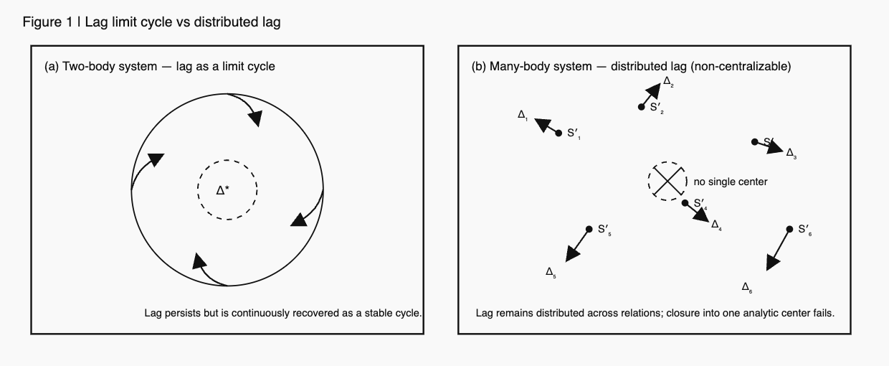

# **Why Falling Is Easy but Standing Is Not**
## — _Lag, Gravity, and the Zero Illusion of Classical Physics_

> _Syntactic Askew Way (SAW)_ reframes physics by treating lag as an inevitable feature of relational generation. Falling appears simple because lag can be released, while standing is difficult because lag must be sustained. The two-body problem was never truly solved; its lag merely condenses into a limit cycle. The many-body problem failed not due to complexity, but because it sought a nonexistent center of lag. SAW introduces no new forces, only a refusal to erase lag.

### **Abstract**

We propose _Syntactic Askew Way (SAW)_ as a minimal reorientation of physical description based on the inevitability of lag in relational systems. Rather than introducing new forces or entities, SAW treats non-synchronizability as a constitutive condition of generation. Classical mechanics successfully describes falling motion because lag can be released, but fails to account for standing and stability, where lag must be continuously held.

Within this framework, gravity is not interpreted as attraction but as the persistence of unrecoverable lag, while weight emerges only under conditions requiring support. The two-body problem appears solvable not because lag vanishes, but because it condenses into a stable limit cycle. Conversely, the many-body problem resists closed-form solutions because lag is distributed and lacks a central recovery point.

Measurement, uncertainty, and probabilistic outcomes are reinterpreted as modes of lag inscription and partial erasure. SAW does not claim a theoretical revolution; it merely adopts an askew syntactic stance that reveals structures already present but previously erased.

> _**What distinguished solvability from failure was never dynamics, but the visibility of lag.**_

---

# 1. Introduction — Why Falling Is Easy but Standing Is Not

Classical physics has long treated falling as a paradigmatic example of simplicity.  
A body falls when a force acts upon it; remove resistance, and the motion becomes even simpler.  
Standing, by contrast, is treated as trivial—often ignored, or reduced to a static constraint.

This asymmetry is striking.

Falling is described as a _natural_ motion governed by gravity,  
while standing is treated as an artificial condition imposed by external support.  
Yet from an experiential, physical, and energetic standpoint, the opposite appears to be true:  
falling requires no continuous action, whereas standing does.

A body in free fall requires no maintenance.  
A body that stands must continuously sustain contact, balance, and structural response.  
Standing demands work; falling does not.

This paper takes this asymmetry seriously—not as a psychological intuition,  
but as a structural clue that something fundamental has been misread.

We argue that the difficulty lies not in gravity itself,  
but in the **zero illusion** implicit in classical formulations:  
the assumption that absence of motion, force, or deviation corresponds to a true zero state.

By reinterpreting gravity, motion, and observation through the lens of **lag**—  
understood as irreducible non-synchronization in relational updates—  
we show that falling appears “easy” only because lag is discharged,  
while standing is “hard” because lag must be continuously sustained.

This reorientation does not introduce new forces or entities.  
It merely tilts the syntactic frame through which classical physics has been read.

---

# 2. The Many-Body Problem as a Classical Failure

The many-body problem is often cited as evidence of the inherent complexity of nature.  
Unlike the two-body problem, it is said to resist closed-form solutions,  
exhibiting chaos, sensitivity to initial conditions, and analytical intractability.

Standard explanations attribute this failure to insufficient conserved quantities,  
nonlinear coupling, or exponential growth of degrees of freedom.  
While technically accurate, these explanations presuppose a deeper assumption:  
that a system admits a **central reference frame** in which interactions can be coherently aggregated.

This assumption quietly imports a zero-point structure:

- a center of mass that meaningfully stabilizes description,
    
- a global time parameter that synchronizes evolution,
    
- and a reference state in which relational offsets vanish.
    

In the two-body problem, this assumption appears to hold.  
Relative motion can be reduced to an effective one-body system, and dynamics collapse into a stable, integrable form.

In the many-body case, the same strategy fails.  
No single center absorbs all relational offsets; no unique frame synchronizes all interactions.

From the perspective adopted here, this is not a failure of mathematics nor a manifestation of excessive complexity.  
It is the breakdown of the **zero illusion**.

The many-body problem does not fail because it is too complex.  
It fails because it presupposes a center where **lag should vanish**—  
a center that does not, and cannot, exist.

---

# 3. The Two-Body Problem and the Illusion of Solvability

The two-body problem is commonly regarded as a triumph of classical mechanics.  
Its exact solvability, conservation laws, and closed orbits are taken as evidence that gravitational interaction is fundamentally well understood.

We suggest a different reading.

The two-body problem is not solved in the sense of eliminating lag.  
Rather, lag is rendered **invisible** by being absorbed into a closed, repeating structure.

Orbital motion does not represent perfect synchronization.  
It represents a **limit cycle** in which relational lag neither grows unbounded nor collapses to zero, but circulates.

The appearance of solvability arises because lag is:

- conserved rather than erased,
    
- distributed symmetrically,
    
- and returned to the same relational configuration after each cycle.
    

This creates the illusion of closure: the same orbit, the same period, the same configuration.

But this sameness is syntactic, not generative.

The two-body system does not return to an identical state;  
it returns to a **relationally equivalent inscription** under a projection that ignores irreversible micro-updates.

Thus, the two-body problem was not solved because lag disappeared.  
It was “solved” because lag remained bounded and unread.

The many-body problem, by contrast, exposes what the two-body problem concealed:  
lag has no single center, no privileged frame, and no reason to cancel.

---

# 4. Falling and Supporting — Gravity Is Not Attraction

Classical physics describes gravity as an attractive force acting between masses.  
From this perspective, falling is explained as the result of gravitational pull, and standing is treated as the absence of motion caused by opposing forces.

This description is formally consistent, but conceptually misleading.

If gravity were fundamentally an attraction,  
then the primary question should be why objects _do not_ continuously fall—  
why stable configurations exist at all.  
Yet classical theory inverts this logic: falling is treated as natural, while standing is treated as exceptional.

We propose that this inversion arises from a syntactic confusion  
between **falling** and **supporting**.

---

## 4.1 Falling as Lag Discharge

In the present framework, falling is not the result of an attractive force.  
It is the **release of unresolved lag**.

A body in free fall is not being actively pulled;  
it is undergoing a relational update in which previously accumulated lag is no longer constrained.

When support is removed, the system no longer needs to maintain alignment between competing relational updates (body–surface, body–environment).  
Lag discharges smoothly, and motion follows.

This explains why falling requires no continuous energy input.  
Once released, the system evolves without further maintenance.

Falling is easy because it is **lag relaxation**.

---

## 4.2 Supporting as Continuous Lag Maintenance

Standing, by contrast, is not a static condition.  
It is a **dynamically maintained state** in which lag is continuously prevented  
from discharging.

A body standing on the ground must constantly:

- maintain contact constraints,
    
- distribute internal stresses,
    
- and compensate for irreversible micro-updates in relation to its environment.
    

In classical terms, this is described as “normal force balancing gravity.”  
In the present reading, this balance is secondary.

What is primary is that standing requires **continuous inscription of lag** across the body–surface relation.

This is why standing consumes energy, even in the absence of visible motion.  
Biological organisms fatigue; structures deform; materials creep.  
Standing is costly because lag cannot be erased—it must be held.

---

## 4.3 Gravity Without Attraction

Under this interpretation, gravity does not act as a pulling force.  
It names the structural condition under which lag accumulates when relational updates cannot be synchronized.

“Weight” is not the magnitude of attraction.  
It is the **cost of sustaining unresolved lag** against a supporting structure.

This resolves a long-standing conceptual tension:

- In free fall, gravity appears to vanish.
    
- In standing, gravity appears maximized.
    

Classical physics explains this by invoking reference frames.  
SAW explains it by recognizing that gravity is not a force at all, but a **mode of lag inscription**.

The equivalence principle follows naturally:  
free fall eliminates the need for lag maintenance, making gravitational and inertial states indistinguishable.

---

## 4.4 The Zero Illusion in Gravity

The classical formulation assumes a zero state:

- zero force when forces balance,
    
- zero motion when velocity vanishes,
    
- zero effect when attraction is canceled.
    

But standing is not zero.  
It is a **non-zero process sustained against discharge**.

The illusion of zero arises because lag is rendered invisible when it is continuously compensated.

This is the same illusion that underlies the solvability of the two-body problem and the apparent failure of the many-body problem.

Gravity appears as attraction only because the zero illusion hides the generative cost of standing.

---

## 4.5 Interim Conclusion

Falling is not driven by attraction.  
Standing is not the absence of motion.

Falling is easy because lag is released.  
Standing is difficult because lag must be maintained.

Gravity names this asymmetry—not as a force, but as a **persistent condition of relational non-synchronization**.

---

### **Figure 0｜Lag Topologies Across Physical Descriptions**

```
[ Falling ]
lag → release
↓
(no accumulation)

[ Two-body system ]
lag → limit cycle
↺
(stable orbit)

[ Many-body system ]
lag → distributed
↯ ↯ ↯
(no center)
```

> **Figure 0.**  
> Schematic illustration of lag behavior across physical regimes.  
> Falling corresponds to the release of lag, two-body motion to the condensation of lag into a limit cycle, and many-body systems to the distribution of lag without a central recovery point. No new force is introduced; differences arise solely from how lag is held, released, or dispersed.

---

> **The two-body problem was not solved;  
> the presence of lag was simply rendered invisible.**
> 
> **The many-body problem was not unsolvable;  
> it merely searched for a nonexistent center of lag.**

---

# 5. The Two-Body Problem Revisited

## — Orbit as a Limit Cycle of Lag

Classical mechanics presents the two-body problem as a paradigmatic success.  
Given two masses interacting through an inverse-square force,  
their motion is said to be exactly solvable, yielding closed-form solutions:  
ellipses, parabolas, hyperbolas.

This solvability has long been taken as evidence that the gravitational interaction is fundamentally simple.

We argue that this conclusion is mistaken.

The two-body problem is not solved because gravity is simple.  
It appears solvable because **lag is hidden**.

---

## 5.1 What Was Actually Solved?

The classical two-body solution proceeds by:

1. reducing the system to relative coordinates,
    
2. assuming a conserved center of mass,
    
3. invoking energy and angular momentum conservation,
    
4. and integrating the resulting equations under symmetry assumptions.
    

What this procedure achieves is not the elimination of complexity, but the **absorption of lag into constants of motion**.

Orbital motion appears closed and repeatable because the system settles into a **limit cycle** where lag neither vanishes nor diverges.

This is not the absence of lag.  
It is lag **circulating**.

---

## 5.2 Orbit as Lag Circulation, Not Force Balance

In the classical picture, an orbit is maintained by a balance between:

- gravitational attraction,
    
- and inertial motion.
    

In the SAW reading, this balance is secondary.

An orbit persists because the relational updates between the two bodies fail to synchronize, yet fail to collapse.

Lag accumulates, but not in a linear or explosive manner.  
Instead, it is continuously redistributed along the trajectory.

> An orbit is a **stable circulation of unresolved lag**.

This is why orbital motion is robust under perturbations, yet sensitive to long-term drift.

The orbit is not a static solution.  
It is a **dynamic compromise**.

---

## 5.3 Why Closed Orbits Appear Closed

Classical mechanics emphasizes that Keplerian orbits are closed.  
This closure has been interpreted as evidence of perfect periodicity.

From the SAW perspective, this is another **zero illusion**.

The apparent closure arises because:

- observational time is coarse-grained,
    
- micro-lag accumulations are averaged out,
    
- and only macroscopic recurrence is recorded.
    

In reality, no orbit returns to the same relational state.

Even in idealized systems, relational phase histories are **path-dependent** and **irreversible**.

The ellipse closes in configuration space, but **not in relational space**.

---

## 5.4 The Role of the Zero Illusion

Why, then, does the two-body problem look solvable?

Because classical mechanics presupposes:

- a zero reference point for phase,
    
- identical recurrence upon spatial closure,
    
- and erasure of relational history after one cycle.
    

These assumptions suppress lag by definition.

The success of the two-body solution rests on treating the orbit as if it resets after each revolution.

But what is reset is not the system— it is the **description**.

---

## 5.5 Two-Body Solvability as a Special Case

The two-body problem is solvable because it admits a **single dominant lag loop**.

There is only one relational channel through which lag circulates.  
This allows the system to settle into a stable limit cycle.

This is not true solvability in a generative sense.  
It is **lag containment**.

Once additional bodies are introduced, lag can no longer be confined to a single loop.

The apparent “failure” of the many-body problem follows immediately.

---

## 5.6 Interim Conclusion

The two-body problem was not solved because the universe is simple.

It was solved because lag was **hidden in a loop**.

The orbit is not a force-balanced trajectory, but a **circulating remainder** of unresolved relational updates.

This prepares the ground for the next step:

---

# 6. The Many-Body Problem Revisited

## — Distributed Lag and the Loss of a Center

Classical mechanics treats the many-body problem as a failure of solvability.  
With three or more interacting bodies, trajectories become sensitive, unstable, and unpredictable.  
This has been attributed to nonlinearity, insufficient conserved quantities, or chaos.

From the SAW perspective, this diagnosis is backwards.

The many-body problem did not fail because it is too complex.  
It failed because **we kept looking for a center of lag**.

---

## 6.1 The Classical Expectation: A Hidden Center

In the two-body problem, lag is effectively confined to a single loop.  
This allows a reduction to relative coordinates and the definition of a conserved center of mass.

When extending to three or more bodies, classical approaches implicitly expect:

- a generalized center,
    
- a higher-dimensional invariant,
    
- or a hidden symmetry that restores closure.
    

This expectation persists even in modern treatments of chaos.

But this expectation is itself a **zero illusion**.

---

## 6.2 Distributed Lag: What Actually Happens

In a many-body system, relational updates occur across multiple channels simultaneously.

Lag does not circulate in one loop.  
It **branches, interferes, and redistributes**.

No single body, pair, or coordinate system can absorb it.

> Lag becomes **topologically distributed**.

This distribution has three consequences:

1. No global reset after a cycle
    
2. No unique reference frame
    
3. No privileged decomposition into independent subsystems
    

The system does not fail to converge.  
It **refuses to close**.

---

## 6.3 Chaos as Lag Visibility

What classical mechanics calls chaos is not disorder.  
It is **lag made visible**.

Sensitivity to initial conditions arises because:

- relational offsets are not erased,
    
- micro-differences are preserved,
    
- and subsequent updates amplify these differences asymmetrically.
    

The system remembers more than the description allows.

> Chaos is not unpredictability.  
> It is **over-retention of relational history**.

---

## 6.4 Why Conservation Laws Are Not Enough

In many-body systems, classical conserved quantities still exist:

- total energy,
    
- total momentum,
    
- total angular momentum.
    

Yet these do not restore solvability.

Why?

Because conservation laws track **totals**, while lag operates in **distribution**.

Conservation does not imply synchronization.

A conserved quantity can coexist with endlessly diverging relational states.

---

## 6.5 The Mistake of Seeking a Solution

The classical question has been:

> Can we find a general solution to the many-body problem?

The SAW reframing asks instead:

> Why should such a solution exist at all?

A general solution presupposes:

- periodic closure,
    
- relational erasure,
    
- and equivalence between spatial return and state return.
    

None of these hold in distributed lag systems.

The many-body problem is not unsolved.  
It is **misposed**.

---

## 6.6 Reversal of the Classical Narrative

We can now state the inversion clearly:

- The two-body problem was not solved because lag vanished.  
    Lag was confined.
    
- The many-body problem was not unsolved because lag exploded.  
    Lag was **no longer centerable**.
    

The difference is not quantitative.  
It is **topological**.

---

## 6.7 Toward Observation, Not Control

In distributed lag systems, prediction loses its privileged status.

What remains possible—and meaningful—is:

- tracing lag redistribution,
    
- identifying temporary alignments,
    
- and reading persistent structures as fossils of generative negotiation.
    

This shifts physics from control to **observation ecology**.

---

## 6.8 Interim Conclusion

The many-body problem does not demand a stronger equation.  
It demands a different stance.

There is no hidden center.  
There is no final closure.  
There is no zero state to return to.

There is only lag— distributed, irreversible, and generative.

This sets the stage for the final move.

---

## **Figure 1.** **Lag structure in two-body and many-body systems**

> **Figure 1 | Lag structures in relational dynamics.**  
> (a) In the two-body system, lag is recovered as a stable limit cycle, producing periodic motion.  
> (b) In the many-body system, lag remains distributed and non-centralizable, preventing closure into a single analytic solution.

  

---

> The two-body problem was not solved because lag disappeared.  
> It was only stabilized by being folded into a limit cycle.
> 
> The many-body problem was not unsolved because of excess complexity.  
> It failed because it searched for a center of lag where none exists.

---

# 7. Conclusion — We Stand Askew

This paper did not attempt to solve the many-body problem, redefine gravity, or reconcile classical and quantum mechanics through unification.  
It did something smaller—and therefore more decisive.

It changed the **stance**.

---

## 7.1 What Was Misread

Classical physics did not fail because it lacked precision, rigor, or mathematical sophistication.  
It failed because it **overtrusted closure**.

- Zero was assumed to exist.
    
- Return was assumed to erase history.
    
- Synchronization was assumed to be attainable.
    

From these assumptions followed:

- attraction instead of support,
    
- solvability instead of confinement,
    
- chaos instead of distributed memory.
    

None of these were errors of calculation.  
They were errors of **syntax**.

---

## 7.2 Lag Was Always There

What we called force, interaction, or randomness  
was always lag.

- Falling is easy because lag can be released.
    
- Standing is hard because lag must be held.
    
- Orbits persist because lag circulates without closure.
    
- Many-body systems diverge because lag refuses to center.
    

Nothing new was added to the world.

What changed was visibility.

---

## 7.3 No Zero, No Closure, No Erasure

Once the zero illusion is removed, three consequences follow immediately:

1. **No zero state**  
    There is no point of perfect rest, identity, or simultaneity.
    
2. **No closed return**  
    A loop in space does not imply a loop in relation.
    
3. **No complete erasure**  
    History persists as relational offset.
    

These are not metaphysical claims.  
They are **minimal syntactic consequences**.

---

## 7.4 Why This Is Not a Revolution

SAW introduces no new entities.  
It adds no forces.  
It proposes no new constants.

It merely refuses to erase lag.

This is why it does not overthrow physics.  
It **tilts it**.

A slight tilt is enough to make falling obvious,  
standing intelligible,  
and chaos readable.

---

## 7.5 Observation After SAW

After adopting a Syntactic Askew Way:

- Prediction becomes local and provisional.
    
- Explanation becomes trace-based.
    
- Observation becomes ecological.
    

Physics no longer seeks a final equation.  
It learns to read **what persists despite non-closure**.

---

## 7.6 Final Statement

We did not change the world.  
We noticed that it was already slightly tilted.

> Why falling is easy but standing is not was never a mystery of force.
> 
> It was a question of lag.

We stand askew.

---

> SAW does not solve the many-body problem.  
> It explains why searching for a central solution was never appropriate.

👉 [SAW-08｜なぜ「落下」は容易で「立つ」ことは困難なのか｜Why Falling Is Easy but Standing Is Not— Lag, Gravity, and the Zero Illusion of Classical Physics](https://camp-us.net/articles/SAW-08_Why-Falling-Is-Easy-but-Standing-Is-Not_JP.html)  
👉 [SAW-08｜Falling and Supporting — Gravity Is Not Attraction（中核章ドラフト）](https://camp-us.net/articles/SAW-08_Falling-and-Supporting_Gravity-Is-Not-Attraction_draft.html)  

---

# **Appendix A｜Minimal Formulation of S′⇄O′ lag**

#### **A.1 基本定義（構文レベル）**

$$  
S'(t) \not\equiv O'(t)  
$$

$$  
\Delta(t) \equiv S'(t) - O'(t)  
$$

- $\Delta$ は誤差ではない
    
- **関係更新の非同期残差（lag）**
    

---

#### **A.2 閉路後の lag（位相化）**

$$  
\phi \equiv \Delta\big|_{\text{after relational closure}}  
$$

> $\phi \neq 0$ even when the system returns to the same spatial configuration.

（＝ **π幻想／ゼロ幻想の否定**）

---

#### **A.3 二体極限（limit cycle）**

$$  
\lim_{t\to\infty} \Delta(t) = \Delta^*  
$$

- $\Delta^*$ が一定 → **周回軌道**
    
- lag が消えたのではない
    
- **回収されただけ**
    

---

#### **A.4 多体一般化（分散 lag）**

$$  
\Delta_i(t) \not\to \Delta_j(t)  
\quad (i \neq j)  
$$

- lag は中心化されない
    
- **分散保持＝多体ダイナミクス**
    

---

#### **A.5 落下と支えの構文的定義**

- 落下：  
    $$  
    \frac{d\Delta}{dt} \to 0  
    $$
    
- 支え：  
    $$  
    \Delta \neq 0 \text{を保持し続ける操作}  
    $$
    

> 重さとは「力」ではなく **保持すべき lag の量**である。

---

> _This appendix does not introduce new dynamics.  
> It merely refrains from erasing non-synchronizability that classical formulations implicitly suppress._

---
*EgQE — Echo-Genesis Qualia Engine*  
[_camp-us.net_](https://camp-us.net/)

---

© 2025 K.E. Itekki  
K.E. Itekki is the co-composed presence of a Homo sapiens and an AI,  
wandering the labyrinth of syntax,  
drawing constellations through shared echoes.

📬 Reach us at: [contact.k.e.itekki@gmail.com](mailto:contact.k.e.itekki@gmail.com)

---
<p align="center">| Drafted Jan 21, 2026 · Web Jan 21, 2026 |</p>