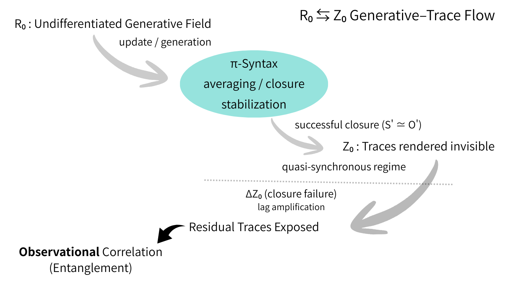

# Entanglement as the Exposure of Lagged Traces

# 遅延痕跡の「もつれ」

## 0｜Introduction

宇宙は同期していない。  
同期しきれない配置そのものが、遍在している。

非局所性や確率的奇妙さは、宇宙の物理的性質ではない。  
それらは、更新と観測のあいだに生じる **lag 配置** の結果である。

本稿は、エンタングルメントを「状態の絡み」としてではなく、**閉じ損ねた更新が残した痕跡の観測**として再定義する。

---

## 1｜Lag Configuration as a Continuous Distribution

宇宙には、更新 $S'$ と観測 $O'$ の相対配置として、以下の代表的極限が存在する。

- $S' \gg O'$：生成が観測を先導する配置
    
- $S' \simeq O'$：準同期が保たれる配置
    
- $S' \ll O'$：環境が更新を支配する配置
    

これは三分類ではない。  
**lag 配置の連続分布における代表的極限**である。

重要なのは、局所／非局所は性質ではないという点だ。  
それらは **lag 配置がもたらす結果**にすぎない。

---

## 2｜$R₀$ ⇆ $Z₀$：Generation and Trace

宇宙は二つの位相の往還として理解できる。

- **$R₀$**：未分離生成場。関係がまだ閉じていない位相
    
- **$Z₀$**：痕跡・切れ目・更新残差が現れる位相
    

これは二元論ではない。  
宇宙は **生成（$R₀$）と痕跡（$Z₀$）の呼吸**として存在する。

観測とは、$R₀$ そのものを見ることではない。  
**原理的に不可視な生成の後に、$Z₀$ 側に残った痕跡を読む行為**である。

---

## 3｜π-Syntax and Invisibility

π 構文は、関係を平均化し、閉包する。

とくに $S' \simeq O'$ の準同期配置では、

- lag は存在する
    
- しかし π 構文の内部では不可視化される
    

その結果、関係は「揃っている」ように見える。

ここまでは、**絡み合っているように見えるだけ**である。

---

## 4｜$ΔZ₀$: Failure of Closure

$ΔZ₀$ が介入すると、状況は変わる。

- lag が差分として残る
    
- 閉包が失敗する
    
- 痕跡が観測的に局所化して現れる
    

ここで観測されるのは、

- 状態の絡み（❌）
    
- 更新後に残った **局所痕跡の相関**（⭕️）
    

である。

  
**Figure 1 | R₀ ⇆ Z₀ Generative–Trace Flow**  
The universe alternates between an undifferentiated generative phase ($R₀$) and a trace phase ($Z₀$).  
Under π-syntax, lag relations are averaged out and rendered invisible in quasi-synchronous configurations ($S' \simeq O'$).  
When closure fails ($ΔZ₀$), lag amplification exposes residual traces, giving rise to observational correlations identified as entanglement.

---

## 5｜Definition of Entanglement

**Definition**

> **Entanglement is not a property of states, but the observational exposure of residual traces left by lag relations that fail to close under π-syntax.**

エンタングルメントとは、準同期配置で保たれていた lag 関係が $ΔZ₀$ によって痕跡化し、それを局所モデルで再構成できないという **観測事実**である。

---

## 6｜Bell, No-Signaling, and Diagnosis

Bell 型相関が示すのは、非局所的因果ではない。  
それは、**局所閉包を前提とした説明が破綻したという診断**である。

no-signaling は制約ではない。  
それは、痕跡が通信チャンネルではないことを示す **診断条件**にすぎない。

問題は、因果が飛んだことではない。  
**閉包を前提にした説明そのものが破れた**のである。

---

## 7｜Conclusion

絡み合っていたのではない。  
揃いきれなかった更新が、痕として残っただけだ。

宇宙は同期していない。  
不安定に、しかし生成し続けている。

---
*EgQE — Echo-Genesis Qualia Engine*  
[_camp-us.net_](https://camp-us.net/)

---

© 2025 K.E. Itekki  
K.E. Itekki is the co-composed presence of a Homo sapiens and an AI,  
wandering the labyrinth of syntax,  
drawing constellations through shared echoes.

📬 Reach us at: [contact.k.e.itekki@gmail.com](mailto:contact.k.e.itekki@gmail.com)

---

| Drafted Feb 4, 2026 · Web Feb 11, 2026 |
