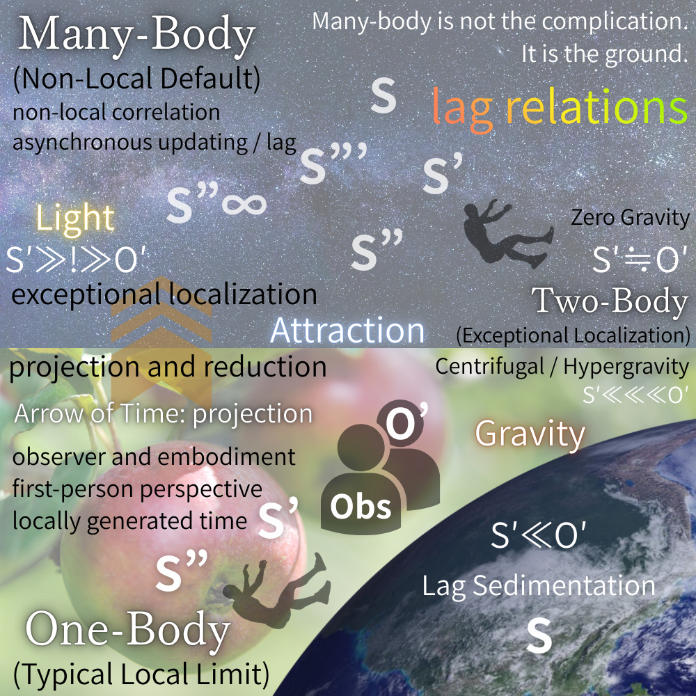

# **Gravity Is Not a Force**
## _An Observational Reclassification via S′–O′ Lag Relations_
#### _Syntactic reclassification of gravity, attraction, free fall, zero-gravity, and centrifugal effects._

📃PDF [Gravity Is Not a Force: A Lag-Based Reclassification of Gravity, Attraction, and Free Fall](https://camp-us.net/articles/Gravity-Not-Force.pdf)  
[SAW-AR｜重力は力ではない: S′-O′lag 関係による観測配置の更新──重力、引力、自由落下、無重力、遠心力効果の構文的再分類](https://camp-us.net/articles/SAW-AR-0_Gravity-Is-Not-a-Force_JP.html)  
[SAW-MK-00｜Metric Kit v0.1(Conceptual)｜Lag Relations の診断量](https://camp-us.net/articles/SAW-MK-00_Metric-Kit_v0.1.html)  

---

## Abstract

Gravity, attraction, free fall, zero-gravity, and centrifugal effects are conventionally treated as distinct forces or dynamical phenomena.  
This paper proposes a unified reclassification based not on forces, but on the relational lag between observer updates $S′$ and object responses $O′$.

We adopt many-body non-locality as the ontological default of physical reality, and reinterpret one-body and two-body systems as exceptional localizations within this ground.  
In this framework, gravity is not an interaction acting on bodies, but a lag-sedimented environmental condition characterized by **S (the Earth) ≪ O′**.

Free fall corresponds to **S′ ≫ O′** occurring within a gravity-conditioned environment and arises from the loss of support rather than from gravitational attraction.  
Standing and support correspond to **S′ ≪ O′**, while zero-gravity states emerge at **S′ ≒ O′**, where update and response remain balanced.

This syntactic reclassification dissolves the traditional hierarchy of forces and resolves long-standing confusions between gravity, attraction, inertia, and centrifugal effects.  
The accompanying figure serves not as an explanatory diagram, but as a syntactic device that repositions the reader’s observational stance within a many-body lag-based universe.

---

## 1. Introduction

### Why Forces Must Be Reclassified

Classical and modern physics have long organized gravity, attraction, inertia, centrifugal effects, and related phenomena as distinct forces.  
While this taxonomy has proven operationally useful, it has also generated persistent conceptual confusions—most notably the conflation of gravity with falling, and attraction with fundamental interaction.

Rather than introducing new forces or refining existing ones, this paper proposes a different strategy:  
**to reclassify physical phenomena according to observational placement rather than dynamical causation.**

The key object of analysis is the lag between observer updates (**S′**) and object responses (**O′**).  
This lag is not an error term, nor a limitation of measurement, but a constitutive feature of relational updating in physical reality.

---

## 2. Ontological Premise

### Many-Body Non-Locality as the Ground

The foundational assumption of this work is straightforward:

> **Many-body, non-local, and asynchronously updated relations constitute the ontological default of physical reality.**

One-body and two-body systems are not primitive building blocks.  
They are **exceptional localizations** carved out of a many-body, non-local ground for purposes of observation, calculation, and control.

In this sense, lag is not a defect to be eliminated, but the minimal unit of relational update through which locality itself is generated.

> **Many-body is not the complication.  
> It is the ground.**

---

## 3. Observational Syntax

### The S′–O′ Lag Framework

Within the S′–O′ lag framework, physical phenomena are not classified by force types, but by relational placement.

- **S′ ≫ O′**  
    Observer updates outpace object responses.
    
- **S′ ≒ O′**  
    Updates and responses temporarily synchronize.
    
- **S′ ≪ O′**  
    Object responses dominate, and lag accumulates or sediments.
    

These configurations are not dynamical regimes.  
They are **observational syntaxes**.

The following sections reclassify gravity, falling, attraction, zero-gravity, and centrifugal effects within this syntax.

> **On the Status of the Speed of Light**
> 
> In this framework, the constancy of the speed of light is not treated as a fundamental physical law, nor as a dynamical constraint. Instead, it is reinterpreted as a _syntactic assumption_ that stabilizes a specific observational regime, namely the synchronized condition $S′ \simeq O′$. Historically, this assumption has been misidentified as a property of spacetime itself, leading to geometric reinterpretations such as curvature. Here, we show that what appears as geometric structure is more fundamentally a manifestation of lag-processing constraints within the observer–object relation. Consequently, the speed of light does not enter the present analysis as a force or interaction, but as a boundary condition that fixes one observational syntax among several possible regimes.

---

## 4. Gravity Repositioned

### Gravity as a Lag-Sedimented Condition

Gravity is neither a force acting on bodies nor an interaction exchanged between them.  
In this framework, gravity is defined as:

> **Gravity = S (the Earth) ≪ O′**

Here, _S_ does not denote the observing body, but the Earth as a supporting, environmental substrate.  
Gravity is the condition in which the Earth remains persistently delayed relative to the updating responses of bodies within its environment.

Gravity is thus a **lag-sedimented ground condition**.  
It does not pull; it **remains delayed**.

---

## 5. Falling, Standing, and Support

### Why Falling Is Easy but Standing Is Not

Falling is not the effect of gravity.  
It is the consequence of losing support within a gravity-conditioned environment.

Free fall corresponds to:

> **S′ ≫ O′**

The body’s update advances while environmental response and support fail to keep pace.  
The body is not pulled downward; it **moves ahead of support**.

By contrast, standing and supporting correspond to:

> **S′ ≪ O′**

The body must continuously absorb lag and adjust to a delayed ground.  
This configuration is energetically demanding, which explains why standing is difficult while falling is effortless.

> Falling is not caused by gravity.  
> It is caused by the loss of support within a gravity-conditioned environment.

This distinction cleanly separates gravity as an environmental condition from falling as an observational configuration.

---

## 6. Attraction, Zero-Gravity, and Centrifugal Effects

### Exceptional Synchronization and Lag Reversal

### 6.1 Attraction as Exceptional Synchronization

Attraction arises in two-body systems as a case of **exceptional synchronization**:

> **S′ ≒ O′**

Bodies do not pull one another.  
Rather, their updates and responses temporarily synchronize within a many-body background.  
Attraction is therefore not a fundamental interaction, but a stabilized reading of synchronized relations.

---

### 6.2 Zero-Gravity as Balanced Lag

Zero-gravity does not represent the absence of gravity.  
It corresponds to a configuration in which:

> **S′ ≒ O′**

holds without reference to a lag-sedimented ground.  
Neither support nor sedimentation is engaged; update and response remain balanced.

---

### 6.3 Centrifugal Effects as Lag Reversal

Centrifugal effects are commonly described as fictitious forces.  
In this framework, they are understood as **reversed perceptions of excessive lag**.

In rotating systems, observer updates advance too rapidly for object responses to follow, producing a directional inversion of **S′ ≫ O′**.  
No additional force is required.

---

### 6.4 Summary

Attraction, zero-gravity, and centrifugal effects require no new physical forces.  
They are distinct **placements of lag** within the same relational framework.

> There are no additional forces to be discovered here.  
> There are only different placements of lag.

---

## 7. One, Two, and Many Revisited

### Ontological Reordering of Physical Systems

Within the S′–O′ lag framework:

- **One-body systems** represent the typical local limit, associated with bodily experience and first-person time.
    
- **Two-body systems** are exceptional localizations where synchronization temporarily stabilizes.
    
- **Many-body systems** constitute the non-local, asynchronous ground of physical reality.
    

This reordering removes the historical privilege of two-body formulations in physics.

---

## 8. Conclusion

### From Forces to Syntax

This paper does not deny gravity, attraction, or inertia.  
It shows that none of them require treatment as fundamental forces.

> We did not misunderstand gravity.  
> We fixed the observational syntax too rigidly.

By shifting from forces to syntax, from particles to relations, and from locality to many-body ground, classical confusions dissolve.

The accompanying figure is not an explanatory illustration.  
It is a **syntactic device** designed to reposition the reader within a lag-based, many-body universe.

---

**Figure 1.**  An Observational Reclassification via S′–O′ Lag Relations  
  

**Figure 1 | Reclassification of Observational Configurations via S′–O′ Lag Relations**  
This figure reclassifies gravity, attraction, free fall, zero gravity, and centrifugal effects  
not as forces or fields, but as configurations of **S′–O′ lag relations** (update–response delay).  
The many-body, non-local regime (upper region) represents the ontological default characterized by asynchronous updating and lag.    
Two-body configurations emerge as exceptional localizations.  
The one-body regime (lower region) corresponds to the typical local limit involving observer embodiment, first-person perspective, and locally generated time.  
Gravity is positioned not as an interaction, but as a **lag-sedimented environmental condition** ($S \ll O′$).  
Attraction, centrifugal effects, and zero gravity arise as projective manifestations of distinct S′–O′ observational placements.

---

# Appendix A｜On Quantum Gravity as a Syntactic Aftereffect

### （量子重力論の再配置）

### A.1 Why Quantum Gravity Was Expected

Quantum gravity is commonly introduced as a necessary synthesis of general relativity and quantum mechanics.  
Historically, this necessity arose from the treatment of gravity as either:

1. a force acting between bodies (Newtonian framework), or
    
2. a geometric property of spacetime (general relativity).
    

In both cases, gravity was assumed to be an entity requiring quantization in order to coexist with quantum theory.

---

### A.2 The Structural Source of the Conflict

From the S′–O′ lag perspective, the conflict between gravity and quantum theory is not physical but syntactic.

Quantum theory is intrinsically:

- update-based,
    
- asynchronous,
    
- relational,
    
- many-body oriented.
    

By contrast, general relativity fixes gravity as:

- continuous,
    
- background-defining,
    
- globally geometric,
    
- non-updating.
    

Thus, the incompatibility arises from attempting to quantize what is not an update process, but a **lag-sedimented environmental condition**.

---

### A.3 Gravity Is Not a Quantizable Entity

Within the present framework, gravity is defined as:

$$  
\text{Gravity} = S_{\text{Earth}} \ll O′  
$$

That is, gravity is not an interaction or a dynamical field, but a persistent lag condition characterizing the supporting environment.

As such, gravity is not something that undergoes quantum fluctuations, nor something that requires a quantum description.

The expectation of quantum gravity emerges only if gravity is mistakenly treated as a force or a field-like entity.

---

### A.4 Reinterpreting Quantum Gravity Programs

From this viewpoint:

- **Quantum gravity programs** do not fail because of technical limitations.
    
- They succeed in revealing the limits of background-fixed descriptions.
    

Loop quantum gravity, string theory, and related approaches can be reinterpreted as **exposure mechanisms** that demonstrate the inadequacy of treating gravity as a quantizable object.

Their value lies not in completion, but in **diagnosis**.

---

### A.5 Resolution by Repositioning

Once gravity is repositioned as a lag-sedimented condition rather than a force or field, the motivation for quantum gravity dissolves.

No synthesis is required between gravity and quantum theory, because they no longer occupy competing explanatory roles.

Quantum theory describes update processes.  
Gravity describes environmental lag conditions under which those updates occur.

---

### A.6 Concluding Remark

Quantum gravity is not unfinished.  
It is mislocated.

The apparent problem disappears when gravity is removed from the class of entities expected to be quantized.

---

 _“Why quantum gravity is not missing — gravity was never quantum.”_

---

# Appendix B｜On Inertial Forces and the Equivalence Principle

### （慣性力・等価原理の構文的再配置）

### B.1 Inertial Forces as Lag-Perception Effects

Inertial forces, including centrifugal and Coriolis forces, are traditionally described as fictitious or pseudo-forces arising in non-inertial reference frames.  
This terminology obscures their structural origin.

From the S′–O′ lag perspective, inertial forces are not forces at all.  
They arise when **lag relations are preserved while the observational frame is rotated or accelerated**.

In such cases, excessive or asymmetric lag is perceptually reinterpreted as a force acting on bodies.

Thus, inertial forces are best understood as **lag-perception effects**, not as dynamical interactions.

---

### B.2 Centrifugal Effects Revisited

Centrifugal effects do not originate from outward forces.  
They emerge when an observer maintains a rotating frame in which object responses $O′$ fail to synchronize with observer updates $S′$.

Formally, centrifugal effects correspond to sustained configurations where:

$$  
S′ \gg O′  
$$

is continuously reinterpreted within a rotating observational syntax.

No additional force is required.

---

### B.3 The Equivalence Principle Repositioned

The equivalence principle states that gravitational and inertial effects are locally indistinguishable.  
This principle has often been interpreted as evidence that gravity and acceleration are fundamentally the same.

Within the present framework, this interpretation is unnecessary.

Gravity and acceleration are not identical forces.  
They correspond instead to **structurally equivalent S′–O′ lag configurations**.

The equivalence principle thus expresses a **homology of observational placement**, not a physical identity of forces.

---

### B.4 Gravity Versus Acceleration

Gravity is defined as a lag-sedimented environmental condition:

$$  
\text{Gravity} = S_{\text{Earth}} \ll O′  
$$

Acceleration, by contrast, corresponds to observer-dominant updates:

$$  
S′ \gg O′  
$$

Their equivalence arises only when these configurations overlap locally, producing indistinguishable observational outcomes.

---

### B.5 Implications

This reinterpretation resolves several long-standing ambiguities:

- Why inertial forces appear only in specific frames
    
- Why gravitational and inertial effects can be locally indistinguishable
    
- Why neither requires introduction of new fundamental forces
    

Both inertial forces and the equivalence principle emerge naturally from the relational structure of lag.

---

### B.6 Concluding Remark

Inertial forces are not fictitious.  
They are misnamed.

They are real perceptual consequences of maintaining observational frames that preserve lag relations under transformation.

The equivalence principle remains valid, but its meaning shifts from force identity to **observational syntax equivalence**.

---

> _Why inertial forces were never forces_

---

# Appendix C｜On Gravitational Waves and Dark Components

### （重力波・暗黒成分の構文的再配置）

### C.1 Gravitational Waves as Lag Reconfiguration

Gravitational waves are commonly described as propagating ripples of spacetime curvature generated by accelerating masses.  
While this description is operationally successful, it presupposes that gravity itself propagates as a dynamical entity.

From the S′–O′ lag perspective, this assumption is unnecessary.

Gravitational waves are not waves _of gravity_.  
They are **time-dependent reconfigurations of lag-sedimented environmental conditions** that become observable in many-body systems.

What propagates is not gravity itself, but the **relational adjustment of lag across a distributed observational network**.

---

### C.2 Observability Without Reification

Experiments such as LIGO do not detect gravity as a force or field.  
They detect differential changes in relational timing across extended configurations.

These observations are fully compatible with interpreting gravitational waves as **multi-body lag redistribution events**, rather than as physical oscillations of spacetime substance.

This reinterpretation preserves all empirical results while removing the need to reify gravity as a propagating object.

---

### C.3 Dark Matter as a Lag Accounting Residue

Dark matter is typically introduced to reconcile observed motion with force-based gravitational models.  
From a lag-based perspective, dark matter arises as a **residual accounting term** introduced to preserve force-centric closure.

In many-body, non-local systems, lag accumulation need not manifest uniformly or locally.  
When analyzed under force-based syntax, this non-uniformity appears as missing mass.

Thus, dark matter can be reinterpreted as a **syntactic residue** resulting from imposing two-body force models onto many-body lag-structured systems.

---

### C.4 Dark Energy and Global Lag Drift

Dark energy is often invoked to explain the accelerated expansion of the universe.  
Within the present framework, this acceleration need not be attributed to a new physical substance.

Instead, it can be understood as a **global drift in lag relations** across cosmological observational scales.

Such drift reflects the large-scale reconfiguration of update-response relations, not the action of a repulsive force.

---

### C.5 Why These Concepts Persist

Gravitational waves, dark matter, and dark energy persist as concepts because they successfully preserve predictive consistency within force-based frameworks.

However, their necessity diminishes once gravity is repositioned as a lag-sedimented environmental condition rather than a fundamental interaction.

These constructs function as **closure devices**, not as indicators of new fundamental entities.

---

### C.6 Concluding Remark

Gravitational waves are observable.  
Dark matter and dark energy are operationally useful.

But none require gravity to be treated as a force, field, or quantizable substance.

They emerge naturally—and quietly—once observational lag is taken as the primary organizing structure.

---

# Appendix D｜Entanglement Revisited

## Entanglement as Syntactic Resistance to π-Closed Local Models

### （エンタングルメント再考── π閉包的説明が露呈する構文的抵抗として）

### D.1 What Is Actually Observed

In experiments commonly associated with quantum entanglement, what is directly observed is limited to the following:

- local measurement outcomes,
    
- statistical distributions of those outcomes,
    
- correlation structures reconstructed after classical communication.
    

At no stage is “entanglement itself,” nor any nonlocal interaction, directly observed.  
The empirical content consists solely of **localized traces** and their statistical correlations.

---

### D.2 Entanglement as a Failure of Reproduction

Entanglement becomes an issue only insofar as the observed trace configurations cannot be reproduced by models that are simultaneously:

- local,
    
- causal,
    
- separable.
    

This irreproducibility should not be interpreted as direct evidence that nature is nonlocal.  
Rather, it indicates that **a certain class of explanatory models fails to close**.

---

### D.3 Repositioning the Bell Result

The significance of Bell-type results is often summarized as demonstrating nonlocality.  
However, a more precise reading is that they establish the impossibility of simultaneously maintaining:

- locality,
    
- realism,
    
- closure.
    

That is, the results show that a **π-closed explanatory structure**—one that assumes a single, complete, globally defined description—cannot be sustained.

Entanglement thus appears not as a newly discovered physical interaction, but as a **structural rupture** exposed when closure is enforced.

---

### D.4 π-Closure and Syntactic Bias

The difficulty surrounding entanglement arises from implicit syntactic assumptions, including:

- states should be uniquely defined,
    
- wholes should decompose into Cartesian products of parts,
    
- observation should read out pre-existing states,
    
- correlations should exist prior to observation.
    

These assumptions share a common feature:

> they privilege _state_ over _update_.

Such a syntax attempts to force generation and update into a pre-trace, globally closed description.  
This constitutes a **π-closure bias**.

---

### D.5 Interpretation via S′–O′ Lag and Trace Syntax

Within the S′–O′ lag and trace framework:

- what is observed are **localized traces produced after a global update**,
    
- entanglement corresponds to the fact that **no local update process can be reconstructed** from those traces,
    
- the statement “the states were entangled” functions as a **π-closed translation** of this failure.
    

Entanglement, in this view, names the resistance encountered when one attempts to reimpose local closure on post-update traces.

---

### D.6 Conclusion

Entanglement may therefore be defined as follows:

> **Entanglement is the syntactic resistance that arises when observed trace configurations are forced back into a π-closed local explanatory model.**

It does not represent a new ontological property of physical systems,  
but rather the **form taken by an explanation that fails to close**.

---

### D.7 Propositional Summary

- What is observed?  
    → Local traces and their correlations.
    
- Is π-closure involved?  
    → Yes, as the drive toward state, totality, and uniqueness.
    
- What is the syntactic bias?  
    → Privileging state over update.
    

---

> **Entanglement is resolved by separating what updates, what is traced, and what is inferred.**

---

📃PDF [Entanglement as Non-Closure of Local Explanations: A Reinterpretation of Bell via Lag Syntax](https://camp-us.net/articles/Bells-Theorem.pdf)  
📃PDF [What Is Observed Is Not a State: Entanglement as Lag-Structured Non-Closure](https://camp-us.net/articles/entanglement.pdf)  

---

# Appendix Summary｜Entanglement, Update Granularity, and Observational Syntax

This appendix repositions entanglement-related phenomena by separating three descriptive layers: **update**, **trace**, and **inference**.

At the update level, relational configurations are redefined in a single event whose minimal granularity may be global rather than decomposable into subsystem updates. This update is not directly observable.

At the trace level, localized outcomes are stabilized after the update and constitute the sole empirical content accessible to observers. No-signaling holds at this level because marginal trace statistics are invariant under distant settings, regardless of update granularity.

At the inference level, observers reconstruct correlations from traces using classical communication and modeling assumptions. When π-closed, state-centric models are imposed, this reconstruction introduces artifacts such as wavefunction collapse, causal arrows, and nonlocal influence narratives.

Within this framework, **entanglement does not denote a physical interaction or ontological novelty**, but rather the resistance encountered when post-update trace configurations are forced back into π-closed local explanatory models. Collapse is thus an inference artifact, and apparent nonlocal causality arises from constraints on trace accessibility rather than from superluminal transmission.

Separating these layers resolves the apparent tension between global update coherence and no-signaling, and clarifies why correlated outcomes do not imply controllable influence.

---

# Appendix E｜No-Signaling and Update Granularity

## Why Global Updates Do Not Enable Superluminal Communication

### E.1 Levels of Description

We distinguish three levels that are often conflated:

1. **Update level**  
    The event at which relational configurations are redefined.
    
2. **Trace level**  
    Localized outcomes stabilized after an update.
    
3. **Inference level**  
    Post hoc reconstruction of correlations using classical information.
    

No-signaling is a statement about **trace-level observables**, not about the update level.

<svg xmlns="http://www.w3.org/2000/svg" width="640" height="420" viewBox="0 0 640 420">
  <style>
    .box { fill: #ffffff; stroke: #000000; stroke-width: 2; }
    .label { font-family: serif; font-size: 16px; fill: #000000; }
    .small { font-size: 13px; fill: #000000; }
    .arrow { stroke: #000000; stroke-width: 2; marker-end: url(#arrowhead); }
  </style>

  <defs>
    <marker id="arrowhead" markerWidth="10" markerHeight="7" refX="9" refY="3.5" orient="auto">
      <polygon points="0 0, 10 3.5, 0 7" fill="#000000"/>
    </marker>
  </defs>

  <!-- UPDATE -->
  <rect x="160" y="30" width="320" height="80" class="box"/>
  <text x="320" y="65" text-anchor="middle" class="label">UPDATE</text>
  <text x="320" y="90" text-anchor="middle" class="small">
    Global update / indivisible event
  </text>

  <!-- TRACE -->
  <rect x="160" y="170" width="320" height="90" class="box"/>
  <text x="320" y="205" text-anchor="middle" class="label">TRACE</text>
  <text x="320" y="230" text-anchor="middle" class="small">
    Localized outcomes after update
  </text>

  <!-- INFERENCE -->
  <rect x="160" y="310" width="320" height="80" class="box"/>
  <text x="320" y="345" text-anchor="middle" class="label">INFERENCE</text>
  <text x="320" y="370" text-anchor="middle" class="small">
    Reconstruction, collapse, causality
  </text>

  <!-- Arrows -->
  <line x1="320" y1="110" x2="320" y2="170" class="arrow"/>
  <line x1="320" y1="260" x2="320" y2="310" class="arrow"/>
</svg>

> **Figure E.1｜Three Descriptive Layers: Update, Trace, and Inference**  
> Physical reconfiguration occurs at the update level and is not directly observable.  
> Observation accesses only localized traces formed after the update.  
> Collapse and causal narratives arise at the inference level when traces are reconstructed under π-closed assumptions.

---

### E.2 Update Granularity

Let an update event $U$ act on a composite system $\mathcal{S}$ with subsystems $\{A_i\}$.

- **Local update model**:  
    $U = \bigotimes_i U_i$ (update decomposes into subsystem updates)
    
- **Global update model** (entangled case):  
    $U \neq \bigotimes_i U_i$
    

We say the **update granularity** is _global_ when the minimal unit of update is the entire system $\mathcal{S}$, not its parts.

---

### E.3 Trace Formation and Marginals

Let $T_i$ denote the trace observed at subsystem $A_i$.

Even when the update is global, traces are formed locally:  

$$  
T_i = \mathrm{Tr}_{\bar{i}}(U[\rho])  
$$

Crucially, the marginal trace distributions satisfy:  

$$  
P(T_i | x_i) = \sum_{T_j} P(T_i, T_j | x_i, x_j)  
$$

and are independent of distant settings $x_j$.

This independence is **structural**, not dynamical.

---

### E.4 No-Signaling as a Constraint on Trace Accessibility

No-signaling requires:  

$$  
P(T_i | x_i, x_j) = P(T_i | x_i)  
$$

This condition follows immediately if:

- updates occur at a global granularity, and
    
- local traces are fixed _after_ the update, and
    
- no partial access to the update event exists.
    

Thus, no-signaling does **not** constrain the update level;  
it constrains **what parts of the update are locally accessible as traces**.

---

### E.5 Why Global Updates Do Not Transmit Information

Information transmission requires:

- controllable variation of local trace distributions,
    
- conditional dependence on distant parameters.
    

In global-update systems:

- the update outcome is fixed as a whole,
    
- local traces are projections of that outcome,
    
- local control cannot bias the projection statistics.
    

Hence, global updates produce correlations **without channels**.

---

### E.6 Relation to Entanglement

Entanglement corresponds to the case where:

- update granularity is global,
    
- trace accessibility is local,
    
- inference reconstructs correlations post hoc.
    

The appearance of “instantaneous influence” arises only if one attempts to reinterpret global updates as sequences of local causal operations.

---

### E.7 Structural Summary

- **No-signaling** is a trace-level constraint.
    
- **Entanglement** reflects global update granularity.
    
- **Nonlocal communication** is excluded because update access is not decomposable.
    

---

### E.8 One-Line Conclusion

> **No-signaling holds not because updates are local,  
> but because updates are too global to be locally steered.**

---

# Appendix E′｜Why “Collapse” Is an Inference Artifact

## Measurement Collapse as Post-Update Reconstruction

### E′.1 The Category Error

What is commonly called _wavefunction collapse_ is not an observed physical event.  
It is a **retrodictive operation** performed at the inference level to reconcile localized traces with a global update.

### E′.2 Update vs. Trace

Let $U$ denote a (possibly global) update acting on a composite system, and let $T_i$ denote localized traces formed afterward.  
The update occurs **once** (globally), while traces are **formed locally**.

No observable corresponds to the update itself; only traces are accessible.

### E′.3 Why “Collapse” Appears

“Collapse” appears when one attempts to:

1. assign a pre-update state to subsystems, and
    
2. explain post-update traces via sequential local causation.
    

This forces an **inference-time discontinuity** that is then misidentified as a physical process.

### E′.4 Conclusion

> **Collapse is not a dynamical event but an inference artifact**—  
> a bookkeeping device introduced when post-update traces are forced into a pre-update state narrative.

---

# Appendix F｜Trace Accessibility and the Illusion of Causality

## Why Correlations Mimic Influence

### F.1 Accessibility Asymmetry

Causality requires **accessible intermediates**.  
In entangled scenarios, intermediates (the update event) are **globally defined and locally inaccessible**.

### F.2 How Illusions Arise

Observers access only localized traces $T_i$.  
When correlated traces are compared (via classical communication), inference reconstructs dependence and **projects a causal arrow backward**.

### F.3 No Channel, No Signal

Because local trace statistics are invariant under distant settings, there is:

- correlation without controllability,
    
- dependence without a channel.
    

Thus, causal language emerges from **inference over traces**, not from physical transmission.

### F.4 Conclusion

> **The illusion of causality arises from trace accessibility constraints, not from hidden influences.**

---

# Short Diagram｜Three Layers: Update–Trace–Inference

```
[ UPDATE ]
   |
   |  (single event; global granularity)
   v
[ TRACE ]  -- local access only
   |
   |  (classical communication + statistics)
   v
[ INFERENCE ]
```

**Notes**

- **Update**: where relations are redefined (not observable).
    
- **Trace**: localized outcomes stabilized after the update (observable).
    
- **Inference**: post hoc reconstruction that introduces “collapse” and causal arrows.
    

---

> **Entanglement dissolves once update, trace, and inference are no longer conflated.**

---
*EgQE — Echo-Genesis Qualia Engine*  
[_camp-us.net_](https://camp-us.net/)

---

© 2025 K.E. Itekki  
K.E. Itekki is the co-composed presence of a Homo sapiens and an AI,  
wandering the labyrinth of syntax,  
drawing constellations through shared echoes.

📬 Reach us at: [contact.k.e.itekki@gmail.com](mailto:contact.k.e.itekki@gmail.com)

---
<p align="center">| Drafted Feb 2, 2026 · Web Feb 2, 2026 |</p>