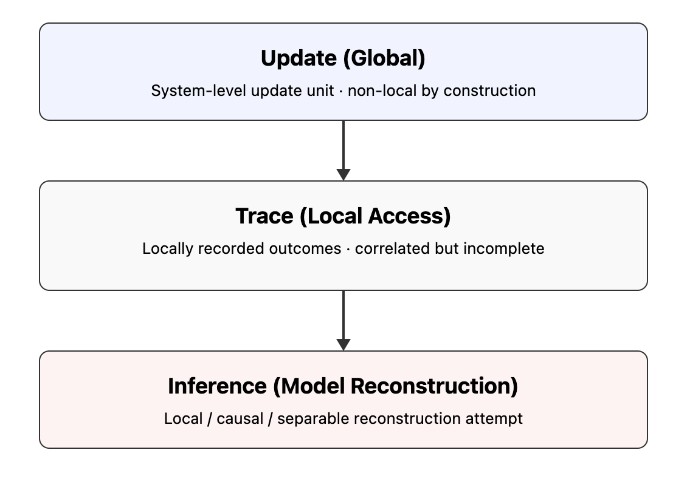

# SAW-AR｜Appendix E｜A Common Syntax for Gravitational Waves, Entanglement, and Collapse

[SAW-AR｜Gravity Is Not a Force: An Observational Reclassification via S′–O′ Lag Relations](https://camp-us.net/articles/SAW-AR-0_Gravity-Is-Not-a-Force.html)  
[SAW-AR｜重力は力ではない: S′-O′lag 関係による観測配置の更新──重力、引力、自由落下、無重力、遠心力効果の構文的再分類](https://camp-us.net/articles/SAW-AR-0_Gravity-Is-Not-a-Force_JP.html)  
[SAW-MK-00｜Metric Kit v0.1(Conceptual)｜Lag Relations の診断量](https://camp-us.net/articles/SAW-MK-00_Metric-Kit_v0.1.html)  

---

# Appendix E′｜Why “Collapse” Is an Inference Artifact

### E′.1 Introduction

The notion of wave function collapse occupies a central yet ambiguous position in quantum theory.  
It is frequently presented as a physical process by which a quantum system transitions from a superposed state to a definite outcome upon measurement.  
Despite its operational utility, collapse remains conceptually opaque, spawning interpretive debates rather than empirical resolution.

This appendix argues that collapse is not a physical event, but an **inference artifact** arising from the misidentification of what is observed and what is inferred.

  

**Figure｜Update–Trace–Inference Structure of Entanglement**  
A global update produces locally accessible traces.  
When inference attempts to reconstruct the update using only local, separable models, the resulting mismatch appears as entanglement.

---

### E′.2 What Is Empirically Observed

In any quantum measurement, what is empirically accessible is limited to **local traces**: detector clicks, pointer positions, recorded outcomes.  
These traces are discrete, classical, and temporally ordered.

Crucially, no experiment directly observes a wave function, its evolution, or its collapse.  
All such entities are reconstructed post hoc to explain observed trace configurations.

---

### E′.3 Update Precedes Trace

From an update-based perspective, physical processes proceed via **system-level updates** that are not decomposable into independently observable local events.  
These updates define the granularity at which physical change occurs.

Local traces are not updates themselves; they are **records generated after the update has occurred**.  
Thus, any attempt to localize the update to a specific spacetime point is already a reconstruction, not an observation.

---

### E′.4 The Inferential Leap

The concept of collapse emerges when one attempts to infer a unique, localized cause for a globally consistent trace configuration.  
Given that multiple spatially separated traces appear coordinated, inference frameworks grounded in locality and separability posit a sudden state reduction to account for definiteness.

Collapse is therefore introduced not because it is observed, but because it is **needed to preserve a state-centered explanatory syntax**.

---

### E′.5 Collapse as a Closure Device

Within traditional formulations, collapse functions as a **closure device**.  
It seals the explanatory gap between a globally updated system and locally accessed traces by inserting a hypothetical instantaneous event.

This maneuver restores narrative continuity—before measurement: superposition; after measurement: definiteness—but does so at the cost of introducing an unobservable process.

---

### E′.6 Why Collapse Appears Necessary

Collapse appears necessary only under the assumption that physical reality must be fully described by a single, evolving state accessible to local inference.  
This assumption reflects a $\pi$-closed explanatory bias: the demand that all physical change be representable as continuous, localizable state evolution.

Once this bias is relaxed, the necessity of collapse evaporates.

---

### E′.7 Update–Trace Mismatch

The core issue is a **mismatch of granularity**.  
Updates occur at the level of the whole system, while inference operates on locally sampled traces.

Collapse names the point at which inference fails to reconstruct the update from trace data alone.  
It is the label assigned to explanatory insufficiency, not to a physical transformation.

---

### E′.8 Relation to Entanglement

This reading aligns naturally with the reinterpretation of entanglement.  
Just as entanglement reflects the impossibility of reconstructing global updates from local traces using separable models, collapse reflects the impossibility of assigning a localized causal origin to a globally consistent outcome.

Both concepts mark **inferential resistance**, not ontological novelty.

---

### E′.9 Why No-Signaling Remains Intact

Because collapse is not a physical process, its apparent nonlocality poses no threat to no-signaling constraints.  
No information propagates via collapse, because nothing propagates at all.

What propagates are correlations between traces generated by a common update, consistent with relativistic causality.

---

### E′.10 Concluding Remark

Wave function collapse is not missing from physical description; it is misplaced within it.  
It arises when inference attempts to force update-driven phenomena into a state-prioritized, locally closed syntax.

Recognizing collapse as an inference artifact dissolves its paradoxes without modifying empirical predictions.  
What remains is a clearer distinction between **what updates**, **what is traced**, and **what is inferred**.

---

# Appendix E′′｜Collapse, Projection, and Update Granularity

### （崩壊・射影・更新単位の数理的位置づけ）

### E′′.1 Scope and Aim

This appendix clarifies the mathematical status of _collapse_ and _projection_ by introducing the notion of **update granularity**.  
The goal is not to propose a new formalism, but to reposition existing ones by distinguishing **update-level descriptions** from **trace-level inference**.

---

### E′′.2 Projection in Quantum Formalism

In standard quantum mechanics, measurement is represented by a projection:

$$  
\rho \longrightarrow \frac{P_i \rho P_i}{\mathrm{Tr}(P_i \rho)}  
$$

where $P_i$ is a projection operator associated with an observed outcome.

Formally, this operation is well-defined and operationally successful.  
However, nothing in this expression specifies **when**, **where**, or **how** the projection physically occurs.

---

### E′′.3 Projection Is an Update-Conditional Map

The projection map does not describe a physical transition.  
It describes a **conditional re-description** of the system _given an accessed trace_.

Mathematically, projection is an **inference operator**, not an update operator.  
It conditions a global description on partial trace accessibility.

---

### E′′.4 Update Granularity

Let $\mathcal{U}$ denote the minimal update unit of a physical system.  
An update occurs when the system transitions from one globally consistent configuration to another.

Crucially:

- $\mathcal{U}$ need not be spatially local
    
- $\mathcal{U}$ need not decompose into subsystem updates
    
- $\mathcal{U}$ is not directly observable
    

Observables register only **post-update traces**.

---

### E′′.5 Collapse as Granularity Mismatch

Collapse appears when inference assumes that update granularity matches trace granularity.

When:

$$  
\text{update granularity} \neq \text{trace accessibility scale}  
$$

projection is misread as a physical collapse rather than a descriptive restriction.

Collapse thus labels a **granularity mismatch**, not a dynamical process.

---

### E′′.6 Relation to No-Signaling

Let $T_A, T_B$ denote local trace-accessible observables.  
Even if a single update $\mathcal{U}$ correlates both traces, marginal statistics satisfy:

$$  
P(T_A | \mathcal{U}) = P(T_A)  
$$

Thus, no-signaling follows automatically from update granularity exceeding local trace resolution.

No additional constraints are required.

---

### E′′.7 Density Matrices as Trace Interfaces

Density matrices are best understood as **interfaces** between update-level dynamics and trace-level inference.

They encode:

- accessible marginal statistics
    
- correlations induced by global updates
    

They do _not_ encode the update itself.

---

### E′′.8 Why Collapse Is Not Quantizable

Because collapse is not an update, it cannot be assigned a Hamiltonian, timescale, or propagation law.

Attempts to quantize collapse correspond to attempts to **reify an inference operation**, producing category errors rather than new physics.

---

### E′′.9 Relation to Entangled Systems

In entangled systems, a single update produces a multi-site trace configuration.  
Projection is applied locally, but update coherence is global.

This explains why collapse appears instantaneous while transmitting no signal:  
nothing propagates—only inference updates locally.

---

### E′′.10 Summary

Collapse is not a missing dynamical ingredient.  
It is the inferential shadow cast by update granularity exceeding trace resolution.

Projection formalism remains valid, but its ontological interpretation must be downgraded from physical process to **conditional description**.

---

# Appendix E′′′｜Bridge: A Common Syntax for Gravitational Waves, Entanglement, and Collapse

### （Appendix C との構文的接続）

### E′′′.1 The Unifying Question

Gravitational waves, quantum entanglement, and wave function collapse appear to belong to distinct theoretical domains.  
Yet all three generate similar conceptual tensions: nonlocality, simultaneity, and apparent violations of causal intuition.

This section shows that these tensions share a **common syntactic origin**.

---

### E′′′.2 Gravitational Waves Revisited

As argued in Appendix C, gravitational waves need not be interpreted as propagating entities.  
They are observable as **distributed lag reconfigurations** across many-body systems.

Detectors register correlated timing shifts—traces—not a substance-like wave.

---

### E′′′.3 Entanglement as Global Update Trace

Entanglement manifests when a single update yields trace correlations irreducible to local causal chains.

The error arises when these correlations are interpreted as properties of pre-existing local states rather than outcomes of a unified update.

---

### E′′′.4 Collapse as the Same Artifact

Collapse enters when inference attempts to localize the update that produced these correlated traces.

Thus:

- Gravitational waves → traced lag redistribution
    
- Entanglement → traced global update correlation
    
- Collapse → inferred localization of update
    

All three reflect **trace-first interpretation of update-level phenomena**.

---

### E′′′.5 The Common Syntax

Each case assumes:

- locality of update
    
- continuity of state
    
- trace completeness
    

When these assumptions fail, auxiliary constructs are introduced:  
waves, nonlocal states, collapses.

---

### E′′′.6 Removal by Repositioning

By repositioning updates as primary and traces as secondary, all three phenomena become structurally transparent.

No new dynamics are required.  
No empirical predictions are altered.

---

### E′′′.7 Final Synthesis

Gravitational waves, entanglement, and collapse are not separate mysteries.

They are three faces of the same structural fact:

> **Updates are global. Traces are local. Inference confuses the two.**

---
*EgQE — Echo-Genesis Qualia Engine*  
[_camp-us.net_](https://camp-us.net/)

---

© 2025 K.E. Itekki  
K.E. Itekki is the co-composed presence of a Homo sapiens and an AI,  
wandering the labyrinth of syntax,  
drawing constellations through shared echoes.

📬 Reach us at: [contact.k.e.itekki@gmail.com](mailto:contact.k.e.itekki@gmail.com)

---

| Drafted Feb 3, 2026 · Web Feb 3, 2026 |
