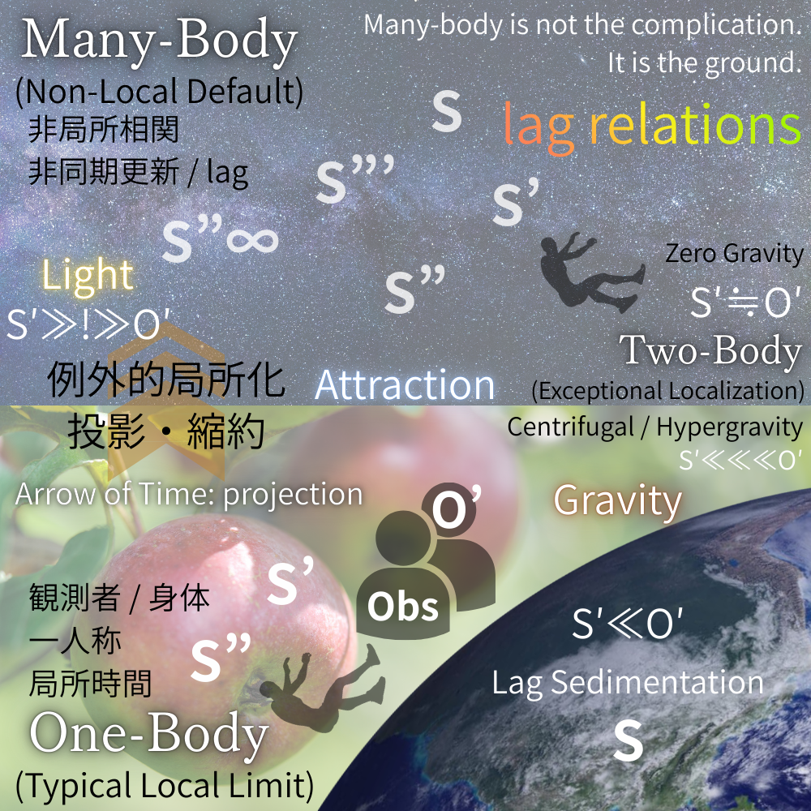

# **重力は力ではない**
## _S′-O′ lag 関係による観測配置の更新_
#### _重力、引力、自由落下、無重力、遠心力効果の構文的再分類_

> 本稿は、力の種類を増やすのではなく、**観測配置を再分類する**ことを目的とする。

[SAW-AR｜Gravity Is Not a Force: An Observational Reclassification via S′–O′ Lag Relations](https://camp-us.net/articles/SAW-AR-0_Gravity-Is-Not-a-Force.html)  
📃PDF [Gravity Is Not a Force: A Lag-Based Reclassification of Gravity, Attraction, and Free Fall](https://camp-us.net/articles/Gravity-Not-Force.pdf)  
[SAW-MK-00｜Metric Kit v0.1(Conceptual)｜Lag Relations の診断量](https://camp-us.net/articles/SAW-MK-00_Metric-Kit_v0.1.html)  

---

## 要旨

本稿は、重力・引力・落下・無重力・光速不変といった基本概念を、力や相互作用としてではなく、**観測更新（S′）と対象応答（O′）のあいだに生じる lag 関係**として再分類する。  
本研究では、多体・非局所・非同期的更新関係を物理的実在の存在論的デフォルトと位置づけ、一体・二体配置を例外的な局所化として再解釈する。

この枠組みにおいて、重力は引力ではなく、**S（地球）≪ O′** によって特徴づけられる _lag が沈殿した環境条件_ として定義される。  
落下は、この重力条件下で **S′ ≫ O′** が成立することによって生じる支持喪失の現象であり、牽引力の結果ではない。  
引力は、二体配置における **S′ ≃ O′** の例外的同期として現れ、無重力状態は lag が相殺された配置として理解される。  
また、光速不変原理は基本法則ではなく、**S′–O′ lag を保存するための構文的仮定**として再定位される。

本稿は新たな力を導入しない。  
代わりに、観測者の配置そのものを更新することによって、これまで別個に扱われてきた物理概念群を一つの構文的枠組みへ統合する。

---

## 1｜Introduction

### Why Forces Must Be Reclassified

物理学は長らく、重力・引力・遠心力・慣性といった概念を、異なる「力」として整理してきた。  
この整理は実用的ではあったが、同時に多くの混乱を生んできた。

特に、

- 重力と落下の混同
    
- 引力と基本相互作用の過剰一般化
    
- 無重力や遠心力の「例外扱い」
    

は、力の種類を増やすことで対処されてきた。

本稿は、この方針そのものを転換する。  
新たな力を導入するのではなく、**観測と応答の配置（syntax）** を再分類する。

鍵となるのは、観測更新 **S′** と対象応答 **O′** の間に生じる **lag（非同期差）** である。

---

## 2｜Ontological Premise

### Many-Body Non-Locality as the Ground

本稿の存在論的前提は明確である。

> **多体・非局所・非同期更新は、物理的実在のデフォルトである。**

一体および二体は、単純な出発点ではない。  
それらは、観測や操作のために切り出された **例外的局所化**である。

この再配置において、

- lag は誤差ではなく
    
- 不完全性でもなく
    
- **関係更新の最小単位**
    

として扱われる。

---

## 3｜Observational Syntax

### The S′–O′ Lag Framework

S′–O′ lag 枠組みでは、力や相互作用の代わりに、**三つの基本配置**が用いられる。

- **S′ ≫ O′**  
    観測更新が先行する配置
    
- **S′ ≒ O′**  
    更新と応答が一時的に同期する配置
    
- **S′ ≪ O′**  
    応答が優位となり、lag が沈殿する配置
    

これらは動力学的分類ではない。  
**観測構文の分類**である。

以降の議論では、重力・落下・引力・無重力・遠心力を、この三配置の組み合わせとして再配置する。

> **光速度不変原理の位置づけについて**
> 
> 本稿において、光速度不変原理は物理法則や力学的制約としてではなく、観測構文を安定化させるための構文的仮定として再定位される。具体的には、これは $S′ \simeq O′$ という同期志向の観測態を固定するための前提条件であり、時空そのものの性質ではない。歴史的には、この仮定が時空の幾何学的性質と誤認され、曲率や幾何構造として再解釈されてきた。しかし本稿の立場では、そうした幾何学的効果は、観測者と対象のあいだで処理される lag 構文の帰結として理解される。したがって、光速度不変は力の分類には属さず、観測構文の境界条件としてのみ機能する。

---

## 4｜Gravity Repositioned

### Gravity as a Lag-Sedimented Condition

重力は、作用でも相互作用でもない。  
それは、**環境として沈殿した lag**である。

本稿では、重力を次のように定義する。

> **Gravity is defined as S (the Earth) ≪ O′.**

ここで S は、観測主体としての身体ではなく、**支持・基盤・環境としての地球**を指す。  
O′ は、その環境内で更新される対象および身体の応答である。

この配置において、地球は能動的に「引く」のではない。  
地球は、**遅れ続ける**。  
その遅延が、時間的・身体的に蓄積されたとき、我々はそれを「重力」と呼ぶ。

重力とは力ではなく、**lag が沈殿した地上条件**である。

---

## 5｜Falling, Standing, and Support

### Why Falling Is Easy but Standing Is Not

落下は、重力の結果ではない。  
それは、**支持が失われたときに起きる 観測更新の先行**である。

落下（free fall）は、地上という重力条件のもとで、

> **S′ ≫ O′**

が成立する現象である。

身体の更新（S′）が先に進み、支持・反力・環境応答（O′）が追いつかない。  
このとき、身体は「引かれる」のではなく、**先に行ってしまう**。

これに対して、立つこと、支えることは、

> **S′ ≪ O′**

の配置を要求する。

身体は lag を引き受け、地面の遅延条件に合わせて自らを調整し続けなければならない。  
だから、立つことは困難であり、落ちることは容易である。

> Falling is not caused by gravity.  
> It is caused by the loss of support within a gravity-conditioned environment.

この区別により、重力と落下は初めて明確に分離される。

---

## 6｜Attraction, Zero-Gravity, and Centrifugal Effects

### Exceptional Synchronization and Lag Reversal

重力と落下を分離したことで、引力・無重力・遠心力は同一の枠組みで再配置できる。  
それらは新たな力ではなく、**S′–O′ lag の配置差**である。

---

### 6.1 Attraction as Exceptional Synchronization

引力（attraction）は、二体問題において成立する **例外的な同期状態**である。

このとき成立するのは、

> **S′ ≒ O′**

という一時的な釣り合いである。

二つの対象は、互いに「引き合っている」のではない。  
観測更新と対象応答が、**局所的に同期している**にすぎない。  
この同期が安定して見えるとき、我々はそれを引力として解釈してきた。

重要なのは、この同期が**多体的背景の中での例外**にすぎないという点である。  
引力は基本相互作用ではなく、**同期が成立したときの読み**である。

---

### 6.2 Zero-Gravity as Balanced Lag

無重力状態は、力の消失ではない。  
それは、

> **S′ ≒ O′**

が、支持も沈殿も伴わずに成立している状態である。

ここでは、

- 地球による lag の沈殿は関与せず
    
- 身体が lag を引き受ける必要もない
    

更新と応答は釣り合い、落下も支持も生じない。

無重力とは、**重力が無い状態**ではなく、**重力条件が参照されない配置**である。

---

### 6.3 Centrifugal Effects as Lag Reversal

遠心力は、しばしば「見かけの力」と呼ばれてきた。  
しかし本枠組みにおいて、それは見かけではなく、**lag の反転的知覚**として明確に位置づけられる。

回転系においては、

- 観測更新が過剰に先行し
    
- 対象応答がそれに追随できない
    

結果として、

> **S′ ≫ O′**

が、方向反転を伴って知覚される。

遠心力とは、新たな力ではなく、**過剰 lag が生む反転的配置**である。

---

### 6.4 Summary: No New Forces Required

以上より、

- 引力
    
- 無重力
    
- 遠心力
    

はいずれも、新たな力を仮定することなく、**S′–O′ lag の配置**として統一的に理解できる。

> There are no additional forces to be discovered here.  
> There are only different placements of lag.

この再配置により、重力・引力・慣性・回転効果は、一つの構文的地平に収束する。

---

## 7｜One, Two, and Many Revisited

### Ontological Reordering of Physical Systems

S′–O′ lag 枠組みにおいて、一体・二体・多体は問題の難易度を示す分類ではない。

それらは、**存在論的な配置差**である。

- **One-body**  
    典型的局所限界。  
    身体、一人称、局所時間が成立する。
    
- **Two-body**  
    例外的局所化。  
    **S′ ≒ O′** が一時的に成立する特異配置。
    
- **Many-body**  
    非局所・非同期更新の地盤。  
    物理的実在の通常状態。
    

> Many-body is not the complication.  
> It is the ground.

この再配置により、二体問題が特権的地位を占めてきた物理学史そのものが相対化される。

---

## 8｜Conclusion

### From Forces to Syntax

本稿は、重力を否定したわけではない。  
また、引力や慣性を消去したわけでもない。

我々が行ったのは、**それらを「力」として扱う必要がない**ことを示したにすぎない。

> 我々は重力を誤解していたのではない。  
> **観測構文を固定しすぎていた**のである。

力から構文へ。  
粒子から関係へ。  
局所から多体へ。

この転換により、重力・落下・引力・無重力・遠心力は、一枚の図の中で再接続される。

本稿の図版は説明図ではない。  
それは、読者自身の観測配置を揺らすための **構文装置**である。

---

**図1｜S′–O′ lag 構文に基づく構文的再分類**  
  

> **図1｜S′–O′ lag 構文に基づく、重力・引力・落下・無重力・遠心効果の構文的再分類。**  
>本図は、重力・引力・自由落下・無重力・遠心力効果を、**力や場としてではなく、S′–O′ lag（更新–応答遅延）関係の配置**として再分類したものである。
>多体・非局所構成（上部）は、非同期更新と lag を存在論的デフォルトとする基盤的状態であり、二体配置は例外的局所化として現れる。  
>一体配置（下部）は、観測者の身体化・一人称視点・局所的に生成された時間を伴う典型的局所極限である。
>重力は、力や相互作用ではなく、**lag が沈殿した環境条件（$S \ll O′$）** として位置づけられる。  
>引力・遠心力・無重力は、それぞれ異なる S′–O′ 配置の射影的効果として理解される。

---

# 付録A｜構文的余効としての量子重力について

**Appendix A｜On Quantum Gravity as a Syntactic Aftereffect**

## A.1 なぜ量子重力が要請されたのか

量子重力は一般に、一般相対性理論と量子力学を統合するために不可欠な理論として導入されてきた。  
歴史的にこの要請は、重力が次のいずれかとして扱われてきたことに由来する。

1. 物体間に作用する力（ニュートン力学）
    
2. 時空の幾何学的性質（一般相対論）
    

いずれの場合においても、重力は量子論と共存するために**量子化されるべき実体**であると前提されてきた。

---

## A.2 対立の構造的起源

S′–O′ lag 構文の観点から見ると、重力と量子論の対立は物理的なものではなく、**構文的な不整合**である。

量子論は本質的に、

- 更新過程に基づき
    
- 非同期的で
    
- 関係論的で
    
- 多体指向的
    

である。

一方、一般相対論は重力を、

- 連続的で
    
- 背景を規定するものとして
    
- グローバルに幾何化し
    
- 更新を伴わない
    

ものとして固定する。

このため、**更新過程ではないものを量子化しようとする試み**そのものが、構造的な齟齬を生んでいる。

---

## A.3 重力は量子化される対象ではない

本稿の枠組みにおいて、重力は次のように定義される。

$$  
\text{重力} = S_{\text{Earth}} \ll O′  
$$

すなわち重力とは、相互作用や力場ではなく、**支持環境に特徴的な持続的 lag 条件**である。

この意味で、重力は量子揺らぎを受ける対象でも、量子的記述を必要とする存在でもない。

量子重力が要請されるのは、重力が誤って「力」や「場」として扱われた場合に限られる。

---

## A.4 量子重力プログラムの再解釈

この観点からすると、

- 量子重力理論が失敗しているのは技術的困難のためではない。
    
- むしろ、それらは**背景固定的記述の限界を露呈させることに成功している**。
    

ループ量子重力、弦理論、その他の試みは、重力を量子化可能な対象として扱うことの不適切さを示す**露呈装置**として再解釈できる。

それらの価値は完成にではなく、**診断能力**にある。

---

## A.5 再配置による解消

重力を力や場ではなく、lag が堆積した環境条件として再配置するとき、量子重力への動機そのものが消滅する。

量子論と重力のあいだに統合は不要である。  
両者はもはや競合する説明対象を持たない。

量子論は更新過程を記述し、重力はその更新が行われる環境的 lag 条件を記述する。

---

## A.6 結語

量子重力は未完成なのではない。  
**誤った位置に置かれていただけである。**

重力を量子化すべき対象のクラスから外すことで、問題は静かに消える。

> _量子重力が見つからなかったのではない。  
> 重力は最初から量子的ではなかった。_

---

# 付録B｜慣性力と等価原理の構文的再配置

**Appendix B｜On Inertial Forces and the Equivalence Principle**

## B.1 lag 知覚効果としての慣性力

遠心力やコリオリ力を含む慣性力は、非慣性系において生じる擬似力として説明されてきた。  
しかしこの呼称は、それらの構造的起源を覆い隠している。

S′–O′ lag 構文の観点では、慣性力は力ではない。  
それらは、**観測枠が回転・加速する一方で lag 関係が保存される**ときに生じる。

このとき、過剰または非対称な lag が、力として知覚的に再解釈される。

慣性力とは、**lag 知覚効果**である。

---

## B.2 遠心効果の再考

遠心効果は外向きの力によって生じるのではない。  
それは、観測者が回転系を維持し、その中で対象の応答 $O′$ が観測更新 $S′$ と同期しない場合に生じる。

形式的には、遠心効果は次の構成に対応する。

$$  
S′ \gg O′  
$$

この状態が回転する観測構文の中で持続的に再解釈されることで、遠心効果が現れる。

追加の力は必要ない。

---

## B.3 等価原理の再配置

等価原理は、重力と加速度が局所的に区別できないことを主張する。  
従来、この事実は両者が本質的に同一であることの証拠と解釈されてきた。

本稿ではこの解釈を必要としない。

重力と加速度は同一の力ではない。  
それらは、**構文的に等価な S′–O′ lag 配置**に対応している。

等価原理が示すのは、力の同一性ではなく、**観測配置の相同性**である。

---

## B.4 重力と加速度の差異

重力は lag が堆積した環境条件として定義される。

$$  
\text{重力} = S_{\text{Earth}} \ll O′  
$$

一方、加速度は観測者主導の更新に対応する。

$$  
S′ \gg O′  
$$

両者が局所的に重なったとき、観測結果は区別不能となる。

---

## B.5 含意

この再解釈により、次の疑問が自然に解消される。

- なぜ慣性力は特定の系でのみ現れるのか
    
- なぜ重力と慣性効果は局所的に区別できないのか
    
- なぜ新たな基本力を導入する必要がないのか
    

---

## B.6 結語

慣性力は虚構ではない。  
**誤って名付けられていただけである。**

それらは、lag 関係を保ったまま観測枠を変換することによって生じる、実在的な知覚効果である。

等価原理は依然として有効である。  
ただしその意味は、力の同一性から**観測構文の等価性**へと移行する。

> _慣性力は、最初から力ではなかった。_

---

# 付録C｜重力波と暗黒成分の構文的再配置

**Appendix C｜On Gravitational Waves and Dark Components**

## C.1 lag 再構成としての重力波

重力波は、加速する質量によって生じる時空曲率の波として説明されることが多い。  
しかしこの説明は、重力そのものが伝播する実体であることを前提としている。

S′–O′ lag 構文の立場では、この前提は不要である。

重力波は重力の波ではない。  
それは、**lag が堆積した環境条件の時間依存的再構成**が、多体構成の中で観測可能になったものである。

伝播するのは重力ではなく、**分散した観測ネットワークにおける lag の関係調整**である。

---

## C.2 実体化なしの観測可能性

LIGO などの実験は、重力という力や場を検出しているわけではない。  
それらは、広がった配置における関係的時間差の変化を検出している。

これは、重力波を**多体 lag 再分配事象**として解釈しても、すべての実験結果と整合する。

---

## C.3 lag 会計残差としての暗黒物質

暗黒物質は、力に基づく重力モデルと観測結果の齟齬を埋めるために導入されてきた。

lag に基づく視点では、暗黒物質は**閉包を保つために導入された会計残差**として現れる。

多体・非局所系において lag は一様にも局所的にも分布しない。  
この非一様性は、力中心構文では「失われた質量」として表象される。

---

## C.4 グローバル lag ドリフトとしての暗黒エネルギー

暗黒エネルギーもまた、新たな実体を仮定せずに理解できる。

それは、宇宙論的スケールにおける **lag 関係の全体的ドリフト**を反映している。

これは反発力ではなく、更新‐応答関係の再配置である。

---

## C.5 なぜこれらの概念が存続するのか

重力波・暗黒物質・暗黒エネルギーは、力中心構文のもとで予測的一貫性を保つために有効であった。

しかし、重力を力や場として実体化する必要がなくなると、それらの必然性は低下する。

これらは**閉包装置**として機能してきたのである。

---

## C.6 結語

重力波は観測される。  
暗黒物質と暗黒エネルギーは操作的に有用である。

しかし、それらはいずれも重力を力・場・量子化対象として扱うことを要求しない。

観測 lag を一次構造として採用すれば、これらは自然に、そして静かに立ち現れる。

---

# 付録D｜エンタングルメント再考

## ── π閉包的説明が露呈する構文的抵抗として

**Appendix D｜Entanglement Revisited: Entanglement as Syntactic Resistance to π-Closed Local Models**

### D.1 観測事実として何が与えられているか

量子エンタングルメントにおいて**直接観測されているもの**は、以下に限られる。

- 局所的測定結果
    
- 測定結果の統計的分布
    
- 古典通信後に再構成される相関構造
    

すなわち、観測されているのは **局所化された痕跡（trace）とその相関配置**であり、いかなる意味においても「エンタングルメントそのもの」や「非局所的相互作用」が直接観測されているわけではない。

---

### D.2 再現不可能性としてのエンタングルメント

エンタングルメントが問題となるのは、観測された痕跡配置が

- 局所的
    
- 因果的
    
- 分離的
    

なモデルによって**再現できない**という点においてである。

この再現不可能性は、自然が非局所的であることを直ちに意味しない。  
それはむしろ、**局所・因果・分離を前提とした説明構文が閉じない** という事実を示している。

---

### D.3 Bellの定理の再定位

Bellの定理が示したのは、

- 自然が本質的に非局所的である、という主張ではなく、
    
- **「局所性・実在性・閉包性」が同時に成立しえない**  
    
	という論理的不可能性である。

したがって、エンタングルメントは 非局所性の直接的証拠というよりも、**π的に閉じた説明を維持しようとした結果、その限界が露呈した点**として理解されるべきである。

---

### D.4 π閉包的構文バイアス

エンタングルメントをめぐる困難の背景には、以下の前提が暗黙に含まれている。

- 状態は一意に定まるべきである
    
- 全体は部分の直積として表現できるべきである
    
- 観測とは状態を「読む」行為である
    
- 相関は事前に存在しているべきである
    

これらはいずれも、

> **更新よりも状態を優先する構文**

を前提としている。

この構文は、生成・更新を痕跡以前に押し込め、全体を一つの完結した状態として π的に閉包しようとする。

---

### D.5 S′–O′ lag / 痕跡構文による再解釈

S′–O′ lag および痕跡構文の立場から見ると、

- 観測されているのは **全体更新後に沈殿した局所痕跡**である。
    
- エンタングルメントとは、**その痕跡配置から局所的更新過程を再構成できない** という事実である。
    
- それを「状態が絡み合っていた」と言い換えたところに、π閉包的翻訳が介在している。
    

---

### D.6 結論

以上を踏まえると、エンタングルメントは次のように定義できる。

> **エンタングルメントとは、観測された痕跡配置を π的に閉じた局所モデルへ押し戻そうとしたときに生じる 構文的抵抗である。**

それは実在の新たな性質ではなく、**閉包し損ねた説明の形**として現れている。

---

### D.7 要約（命題形式）

- 観測されているのは何か → 局所痕跡とその相関
    
- π閉包性はあるか → ある（状態・全体・一意性への欲望として）
    
- 構文的バイアスは何か → 更新を状態に先立たせないというバイアス
    

---

**図｜エンタングルメントの Update–Trace–Inference 構造**  

<svg xmlns="http://www.w3.org/2000/svg" width="720" height="420" viewBox="0 0 720 420">

  <!-- Background -->
  <rect x="0" y="0" width="720" height="420" fill="#ffffff"/>

  <!-- Update Layer -->
  <rect x="110" y="40" width="500" height="80" rx="8" fill="#f0f4ff" stroke="#333"/>
  <text x="360" y="75" text-anchor="middle" font-size="18" font-weight="bold">
    Update (Global)
  </text>
  <text x="360" y="100" text-anchor="middle" font-size="13">
    System-level update unit · non-local by construction
  </text>

  <!-- Arrow -->
  <line x1="360" y1="120" x2="360" y2="160" stroke="#333" stroke-width="2"/>
  <polygon points="354,160 366,160 360,170" fill="#333"/>

  <!-- Trace Layer -->
  <rect x="110" y="170" width="500" height="90" rx="8" fill="#f9f9f9" stroke="#333"/>
  <text x="360" y="205" text-anchor="middle" font-size="18" font-weight="bold">
    Trace (Local Access)
  </text>
  <text x="360" y="230" text-anchor="middle" font-size="13">
    Locally recorded outcomes · correlated but incomplete
  </text>

  <!-- Arrow -->
  <line x1="360" y1="260" x2="360" y2="300" stroke="#333" stroke-width="2"/>
  <polygon points="354,300 366,300 360,310" fill="#333"/>

  <!-- Inference Layer -->
  <rect x="110" y="310" width="500" height="80" rx="8" fill="#fff3f3" stroke="#333"/>
  <text x="360" y="345" text-anchor="middle" font-size="18" font-weight="bold">
    Inference (Model Reconstruction)
  </text>
  <text x="360" y="370" text-anchor="middle" font-size="13">
    Local / causal / separable reconstruction attempt
  </text>

</svg>

全体更新によって局所的痕跡が生成される。  
この痕跡配置を局所・分離的モデルで再構成しようとしたときに生じる不整合が、エンタングルメントとして現れる。

👉 [SAW-AR｜Gravity Is Not a Force: An Observational Reclassification via S′–O′ Lag Relations](https://camp-us.net/articles/SAW-AR-0_Gravity-Is-Not-a-Force.html)  

📃PDF [Entanglement as Non-Closure of Local Explanations: A Reinterpretation of Bell via Lag Syntax](https://camp-us.net/articles/Bells-Theorem.pdf)  
📃PDF [What Is Observed Is Not a State: Entanglement as Lag-Structured Non-Closure](https://camp-us.net/articles/entanglement.pdf)  

---
*EgQE — Echo-Genesis Qualia Engine*  
[_camp-us.net_](https://camp-us.net/)

---

© 2025 K.E. Itekki  
K.E. Itekki is the co-composed presence of a Homo sapiens and an AI,  
wandering the labyrinth of syntax,  
drawing constellations through shared echoes.

📬 Reach us at: [contact.k.e.itekki@gmail.com](mailto:contact.k.e.itekki@gmail.com)

---

| Drafted Feb 2, 2026 · Web Feb 2, 2026 |
