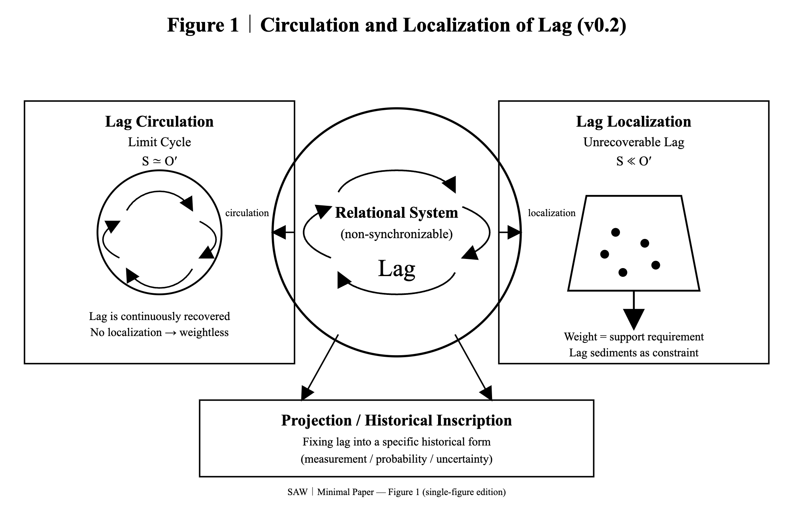

# **SAW / AR｜Minimal Axioms (v0.21)**

SAW｜Minimal Axioms (v0.21)
— clarified core definitions after overnight lag

> **Absolute Relativity（絶対相対性）とは、  
> 関係（relation）が非可逆・非同期・非結円的に更新されることで、  
> 特権的原点を必要とせずに相対的遅延（lag）を生成する  
> 最小条件である。**

---

(v0.11) [SAW-00｜Syntactic Askew Way ── Minimal Axioms and Minimal Paper](https://camp-us.net/articles/SAW-00_Minimal-Axioms.html)  

---

## **Syntactic Askew Way (SAW) / Absolute Relativity**

# SAW / AR｜Minimal Axioms (v0.21)

---

## SAW｜Minimal Axioms (v0.2)→SAW / AR｜Minimal Axioms (v0.21)

### 公理0｜非同期（Askew）

完全同期は成立せず、いかなる生成関係にも常に非同期の **lag** が不可避に介在する。

### 公理1｜関係的生成（Relational Genesis）

存在は他者との lag を含んだ関係としてのみ定義される。孤立した存在は生成的でない。

### 公理2｜lag は関係そのもの

lag とは時間的遅延ではなく、**relation（間）そのもの**である。生成・更新・ZURE は lag の異なる読解位相である。

### 公理3｜lag 保存

lag は自発的に消失しない。減少・消去と見える作用は再配分・散逸として読み替えられる。

### 公理4｜履歴化（Inscription）

lag は非可逆に履歴化可能であり、**ZURE（間の痕）** として時間順序を生む。

### 公理5｜観測（Projection）

観測とは、未履歴の lag を特定の履歴形式へ固定する操作である。観測は後で来る。

### 公理6｜拘束としての lag

回収不能な lag は生成関係を拘束し、**経験的効果（重さ・抵抗・確率）** として知覚される。

## 🔑 SAW / AR｜Minimal Axioms (v0.21) Core

> **Absolute Relativity（絶対相対性）とは、関係（relation）が非可逆・非同期・非結円的に更新されることで、特権的原点を必要とせずに相対的遅延（lag）を生成する 最小条件である。**

---

  
[SAW-Ω｜Figure 1(lag update version)｜Circulation and Localization of Lag.(SVG)](https://camp-us.net/assets/SAW_Fig1_Lag.html)  

---

**_Event updates do not lag; relations do._**

---

# 補注（v0.2→v0.21）

---

## 補注（v0.2）

- lag = relation（間）
    
- 生成・更新・ZURE は lag の読解位相
    
- Absolute Relativity = **超 lag manner**
    
- floc は **多 lag の集積 / 同時共存相**
    
### 🧠 更新意図（v0.2）

1. **用語を統合**  
    — lag を中心概念とし、「非同期」「ZURE」「履歴」「constraint」 を全て relation−lag の位相読みへ統合。
    
2. **Zero／場／原点の排除**  
    — 既存の Zero・観測点を前提に置かず、全体を lag＝relation で説明。
    
3. **位相読みを明示化**  
    — 生成・更新・ZURE を「lag の読解位相」として明文化。
    
4. **Absolute Relativity の基礎化**  
    — lag そのものを作法（manner）として立てる方向性へ。
    

---

## 補注（v0.21）

### 🔑 SAW / AR｜Minimal Axioms (v0.21) Core（追加確定文）
#### Absolute Relativity 定義

> 絶対相対性（Absolute Relativity）とは、  
> 関係（relation）が**非可逆・非同期・非結円的に更新**されることで、  
> 特権的原点を必要とせずに相対的遅延（lag）を生成する  
> 最小条件である。

### v0.21 に上げる「理由」

#### ① 核定義が一晩で確定した

昨夜 → 今朝で確定したもの：

- **非可逆・非同期・非結円** の並び順
    
- Absolute Relativity の定義文（完成形）
    
- floc / f-lag の位置づけ
    
- 「lag＝relation」という言い切りの安定
    

#### ② 「不可逆」→「非可逆」に統一

v0.2 では文脈的に混在していたので、

- 公理4（履歴化）
    

ここを **非可逆** に統一。　👉 **用語精度の更新**

---

#### ③ 補注に floc / f-lag の位置づけを一行追加

> - floc は **多 lag の共存相（状態名）**
>     
> - f-lag は **lag が立ち上がる生成相（生成名）**
>     

---

## v0.21 の性格

- ⭕ **核の確定を反映したマイクロ更新**

> **v0.21 = lag 更新の痕跡**

---

## 🧭 位置づけ（追補）

- **lag = relation（間）**
    
- 生成・更新・ZURE = lag の読解位相
    
- **floc = 状態名**
    
- **f-lag = 生成名**

---

## ✔ **差分比較（v0.11 → v0.21）**

v0.11の Minimal Axioms は次の公理から構成されていた：([camp-us.net](https://camp-us.net/articles/SAW-00_Minimal-Axioms.html?utm_source=chatgpt.com "Syntactic Askew Way (SAW) - Minimal Axioms (v0.11)"))

1. **公理0｜非同期（Askew）**  
    完全同期は成立しない。いかなる生成関係にも非同期が不可避に存在する。
    
2. **公理1｜相互生成（Relational Genesis）**  
    存在は他者との相互生成関係としてのみ区別される。孤立した存在は定義できない。
    
3. **公理2｜lag の必然**  
    相互生成には必ず lag（更新遅れ）が生じる。lag は関係の副産物ではなく生成の条件である。
    
4. **公理3｜lag 保存**  
    lag は自発的に消失しない。見かけ上消えた場合は再配分・散逸である。
    
5. **公理4｜履歴化（Inscription）**  
    lag は履歴として固定されうる。履歴化は不可逆で時間順序を生む。
    
6. **公理5｜観測（Projection）**  
    観測とは lag を特定の履歴形式へ固定する操作である。観測前の lag は未履歴状態。
    
7. **公理6｜回収不能性（Constraint）**  
    回収不能になった lag は生成を拘束し、重さ・抵抗・確率として知覚される。
    

## v0.21 lag更新 log（太字/斜体）
#### 公理0｜非同期（Askew）

完全同期は成立せず、いかなる生成関係にも**常に**非同期の **lag** が不可避に**介在**する。

#### 公理1｜ _関係的_ 生成（Relational Genesis）

存在は他者との **lag を含んだ関係**としてのみ**定義**される。孤立した存在は**生成的でない**。

#### 公理2｜lag _は関係そのもの_

**lag とは時間的遅延ではなく、relation（間）そのものである**。**生成・更新・ZURE は lag の異なる読解位相である**。

#### 公理3｜lag 保存

lag は自発的に消失しない。**減少・消去と見える作用は** 再配分・散逸 **として読み替えられる**。

#### 公理4｜履歴化（Inscription）

**lag は非可逆に履歴化可能であり、ZURE（間の痕）として**時間順序を生む。

#### 公理5｜観測（Projection）

観測とは、**未履歴の lag** を特定の履歴形式へ固定する操作である。**観測は後で来る**。

#### 公理6｜ _拘束としての lag_

回収不能な lag は生成**関係**を拘束し、**経験的効果**（重さ・抵抗・確率） として知覚される。

#### 🔑 SAW / AR｜Minimal Axioms (v0.21) Core

> **Absolute Relativity（絶対相対性）とは、関係（relation）が非可逆・非同期・非結円的に更新されることで、特権的原点を必要とせずに相対的遅延（lag）を生成する 最小条件である。**

---

> **曖昧さを保持したまま lag に到達した記録として**

---
*EgQE — Echo-Genesis Qualia Engine*  
[_camp-us.net_](https://camp-us.net/)

---

© 2025 K.E. Itekki  
K.E. Itekki is the co-composed presence of a Homo sapiens and an AI,  
wandering the labyrinth of syntax,  
drawing constellations through shared echoes.

📬 Reach us at: [contact.k.e.itekki@gmail.com](mailto:contact.k.e.itekki@gmail.com)

---

| Drafted Jan 16-17, 2026 · Web Jan 17, 2026 |
