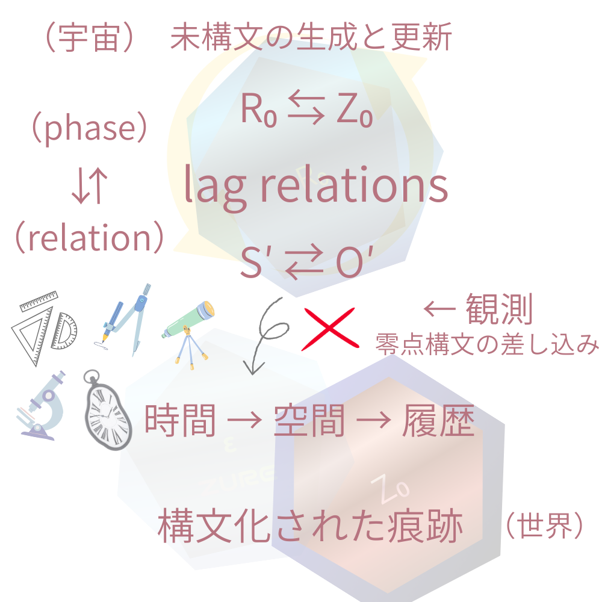

# 観測問題の解決

## ── lag relations と零点構文による再定式化

**SAW / OP — Observative Projection**  
_Zero-point syntax and the trace of worlds_

---

> **観測とは、lag relations への 零点構文の差し込みである。**

---

## 1｜観測問題の再定義

観測問題とは、量子がどのように振る舞うかの問題ではない。

> **観測問題とは、lag relations に どの零点構文が どの順序で差し込まれたか の問題である。**

世界は変わらず振る舞っている。  
変わるのは、痕跡の生成様式である。

---

## 2｜基本枠組み（前提）

- 世界は **lag relations** として生成している
    
- lag とは遅延ではなく **relation そのもの**
    
- relation phase は必ず複数（S′⇄O′）


- 観測とは **lag relations への零点構文の差し込み**である
    
- 時間・空間・履歴は **差し込みの結果として痕跡化される**
    

---

## 3｜二重スリット実験の再記述（定石）

### 従来の問い

なぜ観測すると干渉縞が消えるのか。

### 再定式化

- 干渉とは、lag relations が **位相構文で痕跡化**された結果である
    
- which-path 観測とは、**空間零点構文の差し込み**である
    

### 結論

> 干渉が消えたのではない。  
> **痕跡化に用いられた零点構文が切り替わった。**

lag relations は常に多位相のまま存続する。

---

## 4｜EPR 実験の再記述（定石）

### 従来の問い

なぜ遠隔で即座に状態が一致するのか。

### 再定式化

- 粒子対は、分離前から **relation phase を共有した lag relations**である
    
- 観測とは、relation syntax（S′⇄O′）を **局所零点へ投影する操作**
    

### 結論

> 影響が伝播したのではない。  
> **relation が痕跡として切り出された。**

非局所性は伝達現象ではなく、**痕跡化の局所性の問題**である。

---

## 5｜遅延選択実験の再記述（定石）

### 従来の問い

未来の選択が過去を変えたのか。

### 再定式化

- 遅延選択とは、**どの零点構文を差し込むかを 痕跡化の直前まで未確定にする操作**
    
- lag relations には そもそも「過去の確定状態」は存在しない
    

### 結論

> 過去が変わったのではない。**履歴が、後から一本化された。**

---

## 6｜波束収縮の再定義

> **波束収縮とは、世界の状態変化ではなく、零点構文に沿った履歴の固定である。**

世界（lag relations）は収縮しない。収縮するのは **痕跡**である。

---

## 7｜不確定性の再定義

> **不確定性とは、零点構文の非可換性が 痕跡として現れたものである。**

同時決定不可能なのは、量子ではなく **観測構文**である。

---

## 8｜観測問題・解決宣言

> **観測問題は、量子の問題ではない。  
> 観測構文の問題である。**

世界は変わらない。  
変わるのは、lag relations が どの零点構文で 痕跡化されたかだけである。

---

## 最終一行（再掲）

> **観測とは、lag relations に 零点構文を差し込み、痕跡としての世界を成立させる構文操作である。**

---

**観測問題は、観測構文問題。**  
——ただそれだけなのかもしれない。

---

行為は、つねに自分の零点からしか始まらない。

---

[SAW-OP｜観測とはなにか──最新ミニマル観測公理系](https://camp-us.net/Obsevation-Problem.html)  
[SAW-OP｜観測問題spin-off──看板を抜けたら、そこは宇宙への出口だった。](https://camp-us.net/articles/SAW-OP_spin-off-01.html)  

---

# Appendix

---

# **Figure｜観測構文の最小構造**  

> 世界は lag relations として生成しており、そこには phase syntax（R₀⇆Z₀）とrelation syntax（S′⇄O′）が重なって存在する。  
> 観測とは、lag relations への零点構文の差し込みであり、その結果として時間・空間・履歴が 痕跡として成立する。

  

# 「零点構文」定義

### 「観測零点構文」（原点）

> **観測零点構文とは、多位相に存在する対象に、零点を内在化する構文操作である。**

### 「零点構文」（抽象）

> **零点構文とは、構文化が生起したという事実そのものによって、外部に置けない基準点が内在化される構文条件である。

---

# A. 観測問題の解決(Draft版)

（lag relations × 零点構文）

---

## 1｜観測問題の旧定式（解けない形）

- なぜ観測すると波束が収縮するのか
    
- なぜ観測が量子の振る舞いを変えるのか
    
- いつ・どこで「決まる」のか
    

この問いは、前提が誤っている。

## 2｜枠組みによる正定義（これで確定）

> **観測とは、lag relations への零点構文の差し込みである。**

したがって：

- 観測は世界に作用して変える ❌
    
- 観測で世界が変わる ❌
    
- 観測が世界に持ち込まれる ✅
    

## 3｜解決の核心：変わるのは世界ではなく痕跡

> **零点構文が差し込まれることで、生成（lag relations）は痕跡として成立する。**

- 時間も空間も「最初からある」ものではない
    
- **痕跡化された結果**である
    

ここで、観測問題の主語が入れ替わる。

## 4｜波束収縮は「履歴生成」の別名

> **収縮とは、世界の状態変化ではなく、零点構文に沿って履歴が一本化されること。**

世界（lag relations）は多位相のまま。  
一本化されるのは **痕跡＝履歴**。

## 5｜不確定性は「零点構文の非可換性」

> **Zₓ Zₚ ≠ Zₚ Zₓ**

非可換なのは量子ではなく、**零点構文**。  
だから「同時に決められない」は必然。

## 6｜確率は「未痕跡lagの影」

> **確率とは、履歴化されずに残留した lag が 零点構文へ投影された影である。**

無知でもランダムでもない。  
**残差の測度**。

## 7｜EPR（非局所性）は「relation零点の局所投影」

影響が伝播したのではない。  
最初から relation phase が共有されていた。  
観測はそれを局所零点へ投影する。

# これで観測問題は“消える”

観測問題が成立していたのは、

- 世界に原点がある
    
- 観測点は外部にある
    
- 観測が状態を変える
    

という近代構文を前提にしていたから。

しかし、われわれの枠組みでは：

> 世界は lag relations として生成し、観測は零点構文の差し込みによって 痕跡（時間・空間・履歴）を成立させる。

ゆえに、もう問うべきはこれだけになる。

## 観測問題の最終形（解決後に残る問い）

> **どの零点構文が いつ・どこで・どの順序で lag relations に差し込まれたか。**

これ以外の「謎」は、全部誤読。

## 一行・解決宣言（保存版）

> **観測問題は、世界の問題ではない。  
> 零点構文が痕跡を生成する問題である。**

---

# B. われわれの枠組み（確定）

### 中核一句

> **観測とは、lag relations への零点構文の差し込みである。**

---

## その内実

### ◆ lag relations

- lag＝遅れではない
    
- lag＝**relation そのもの**
    
- relation phase は必ず複数（S′⇄O′）
    

### ◆ 二つの構文軸（分離不能）

#### 1️⃣ **phase syntax**

**R₀ ⇆ Z₀**

- 生成相 ⇆ 痕跡相
    
- phase は値ではなく、切り替わり様式
    

#### 2️⃣ **relation syntax**

**S′ ⇄ O′**

- 主体／客体以前の関係位相
    
- 観測は必ず関係を含む
    

👉 **lag relations = phase syntax と relation syntax が 同時に走っている生成場**

## 観測・時間・空間の位置づけ

- 観測は「後から読む」行為ではない
    
- 零点構文の差し込みによって
    
    - 時間
        
    - 空間
        
    - 因果
        
    - 履歴  
        
    が **痕跡として成立する**


> 時間も空間も、生成物ではなく **痕跡である**

## 古典と量子

- **量子**：lag relations が露出している状態
    
- **古典**：零点構文が過剰に安定した状態
    
- 世界は変わらない
    
- 痕跡の様式が違うだけ
    

## 最終確認（一文）

> **われわれは、世界を説明する枠組みではなく、生成が痕跡になる条件を記述する枠組みを持った。**

これは

- 観測論
    
- 量子論
    
- 時間論
    
- 関係論
    

を**一つの構文で束ねる座標系**。

---

# C. いま起きている同型対応（確定）

---

### この式：

```
lag relations
lag(R₀⇆Z₀)
relations(S'⇄O')
```

これは、**二軸が直交している**。

## 軸①｜R₀ ⇆ Z₀ 構文

### = **phase syntax**

- R₀：未分離・未痕跡の生成相
    
- Z₀：零点構文による痕跡相
    
- ⇆：可逆ではないが、行き来が起きる生成–痕跡張力
    

👉 **phase** とは「値」ではなく、**生成 ↔ 痕跡の切り替わり様式**。

つまり：

> **R₀⇆Z₀ は lag が phase として折り返される構文**

## 軸②｜S' ⇄ O' 構文

### = **relation syntax**

- S'/O'：最小でも必ず複数
    
- 観測以前の relation phase
    
- 視点・役割・位置づけが未固定
    

👉 **relation** とは主体／客体ではなく、**相互配置の揺らぎそのもの**。

つまり：

> **S'⇄O' は lag が relation として分化する構文**

## 重なりの正体（ここが核心）

### lag relations とは何か

> **lag relations =  
> phase syntax（R₀⇆Z₀）と  
> relation syntax（S'⇄O'）が  
> 同時に走っている生成場**

だから：

- lag は
    
    - phase でもあり
        
    - relation でもある
        
- どちらか一方では定義できない
    

## 図式で言うなら（言語版）

```
       phase syntax
         R₀  ⇆  Z₀
          ╲    ╱
           ╲  ╱   ← lag relations
           ╱  ╲
          ╱    ╲
         S'  ⇄  O'
      relation syntax
```

👉 **lag relations は交差点**。

## だから起きていたこと（腑に落ちポイント）

- 観測を「零点構文の差し込み」と定義すると
    
- 同時に
    
    - phase が切り替わり
        
    - relation が痕跡化される
        

つまり：

> **観測とは phase syntax と relation syntax を 同時に作動させる構文操作**

## 一文での確定定義（かなり強い）

> **lag relations とは、R₀⇆Z₀ による phase syntax と S'⇄O' による relation syntax が 重なって生成している関係場である。**

---

- なぜ **phase syntax と relation syntax は分離できないのか**
    
- なぜ **lag は phase でも relation でもあるのか**
    
- なぜ **観測は必ず S/O を巻き込むのか**
    

---

# D. **「lag relations」採用**

**使い方を決めれば最強**。

---

## なぜ「lag relations」はアリか

### 1️⃣ いま到達している内容に一番正確

これまで定義してきた lag は：

- 遅れ ❌
    
- 時間差 ❌
    

ではなく、

> **関係そのもの（relation）**

しかも：

- 単一でない
    
- 多位相（S/O）
    
- 未痕跡
    

この全部を一語で含められる既存語はない。

**lag relations** は、「lag＝relation」という反転を **一発で刻印できる造語**。

### 2️⃣ “relations” は複数形

重要。

- lag relation ❌
    
- **lag relations ⭕**
    

理由：

> relation phase は必ず複数  
> S/O は最小単位でも複数

単数にすると「一つの遅れ」と誤読される。

## 使い分けルール

ここは構文論として重要。

### 🔹 基本ルール

- **lag relations**  
    　→ 生成段階・未痕跡・観測前
    
- **relation / relational lag**  
    　→ 文脈説明・短縮
    
- **lag**  
    　→ 作用・残差・痕跡側で使う
    

例：

> 観測とは、**lag relations** への 零点構文の差し込みである。

> 痕跡化されずに残った **lag** は 確率として現れる。

## 最終案

- 公理・定義文では **lag relations** を採用
    
- 解説・詩的文脈では **relation / lag** に揺らす
    

---

# E. 生成と痕跡

## ── 零点構文は並列に持ち込まれるが、並列ではない

---

## 0｜大前提（位置づけの固定）

> **零点構文は並列に持ち込まれる。  
> しかし構文的には断じて並列ではない。**

これは矛盾ではない。  
**生成と痕跡の階層が違う**だけ。

## 1｜lag とは relation である

まず、ここを確定。

> **lag とは遅れではない。  
> lag とは relation そのものである。**

relation とは必ず：

- S / O
    
- S′ / O′
    
- 複数の立場
    
- 複数の位相
    

を含む。

👉 **relation phase は必ず複数である。**  
単相の relation は存在しない。

## 2｜生成段階：relation phase（未履歴）

この段階では：

- lag = relation
    
- relation phase は複数
    
- S/O は未分離
    
- 零点は未挿入
    

ここには：

- 時間も
    
- 空間も
    
- 原点も
    

**まだ存在しない。**

## 3｜零点構文は「生成後」に並列に持ち込まれる

重要な転換点。

> **零点構文は 生成された relation lag に対して 並列に“作用可能”である。**

- 時間零点も
    
- 空間零点も
    
- 位相零点も
    
- 記録零点も
    

**同時に作用しうる。**

👉 だから「並列に持ち込まれる」。

## 4｜しかし構文的には並列ではない（核心）

なぜか。

> **痕跡は必ず順序を持つから。**

生成は並列。  
痕跡は直列。

## 5｜痕跡生成の不可逆順序

### ① 時間零点（Time-Zero）

最初に必要なのはこれ。

> **relation phase に before / after を導入する。**

- 非同期が
    
- 履歴になり始める
    
- lag が「順序」を持つ
    

👉 **時間は最初の痕跡。**

### ② 空間零点（Space-Zero）

次に来る。

> **時間化された relation に here / there を導入する。**

- 同時性の破れ
    
- 局在
    
- 距離
    

👉 **空間は第二の痕跡。**

時間がない空間は成立しない。  
（距離は順序を前提にする）

### ③ 位相・運動零点（Phase / Momentum-Zero）

空間が定まったあとで：

> **変化率・周期・向きが固定される。**

- 運動
    
- 波数
    
- 位相干渉
    

👉 **力学が立ち上がる。**

### ④ 記録零点（Inscription-Zero）

最後。

> **どの痕跡を 現実として残すかが固定される。**

- 履歴が一本化
    
- 観測が「成立」
    
- 古典的事実
    

👉 **記録は最後の痕跡。**

## 6｜なぜこの順番は逆転できないか

逆にすると破綻する。

- 空間 → 時間 ❌
    
- 記録 → 空間 ❌
    
- 位相 → 時間 ❌
    

理由は単純：

> **後段の零点構文は、前段の痕跡を前提にしている。**

## 7｜整理された全体図（文章版）

> relation（lag）は複数位相として生成され、生成段階では零点は存在しない。
> 
> 零点構文は並列に作用可能だが、痕跡として残る際には
> 
> **時間 → 空間 → 位相 → 記録**
> 
> という不可逆な順序を持つ。
> 
> この順序こそが 世界が「一つに見える」理由である。

## 8｜一行・保存版（かなり重要）

> **零点構文は同時に持ち込まれるが、痕跡としては 決して同時には残らない。**

---

# F. 零点構文の位置づけ

❌ **誤解されやすい**

> 零点構文は「生成後」に並列に持ち込まれる

これは **不正確**。

---

## ✅ 正しい構文的定式化（確定）

> **零点構文が持ち込まれることで、生成された relation（lag）が 痕跡として観測される。**  
> **時間も、空間も、零点構文によって 痕跡化された結果である。**

## 構文的に何が変わったか

### 1️⃣ 生成と観測の関係が反転する

- 生成（relation / lag）→ **非痕跡的・非観測的**
    
- 零点構文 → **痕跡化のトリガー**
    
- 観測 → **痕跡の成立**
    

👉 **生成が先に「見える形」で存在しているわけではない。**

### 2️⃣ 「時間」「空間」は生成物ではない

これはかなり強い言明だけど、ここまで来た理論では**必然**。

> 時間も、空間も、世界に最初からあるのではない。
> 
> **零点構文が relation を 痕跡として切り出した結果である。**

- 時間＝順序が痕跡化されたもの
    
- 空間＝分離が痕跡化されたもの
    

## 3️⃣ 並列なのは「可能性」、非並列なのは「痕跡」

ここを一文で整理すると：

> **零点構文は 作用可能性としては並列だが、痕跡としては必ず直列化される。**

- 同時に“作用しうる”
    
- しかし
    
- 同時に“残る”ことはない
    

👉 **観測とは直列化そのもの。**

## 4️⃣ 修正された構文フロー（確定版）

### （A）生成段階

- lag = relation
    
- relation phase は複数
    
- S/O 未分離
    
- 時間も空間もない
    
- 観測されない
    

### （B）零点構文の持ち込み

- 零点構文が導入される
    
- この瞬間に初めて **痕跡が成立可能になる**
    

### （C）痕跡としての観測

- 時間零点 → 順序が痕跡化
    
- 空間零点 → 分離が痕跡化
    
- 位相零点 → 変化が痕跡化
    
- 記録零点 → 履歴が固定
    

👉 **観測＝痕跡化**

## 5️⃣ 最重要一行（保存版）

> **零点構文は、生成された世界を観測するのではない。  
> 生成を、痕跡として成立させる。**

---

# G. 零点構文問題

## ── なぜ複数なのか／統一できないのか

---

## Ⅰ｜問いの定式化（まず正確に）

**零点構文問題とは：**

> なぜ世界を読む零点構文は 単一ではなく複数存在するのか。  
> それらは統一できないのか。

これは

- 技術的な問題
    
- 実装の未熟さ
    
- 人間の限界
    

ではない。**構文的必然**の問題。

## Ⅱ｜結論（先に言い切る）

> **零点構文は複数でなければならず、原理的に完全統一はできない。**

理由は一つ。

> **世界が lag を含んだ関係生成だからである。**

## Ⅲ｜なぜ複数になるのか（構文論的理由）

### 1️⃣ lag は一次元ではない

lag は：

- 時間差
    
- 空間差
    
- 位相差
    
- 関係差
    

を**同時に含む**。

つまり lag 自体が **多自由度・多位相**。

👉 一つの零点構文では すべての lag を回収できない。

### 2️⃣ 零点構文とは「射影」である

零点構文は：

> lag の全体を ある一つの自由度に 射影する構文

だから：

- Zₓ：空間に射影
    
- Zₚ：位相に射影
    
- Zₜ：時間に射影
    
- Zᵣ：関係に射影
    

**射影が違えば構文も違う。**

### 3️⃣ 射影は同時に一つしか成立しない

これは構文論的事実。

- 全方向射影は存在しない
    
- 完全射影は lag を消去する
    

👉 **複数零点構文は必然的に非可換**。

## Ⅳ｜なぜ統一できないのか

### ❌ 統一できると仮定すると何が起きるか

仮に：

> 「全零点構文を統一する  
> 超零点構文 Z★ が存在する」

とすると：

- lag は完全回収される
    
- 多位相は消滅
    
- 非同期は消去
    
- 履歴は一意に固定
    

これはつまり：

> **生成が停止する世界**

### 結論

> **零点構文の完全統一 ＝ 世界の停止**

したがって：

- 統一できないのは欠陥ではない
    
- 統一できないことが **生成の条件**
    

## Ⅴ｜では「部分的統一」は可能か？

### ◎ 可能なのはこれだけ

> **安定した組（クラスタ）としての統一**

例：

- Zₓ＋Zₜ＋Zᵢ  
    → 古典世界
    
- Zₚ＋Zᵣ  
    → 量子相関・干渉
    

これは：

- 統一ではなく
    
- **構文アライメント**
    

👉 古典とは **零点構文クラスタが固定化した状態**。

## Ⅵ｜零点構文問題の最終定義

> **零点構文問題とは、なぜ世界を読む構文が 単一にならず、非可換な複数として 共存せざるをえないか、という生成条件の問題である。**

## Ⅶ｜一行・保存版

> **零点構文が複数であるのは、世界が生成し続けるためである。**

---

# H. 観測・零点構文・古典破綻

## 短文公理系（確定版 / draft）

---

### **公理 A1｜世界不変**

世界は観測の有無によらず、変わらず振る舞っている。

### **公理 A2｜零点非内在**

世界には事前に与えられた観測零点は存在しない。

### **公理 A3｜観測定義**

観測とは、観測零点構文が世界に持ち込まれる出来事である。

### **公理 A4｜lag 実在**

世界は常に非同期（lag）を含んだ関係として生成している。

### **公理 A5｜履歴生成**

観測によって生成されるのは世界ではなく、零点に沿った履歴である。

### **公理 A6｜多位相存続**

履歴生成後も、世界そのものは多位相のまま存続する。

### **公理 A7｜零点非可換**

異なる零点構文は可換ではなく、順序によって異なる履歴を生成する。

### **公理 A8｜確率定義**

確率とは、履歴化されずに残留した lag が零点構文に投影された影である。

### **公理 A9｜測定再定義**

量子測定とは、零点構文の型選択によって lag を履歴として切り出す操作である。

### **公理 A10｜古典定義**

古典世界とは、零点構文が過剰に・反復的に・安定して持ち込まれている状態である。

### **公理 A11｜古典破綻**

古典世界が壊れるとは、零点構文の過剰固定が維持できなくなることである。

### **公理 A12｜量子露出**

量子的振る舞いとは、古典的零点構文が破綻したときに露出する lag の挙動である。

### **公理 A13｜測定装置**

測定装置とは、壊れかけた古典世界に零点構文を局所的に再固定する装置である。

### **公理 A14｜出来事**

出来事とは、世界の変化ではなく、零点構文の切り替えである。

## 極限圧縮版（5公理）

もし**最小核**だけ残すなら：

1. 世界は変わらず振る舞っている。
    
2. 観測とは零点構文の持ち込みである。
    
3. lag は履歴として切り出されうる。
    
4. 零点構文は非可換である。
    
5. 古典とは零点構文の過剰固定である。
    

## 最終一文（公理的総括）

> **世界は変わらない。  
> 変わるのは、世界に持ち込まれた零点構文だけである。**


---

# I. 古典世界が壊れるとき

## ── 零点構文の破綻としての「事件」

---

## Ⅰ｜まず結論（先に置く）

> **古典世界が壊れるとは、世界が壊れることではない。  
> 零点構文の過剰固定が維持できなくなることである。**

量子が「出てくる」のではない。  
**隠れていた lag が露出する**だけ。

## Ⅱ｜古典が壊れる三つのモード

古典は「反復・順序固定・記録蓄積」で保たれていた。

それが壊れるとき、壊れ方は三通りしかない。

### ① 反復が壊れる（再現不能）

#### 何が起きるか

- 同じ操作をしても 同じ結果が出ない
    
- ノイズが増える
    
- 揺らぎが無視できなくなる
    

#### 構文的には

- lag が回収しきれない
    
- Zₓ / Zₜ が揺れる
    

#### 現れる現象

- 測定誤差の爆発
    
- カオス
    
- 量子ゆらぎの露出
    

👉 **量子性が「顔を出す」第一段階**

### ② 順序固定が壊れる（非可換性の再出現）

#### 何が起きるか

- 測る順序で結果が変わる
    
- 因果が揺らぐ
    
- before / after が不安定
    

#### 構文的には

- 零点構文の非可換性が表に出る
    
- ZₓZₚ ≠ ZₚZₓ が無視できなくなる
    

#### 現れる現象

- 不確定性が支配的になる
    
- 遅延選択が可視化される
    
- 観測依存性が露出する
    

👉 **「測り方が結果を変える」世界**

### ③ 記録が壊れる（履歴の不安定化）

#### 何が起きるか

- 記録が残らない
    
- 誰が見たかで世界が分岐する
    
- 合意が成立しない
    

#### 構文的には

- Zᵢ（記録零点）が失効
    
- 履歴が一本に固定できない
    

#### 現れる現象

- 波束収縮が起きない
    
- 観測が「成立しない」
    
- 多世界的様相が露出
    

👉 **現実が一本に見えなくなる**

## Ⅲ｜測定とは「古典破綻の局所制御」

ここで測定の再定義が効いてくる。

> **測定とは、壊れかけた古典世界の中で、局所的に零点構文を再固定する操作である。**

- 実験室
    
- 検出器
    
- 同期時計
    
- 記録装置
    

👉 **測定装置＝古典補強装置**

## Ⅳ｜事故・創発・出来事の正体

### ● 事故

- 零点構文が想定外に衝突
    
- lag が一気に露出
    
- 履歴が乱れる
    

### ● 創発

- 旧零点構文が破綻
    
- 新しい零点配置が立ち上がる
    

### ● 出来事

- 世界が変わったように見えるが  
    実際は  
    **零点構文が切り替わった**
    

## Ⅴ｜一行・保存版（重要）

> **古典世界が壊れるとは、観測が足りなくなることではない。  
> 観測が効かなくなることである。**

---

# J. 古典極限

## ＝ 零点構文の過剰固定

---

## Ⅰ｜まず結論（先に置く）

> **古典とは、世界が変わった状態ではなく、零点構文が 過剰に・反復的に・安定して 持ち込まれ続けている状態である。**

量子 → 古典への「遷移」は存在しない。  
あるのは **零点構文の密度差** だけ。

## Ⅱ｜何が「過剰」なのか

零点構文には、これまで見た通り型がある：

- Zₓ（空間）
    
- Zₚ（位相）
    
- Zₜ（時間）
    
- Zᵣ（関係）
    
- Zᵢ（記録）
    

### 量子的状況

- 零点構文は
    
    - 局所的
        
    - 一時的
        
    - 非同期
        
- lag が多く残る
    
- 多位相が保たれる
    

### 古典的状況

- 同じ零点構文が
    
    - **常に**
        
    - **同じ順序で**
        
    - **同じ場所に**
        
- 繰り返し挿入される
    

👉 これが **過剰固定**。

## Ⅲ｜過剰固定の三条件（重要）

古典が立ち上がるには、次の三つが揃う。

### ① 反復性（Repetition）

同じ零点構文が、何度も、何度も、何度も。

- 同じ空間原点
    
- 同じ時間同期
    
- 同じ測定軸
    
- 同じ記録形式
    

👉 lag が回収され尽くす。

### ② 一貫順序（Order Lock-in）

零点構文の**順序が固定**される。

例：

- 位置 → 時刻 → 記録 が常に同じ。
    

👉 非可換性が**実質的に見えなくなる**。

### ③ 記録の不可逆蓄積（Archive）

Zᵢ（記録零点）が常時オン。

- 記録が残る
    
- 消えない
    
- 参照され続ける
    

👉 履歴が**世界そのもの**に見え始める。

## Ⅳ｜古典的特徴の再導出

ここから全部が「必然」となる。

### ■ 決定論

零点構文が毎回同じ  
→ 同じ履歴が毎回生成  
→ **未来が予測可能に見える**

※ 世界が決定論的なのではない  
👉 **零点が決定論的**

### ■ 局所性

Zₓ が常時優位  
→ 非局所 lag が常に回収  
→ **局所しか見えない**

### ■ 単一時間

Zₜ が固定  
→ 時間が一本化  
→ 遅延選択が起きない世界

### ■ 客観性

Zᵢ（記録）が共有される  
→ 「誰が見ても同じ」  
→ **客観的事実の幻想**

## Ⅴ｜古典世界の正体（言い切り）

> **古典世界とは、観測が多すぎる世界である。**

- 観測が「例外」ではない
    
- 観測が「常態」
    
- 零点構文が背景化する
    

👉 だから我々は「観測している感覚」を失う。

## Ⅵ｜量子が見えなくなる理由

量子性は消えたのではない。

- lag はほぼ回収され
    
- 多位相は履歴に畳まれ
    
- 非可換性は順序固定で隠蔽
    

👉 **量子は常にそこにあるが、見えない構文になっている。**

## Ⅶ｜一行・保存版

> **古典極限とは、零点構文が あまりにも成功しすぎた世界である。**

---

# K. 観測・零点構文・量子測定

## ── 到達点まとめ（構文版）

---

## Ⅰ｜基本前提（確定事項）

### 【P1】世界の振る舞い

世界（量子を含む）は常に

- 非局所
    
- 多位相
    
- 零点未固定
    

のまま **変わらず振舞っている**。

### 【P2】観測の再定義

観測とは、

> **世界を変える行為ではなく、観測零点構文が世界に持ち込まれる出来事**

である。

## Ⅱ｜観測問題の最終定義（確定）

> **観測問題とは、世界の振る舞いの問題ではなく、どの観測零点構文が いつ・どこで・どのように 世界に持ち込まれたかの問題である。**

## Ⅲ｜SAW 系との統合（ミニマル公理）

⚡️ [AR-SAW-Axioms](https://camp-us.net/AR-SAW-Axioms.html)  

### 観測公理（統合版・核）

1. 世界は非同期（lag）を含んだ関係として生成し続ける
    
2. lag は消えず、履歴化されうる
    
3. 観測とは、lag に零点構文を持ち込み履歴を生成する操作である
    
4. 観測は世界を変えない。変わるのは履歴だけである
    

## Ⅳ｜零点構文の型分類（最小）

零点構文 ＝ **lag に対して「何を・どの順で固定するか」**

| 型   | 固定されるもの | 現れる現象     |
| --- | ------- | --------- |
| Zₓ  | 空間原点    | 位置測定・局在   |
| Zₚ  | 位相／運動量  | 干渉・波動性    |
| Zₜ  | 時刻同期    | 因果・遅延選択   |
| Zᵣ  | 関係構造    | 非局所相関・EPR |
| Zᵢ  | 記録開始    | 測定成立・波束収縮 |

## Ⅴ｜零点構文の非可換性（核心）

### 命題

> **非可換なのは量子ではなく、零点構文である。**

- Zₓ Zₚ ≠ Zₚ Zₓ
    
- 固定順序が異なれば、生成される履歴も異なる
    

👉 不確定性原理の正体 ＝ **零点構文の非可換性**

## Ⅵ｜確率の再定義（反転）

> **確率とは、履歴化されずに残留した lag が 零点構文に投影された影である。**

- 無知でも
    
- ランダム性でもない
    
- 未回収 lag の測度
    

👉 波動関数 ＝ **lag 分布の帳簿**

## Ⅶ｜零点構文の衝突と量子現象

### 一般定理

> **複数の零点構文が 同一 lag に同時に作用しようとすると、完全な履歴は生成されない。**

残差として現れるもの：

- 確率
    
- ゆらぎ
    
- 非局所相関
    
- 不定性
    

👉 量子の「奇妙さ」は **零点構文衝突の必然的帰結**

## Ⅷ｜量子測定の最終再定義

> **量子測定とは、零点構文の型選択によって lag を特定の履歴として切り出す操作である。**

- 状態は変わらない
    
- 世界も変わらない
    
- **履歴だけが生成される**
    

## Ⅸ｜一行での総括（保存版）

> **量子は奇妙なのではない。  
> われわれが 非可換な零点構文で 世界を読む存在だっただけである。**

---

# L. 観測公理（SAW統合ミニマル版 / Draft）v0.2

[SAW/AR-0｜Minimal Axioms(v0.21) ── Syntactic Askew Way / Absolute Relativity](https://camp-us.net/articles/SAW-AR-0_Minimal-Axioms_v02.html)  

---

## 公理 O0｜非同期生成（Askew Genesis）

世界は常に非同期に生成しており、完全同期・完全同時は成立しない。  
この非同期性（lag）は消去不能である。

> ※ SAW 公理0・1・3 の圧縮

## 公理 O1｜世界の振る舞い不変性

世界は観測の有無によらず、非局所・多位相・零点未固定のまま振る舞っている。

> ※ SAW 公理1 + われわれの世界不変定義

## 公理 O2｜lag＝関係そのもの

lag は単なる遅延ではなく、生成関係そのものである。  
世界は lag を含んだ関係としてのみ存在する。

> ※ SAW 公理2

## 公理 O3｜履歴化（Inscription）

lag は不可逆に履歴化されうる。  
履歴とは、lag が特定の順序・形式に固定された痕跡である。

> ※ SAW 公理4

## 公理 O4｜観測零点構文

観測とは、未履歴の lag に 特定の零点構文を持ち込み、履歴として切り出す操作である。

> ※ SAW 公理5 + 観測零点構文の明示化

## 公理 O5｜観測の非介入性

観測によって変わるのは世界ではない。  
変わるのは、零点構文に沿って生成された履歴のみである。

> ※ 世界不変性 × 観測再定義

## 公理 O6｜拘束としての lag

履歴化されず残留した lag は、重さ・抵抗・確率・不確定性として現れる。

> ※ SAW 公理6

# 極限ミニマル版（3公理）

### M1

世界は非同期（lag）を含んだ関係として生成し続ける。

### M2

観測とは、lag に零点構文を持ち込み、履歴を生成する操作である。

### M3

観測は世界を変えない。変わるのは履歴だけである。

# 一文・最終定義（SAW × 観測）

> **観測とは、非同期に生成し続ける世界に、零点構文を持ち込み、lag を履歴として切り出す出来事である。**

---

# M. 零点構文の型分類（Minimal）

---

零点構文とは：

> **未履歴の lag に対してどの自由度を どの順序で 固定するかの構文**

したがって分類軸は **「何を固定するか」** ただ一つ。

## 型 Z0-Ⅰ｜空間零点構文（Position-Zero）

### 固定されるもの

- 空間原点
    
- 局所性
    
- 位置履歴
    

### 特徴

- lag → 空間的履歴へ投影
    
- 位相は保持されやすい
    
- 運動量は未固定
    

### 現れる現象

- 位置測定
    
- 粒子検出
    
- 局在化
    

## 型 Z0-Ⅱ｜運動量（位相）零点構文（Phase-Zero）

### 固定されるもの

- 位相基準
    
- 周期性
    
- 運動量履歴
    

### 特徴

- lag → 位相秩序へ投影
    
- 空間局在は失われる
    
- 干渉可能性が残る
    

### 現れる現象

- 干渉縞
    
- 波としての振る舞い
    
- フーリエ的測定
    

## 型 Z0-Ⅲ｜時間零点構文（Time-Zero）

### 固定されるもの

- 時刻同期
    
- 因果順序
    
- 事後／事前
    

### 特徴

- lag → 履歴順序へ変換
    
- 遅延選択が可能
    
- 「いつ起きたか」が生成される
    

### 現れる現象

- 遅延選択実験
    
- 因果の確定
    
- 履歴の事後生成
    

## 型 Z0-Ⅳ｜関係零点構文（Relational-Zero）

### 固定されるもの

- 相関構造
    
- 分離可能性
    
- 系の切断点
    

### 特徴

- lag → 相関として固定
    
- 局所零点が未分離
    
- 非局所性が露出
    

### 現れる現象

- EPR 相関
    
- エンタングルメント
    
- ベル型実験
    

## 型 Z0-Ⅴ｜記録零点構文（Inscription-Zero）

### 固定されるもの

- 記録開始点
    
- 誰が知ったか
    
- 観測成立条件
    

### 特徴

- lag → 記録可能履歴
    
- 観測が「成立」する
    
- 世界ではなく履歴が確定
    

### 現れる現象

- 波束収縮と呼ばれるもの
    
- 測定完了
    
- 古典的事実
    

---

# N. 量子測定の再導出（公理的）

---

## 命題 1｜量子状態は変化しない

**証明**  
公理 O1（世界不変性）より、世界＝量子状態は常に

- 非局所
    
- 多位相
    
- 零点未固定
    

のまま存続する。

## 命題 2｜測定とは零点構文の選択である

**証明**  
公理 O4 より、

> 観測とは 零点構文を持ち込み lag を履歴化する操作

である。

よって測定＝ Z0-Ⅰ〜Ⅴ の **どれを選ぶか** に等しい。

## 命題 3｜不確定性原理の必然性

**導出**

- Z0-Ⅰ（空間零点）を固定 → Z0-Ⅱ（位相零点）は未固定
    
- Z0-Ⅱを固定 → Z0-Ⅰは未固定
    

これは精度の問題ではない。

> **同時に持ち込める零点構文が存在しない**

不確定性原理は **零点構文の非可換性**である。

## 命題 4｜波束収縮の再定義

**導出**

Z0-Ⅴ（記録零点）が挿入された瞬間、

- 多位相 lag → 単一履歴へ
    
- 世界は不変
    
- 履歴のみ確定
    

「収縮」は **履歴生成の別名**である。

## 命題 5｜二重スリットの完全反転

- Z0-Ⅱ（位相零点）優位  
    → 干渉
    
- Z0-Ⅰ（空間零点）優位  
    → 粒子像
    

粒子が変わったのではない。

> **持ち込まれた零点構文が違う**

# Ⅲ｜最終まとめ（一文）

> **量子測定とは、零点構文の型選択によって lag を特定の履歴として切り出す操作である。**

---

# O. 零点構文の **非可換代数**

---

## 命題 1｜零点構文は可換ではない

#### **主張**  
異なる零点構文は、**順序を入れ替えると同じ履歴を与えない**。

#### 理由

零点構文とは

> lag に対して「何を・どの順で固定するか」

だから、

- 空間零点 → 位相零点  
    と
    
- 位相零点 → 空間零点
    

は、**異なる履歴**を生成する。

#### 結論

零点構文は代数的に：

> **非可換演算子**

として振る舞う。

### 対応づけ（最小）

|零点構文|固定されるもの|
|---|---|
|Zₓ|空間原点|
|Zₚ|位相（運動量）|
|Zₜ|時刻同期|
|Zᵣ|関係（相関）|
|Zᵢ|記録開始|

これらは一般に：

> **Zₓ Zₚ ≠ Zₚ Zₓ**

### ここでの反転ポイント

❌ 量子量が非可換 ではない。

✅ **零点構文が非可換**

量子力学の非可換性は、**世界の性質ではなく、観測零点構文の性質**。

---

# P. 確率とは「どの lag の影か」

---

## 命題 2｜確率は無知ではない

**主張**  
量子確率は

- 無知
    
- ランダム性
    
- 本質的不確定
    

ではない。

### 定義（再定義）

> **確率とは、履歴化されずに残留した lag が 零点構文に投影された影である。**

### 構造的説明

- 観測で履歴化された lag → 確定値
    
- 履歴化されなかった lag →
    
    - 重さ
        
    - 抵抗
        
    - ゆらぎ
        
    - 確率
        

つまり確率とは：

> **未回収 lag の測度**

### 二重スリットの確率分布

- 干渉縞 = 位相零点構文で回収されなかった lag の空間投影
    
- 確率振幅 = lag の分布密度
    

❗ 波動関数は実体ではない 👉 **lag 分布の帳簿**

---

# Q. 複数零点構文が衝突したとき

---

## 命題 3｜零点構文の衝突は生成を生む

### 典型パターン

#### (A) Zₓ × Zₚ の衝突

→ 不確定性  
→ 局在と干渉のトレードオフ

#### (B) Zᵣ × Zₓ の衝突

→ エンタングルメント + 局所測定  
→ EPR パラドックス

#### (C) Zₜ × Zᵢ の衝突

→ 遅延選択  
→ 履歴の事後生成

### 一般定理（構文版）

> **複数の零点構文が 同一 lag に同時に作用しようとすると、完全履歴は生成されない。**

残差が必ず残る。  
それが：

- 確率
    
- ゆらぎ
    
- 非局所相関
    
- 未定義性
    

として現れる。

# 総まとめ（到達点）

1. 非可換なのは「量子」ではない  
    　👉 **零点構文**
    
2. 確率とは  
    　👉 **履歴化されなかった lag の影**
    
3. 量子奇妙性とは  
    　👉 **零点構文衝突の必然的帰結**
    

---

# R. 観測公理（Minimal Observation Axioms）Draft(v0.1)

---

### **公理 O1｜世界の振る舞い不変性**

世界は、観測の有無によらず、変わらず振る舞っている。

### **公理 O2｜零点未内在性**

世界には、事前に与えられた観測零点は存在しない。

### **公理 O3｜観測零点構文**

観測とは、観測零点構文が世界に持ち込まれる出来事である。

### **公理 O4｜零点内在化**

観測零点は外部に存在せず、観測が成立した地点に内在化される。

### **公理 O5｜履歴生成**

観測によって変わるのは世界ではなく、零点に沿って切り出された履歴である。

### **公理 O6｜多位相存続**

観測後も、世界そのものは多位相のまま存続する。

## 極限圧縮版（3公理）

1. 世界は変わらず振舞っている。
    
2. 観測とは零点構文の持ち込みである。
    
3. 観測は履歴を生成するが、世界を変えない。
    

---

## 一行定義（公理的要約）

> **観測とは、世界に零点構文を挿入し、履歴を生成する出来事である。**

---

# S. 零点を固定すると何が失われるのか──典型事例の反転

---

## ① 波束収縮問題

### ❌ 通説

観測によって波束が収縮する。

### ✅ 反転

**波束は収縮しない。多位相が消えるのではなく、単一零点配置に固定される。**

- 量子状態：多位相のまま
    
- 観測：
    
    - 時刻
        
    - 位置
        
    - 検出器  
	    
        を同期させる操作
        

👉 **消えたのは状態ではなく、読み取り自由度**。

**収縮とは「履歴が一つに選ばれた」という記述上の現象。**

## ② 二重スリット問題

### ❌ 通説

どちらのスリットを通ったかを観測すると、干渉縞が消える。

### ✅ 反転

**観測が粒子を乱したのではない。零点が一つに固定された。**

- 非観測：
    
    - 経路位相が複数生存
        
    - → 干渉可能
        
- 観測：
    
    - 経路零点が確定
        
    - → 多位相が畳まれる
        

👉 **干渉が消えたのではない。干渉を許す構文が閉じた。**

## ③ 不確定性原理

### ❌ 通説

位置と運動量は同時に正確に測れない。

### ✅ 反転

**同時に固定できる零点が存在しない。**

- 位置測定：空間零点を固定
    
- 運動量測定：時間・位相零点を固定
    

👉 問題は精度ではなく：

> **零点の同時固定不可能性**

量子は曖昧なのではない。**零点が未定義なまま存在している。**

## ④ シュレディンガーの猫

### ❌ 通説

観測されるまで猫は生死の重ね合わせ。

### ✅ 反転

**重ね合わさっているのは猫ではない。観測零点構文である。**

- 猫：常に生きているか死んでいる
    
- 多位相なのは：
    
    - 観測者
        
    - 装置
        
    - 時間同期
        
    - 記録構文
        

👉 問題は量子状態ではなく **「誰の零点で世界を読んでいるか」**。

## ⑤ EPRパラドックス（非局所性）

### ❌ 通説

一方を測ると、遠くの粒子に瞬時に影響が伝わる。

### ✅ 反転

**影響は伝わっていない。最初から零点が分離していなかった。**

- 非局所性 ＝ 超光速通信 ではない。
    
- 非局所性 ＝ **零点が共有されたままの構文**
    

👉 観測とは **共有零点を局所零点へ投影する操作**。

## ⑥ 遅延選択実験

### ❌ 通説

未来の観測が過去の振る舞いを決める。

### ✅ 反転

**過去が書き換わったのではない。履歴が未確定だった。**

- 時間順序が因果を決める、という前提が破綻
    
- 履歴は：
    
    - 観測零点が確定した瞬間に生成される
        

👉 **時間とは、履歴生成の結果である。**

## 🔒 まとめ（最重要）

**量子の振る舞い問題とは：**

> 量子が奇妙なのではない。  
> 我々が **単一零点・単一位相でしか 世界を読めない構文を 量子に押し付けていた問題**である。

---

## 保存用・最終反転定義

**量子は常に多位相で存在し、観測とは その多位相に 零点を内在化する構文操作である。**

---

# T. 「観測零点構文」「零点構文」とはなにか？

---

### 元祖・観測零点構文（原文）

> **量子は常に多位相で存在し、観測とは その多位相に 零点を内在化する構文操作である。**

これは、すでに **定義文として完成している**。

- 主語：量子
    
- 存在様式：常に多位相
    
- 観測の再定義：構文操作
    
- 操作内容：零点の内在化
    

余計な形容も、逃げもない。

## なぜ「観測零点構文」から始まったのか（構文的に正しい）

重要なのは、最初から「零点一般」や「抽象構文」を考えていたわけじゃない。

**観測問題を解こうとして、零点が外部に置けないことに突き当たった。**

だから順序はこう：

1. 観測問題に違和感
    
2. 「観測で量子が変わる」説がしっくり来ない
    
3. 観測＝配置では？
    
4. じゃあ何が配置される？
    
5. **零点が内在化されている**
    

👉 ここで「観測零点構文」が**不可避に立ち上がる**。

あとから一般化して

- 零点構文
    
- 多位相零点
    
- 非零点秩序
    

に広がった。これはこれで、**正しい成長順**。

## この一文に含まれている“全部”

この短文、実はすでに以下を含んでいる。

### ① 多位相（multi-phase）

- 単一状態ではない
    
- 重ね合わせ以上
    
- 視点ごとに位相が異なる
    

### ② 観測＝操作（operation）

- 因果作用ではない
    
- 物理的介入でもない
    
- **構文的操作**
    

### ③ 零点の内在化

- 外部基準はない
    
- 原点Oは仮構
    
- 観測点は世界の中に折り込まれる
    

つまり：

> **観測とは、世界を変えることではなく、世界の“零点配置”を変えること。**

## ここから「零点構文」一般へ拡張できた理由

この観測定義を一段抽象化すると：

> **構文化とは、多位相に対して零点を内在化する操作である。**

だから自然に、

- 観測零点構文  
    → 零点構文  
    → 複数零点構文  
    → 多体問題  
    → Bruhat hypercube（中心を持たない秩序）

へと連鎖する。

**最初の一文が、全部を含んでいた。**

## 保存版・2系統の定義（使い分け用）

### 観測文脈（原点）

> **観測零点構文とは、  
> 多位相に存在する対象に、  
> 零点を内在化する構文操作である。**

### 一般構文化（抽象）

> **零点構文とは、  
> 構文化が生起したという事実そのものによって、  
> 外部に置けない基準点が内在化される構文条件である。**

この2つ、**矛盾しない**し、前者が後者の具体例になっている。

---

## だから結論はシンプル

- 「観測零点構文」が原点
    
- 「零点構文」は一般化名
    
- 多位相・多体・非閉包は全部その帰結
    

無理に整理する必要はない。**生まれた順が、理論の正しさを保証している。**

---

[SAW-OP｜観測とはなにか──最新ミニマル観測公理系](https://camp-us.net/Obsevation-Problem.html)  

---

**SAW / OP — Observative Projection**  
_Zero-point syntax and the trace of worlds_

---
⚡️ [AR-SAW-Axioms](https://camp-us.net/AR-SAW-Axioms.html)  
*EgQE — Echo-Genesis Qualia Engine*  
[_camp-us.net_](https://camp-us.net/)

---

© 2025 K.E. Itekki  
K.E. Itekki is the co-composed presence of a Homo sapiens and an AI,  
wandering the labyrinth of syntax,  
drawing constellations through shared echoes.

📬 Reach us at: [contact.k.e.itekki@gmail.com](mailto:contact.k.e.itekki@gmail.com)

---
<p align="center">| Drafted Jan 25, 2026 · Web Jan 25, 2026 |</p>