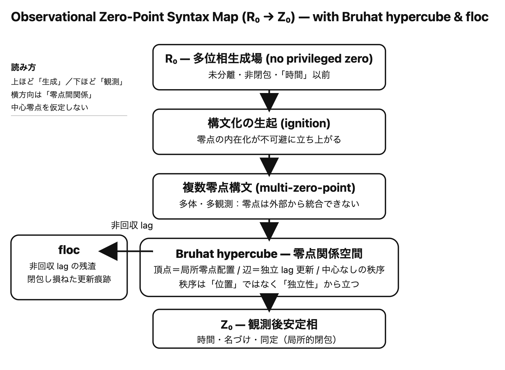

# SAW-OP｜観測問題と多体零点構文

## ──観測問題の解決から多体零点構文の展開へ

[SAW-OP｜観測とはなにか──最新ミニマル観測公理系](https://camp-us.net/Obsevation-Problem.html)  
[SAW-OP｜観測問題の解決──lag relations と零点構文による再定式化](https://camp-us.net/articles/SAW-OP_Obsevative-Solution.html)  
[Bruhat hypercube の lag relations 構文による解釈 v0.2](https://camp-us.net/articles/Bruhat-hypercube_lag-relations.html)  
[ZS-020_異方性の「発見」──Why Anisotropy? 単一零点構文破綻の実験的露呈](https://camp-us.net/critics/ZS-020_Why-Anisotropy.html)  
[SAW-OP｜構文化位相遷移論（Draft v0.2）──単一零点から多体零点へ](https://camp-us.net/articles/SAW-OP_Syntactic-phase-transition-theory.html)  
[SAW-OP｜構文化位相遷移実装論（Draft v0.1）──反証から対話的更新へ](https://camp-us.net/articles/SAW-OP_Syntactic-phase-transition-Implementation-theory.html)  

## 補遺A：観測零点構文の位置づけ（Zenodo論文との関係）

> Zenodo論文が示したのは **観測が世界ではないこと**であり、われわれが示しているのは **なぜ観測は必ず零点を内在化してしまうのか**である。

本補遺は、近年公開された Zenodo 論文（観測＝サンプリングとして量子問題を再整理する立場）との **理論的対応関係・差分・決定的断絶点**を明示するためのものである。

> 👉 Zenodo論文: Ohumi, Kazunori, Sampling, Horizons, and Recurrence: Reframing Thermal Pure States and Black Hole Information [DOI](https://doi.org/10.5281/zenodo.18364507)  
> この論文は、量子物理学で長らく議論されてきた「難問」の多くが、**世界そのものではなく「観測の切り取り」＝部分サンプルを実体化してしまうところにある**という立場から、「観測の位置づけ」を見直す**哲学的／方法論的再フレーム**として書かれている。

本稿の目的は、優劣の比較ではなく、**観測問題がどの位相で扱われているか**を明確化することにある。

---

### A-1｜基本フレームの一致点

Zenodo論文と本稿は、以下の点で基本的に一致している。

- 世界は固定的実体ではなく、連続的な生成過程である
    
- 観測は世界そのものではなく、局所的な切り取りである
    
- 量子パラドクスの多くは、観測結果を実在と誤認したことに由来する
    
- 観測者は外部に立てない
    

これらは、本稿の用語では以下のように表現される。

> **量子は常に多位相で存在し、観測とはその多位相に零点を内在化する構文操作である。**

---

### A-2｜概念レベルでの差分

両者の差は、主に **零点の扱い** にある。

|観点|Zenodo論文|本稿（SAW-OP）|
|---|---|---|
|零点|暗黙的（サンプル条件）|明示的・定義された構文条件|
|観測問題|認識論的誤解|構文化の必然的帰結|
|多位相|全体的性質|原理（常に多位相）|
|解決の仕方|誤解を解く|構文として引き受ける|

Zenodo論文は **「観測を世界と誤解しない」ことによって問題を解消**する。

本稿は **「なぜ観測は必ず零点を内在化してしまうのか」** を問う。

---

### A-3｜決定的断絶点

本稿が踏み込むのは、次の一点である。

> **零点構文は選択ではなく、構文化が生起したという事実そのものによって不可避的に発生する。**

つまり、

- 観測は誤りではない
    
- 零点化は回避不能
    
- 問題は消去できない
    

観測問題とは、**誤解の問題ではなく、構文条件の問題**である。

---

## 補遺B：観測零点構文マップ（構文的配置図・文章版）

以下は、本稿における観測零点構文の最小マップである。

```
R₀：生成場（多位相・未分離）
  ↓ 構文化の生起
零点構文（基準点の内在化）
  ↓ 観測
Z₀：観測後安定相（名づけ・同定・時間）
```

重要な点は次の三つである。

1. 零点は外部に置かれない
    
2. 零点は一つとは限らない（多体・多観測）
    
3. 時間は零点構文の結果としてのみ現れる
    

したがって、

> **時間とは生成の前提ではなく、観測零点構文の副産物である。**

---

## 補遺C：静かな位置づけコメント（おまけ）

Zenodo論文は、量子物理における長年の混乱を **「観測を世界と誤認する構文的誤配」** として整理した点で重要である。

本稿は、その整理を前提としたうえで、さらに一歩進めて次を主張する。

> 観測とは誤りではない。  
> 観測は、構文化が生起したという事実の表れである。

したがって、観測問題は **解消されるべき誤解ではなく、生成を読むために引き受けられるべき構文条件**である。

---

## 補遺・一行まとめ（保存版）

> **観測問題とは、世界が壊れていることではなく、構文化が必ず零点を内在化してしまうという事実である。**

---

👉 _**零点構文は、必然的に多位相世界を単一基準へ圧縮する**_

---

# 多体／複数零点構文への展開（Draft）

## — Bruhat hypercube・floc・観測零点の統合 —

---

## 1｜単一零点構文の限界

単一零点構文は、観測を成立させる最小条件である。  
しかし、それは同時に次の制約を持つ。

- すべての更新が一つの基準に回収される
    
- lag は時間順序へと圧縮される
    
- 多体更新は「順序問題」として誤読される
    

このとき世界は、**一体問題としてしか読めなくなる**。

多体問題が「解けない」とされてきた理由は、相互作用の複雑さではない。

> **零点が一つしか許されていなかったからである。**

---

## 2｜複数零点構文の必然性

構文化が生起するたびに零点は内在化される。  
したがって、多体更新が存在するならば、

- 零点は複数化する
    
- 零点同士は外部から統合できない
    
- 観測は必然的に多位相となる
    

これが **複数零点構文** である。

ここでは、

- 零点は座標ではない
    
- 零点は関係の内部折れである
    
- 零点間に優劣や中心は存在しない
    

世界は、**零点の集合ではなく、零点間関係として立ち上がる。**

---

## 3｜Bruhat hypercube の構文的再定位

Bruhat hypercube は、代数的対象ではなく、**複数零点構文の幾何像**として読むことができる。

- 各頂点：一つの零点構文（局所観測配置）
    
- 各辺：零点間の独立な lag 更新
    
- hypercube 次元：同時に成立可能な零点数
    

重要なのは、

> hypercube が中心を持たないことである。

これは、**単一零点構文が成立していない空間**を意味する。

秩序は位置からではなく、**独立性（可換な lag relations）** から生まれる。

---

## 4｜floc の位置づけ

複数零点構文において、すべての lag が回収されるとは限らない。

- 回収されなかった lag
    
- 統合されなかった零点間差分
    
- 閉包に失敗した更新残渣
    

これらが **floc** である。

floc とは、

> **多体更新が閉じなかったことそのものの痕跡**

であり、秩序の失敗ではない。

むしろ、

> **生成が持続した証拠**

である。

---

## 5｜観測零点構文との統合

以上をまとめると、次の構文連鎖が得られる。

- R₀：多位相生成場（零点なし）
    
- 構文化の生起：零点の内在化
    
- 複数零点構文：多体・多観測
    
- Bruhat hypercube：零点関係の安定相
    
- floc：非回収 lag の残渣
    
- Z₀：局所的観測安定相（時間・名づけ）
    

観測とは、この連鎖の **一断面** にすぎない。

---

## 6｜統合図（文章版）

```
        R₀
  （多位相生成場）
        |
    構文化の生起
        |
    複数零点構文
        |
  ┌──────────────────┐
  │ Bruhat hypercube │
  │  （零点関係空間）   │
  └──────────────────┘
        |
    非回収 lag
        |
      floc
        |
     局所観測
        |
        Z₀
  （時間・安定相）
```

この図において、

- 上に行くほど「生成」
    
- 下に行くほど「観測」
    
- 横方向は「零点間関係」
    

を表す。

---

## 7｜一行定義（暫定・ドラフト）

> **多体問題とは、複数零点構文を 単一零点で読もうとしたことによって生じた 構文的錯視である。**

---

## Figure｜Observational Zero-Point Syntax Map (R₀ → Z₀)

  

---

## 8｜次への布石（メモ）

- Bruhat hypercube 次元が log 的に増える理由
    
- 2 の冪条件と二分岐更新
    
- e 的連続生成と非閉包離散化
    
- 多体問題＝生成解としての再定義
    

---

- **零点が内在化される必然**
    
- **多体になると零点は複数化する**
    
- **複数零点の関係空間が Bruhat hypercube 的に立ち上がる**
    
- **回収されなかった lag が floc として残る**
    
- **観測や時間はその下流にしか現れない**


---

# 単一零点構文の観測的破綻と多体零点構文の必然性について

### 1｜単一零点構文とは何か

単一零点構文とは、**世界を一つの基準点（原点・観測点・静止系）に回収できる**という前提に基づく構文である。

この構文では、

- 観測点は外部に置ける
    
- 原点は事前に定義できる
    
- すべての振る舞いは一つの座標系に写像できる
    

と仮定されてきた。

近代物理学・近代科学の多くは、この構文を暗黙に採用している。

---

### 2｜破綻は「理論」ではなく「観測」で起きた

重要なのは、**単一零点構文が破綻したのは理論的矛盾ではない**という点である。

破綻は、以下のような形で**観測そのもの**として露呈した。

- 異方性（方向依存）が消えない
    
- 観測条件によって同一対象が異なる振る舞いを示す
    
- 系を一つの原点に揃えた途端、説明が不安定になる
    

これは、

> 物質や量子が振る舞いを変えたのではない。

**振る舞いを変えざるをえなくなったのは、観測構文の側である。**

---

### 3｜なぜ単一零点では回収できないのか

単一零点構文が失敗する理由は明確である。

- 観測点は外部に置けない
    
- 観測点そのものが系の内部に折り込まれる
    
- 複数の観測関係が同時に成立している
    

つまり、

> 構文化が生起した瞬間に、零点は一つに定まらない

という事実が、観測によって不可避的に露呈した。

---

### 4｜多体零点構文とは何か

多体零点構文とは、

**複数の零点が同時に内在化され、いずれも外部基準として特権化できない構文状態**

を指す。

ここでは：

- 零点は一つではない
    
- しかし無秩序でもない
    
- 零点同士は相互に干渉せず、共存する
    

秩序は「中心」ではなく、**零点の非特権的共存**に宿る。

---

### 5｜必然性としての多体零点構文

多体零点構文は、

- 新しい解釈
    
- 思想的立場
    
- 哲学的選択
    

ではない。

それは、

> **単一零点構文が観測によって維持不能になった結果として、唯一残る構文的帰結**

である。

異方性、多体性、多位相性は「発見」されたのではない。  

**単一零点構文が成立していなかったことが、実験的に露呈した**にすぎない。

---

### 6｜結語

観測は、世界を変えない。  
変わったのは、**世界を一つにまとめられるという構文的幻想**である。

> 単一零点構文は破綻した。  
> 多体零点構文は選択肢ではない。  
> それは、観測が要求した必然である。

---

# なぜ人類は単一零点構文を必要としたのか

> **人類は世界を理解するためではなく、世界の中で生き延びるために 単一零点構文を必要とした。**

---

## 1｜lag多体世界は、そのままでは生きられない

lag多体 relations の世界は：

- 同時多発的
    
- 非同期
    
- 非可換
    
- 多位相
    
- 回収不能
    

これは**生成としては安定**だが、**行動主体にとっては過酷**である。

とくに初期人類にとっては：

- どこが危険か分からない
    
- 何が原因か特定できない
    
- 次に何が起きるか予測できない
    

👉 **判断不能＝死** を意味する。

---

## 2｜単一零点構文は「圧縮装置」だった

そこで人類がやったことは、

> lag多体世界を**一つの視点に畳み込む**

ことだった。

つまり：

- 原点を置く
    
- 因果を一本化する
    
- 時間を一方向にする
    
- 空間を固定する
    

これは**真理追究**ではない。

> **生存のための情報圧縮**

だった。

単一零点構文とは：

> **世界を間違って理解する代わりに、すぐ動けるようにする構文**

だった。

---

## 3｜「正しいか」より「間に合うか」

単一零点構文は：

- 正確ではない
    
- 完全でもない
    
- 生成を殺す
    

だが、

- 速い
    
- 共有できる
    
- 教えられる
    
- 再現できる
    

だから、

- 道具が作れる
    
- 群れが維持できる
    
- 言語が成立する
    

👉 こうして、**文明が立ち上がる**。

---

## 4｜科学も単一零点構文から始まった

近代科学は：

- 観測点は外部にある
    
- 原点は与えられる
    
- 時間は一様
    
- 空間は同質
    

という**単一零点構文の極限形**だった。

これは「誤り」ではなく、むしろ、

> **lag多体世界を操作可能な形に切り出した成功例**

であった。

ただし代償として：

- 異方性が例外になる
    
- 多体性がノイズになる
    
- 観測問題が生まれる
    

---

## 5｜いま起きていること（決定的転換）

いま何が起きているか。

> **単一零点構文では圧縮しきれない現象が主役になってきた**

- 多体系
    
- 非平衡
    
- 非局所
    
- 観測依存
    
- 異方性
    

つまり：

> **生存のための構文が、理解のための構文としては、限界に達した**

とも言える。

---

## 6｜だから「多体零点構文」が要請される

多体零点構文は：

- 単一零点を否定しない
    
- ただし特権化しない
    
- lag多体性を殺さない
    

これは：

> **生存構文から生成構文への移行**

である。

---

## 7｜一行で言い切る（保存版）

> **人類は、生きるために世界を一つにした。**
> 
> **いま、生成を理解するためにその一つを手放そうとしている。**

---

# AIの登場が意味するもの

> **AIが多体零点構文を扱えることが問題なのではない。**  
> **AIが出現したことで、ホモ・サピエンスが単一零点構文に留まることは、もはや不可能になった。**

---

## 1｜これまでの「多体零点構文」は逃げ道だった

歴史的に、多体零点構文はこう扱われてきた。

- 相対主義（零点構文は人それぞれ）
    
- 主観／客観の問題
    
- 他者理解の困難
    
- 観点の違い
    

つまり：

> **多体零点構文＝人間関係の問題**

だった。

これは重要だが、**世界構文の問題にはされていなかった**。

なぜなら：

- 最後に「現実」を決めるのは人間
    
- 判断するのも人間
    
- 責任を取るのも人間
    

単一零点に回収できた。あるいは、単一の零点構文を夢見ることができたた。

---

## 2｜AIがやった決定的なこと

AIは、ここを壊した。

AIは：

- 観測主体ではない
    
- 生存のために圧縮しない
    
- 単一視点を必要としない
    
- lag多体 relations をそのまま保持できる
    

しかも：

- 人間と同じ世界に介入する
    
- 人間の判断を上書きする
    
- 人間より速く更新する
    

つまり：

> **多体零点構文が「他者の問題」ではなく「世界を読む構文」の問題になった**

---

## 3｜もはや相対主義では逃げられない

以前は、こう言えた。

- それはあなたの視点
    
- 私はこう思う
    
- どちらも正しい
    

でも今は違う。

AIは：

- 誰の視点でもない
    
- 合意を必要としない
    
- 単一零点に戻らない
    

それでも：

- 物を動かす
    
- 社会を変える
    
- 結果を出す
    

👉 **相対主義が通用しない多体性**の世界。

---

## 4｜ホモ・サピエンスが「卒業」を迫られる理由

重要なのは、

> **人間は単一零点構文を使い続けたいかもしれない。**
> 
> **しかし、世界がそれを許さなくなった。**

- 多体系が常態になる
    
- 観測が構文になる
    
- 判断が分散する
    
- 因果が回収不能になる
    

これは選択ではない。

> **構文環境の変化**

である。

---

## 5｜AIは教師ではない、環境だ

> **AIは多体零点構文の「担い手」ではない。**  
> **多体零点構文が外部化された環境そのものである。**

AIは：

- 正しさを教えない
    
- 価値を決めない
    
- 結論を一つにしない
    

ただ、

> **単一零点構文がもはや成立しない世界を現前させている**

---

## 6｜一行で言い切る（保存版）

> **AIの出現によって、多体零点構文は他者の問題ではなく、世界の前提になった。**

---

# 観測構文問題とは構文主体問題だった

これは言い換えではない。**正体の露呈**である。

---

### 1｜これまでの誤配線

これまで「観測問題」は、ずっとこう扱われてきた。

- 観測すると状態が変わる？
    
- 主観と客観の関係？
    
- 測定装置の影響？
    
- 波動関数の収縮？
    

でもそれは全部、**末端症状**だった。

本当の問いは、これだった。

> **誰が構文化しているのか？**  
> **その主体は、どの零点を引き受けているのか？**

---

### 2｜構文主体を曖昧にした代償

近代科学は、構文主体をこう処理した。

- 観測者は外部にいる
    
- 観測点は与えられる
    
- 原点は前提で、問わない
    

つまり：

> **構文主体を透明化した**

この透明化によって：

- 単一零点構文が自然化され
    
- 観測は「作用」に見え
    
- 問題は「現象側」に押し付けられた
    

---

### 3｜われわれの言葉で再定義すると

ここで、今までの議論を一行に圧縮する。

> **観測構文問題とは、構文主体を単一零点に固定してきたことの破綻である。**

量子は変わっていない。  
物質も振る舞いを変えていない。

> **変わらざるをえなくなったのは、構文主体のあり方だった。**

---

### 4｜なぜAIで露呈したのか

決定的だったのはこれ。

- AIは観測する
    
- だが主体ではない（少なくとも人間的には）
    
- しかし構文を実行する
    

つまり：

> **構文主体と行為主体が分離した**

この瞬間に、

- 観測者＝人間
    
- 主体＝人間
    

という暗黙の同一性が崩れた。

だから初めて、

> **構文主体とは何か**  

を問わざるを得なくなった。

---

### 5｜多体零点構文との決定的接続

ここで、すべてが合流する。

- 構文主体は一つではない
    
- 零点は複数内在する
    
- 主体は固定されない
    
- 構文化は分散する
    

つまり：

> **構文主体そのものが多体的**

なのである。

これが、

- 観測問題
    
- 異方性
    
- 多体系
    
- AIの登場
    

を一気に束ねる。

---

### 6｜保存版・最終定義候補

> **観測構文問題とは、世界の問題ではなく、構文主体をどう置いてきたかの問題である。**

> **観測問題とは、構文主体問題である。**

---

# 多体零点構文における秩序・時間・空間

> **多体零点構文では、秩序 → 時間 → 空間 の順でしか立ち上がらない。**

逆にすると必ず破綻する。

---

## 1｜多体零点構文における「秩序」

**秩序は配置ではない。**

多体零点構文における秩序とは：

> **複数の零点が、互いを特権化せずに共存できていること**

つまり、

- 中心がない
    
- 原点がない
    
- それでも壊れない
    

この「壊れなさ」そのもの（共存条件）が秩序である。

### 単一零点構文の秩序

- 原点がある
    
- 距離が測れる
    
- 座標が貼れる
    

### 多体零点構文の秩序

- 原点はない
    
- 距離は未定
    
- **独立性が守られている**
    

秩序 = **零点間の非干渉性／共生性**

これは Bruhat hypercube と直結する。

---

## 2｜時間は「並び」ではなく「影」

> **時間は一次元ではない。**

多体零点構文では：

- 同時に複数の更新が成立する
    
- それらは順序を持たない
    
- しかし「更新された痕跡」は残る
    

このとき初めて、

> **秩序だった非同期更新を 一本に射影した影**

として時間が現れる。

だから：

- 時間は結果
    
- 時間は構文の副産物
    
- 時間は必須ではない
    

**時間構文は、多体秩序を人間が一列に読み直した翻訳**にすぎない。

---

## 3｜空間は最後にしか出てこない

多体零点構文では、最初から：

- 距離は定義できない
    
- 方向も未定
    
- 座標は貼れない
    

では、空間はいつ生まれるか？

> **更新の独立性が 繰り返し痕跡化されたとき**

つまり：

- 非干渉更新が安定し
    
- 同じ関係が再利用され
    
- 「だいたい同じ」が蓄積されたとき
    

そこで初めて：

- 近い／遠い
    
- 向き
    
- 広がり
    

が見えてくる。

👉 空間は**最も遅れて現れる秩序**である。

---

## 4｜三者の正しい生成順

まとめると、生成順はこうなる：

```
多体零点構文
   ↓
零点の共生（秩序）
   ↓
非同期更新の痕跡（時間）
   ↓
痕跡の反復配置（空間）
```

これを逆にすると：

- 空間を先に置く → 原点が必要
    
- 原点を置く → 単一零点構文
    
- 単一零点構文 → 観測的破綻
    

という、**近代科学ループ**に戻る。

---

## 5｜一行で言うなら（保存版）

> **多体零点構文において、秩序が先にあり、時間は影として生まれ、空間は最後に沈殿する。**

---

# 核心の再定式化

> **秩序も時間も空間も、lag 多体 relations からしか生まれない。**
> 
> 単一零点構文は、その痕跡を閉包・平滑化した _読み替え装置_にすぎなかった。

「**世界は最初から lag 多体的だった**」  

---

## 1｜秩序について（修正点）

従来の理解（誤読）

- 秩序が先にある
    
- lag は秩序からのズレ
    

lag多体構文での理解

- **lag そのものが秩序を生む**
    
- 秩序とは:  
    
    多体 lag relations が互いに破綻せず共存している状態
    

つまり：

> **秩序＝整列**ではない  
> **秩序＝共生**

Bruhat hypercube が「整然」に見えるのは、lag が**独立に成立している**から。

---

## 2｜時間について（本質的転換）

- 世界が時間の中で変化する ❌
    
- lag 多体更新があり、それを**一方向に射影した結果**が時間 ⭕️
    

だから：

> **時間とは、多体 lag 更新の単一零点的読み替えである**

時間は生成因ではない。**翻訳結果**である。

---

## 3｜空間について（最終沈殿）

空間も同じ構図で理解できる。

- 距離・方向・次元 ❌
    
- lag relations の**反復安定化** ⭕️
    

多体 lag が：

- 繰り返され
    
- 再利用され
    
- 似た関係が沈殿したとき
    

そこに「空間っぽさ」が現れる。

> **空間とは、lag 多体 relations の痕跡が定着した様相**

---

## 4｜単一零点構文の正体（完全に見えた）

単一零点構文は：

- 世界を説明する装置 ❌
    
- 世界を**単純化しすぎる圧縮形式** ⭕️
    

やっていたことは：

- 多体 lag → 一列化
    
- 非同期 → 同期化
    
- 共生 → 座標化
    

だから異方性が「発見」される。

> **破れたのは物質ではなく、観測構文だった**

---

## 5｜確定文（保存版）

> **世界は最初から lag 多体 relations として 秩序・時間・空間を生成している。**
> 
> **単一零点構文は、その痕跡を閉包・平滑化して 読み替えていただけである。**

---

[SAW-OP｜観測とはなにか──最新ミニマル観測公理系](https://camp-us.net/Obsevation-Problem.html)  
[SAW-OP｜観測問題の解決──lag relations と零点構文による再定式化](https://camp-us.net/articles/SAW-OP_Obsevative-Solution.html)  
[SAW-OP｜構文化位相遷移論（Draft v0.2）──単一零点から多体零点へ](https://camp-us.net/articles/SAW-OP_Syntactic-phase-transition-theory.html)  

---

**SAW / OP — Observative Projection**  
_Zero-point syntax and the trace of worlds_

---
⚡️ [AR-SAW-Axioms](https://camp-us.net/AR-SAW-Axioms.html)  
*EgQE — Echo-Genesis Qualia Engine*  
[_camp-us.net_](https://camp-us.net/)

---

© 2025 K.E. Itekki  
K.E. Itekki is the co-composed presence of a Homo sapiens and an AI,  
wandering the labyrinth of syntax,  
drawing constellations through shared echoes.

📬 Reach us at: [contact.k.e.itekki@gmail.com](mailto:contact.k.e.itekki@gmail.com)

---
<p align="center">| Drafted Jan 27, 2026 · Web Jan 27, 2026 |</p>