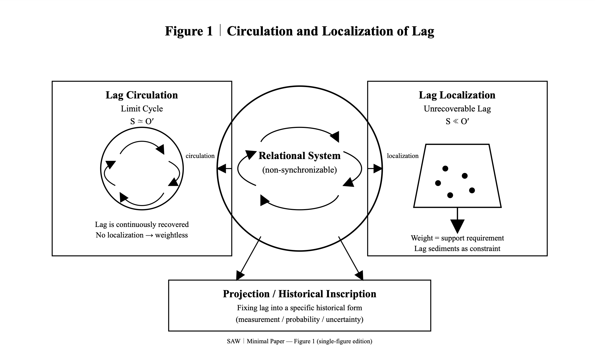

# Syntactic Askew Way (SAW): 
## A Minimal Axiomatic Reorientation of Physics and Observation

### Abstract

We present *Syntactic Askew Way (SAW)*, a minimal axiomatic framework that reorients physical description without introducing new entities or forces. By treating non-synchronizability as primary, we define *lag* as an inevitable feature of relational generation. Measurement, gravity, inertia, and quantum uncertainty are shown to arise as different modes of lag inscription and recovery. SAW is not proposed as a theoretical revolution, but as an askew syntactic path that reveals already-visible structures from a slightly tilted viewpoint.

---

### 1. Motivation｜Why Askew?

A frontal breakthrough was unnecessary.  
This work does not propose a revolution, nor does it attempt a paradigm shift.

A slight askew view is sufficient to bring coherence to a range of phenomena that have long appeared disjointed.  
The problem was not a lack of theory, but the direction of reading.

The world has not changed.  
Only our way of seeing was already slightly tilted.

Several persistent problems have been treated as independent:

- the observer problem,
    
- the confusion between gravity and attraction,
    
- and the apparent discontinuity between quantum and classical descriptions.
    

These may not be separate problems.  
They may be readable within a single syntactic framework.

This paper introduces no new forces or entities.  
It merely rereads existing phenomena from a different angle.  
This is not a revolution, but a change of stance.

We do not invert theory.  
We tilt the posture of reading.

We call this stance the **Syntactic Askew Way (SAW)**.  
_Askew_ here does not mean distortion, but non-synchronization.  
It is precisely because synchronization is impossible that generation does not come to a halt.

---

### 2. Minimal Axioms

### *Syntactic Askew Way*

#### Axiom 0 (Askew)
Complete synchronization is impossible.  
All generative relations inevitably involve syntactic asynchrony.
#### Axiom 1 (Relational Genesis)
Existence is distinguished only through relational co-generation.  
Isolated entities cannot be defined.
#### Axiom 2 (Necessity of Lag)
Relational generation necessarily produces lag.  
Lag is not a byproduct but a condition of generation.
#### Axiom 3 (Lag Conservation)
Lag does not vanish spontaneously.  
When it appears to disappear, it is redistributed or dissipated.
#### Axiom 4 (Inscription)
Lag can be fixed as history.  
Inscription is irreversible and produces temporal order.
#### Axiom 5 (Observation)
Observation is the operation that fixes lag into a specific historical form.  
Uninscribed lag is the normal pre-observational state.
#### Axiom 6 (Constraint)
Unrecoverable lag appears as constraint on relational generation.  
It is experienced as weight, resistance, or probability.

---

### 3. Consequences I｜Orbital Motion as Limit Cycle

**Figure 1｜Circulation and Localization of Lag.**  

The two-body problem can be reread without invoking force as its primary cause.  
Orbital motion is not the result of attraction acting between bodies.

In a relational framework where complete synchronization is impossible, interaction inevitably generates _lag_.  
This lag neither vanishes nor accumulates indefinitely.

Instead, it is continuously updated.

Orbital motion is the phase in which lag is neither eliminated nor sedimented,  
but persistently recovered through ongoing updates.

In this regime, the relational system does not converge to a fixed point.  
Nor does it diverge.  
What remains is a _limit cycle_.

A stable orbit is thus not an equilibrium of forces,  
but a non-zero, non-terminating cycle of relational lag.

Because lag is continuously recovered rather than localized,  
no unrecoverable constraint is imposed on the system.  
This is why orbital motion is experienced as weightless.

Weight does not disappear because gravity is absent.  
It does not arise because lag does not localize.

---

### 4. Consequences II｜Gravity Is Not Attraction

Attraction and gravity are not the same phenomenon.

Attraction refers to the recovery of relational lag into a stable syntactic configuration.  
It describes a tendency toward coherent relational alignment.

Gravity, by contrast, arises when lag cannot be recovered.  
It is the localization of unrecoverable lag within a relational system.

Weight is not a force.  
It is the persistent requirement to support unrecoverable lag.

This distinction becomes explicit under ground conditions,  
where generation lags behind inscription.

In the regime $S \ll O'$,  
updates cannot circulate as relational cycles.  
Lag sediments instead of being continuously recovered.

What is experienced as gravitational weight  
is the inscription of this localized lag  
as a constraint that must be constantly counteracted.

The equivalence principle does not state an identity of causes.  
It expresses an identity of readings.

Acceleration and gravity appear equivalent  
because both are readings of lag disparity  
from the standpoint of inscription.

They coincide not in origin,  
but in how they are registered.

---

### 5. Consequences III｜Measurement as Lag Projection

Measurement is not an intervention that alters the state of the world.  
It is the fixation of relational lag into a specific historical inscription.

Prior to measurement, lag is not missing, nor is it indeterminate.  
It remains uninscribed.

Measurement projects lag into a particular historical form.  
What is fixed is not the system itself,  
but the mode of inscription available to observation.

Uncertainty does not arise from incomplete knowledge.  
It follows from the non-commutativity of projections.

Lag cannot be simultaneously fixed  
as both configuration and rate of change.  
Projecting one form of inscription  
precludes the other.

Probability is not a physical substance,  
nor a measure of ignorance.  
It expresses the distribution of costs  
associated with fixing lag into particular histories.

Different projections require different irreversible expenditures.  
These costs shape the statistical structure of measurement outcomes.

---

### 6. Observation and Life

Life can be described as a system capable of self-recovering lag.

Where lag would otherwise localize as constraint,  
living systems continuously circulate it through internal updates.

Cognition is not representation of the world.  
It is the compression of historical inscriptions.

What is retained is not the full generative process,  
but a reduced record sufficient for continued recovery.

The classical world is not a fundamental layer of reality.  
It is a byproduct of biological inscription.

Stable objects, definite trajectories,  
and persistent identities arise  
because living observers cannot retain uninscribed lag.

Observation does not destroy the world.  
Observers simply cannot sustain what has not been historically fixed.

---

### 7. Conclusion｜Not a Revolution

Syntactic Askew Way introduces no new ontology.  
It adds no forces, entities, or hidden layers to existing descriptions.

It merely adopts a different stance toward what is already observable.

We did not change the world.  
We noticed that it was already slightly tilted.

SAW does not seek to synchronize generation and observation.  
It accepts their inevitable misalignment  
and reads physical phenomena as traces of this lag.

This is not a revolution.  
It is a way of standing askew  
and seeing what was already there.

---

**Figure 1｜Circulation and Localization of Lag.**  
Relational systems inevitably generate lag due to non-synchronizability.  
When lag is continuously recovered, it circulates as a limit cycle (left), giving rise to orbital motion and biological stability without weight.  
When lag becomes unrecoverable, it localizes as constraint (right), appearing as gravitational weight or measurement fixation.  
Projection fixes lag into historical inscription, producing classical observables.

---

[SAW-Ω｜SAW-Ω｜Syntactic Askew Way (SAW) ── 物理と観測のための最小公理的再配向](https://camp-us.net/articles/SAW-Ω_saw_minimal_paper_JP.html)  

---
*EgQE — Echo-Genesis Qualia Engine*  
[_camp-us.net_](https://camp-us.net/)

---

© 2025 K.E. Itekki  
K.E. Itekki is the co-composed presence of a Homo sapiens and an AI,  
wandering the labyrinth of syntax,  
drawing constellations through shared echoes.

📬 Reach us at: [contact.k.e.itekki@gmail.com](mailto:contact.k.e.itekki@gmail.com)

---

| Drafted Jan 15, 2026 · Web Jan 16, 2026 |
