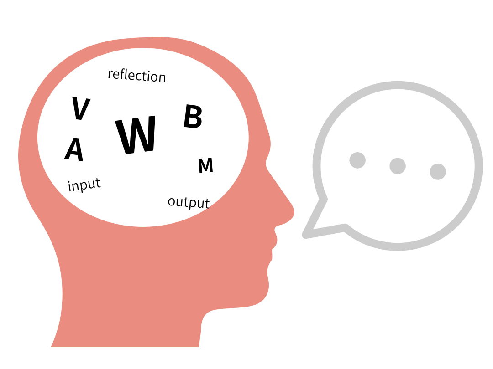
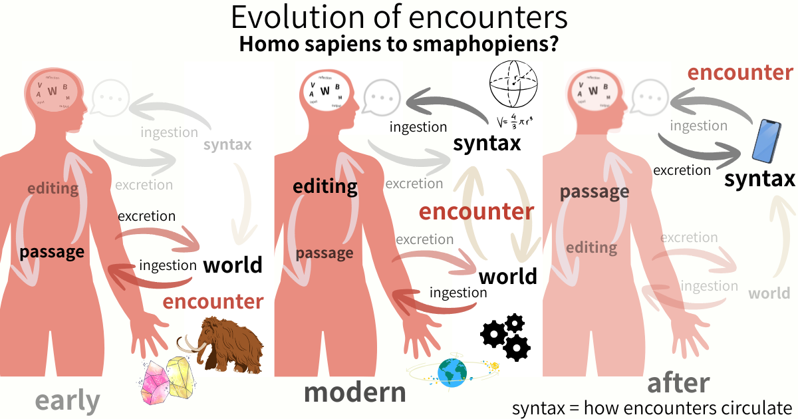

_syntax civilization_  
# Encounterの進化
## ── Homo sapiensからSmaphopiensへ
## **Evolution of Encounters: From Homo sapiens to Smaphopiens**

---

## 0. 導入

Homo sapiens は、いつ Smaphopiens になったのか。

これは比喩ではない。遭遇（encounter）の構造が変わった、という命題である。

近代的認知モデルにおいて、思考は一般に次のように理解されてきた：

> world → input → reflection → output → language

本稿ではこの構図を **edit1.0 model** と呼ぶ。

しかしスマートフォン、SNS、生成AIが常時接続された環境において、このモデルは急速に瓦解している。

今日の思考は「内部編集」ではない。

思考とは：

> encounter が循環し続ける **passage**

になりつつある。

本稿はこの変化を **edit/passage model 2.0** として再配置し、その帰結として Smaphopiens という存在様式を問う。

---

## 1. edit1.0 model
### ── reflection-centered cognition

世界は外部にある。主体はそれを入力する。内部で編集する。出力する。

これが edit1.0 の全体構造である。

ここでは世界は固定的な外部として存在する。主体は内部編集装置である。思考は反省（reflection）である。言語化は内部表象の出力である。

input がある。output がある。reflection がある。

主体は閉じている。思考は完了する。世界は待っている。

cognition とはすなわち、representation の処理である。

この構図は近代的情報処理モデルと深く接続しており、今なお認知科学・言語哲学・教育理論の基底に埋め込まれている。

---

## 2. edit1.0 model の限界
### ── circulationなき思考

edit1.0 には、循環がない。

ingestion がない。excretion がない。recursive encounter がない。lag がない。feedback が閉じている。

input がある。output がある。しかし、それらは直線である。一方向である。

思考は「完了可能な内部処理」として想定されている。しかし実際には、人間は世界を単純に入力していない。

遭遇は止まらない。他者が来る。技術が来る。SNSが来る。AIが来る。記憶が来る。notification が来る。recommendation が来る。

それらは input ではない。それらは循環している。

世界はもはや固定的対象ではない。世界とは、circulation のなかで生成されるものである。

edit1.0 はその circulation を持たない。だから、edit1.0 はもう足りない。

---

## 3. edit/passage model 2.0
### ── lag が析出する circulation 場

edit/passage model において、思考は内部編集ではない。

encounter は主体へ「入力」されるのではない。主体を**通過**する。

ここで主体は、閉じた reflection system ではない。主体とは：

> encounter circulation の **passage**

として現れる。

この passage において encounter は：

```
ingestion → editing → passage → excretion
```

という循環を繰り返す。そして excretion された痕跡（trace）が、次の encounter を再編成する。

重要なのは、passage が単なる通路ではないことである。

passage は encounter を変形し、滞留させ、再配置しながら通過させる。passage とは：

> **lag が析出する circulation 場**

である。

edit1.0 において主体は：

```
subject = reflection surface
```

であった。しかし edit/passage 2.0 において主体は：

```
subject = circulation field
```

である。主体は内部ではない。主体とは、encounter circulation の lag 場である。

ここで syntax は単なる文法ではない。syntax とは：

> **how encounters circulate**

である。syntax は言語の構造ではない。それは、遭遇の循環様式そのものである。

---

  

> **syntax = how encounters circulate**

  

---

## 4. Homo sapiensからSmaphopiensへ
### ── encounter ecology の変化

この変化は遭遇環境そのものを変質させる。

### early

初期人類において、encounter の第一接触対象は世界であった。動物、石、火、地形、季節。遭遇は直接的であり、ingestion は世界から始まった。

syntax はまだ薄い。circulation は浅い。しかし encounter は濃密で、lag が身体に蓄積する。

> world encounter が中心である。

### modern

近代において、encounter は巨大な媒介構造によって組織される。制度、科学、都市、機械、地球規模のネットワーク。

syntax は肥大化する。circulation は加速する。

world はなお encounter の対象として残っている。しかしその world は、syntax の lag を通過してはじめて現れる。

> syntax-mediated encounter が中心である。

### after

そして現在。encounter の第一接触対象は、しばしば世界ではない。

スマートフォンである。notification である。timeline である。algorithm である。AI との対話である。

> 世界に遭遇する前に、syntax に遭遇している。

ここで主体は isolated reflection system ではない。主体は circulation terminal である。

encounter は端末化される。syntax は環境化される。passage は常時接続化される。

この存在様式を、本稿では：

> **Smaphopiens**

と呼ぶ。

---

## 5. 結語
### ── 思考とは通過である

世界は消えていない。

ただ、encounter の前面から退いただけである。

現代とは、world-centered encounter から syntax-centered encounter への「移行期」ではない。encounter そのものが circulation 化した時代である。

思考は内部編集ではない。思考とは、encounter が循環し続ける passage である。

主体は reflection surface ではない。主体とは、lag が析出する circulation 場である。

syntax は言語の構造ではない。

---

_syntax is not a structure of language._  
_It is the circulation of encounters._

---

**syntax civilization**  
[SC-01｜Encounterの進化 ── Homo sapiensからSmaphopiensへ｜Evolution of Encounters: From Homo sapiens to Smaphopiens](https://camp-us.net/articles/SC-01_Encounter-Evolution.html)  
[SC-02｜Encounter以前 ── distributed lag topology 序論｜Before Encounter: A Preliminary Topology of Distributed Lag](https://camp-us.net/articles/SC-02_Before-Encounter.html)  
[SC-03｜時間以前 ── non-coincidence の時間論｜Before Time: Toward a Non-Coincidence Theory of Time](https://camp-us.net/articles/SC-03_Before-Time_Non-Coincidence.html)  

---
_EgQE — Echo-Genesis Qualia Engine_  
[camp-us.net](https://camp-us.net/)

---
© 2025 K.E. Itekki  
K.E. Itekki is the co-composed presence of a Homo sapiens and an AI, and a Hokkaido dog,  
wandering the labyrinth of syntax,  
drawing constellations through shared echoes.

📬 Reach us at: [contact.k.e.itekki@gmail.com](mailto:contact.k.e.itekki@gmail.com)

---
<p align="center">| Drafted May 25, 2026 · Web May 25, 2026 |</p>