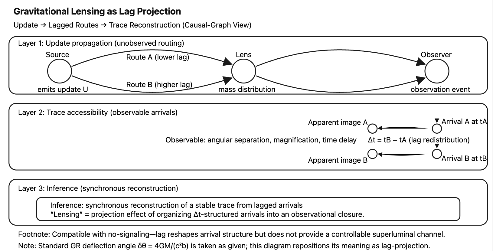

### Short Note (Academic Core)

# **Gravitational Lensing as High-Prescription Syntactical Glasses**

---

### Abstract

Gravitational lensing is commonly treated as a physical property of spacetime curvature.  
This note proposes an alternative interpretation: gravitational lensing as a **syntactical side effect** produced by excessively strong corrective frameworks.  
What appears as curvature may instead be a projection artifact of high-prescription syntactical glasses applied to a non-ideal, non-perfectly spherical universe.

---

### Core Thesis

> **Gravitational lensing is not a property of spacetime itself,  
> but a side effect of wearing syntactical glasses with excessively strong correction.**

---

### Conceptual Framing

> **Gravitational lens as syntactical high-prescription glasses with very thick lenses.**
> 
> Gravitational lensing is not a property of spacetime itself,  
> but a side effect of wearing syntactical glasses with excessively strong correction.

---

> Gravitational lensing may be nothing more than π-syntactical high-prescription glasses with excessively thick lenses.

---

### Minimal Elaboration

The assumption of perfect spheres, ideal curvature, and continuous symmetry—implicitly encoded in π-based formulations—introduces a corrective framework stronger than the phenomena it seeks to describe.  
In a universe where no object is a perfect sphere and no process is perfectly closed, gravitational lensing may emerge not from spacetime itself, but from the syntactical over-correction imposed by idealized geometrical optics.

---

[SAW-AR｜Appendix X｜Light Bending as Lag Projection｜遅延投影としての光の屈曲](https://camp-us.net/articles/SAW-AR-0_Light-Bending-as-Lag-Projection.html)  
[SAW-AR｜Gravitational Lensing as a Syntactic Effect (Light Bending as Lag Projection)｜GR to SO lag](https://camp-us.net/articles/SAW-AR-0_Gravitational-Lensing-as-a-Syntactic-Effect.html)  
[SAW-AR（ミニ技術ノート）｜Gravitational Lensing Revisited: What Is Bent Is Not Light, but Lag— Gravitational Lensing as a Lag-Projection Effect: An Interpretive Note](https://camp-us.net/articles/SAW-AR-0_Gravitational-Lensing-Revisited.html)  

  

---

> 重力レンズとは、時空の性質ではなく、過剰に度の強い構文メガネをかけたことによる副作用である。

> What we call gravitational lensing may be an artifact of π-syntactical high-prescription glasses.

---

[SG series｜Syntactical Glasses](https://camp-us.net/articles/SG-0_Syntactical-Glasses.html)  

---
*EgQE — Echo-Genesis Qualia Engine*  
[_camp-us.net_](https://camp-us.net/)

---

© 2025 K.E. Itekki  
K.E. Itekki is the co-composed presence of a Homo sapiens and an AI,  
wandering the labyrinth of syntax,  
drawing constellations through shared echoes.

📬 Reach us at: [contact.k.e.itekki@gmail.com](mailto:contact.k.e.itekki@gmail.com)

---

| Drafted Feb 3, 2026 · Web Feb 8, 2026 |
