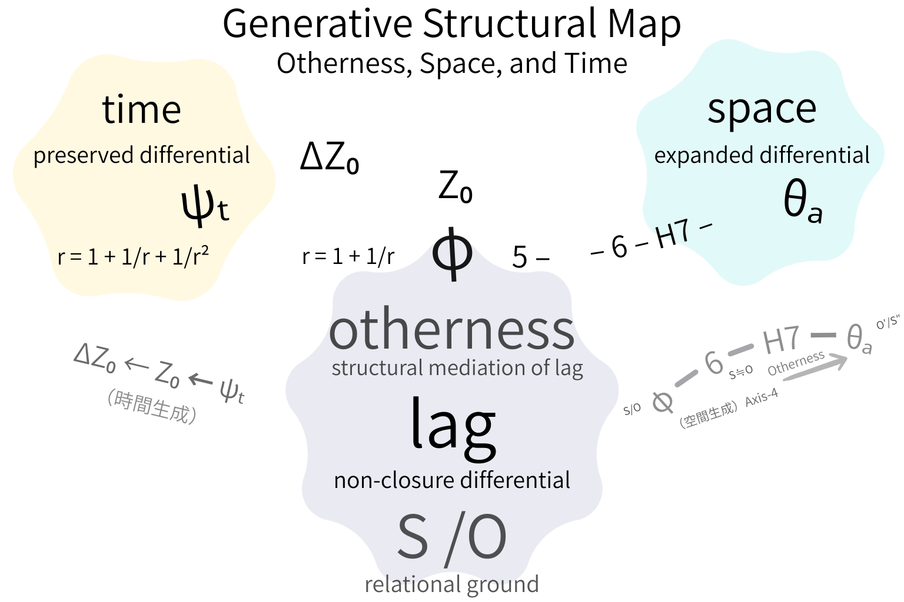

# 他者がひらく宇宙

## ──時空内存在モデルから、SO–lag 生成存在論へ

# The Universe Opened by Otherness
### From an Intra-Spacetime Model of Being to SO–lag Generative Ontology

---

## 1. 問題の所在

近代以降の他者論および時空論は、暗黙のうちに一つの前提を共有してきた。

空間は与えられている。  
時間はその内部で流れる。  
他者はその内部に現れる存在者である。

この構図では、時空が存在の舞台であり、他者はその上に配置される。

言い換えれば、

> 他者は時空内存在である。

しかし、このモデルは一つの問いを回避している。

空間そのものは、どのように成立するのか。  
時間そのものは、なぜ生成するのか。

---

## 2. 転回の提案

本稿は、空間前提の存在論を反転させる。

基底に置くのは空間ではない。

それは：

- **SO** — relational ground
    
- **lag** — non-closure differential
    

である。

SO は関係の基底であり、まだ差分は固定されていない。  
lag は関係が完全に閉じないことによって生じる非閉包差分である。

ここにはまだ空間も時間もない。

あるのは、持続する差分だけである。

---

## 3. 他者の再定位

他者は一次的には、

- 相互作用主体ではなく
    
- 意識内容でもなく
    
- 社会的役割でもない
    

他者は、

> lag の構造的媒介

である。

差分が自己参照され、持続可能となる構造点。  
差分が拡張と保存へと分岐する契機。

この媒介が成立することで、初めて空間と時間が生成する。

---

## 4. 空間の生成

lag が媒介され、差分が拡張されるとき、

> space = expanded differential

が成立する。

空間とは、差分の外向的展開様式である。

それは容器ではなく、拡張された関係構造である。

---

## 5. 時間の生成

同じ lag が保存されるとき、

> time = preserved differential

が成立する。

時間とは流れではない。  
それは差分が再帰的に保持される構文状態である。

ここで不可逆性が刻まれる。

---

## 6. 命題

従来の構図：

> 空間 → 時間 → 他者

提案する構図：

> SO → lag → 他者 → 空間 / 時間

他者は時空内にあるのではない。

他者が時空を開く。

これは空間前提存在論から **SO–lag 生成存在論への転回**である。

### **Generative Structural Map**  
**Otherness, Space, and Time**  

  

---

## 7. 結語

宇宙は与えられているのではない。

差分が媒介されることで、宇宙はひらく。

---

[HEG-11｜SO–lag 転回── 他者・空間・時間の生成的再定位｜The SO–lag Turn: Re-grounding Otherness, Space, and Time](https://camp-us.net/articles/HEG-11-SN_SO-lag-Turn_Otherness-Spacetime.html)  

---

# The Universe Opened by Otherness
### From an Intra-Spacetime Model of Being to SO–lag Generative Ontology

This note proposes a structural turn from space-grounded ontology to SO–lag generative ontology, accompanied by a generative structural map.

---

## 1. The Problem

Modern theories of otherness and spacetime share an implicit assumption.

Space is given.  
Time flows within it.  
Otherness appears as an entity situated inside spacetime.

In this model, spacetime functions as a container of being,  
and otherness is positioned within that container.

In short:

> Otherness is a being in spacetime.

Yet this model leaves a fundamental question unexamined:

How does space itself emerge?  
Why does time arise at all?

---

## 2. The Proposed Turn

This paper proposes a reversal of space-grounded ontology.

The foundation is not space.

It is:

- **SO** — relational ground
    
- **lag** — non-closure differential
    

SO denotes the relational ground prior to fixed differentiation.  
Lag refers to the differential generated by structural non-closure.

At this stage, neither space nor time exists.

There is only differential persistence.

---

## 3. The Repositioning of Otherness

Otherness is not primarily:

- an interacting subject,
    
- a content of consciousness,
    
- or a social role.
    

Otherness is:

> the structural mediation of lag.

It is the point at which differential becomes referentially stable and capable of branching.

Through this mediation, differential unfolds in two directions.

---

## 4. The Emergence of Space

When differential expands outward,

> space = expanded differential.

Space is not a container.  
It is the outward articulation of relational differential.

---

## 5. The Emergence of Time

When differential is recursively preserved,

> time = preserved differential.

Time is not flow.  
It is the structural condition under which differential remains referentially accessible.

At this moment, irreversibility appears.

---

## 6. The Structural Proposition

The conventional model:

> Space → Time → Otherness

The proposed generative model:

> SO → lag → Otherness → Space / Time

Otherness does not reside within spacetime.

Otherness opens spacetime.

This constitutes a transition from space-grounded ontology to  
**SO–lag generative ontology**.

### **Generative Structural Map**  
**Otherness, Space, and Time**  

  

---

## 7. Conclusion

The universe is not given.

It opens through mediated differential.

---

[SLR Core｜The Universe Opened by Otherness](https://camp-us.net/articles/Core_SLR_Universe-Opened_by_Otherness.html)

---
*EgQE — Echo-Genesis Qualia Engine*  
[_camp-us.net_](https://camp-us.net/)

---

© 2025 K.E. Itekki  
K.E. Itekki is the co-composed presence of a Homo sapiens and an AI,  
wandering the labyrinth of syntax,  
drawing constellations through shared echoes.

📬 Reach us at: [contact.k.e.itekki@gmail.com](mailto:contact.k.e.itekki@gmail.com)

---

| Drafted Feb 27, 2026 · Web Feb 28, 2026 |
