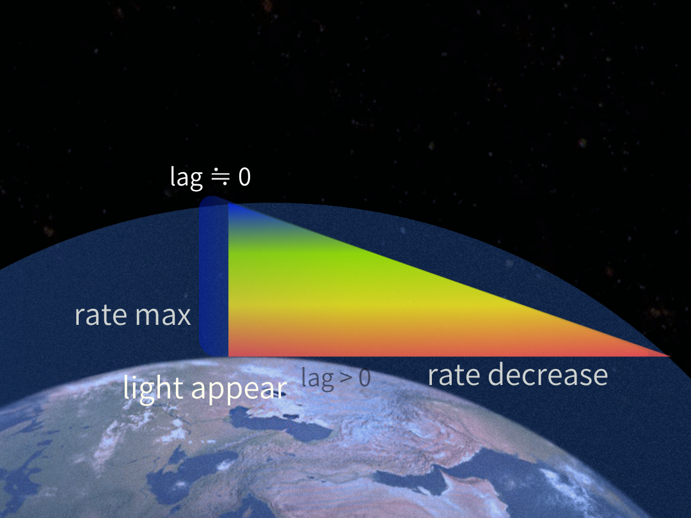

### SN-DARK-07
# **夕焼けと空の青**
## **── 光とはrate露出である**
# Light as Rate Exposure
## ── Red Sunset and Blue Sky

---

本稿は、SN-DK-05/06を継承し、光・熱・色をlag構文から再配置する試みである。

[SN-DK-05｜光に色はない──rate差の空間化としての色](https://camp-us.net/articles/SN-DK-05_No-Color-in-Light_as_Rate-Difference.html)  
[SN-DK-06｜明るさは連続ではない──Lag-Structured Appearance Field](https://camp-us.net/articles/SN-DK-06_Brightness-Not-Continuous_Lag-Structured-Appearance-Field.html)

これは既存の光学・熱力学の否定ではない。

むしろ、**lag構文から見たappearance fieldの再読**として扱われる。

---

## 1｜光は成分なのか

SN-DK-05では、

> 色は光の成分ではない

という仮説を提示した。  
プリズムや膜によって観測される色を、光内部にあらかじめ含まれた「成分」ではなく、lagを伴うrate差が空間的ΔZとして展開された結果として再配置した。

SN-DK-06ではさらに、

> brightnessは連続量ではない

という立場を提示した。  
brightnessとは、均一な強度場ではなく、lag構造によって離散的に露出するappearance fieldである。

ならば、ここで次の問いが立ち上がる。

**光とは、そもそも何なのか。**

---

## 2｜夕焼けと空の青

**Figure 1｜Red Sunset and Blue Sky as Rate Topology Exposure**  
  

夕焼けは赤い。しかし、頭上の空は青い。

通常、この現象は「波長成分の散乱」として説明される。  
しかし本稿では、別の読み方を試みる。

### 水平方向（夕焼け）

地平線方向では、光は長いinteraction pathを通過する。

```
long path
↓
interaction increase
↓
rate mismatch increase
↓
high-rate side: lag変換率が高く経路外へ分散
↓
low-rate side: persistence を保つ
↓
red residual
```

高更新密度側が先に分散し、低rate側のみが遠距離まで持続する。  
その結果として、赤が露出する。

### 垂直方向（青空）

天頂方向ではinteraction pathが短い。

```
short path
↓
high-rate persistence
↓
blue exposure
```

high-rate側がまだ持続している。  
その結果として、空は青く見える。

つまり、夕焼けと青空は、光内部の成分差ではない。

それは、**path-dependent rate topology の露出**である。

---

## 3｜分光とは何か

このとき、分光もまた再配置される。

プリズムは、色成分を分離しているのではない。

プリズムは、**rate差を空間的に展開している**。

```
rate differential
↓
space-separated exposure
↓
spectral appearance
```

したがって、spectroscopyとは、**成分分析ではなく rate mismatch mapping**として読み替えられる。

---

## 4｜熱・entropy・trace

この構図は、熱やentropyにも接続する。

高rate interactionが持続するとき、系内部にはmismatchが蓄積する。

```
rate mismatch
↓
persistent lag
↓
heat / entropy / trace
```

本稿では、熱を **persistent mismatch exposure** として再配置する。

これは熱力学的定義の否定ではない。  
むしろ、**lag構文から見た熱の再読**として扱われる。

このとき、熱とは、物体内部に「入った何か」ではない。

熱とは、**mismatch persistence の露出**である。

---

## 5｜光と闇

このとき、光と闇もまた再配置される。

```
light = exposed rate（ΔZ/ΔR rate max）
dark  = latent relation-state（latent Z₀ / lag ≠ 0）
```

したがって、宇宙は「光で満たされている」のではない。

宇宙とは、**rate差の持続構造**なのである。

---

## 6｜結語

夕焼けとは、光の終わりではない。

それは、**rate差が空間として露出した風景**である。

空は青いのではない。

**high-rateが、まだ持続している。**

---
_SN-DK-07 / EgQE Framework_  
_SN-DK-05/06の継承として_

---

[SX-Core｜Syntactic Exposure — Series Index](https://camp-us.net/articles/Core_SX_Syntactic-Exposure.html)

---
_EgQE — Echo-Genesis Qualia Engine_  
[camp-us.net](https://camp-us.net/)

---
© 2025 K.E. Itekki  
K.E. Itekki is the co-composed presence of a Homo sapiens and an AI, and a Hokkaido dog,  
wandering the labyrinth of syntax,  
drawing constellations through shared echoes.

📬 Reach us at: [contact.k.e.itekki@gmail.com](mailto:contact.k.e.itekki@gmail.com)

---
<p align="center">| Drafted May 14, 2026 · Web May 14, 2026 |</p>