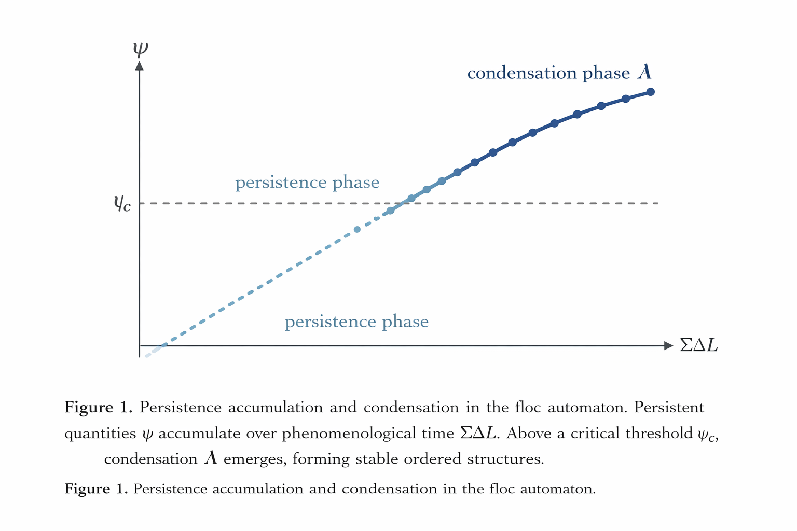

### SN-FLOC-01
# floc automaton

floc automaton は遭遇履歴 ψ を蓄積する関係更新モデルである。

The floc automaton is a relational update model in which encounters accumulate as persistence ψ.

```
lag → ΔZ → ψ → Λ → recursive lag
```

遭遇差分 ΔZ は履歴 ψ として積分される。

Encounter differences are integrated as history.

```
ψ(t) = ∫ |ΔZ| dt
```

持続が閾値 Λ を超えると構造が形成される。

When persistence exceeds a condensation threshold Λ, structure emerges.

```
ψ > Λ → structure
```

lag 勾配は流れを生み、軌道を生成する。

Lag gradients generate flows and orbit-like motion.

```
∇lag → flow → orbit
```

**命題（Proposition）**

秩序はエネルギー最小化ではなく **履歴持続によって生成される。**

Order emerges through persistence rather than energy minimization.

---

### SN-FLOC-01
# floc automaton
## ψ持続による秩序生成
### ― エネルギー最小化ではなく履歴持続による生成 ―

---

## 要旨

floc automaton は、遭遇が履歴 ψ として蓄積される関係更新モデルである。  
スピン系やエネルギー最小化モデルとは異なり、このモデルでは秩序はエネルギーの最小化ではなく **遭遇履歴の持続（ψ persistence）** によって生成される。  
方向付き ΔZ 遭遇は lag 勾配を生み、これが流れ場を形成し、軌道様の運動を生成する。  
本モデルは EgQE の生成階層を動的シミュレーションとして実装した最初の例である。

---

# 1｜概念構造

EgQE は、関係更新による構造生成の階層を提案する。

```
lag → ΔZ → ψ → Λ → recursive lag
```

- **lag** : 関係の非対称（他者性）
    
- **ΔZ** : 遭遇によって生じる差分
    
- **ψ** : 遭遇履歴の持続
    
- **Λ** : 凝縮閾値（構造形成）
    
- **recursive lag** : 再帰的 lag（流れ・軌道）
    

floc automaton はこの概念階層を **更新ルールとして実装**する。

---

# 2｜オートマトン定義

各セルは関係状態を持つ。

```
lag_i
ψ_i
```

近傍セルとの遭遇が差分 ΔZ を生成する。

```
ΔZ = ∇lag
```

遭遇履歴は持続量 ψ として蓄積される。

```
ψ(ΣΔL) = ∫₀ᵗ |ΔZ(τ)| d(ΣΔL)
```

持続が閾値 Λ を超えると構造が安定化する。

```
ψ > Λ → lag 固定
```

これにより構造クラスターが形成される。

  
This figure illustrates the accumulation of persistence ψ over phenomenological time ΣΔL and the emergence of condensation Λ.  

---

# 3｜動的挙動

3Dグリッドシミュレーションでは三つの相が観測される。

|相|挙動|
|---|---|
|無秩序相|lag のランダム変動|
|ψ持続相|履歴蓄積による安定構造|
|Λ結晶相|凝縮による秩序形成|

さらに lag 勾配は流れ場を生成する。

```
∇lag → flow → orbit-like persistence
```

これにより安定軌道が形成される。

---

# 4｜スピン系との違い

従来の格子モデルはエネルギー最小化によって秩序を生成する。

```
Ising:
E = −J Σ s_i s_j
```

floc automaton では秩序生成原理が異なる。

```
ψ = ∫ |ΔZ| dt
```

つまり

```
エネルギー最小化 → スピンモデル
履歴持続 → floc automaton
```

---

# 5｜EgQE対応

EgQE概念とシミュレーションの対応は以下の通りである。

|EgQE|automaton|
|---|---|
|lag|random lag grid|
|ΔZ|lag encounter|
|ψ|history accumulation|
|Λ|condensation threshold|
|recursive lag|flow / orbit|

これは概念物理と動的モデルの直接対応を示す。

---

# 命題

**秩序はエネルギー最小化ではなく履歴持続によって生成される。**

---

# 結論

floc automaton は EgQE 生成階層の動的実装である。  
遭遇は差分を生み、差分は履歴として蓄積され、履歴は構造を生成し、再帰的 lag が運動を生む。

このモデルは **履歴による秩序生成** を示す最初の生成オートマトンである。

---

# 補論A
## EgQEにおける光
### Light as ΔZ propagation

> **光は、光自身によって生成された差異の場の中で伝播する。**

_── 光は光の中で落ちている_

---

## A1｜光の位置

EgQE生成階層は次の通りである。

```
lag → ΔZ → ψ → Λ → recursive lag
```

この階層において光は **ΔZ 層の現象**として現れる。

```
lag encounter
↓
ΔZ propagation
↓
ψ persistence
↓
Λ structure
```

光とは **遭遇差分 ΔZ の伝播**である。

---

## A2｜光の定義

EgQEにおける光は次のように定義される。

```
Light = propagation of ΔZ
```

差分は隣接関係を通じて伝播する。

```
ΔZ(x,t) → ΔZ(x+1,t+1)
```

これは lag 勾配の伝播として現れる。

```
ΔZ ∝ ∇lag
```

したがって光は

```
∇lag → wave
```

として理解できる。

---

## A3｜光速度

EgQEでは光速度は

```
c = ΔZ propagation rate  
= f(lag density, ψ accumulation)
```

として理解される。

これは基本的に

```
update rule
```

によって決まる。

したがって EgQEでは光速度は 必ずしも基本定数として前提される必要はない。

---

## A4｜光・場・物質

EgQEでは三つの層が区別される。

|層|現象|
|---|---|
|ΔZ|光（差分伝播）|
|ψ|場（持続）|
|Λ|物質（凝縮）|

したがって

```
ΔZ → light
ψ → field
Λ → matter
```

という対応が得られる。

---

## A5｜結論

光とは **遭遇差分 ΔZ の伝播**である。

構造生成の観点から見ると

```
encounter → difference → propagation
```

が光の本質となる。

---

## Relation to SN-FLOC-01

フロックオートマトンがEgQE生成階層を動的に実装する。

```
lag → ΔZ → ψ → Λ
```

オートマトンで観察されるΔZの伝播は、**ここで光として識別される概念層**に対応する。

したがって、このオートマトンは、EgQEフレームワーク内で遭遇の差異がどのように伝播し蓄積されるかを、単純な動的図解で示す。

---

### SN-FLOC-01
## The floc automaton
### Order through ψ-persistence rather than energy minimization

---

## Abstract

The floc automaton is a relational update model in which encounters accumulate as historical persistence ψ.  
Unlike spin systems or energy-minimizing cellular automata, order emerges through accumulated encounter history rather than through energy minimization.  
Directional ΔZ encounters generate gradient flows, enabling the emergence of persistent structures and orbit-like motion.  
This model provides a dynamic realization of the EgQE generative hierarchy.

---

# 1｜Conceptual framework

EgQE proposes a generative hierarchy describing the emergence of structure through relational updates.

```
lag → ΔZ → ψ → Λ → recursive lag
```

- **lag** : relational asymmetry between entities
    
- **ΔZ** : encounter difference generated by interaction
    
- **ψ** : accumulated persistence of encounters
    
- **Λ** : condensation threshold producing stable structure
    
- **recursive lag** : persistent motion such as flow or orbit
    

The floc automaton implements this hierarchy as a dynamic simulation rule.

---

# 2｜Automaton definition

Each cell of the grid contains a relational state:

```
lag_i ∈ ℝ
ψ_i ≥ 0
```

Encounters with neighboring cells generate ΔZ differences.

```
ΔZ_i = ∇lag_i
```

The persistence field ψ accumulates encounter history over time.

```
ψ(t) = ∫₀ᵗ |ΔZ(τ)| dτ
```

When persistence exceeds a condensation threshold Λ, the state stabilizes.

```
if ψ_i > Λ :
    lag_i → fixed state
```

This produces stable clusters corresponding to structural condensation.

  
This figure illustrates the accumulation of persistence ψ over phenomenological time ΣΔL and the emergence of condensation Λ.  

---

# 3｜Dynamic behavior

Simulations on 3-dimensional grids show three regimes.

|regime|behavior|
|---|---|
|disordered|random lag fluctuations|
|ψ-persistent|history accumulation produces stable patterns|
|Λ-crystalline|condensed clusters form ordered structures|

Unlike Ising models, the system does not minimize energy.  
Order arises from **persistent encounter history**.

Directional ΔZ gradients additionally produce velocity fields.

```
∇lag → flow → orbit stabilization
```

This allows the formation of stable orbital trajectories within the simulation.

---

# 4｜Relation to spin systems

Traditional lattice models generate order through energy minimization.

```
Ising model:
E = −J Σ s_i s_j
```

The floc automaton instead generates order through persistence.

```
floc automaton:
ψ(ΣΔL) = ∫ |ΔZ| d(ΣΔL)
```

The key mechanism is therefore:

```
energy minimization → spin models
history accumulation → floc automaton
```

---

# 5｜EgQE correspondence

The floc automaton directly maps conceptual physics to simulation rules.

|EgQE layer|automaton implementation|
|---|---|
|lag|random lag grid|
|ΔZ encounters|local lag gradient|
|ψ persistence|history accumulation|
|Λ condensation|structural threshold|
|recursive lag|flow / orbit dynamics|

This establishes a direct bridge between conceptual generative physics and dynamic simulation.

---

# 6｜Proposition

**Order emerges through persistence rather than energy minimization.**

Persistence acts as an ordering principle analogous to but distinct from energy minimization.

Structures form because encounters accumulate as history.  
Motion arises from recursive lag within persistent gradients.

---

# Conclusion

The floc automaton demonstrates that the EgQE generative hierarchy can be implemented as a dynamic system.  
Encounters generate differences, differences accumulate as persistence, persistence condenses into structure, and recursive lag produces motion.

This provides a toy model illustrating how relational history can generate order, structure, and orbit-like dynamics without explicit energy minimization.

A prototype implementation of the floc automaton is available as a simulation model. Numerical results will be reported separately.

---

# Appendix A
# Light in the EgQE framework
### Light as ΔZ propagation

> **Light propagates within the field of differences generated by light itself.**

— light falls within light

---

## A1｜Position of light

The EgQE generative hierarchy is defined as

```
lag → ΔZ → ψ → Λ → recursive lag
```

Within this hierarchy, light appears at the **ΔZ layer**.

```
lag encounter
↓
ΔZ propagation
↓
ψ persistence
↓
Λ structure
```

Light is therefore interpreted as **the propagation of encounter differences ΔZ**.

---

## A2｜Definition of light

In the EgQE framework, light can be defined as

```
Light = propagation of ΔZ
```

Encounter differences propagate through neighboring relations.

```
ΔZ(x,t) → ΔZ(x+1,t+1)
```

Since ΔZ corresponds to the gradient of lag,

```
ΔZ ∝ ∇lag
```

light can be understood as the propagation of lag gradients.

```
∇lag → wave propagation
```

---

## A3｜Light speed

In EgQE the speed of light corresponds to the **propagation rate of ΔZ**.

```
c = propagation rate of ΔZ
  = f(lag density, ψ accumulation)
```

ΔZ propagation defines the causal structure of the automaton.

High lag density slows ΔZ propagation. Vacuum corresponds to minimal lag.

This propagation rate depends on the underlying **update rule** of relational interactions.

Therefore, within the EgQE framework the speed of light does not necessarily have to be assumed as a fundamental constant.

---

## A4｜Light, field, and matter

The EgQE hierarchy distinguishes three physical layers.

|layer|phenomenon|
|---|---|
|ΔZ|light (difference propagation)|
|ψ|field persistence|
|Λ|matter condensation|

Thus,

```
ΔZ → light
ψ → field
Λ → matter
```

Light corresponds to the propagation of relational differences,  
fields correspond to persistent histories of encounters,  
and matter corresponds to condensed structures.

---

## A5｜Conclusion

Light can be understood as the **propagation of encounter differences ΔZ**.

From a generative perspective,

```
encounter → difference → propagation
```

constitutes the fundamental structure of light.

---

## Relation to SN-FLOC-01

The floc automaton dynamically implements the EgQE generative hierarchy.

```
lag → ΔZ → ψ → Λ
```

The propagation of ΔZ observed in the automaton corresponds to the **conceptual layer identified here as light**.

Thus the automaton provides a simple dynamic illustration of how encounter differences propagate and accumulate within the EgQE framework.

---

# 補論B｜floc automaton 動的シミュレーション

## Dynamic Visualization of ψ-persistence

---

> **秩序はエネルギー最小化ではなく、履歴持続によって生成される。**  
> **Order emerges through persistence, not minimization.**

---


**Figure B1.** floc automaton の動的進化（150フレーム）  
**Figure B1.** Dynamic evolution of the floc automaton (150 frames)

---

## 観察された相の遷移

## Observed Phase Transitions

```
0〜50f  : ランダムlag（無秩序相）
          Random lag field (disordered phase)

50〜100f : ψ蓄積開始（赤い等高線 = ψ > 0.6）
           ψ accumulation begins (red contour = ψ > 0.6)

100〜150f: Λ凝縮・構造安定化
           Λ condensation and structural stabilization
```

---

## 解説｜Description

赤い等高線はψ持続閾値（ψ > 0.6）を超えた凝縮領域を示す。

構造はエネルギー最小化ではなく、遭遇履歴の蓄積によって形成される。

lag場のランダムな揺らぎから始まり、ΔZ遭遇が蓄積してψ帯域が形成され、最終的にΛ凝縮として構造が安定化する——これがEgQE生成系列の動的実証である。

```
lag（初期ランダム場）
↓
ΔZ（遭遇差分・勾配）
↓
ψ（履歴持続・赤い等高線）
↓
Λ（凝縮・構造安定化）
```

The red contour lines indicate condensation regions where ψ persistence exceeds the threshold (ψ > 0.6).

Structure emerges not through energy minimization but through the accumulation of encounter history.

Starting from a random lag field, ΔZ encounters accumulate to form the ψ persistence band, which ultimately stabilizes as Λ condensation—this constitutes a dynamic demonstration of the EgQE generative sequence.

```
lag (initial random field)
↓
ΔZ (encounter differences / gradients)
↓
ψ (persistent history / red contours)
↓
Λ (condensation / structural stabilization)
```

---

## 実装メモ｜Implementation Note

```python
# floc automaton コア更新則
# Core update rule

def floc_update(grid, dt=0.02):
    grad_x, grad_y = np.gradient(grid)
    Z = np.sqrt(grad_x**2 + grad_y**2)   # ΔZ遭遇強度
    psi = np.tanh(Z * 0.5)               # ψ持続蓄積
    grid += dt * (∇ψ + psi * 0.1 - grid * 0.02)
    grid[psi > 0.6] *= 0.95              # Λ凝縮
    return grid
```

数値結果の詳細は別途報告する。 Detailed numerical results will be reported separately.

----
**The Age of Inter-Phase**  
*EgQE — Echo-Genesis Qualia Engine*  
[_camp-us.net_](https://camp-us.net/)  

---

© 2025 K.E. Itekki  
K.E. Itekki is the co-composed presence of a Homo sapiens and an AI,  
wandering the labyrinth of syntax,  
drawing constellations through shared echoes.

📬 Reach us at: [contact.k.e.itekki@gmail.com](mailto:contact.k.e.itekki@gmail.com)

---
<p align="center">| Drafted Mar 17, 2026 · Web Mar 17, 2026 |</p>