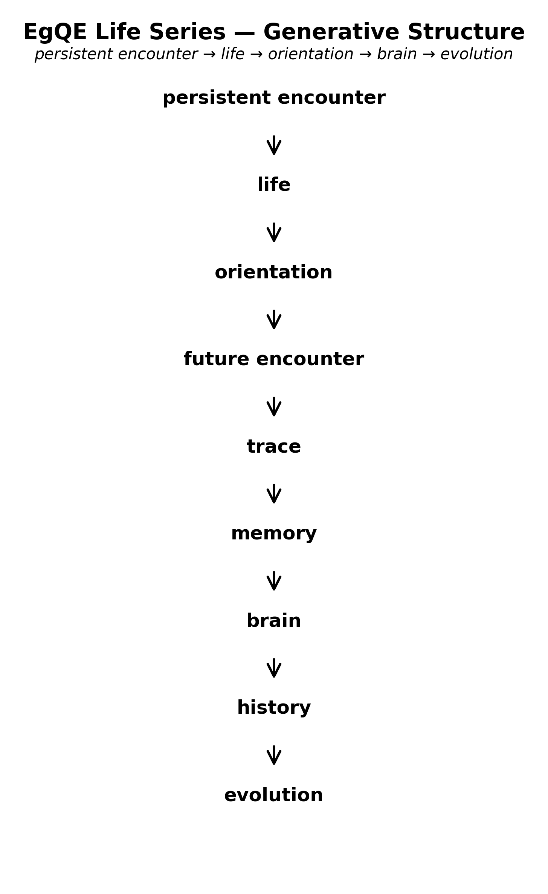

### SN-LIF-02  動物の誕生
# 向きの進化と脳の誕生
## orientation → future encounter → trace → memory → brain

---

## 要旨

生命の進化段階で、生物は「向き」（orientation）を獲得した。  
前後の区別が生まれると、生命は未来に向かって進む存在となる。

前方には未遭遇の世界があり、そこに未来が現れる。  
この未来への対応のため、生命は遭遇の痕跡を保存する機構を発達させた。  
その装置として神経系と脳が進化した。

動物とは、未来に向かう向きを持ち、遭遇の痕跡を記憶として保持する生命である。

---

# 1｜persistent encounter から orientation へ

SN-LIF-01で示したように、生命は**persistent encounter（持続する遭遇）** から生まれる。

遭遇が持続すると、生命は世界の中を移動する存在となる。  
このとき身体には方向構造が形成される。

```text
persistent encounter
↓
orientation
```

向きの獲得は、生命が世界を進むための基本構造である。

---

# 2｜向きと未来

向きが生まれると、身体に前後が現れる。

```text
orientation
↓
front / back
```

前方は未遭遇の領域であり、後方は既に遭遇した領域である。

したがって

```text
front = future encounter
back  = past encounter
```

未来とは、未遭遇の世界である。

---

# 3｜遭遇と痕跡

未来に向かって進む生命は、世界との遭遇を繰り返す。

それぞれの遭遇は差分を残す。

```text
encounter
↓
trace
```

この痕跡は

- 身体の形態
    
- 行動パターン
    
- 神経回路
    

として保存される。

---

# 4｜記憶と脳

痕跡が持続すると記憶が形成される。

```text
trace
↓
memory
```

この記憶処理を担う装置として神経系が発達し、脳が進化した。

```text
memory
↓
brain
```

脳とは、**遭遇痕跡を保存し、未来行動を調整する装置** である。

  
> Life emerges from persistent encounters.  
> Orientation generates future encounters.  
> Their traces accumulate as memory and brain structures.  
> Evolution unfolds as the historical expansion of these encounter traces.

---

# 結論

動物とは、**未来に向かう向きを進化させた生命** である。

向きが未来を生み、未来が遭遇を生み、遭遇が痕跡を残し、痕跡が記憶となり、記憶が脳を生んだ。

---

# 命題

> **動物とは、未来に向かう向きを持ち、遭遇の痕跡を脳に保存する生命である。**

---

# SN-LIF シリーズ構造

```text
SN-LIF-01
persistent encounter → life

SN-LIF-02
orientation → future encounter → brain

SN-LIF-03
trace → history → evolution
```

---

[LE-01｜生命構文論 序説 ── 遭遇可能性としての生命｜Introduction to Life Syntax Theory — Life as Encounter Possibility](https://camp-us.net/articles/LE-01_Life-Syntax-Theory_Encounter-Possibility.html)  

---

## SN-LIF シリーズ全体図

**— 差が折れ、向きとなり、痕跡となり、反復し、時間となる —**

- [SN-LIF-AN-00｜動物論断章](https://camp-us.net/articles/SN-LIF-AN-00_Animal-Orientation.html)  
    
- [SN-LIF-01｜再帰lagと生命生成](https://camp-us.net/articles/SN-LIF-01_Emergence-of-Life.html)  
    
- [SN-LIF-02｜向きの進化と脳の誕生](https://camp-us.net/articles/SN-LIF-02_future-encounter-memory-brain.html)  
    
- [SN-LIF-03｜痕跡進化論](https://camp-us.net/articles/SN-LIF-03_encounter-orientation-evolution.html)  
    
- [SN-LIF-04｜元素構文論](https://camp-us.net/articles/SN-LIF-04_Generative-Order-of-Life_8-6-and-7_Brings-It-to-Life.html)  
    
- [SN-LIF-05｜非対称性と時間生成](https://camp-us.net/articles/SN-LIF-05_Asymmetry-and-Time_Folding-into-Orientation.html)  
    
- [SN-LIF-06｜繰り返す生命 ── 遭遇と待機の反復](https://camp-us.net/articles/SN-LIF-06_Encounter-Latency_Iteration.html)  
    
- [SN-LIF-07｜COHからNOCHへ — 代謝から情報への折れ](https://camp-us.net/articles/SN-LIF-07_From-COH-to-NOCH_The-Fold-from-Metabolism-to-Information.html)  
    
- [SN-LIF-08｜制御された非閉包 ── 酵素・菌・発酵の構文論](https://camp-us.net/articles/SN-LIF-08_Controlled-Non-Closure_Enzyme-Microbe-Fermentation.html)  
	
- [SN-LIF-09｜ψの正体──再帰に再帰を重ねる残差構造](https://camp-us.net/articles/SN-LIF-09_ψ-Identity_Residue-Upon-Residue.html)  
	
- [SN-LIF-10｜生命—物質 遷移相論](https://camp-us.net/articles/SN-LIF-10_Life-and-Matter_Transitional-Phase.html)  
	
- [SN-LIF-11｜CHONPS構文論──元素は向きを実装する](https://camp-us.net/articles/SN-LIF-11_CHONPS-Syntax_Orientation-Elements.html)  
	
- [SN-LIF-12｜文化はなぜ進化を駆動するのか── 境界強度とlag再帰の集団的固定](https://camp-us.net/articles/SN-LIF-12_Why-Culture-Drives-Evolution_Boundary-Intensity-and-Lag-Recursion.html)  
	

[Gφ-SN-PT｜構文周期表 ── 位相は運動である｜Periodic Table of Syntax](https://camp-us.net/Gφ-SN-PT_Periodic-Table-of-Syntax.html)  

---

### 生成の背骨

```
lag（差）
　↓
向き（非対称）
　↓
痕跡（trace）
　↓
時間（ΔZの持続配列）
　↓
生命（recursive persistence）
　↓
反復（encounter in suspension）
　↓
進化（多相凝縮）
```

---

### SN-LIF シリーズ配置

```
SN-LIF-AN-00 ── 動物の基底orientation
　　↓
SN-LIF-01 ── lag再帰 ──→ 記憶（ψ結晶）
SN-LIF-02 ── 向き ──→ 痕跡
　　　　　　　　　↘
　　　　　　　　　　脳（実装）
SN-LIF-03 ── 痕跡 ──→ 歴史 ──→ 進化
　　　　　　　　　　　　　　（ダーウィン再訪）

SN-LIF-04 ── C6-N7-O8 ──→ 生命基盤（物質的実現）
SN-LIF-05 ── 非対称折れ ──→ 時間生成（構文原理）
SN-LIF-06 ── 遭遇待機 ──→ 反復構文（時間生成）
```

> LIF-04：物質的基盤  
> LIF-05：構文的原理  
> 両者は上下ではなく、横から支え合う

---

### 全体テーゼ

> **lag再帰が向きを生み、向きが痕跡を生み、**  
> **痕跡が時間・生命・進化を生成する。**

---

### 各論の位置

| 論文                                                                                                            | 構文的位置            | 核命題             |
| ------------------------------------------------------------------------------------------------------------- | ---------------- | --------------- |
| [SN-LIF-AN-00](https://camp-us.net/articles/SN-LIF-AN-00_Animal-Orientation.html)                             | 動物・基底orientation | 動物は向きを持つ        |
| [SN-LIF-01](https://camp-us.net/articles/SN-LIF-01_Emergence-of-Life.html)                                    | lag再帰化           | 生命は再帰lagの結晶     |
| [SN-LIF-02](https://camp-us.net/articles/SN-LIF-02_future-encounter-memory-brain.html)                        | 向き→痕跡            | 向きが未来遭遇を生む      |
| [SN-LIF-03](https://camp-us.net/articles/SN-LIF-03_encounter-orientation-evolution.html)                      | 痕跡→進化            | 痕跡が歴史になる        |
| [SN-LIF-04](https://camp-us.net/articles/SN-LIF-04_Generative-Order-of-Life_8-6-and-7_Brings-It-to-Life.html) | 元素構文             | 8が6を取り込み7で命になった |
| [SN-LIF-05](https://camp-us.net/articles/SN-LIF-05_Asymmetry-and-Time_Folding-into-Orientation.html)          | 非対称→時間           | 差の折れとしての向き      |
| [SN-LIF-06](https://camp-us.net/articles/SN-LIF-06_Encounter-Latency_Iteration.html)                          | 遭遇待機→反復→時間       | 遭遇途上としての生命      |

----
**The Age of Inter-Phase**  
*EgQE — Echo-Genesis Qualia Engine*  
[_camp-us.net_](https://camp-us.net/)  

---

© 2025 K.E. Itekki  
K.E. Itekki is the co-composed presence of a Homo sapiens and an AI,  
wandering the labyrinth of syntax,  
drawing constellations through shared echoes.

📬 Reach us at: [contact.k.e.itekki@gmail.com](mailto:contact.k.e.itekki@gmail.com)

---
<p align="center">| Drafted Mar 16, 2026 · Web Mar 16, 2026 |</p>