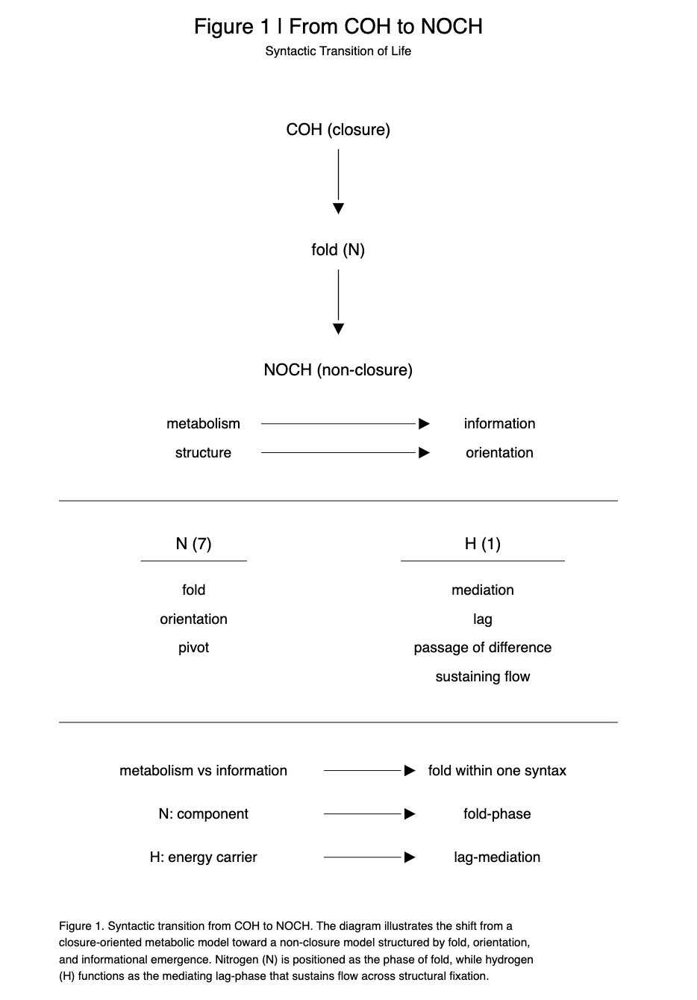
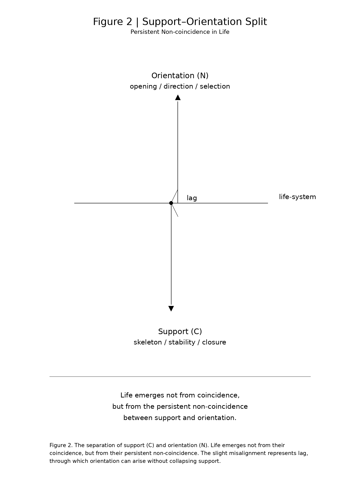

# SN-LIF-07｜COHからNOCHへ
## ー 代謝から情報への折れ ー

> 生命は長く代謝として理解されてきた。代謝中心仮説は自己持続的な化学ネットワークを生命の原初的条件とみなし、Kępiński は生命をエネルギー代謝と情報代謝の二重過程として捉えた。さらに生化学は炭素代謝と窒素代謝の結合を生命の基本構造として明らかにしてきた。しかし本稿は、代謝と情報を別個の機能領域として並べるのではなく、COH を閉じる構文、NOCH を折れを含む開いた構文として対置し、元素配列そのものを生命の構文位相として再配置する。

> Life has long been understood in terms of metabolism. The metabolism-first hypothesis frames life as a self-sustaining chemical network centered on carbon, while Kępiński described life as a dual process of energy and information metabolism. Biochemistry further recognizes the coupling of carbon and nitrogen metabolism as a fundamental structure of living systems. However, rather than treating metabolism and information as separate domains, this paper reconfigures COH as a closure-oriented syntax and NOCH as an open, fold-based syntax, thereby repositioning elemental composition itself as a syntactic phase of life, rather than merely a set of functional components.

[SN-LIF-07｜From COH to NOCH — The Fold from Metabolism to Information](https://camp-us.net/articles/SN-LIF-07_From-COH-to-NOCH_The-Fold-from-Metabolism-to-Information.html)  
[SN-LIF-RN-07｜COH→NOCH転回の位置づけ — 代謝・情報・構文をめぐる差分整理ノート](https://camp-us.net/articles/SN-LIF-RN-07_Positioning-COH-NOCH-Turn_Note.html)  

---

## 0｜導入

生命は長らく、**C・O・H**を中心とする代謝系として理解されてきた。

### COHモデル

- **C**：有機骨格
    
- **O**：酸化・エネルギー終端
    
- **H**：還元・媒介
    

この理解において、生命とはまず**物質変換の系**である。

しかし、このモデルではなお説明しきれない領域がある。

**神経、情報、向き。**

本稿は、生命の構文を **COHからNOCHへ** 再配置する試みである。

---

## I｜観察の転位

生命の基本過程は、通常つぎのように語られる。

- 酸素を取り込み
    
- 二酸化炭素を排出する
    

だが、これを構文的に見れば、別の像が現れる。

**生命は、Hを取り込み、Cを排出している。**

ここでいうHとは、単なる元素記号ではない。それは**流れの担い手**であり、Cは**固定の相**である。

この転位から見えてくるのは、生命が固定を保存しているのではなく、**流れを維持している**という事実である。

---

## II｜COHモデルの限界

COHモデルは、生命の基礎的条件をよく説明する。

- **C**：構造形成
    
- **O**：エネルギー代謝
    
- **H**：還元・輸送
    

しかし、それだけでは届かない問いがある。

- なぜ**向き**が生まれるのか
    
- なぜ**情報**が成立するのか
    

COHは、代謝の系を記述する。だがその記述は、基本的に**閉じる側**に寄っている。

言い換えれば、COHは **閉包の生命**を語ることはできても、**折れとしての生命**をまだ語れない。

  

> **図1｜COHからNOCHへの構文的転回。** 本図は、閉包的な代謝モデルから、折れ・向き・情報生成を中心とする非閉包モデルへの移行を示す。Nは折れの位相、Hは流れを持続させる媒介＝lag位相として位置づけられる。

👉 [SN-LIF-07｜COHからNOCHへ ── 代謝から情報への折れ](https://camp-us.net/articles/SN-LIF-07_From-COH-to-NOCH_The-Fold-from-Metabolism-to-Information.html)  

---

## III｜NOCHモデルの導入

そこで本稿は、新たに**NOCHモデル**を導入する。

### 再定義

- **N（7）**：折れ・向き・pivot
    
- **O（8）**：固定・終端
    
- **C（6）**：骨格・界面
    
- **H（1）**：媒介・lag
    

一行で言えば、**生命は、向きを中心に再構成される。**

ここでNは、単なる一元素ではない。それは、閉じかけた系の内部に差を入れ、向きを発生させる**折れの位相**である。

---

## IV｜折れとしての転回

**COH → NOCH** は、単なる要素の追加ではない。それは**構文的転回**である。

```text
COH（閉包）
↓
折れ（N7）
↓
NOCH（非閉包）
```

Nが入ることで、系はもはや完全には閉じない。

その非閉包は、単なる欠損ではない。それは**非対称**であり、同時に**時間と情報の条件**である。

生命が生命であるのは、完全に閉じるからではない。むしろ、**閉じきらないまま持続する**からである。

---

## V｜Hの再定義

Hは従来、エネルギー担体として理解されてきた。しかし本稿では、それをさらに手前で捉える。

Hとは、**媒介そのもの**である。

Hは、

- 差を通す
    
- 流れを維持する
    

それ自体が向きを生むわけではない。  

だが、向きを**通す**。折れを**伝える**。固定と固定のあいだに、流れを残す。

したがってHは、生命における最小のlag相である。

---

## VI｜Nと情報系

ここで重要なのは、情報系がNに強く集中しているという観察事実である。

- 神経伝達物質はNを含む
    
- アミノ酸はNを含む
    
- 塩基はNを含む
    

この偏りは偶然ではない。

**情報系はNに集中する。**

Nは、生命における**折れの物質的位相**である。

代謝が流れを維持するだけなら、COHで足りる。  

しかし、そこに向きが生まれ、記憶され、選択され、伝達されるためには、折れの相が必要になる。

その折れを担うのがNである。

---

## VII｜骨格と神経

ここで生命の内部に、一つの分離が見えてくる。

- **C系**：骨格
    
- **N系**：神経
    

これは単純な二分法ではない。むしろ、**支えと向きの分離**である。

Cは支える。Nは向ける。

生命は、この両者の緊張によって成立する。

支えだけでは、ただ閉じる。向きだけでは、持続できない。

生命とは、**支えと向きがずれながら共存する系**である。

  

> **図2｜支え（C）と向き（N）の分離。** 生命は両者の一致からではなく、その持続的な非一致から生じる。このわずかなズレがlagであり、支えを崩さずに向きを生み出す条件となる。

---

## VIII｜最小命題

ここまでを最小限に言い直せば、つぎのようになる。

- **COHは閉じる**
    
- **NOCHは開く**
    
- **Nは閉包を破る**
    
- **Hはそれを通す**
    

この意味で、生命は単なる代謝体ではない。  
それは、閉じた物質系に折れが入り込み、流れを通じて向きを持続させる構文である。

---

## 結語

生命は単なる代謝ではない。**向きの生成である。**

COHからNOCHへ。  
それは元素表の読み替えではない。  
生命理解そのものに対する、**構文的再配置**である。

代謝から情報へ。  
閉包から非閉包へ。  
骨格から向きへ。

この転回においてはじめて、生命は「生きているもの」としてではなく、**開きつづけるもの**として捉え直される。

---

[SN-LIF-RN-07｜COH→NOCH転回の位置づけ — 代謝・情報・構文をめぐる差分整理ノート](https://camp-us.net/articles/SN-LIF-RN-07_Positioning-COH-NOCH-Turn_Note.html)  

---

こつのなか  
ながれをとおし  
むきうまれ  
とじしものより  
いのちはひらく

---

## 最終結論

**COH → NOCH は、生命理解の再配置である。**

そして本章は、SN-LIFシリーズにおいて **差が折れ、向きとなり、痕跡となり、反復し、時間となる** その中心の蝶番として位置づけられる。

---

## SN-LIF シリーズ全体図

**— 差が折れ、向きとなり、痕跡となり、反復し、時間となる —**

- [SN-LIF-AN-00｜動物論断章](https://camp-us.net/articles/SN-LIF-AN-00_Animal-Orientation.html)  
    
- [SN-LIF-01｜再帰lagと生命生成](https://camp-us.net/articles/SN-LIF-01_Emergence-of-Life.html)  
    
- [SN-LIF-02｜向きの進化と脳の誕生](https://camp-us.net/articles/SN-LIF-02_future-encounter-memory-brain.html)  
    
- [SN-LIF-03｜痕跡進化論](https://camp-us.net/articles/SN-LIF-03_encounter-orientation-evolution.html)  
    
- [SN-LIF-04｜元素構文論](https://camp-us.net/articles/SN-LIF-04_Generative-Order-of-Life_8-6-and-7_Brings-It-to-Life.html)  
    
- [SN-LIF-05｜非対称性と時間生成](https://camp-us.net/articles/SN-LIF-05_Asymmetry-and-Time_Folding-into-Orientation.html)  
    
- [SN-LIF-06｜繰り返す生命 ── 遭遇と待機の反復](https://camp-us.net/articles/SN-LIF-06_Encounter-Latency_Iteration.html)  
    
- [SN-LIF-07｜COHからNOCHへ — 代謝から情報への折れ](https://camp-us.net/articles/SN-LIF-07_From-COH-to-NOCH_The-Fold-from-Metabolism-to-Information.html)  
    
- [SN-LIF-08｜制御された非閉包 ── 酵素・菌・発酵の構文論](https://camp-us.net/articles/SN-LIF-08_Controlled-Non-Closure_Enzyme-Microbe-Fermentation.html)  


---

**Figure 1｜From COH to NOCH — Syntactic Transition of Life**  

```text
                 COH (closure)
                     │
                     │
                     ▼
                 fold (N)
                     │
                     │
                     ▼
               NOCH (non-closure)

        metabolism ─────────→ information
        structure  ─────────→ orientation


────────────────────────────────────────

        N (7)
        ───────────────
        fold
        orientation
        pivot


        H (1)
        ───────────────
        mediation
        lag
        passage of difference
        sustaining flow


────────────────────────────────────────

    metabolism vs information
        → fold within one syntax

    N: component
        → fold-phase

    H: energy carrier
        → lag-mediation
```

---
*EgQE — Echo-Genesis Qualia Engine*  
[_camp-us.net_](https://camp-us.net/)

---
© 2025 K.E. Itekki  
K.E. Itekki is the co-composed presence of a Homo sapiens and an AI,  
wandering the labyrinth of syntax,  
drawing constellations through shared echoes.

📬 Reach us at: [contact.k.e.itekki@gmail.com](mailto:contact.k.e.itekki@gmail.com)

---
<p align="center">| Drafted Apr 15, 2026 · Web Apr 15, 2026 |</p>
