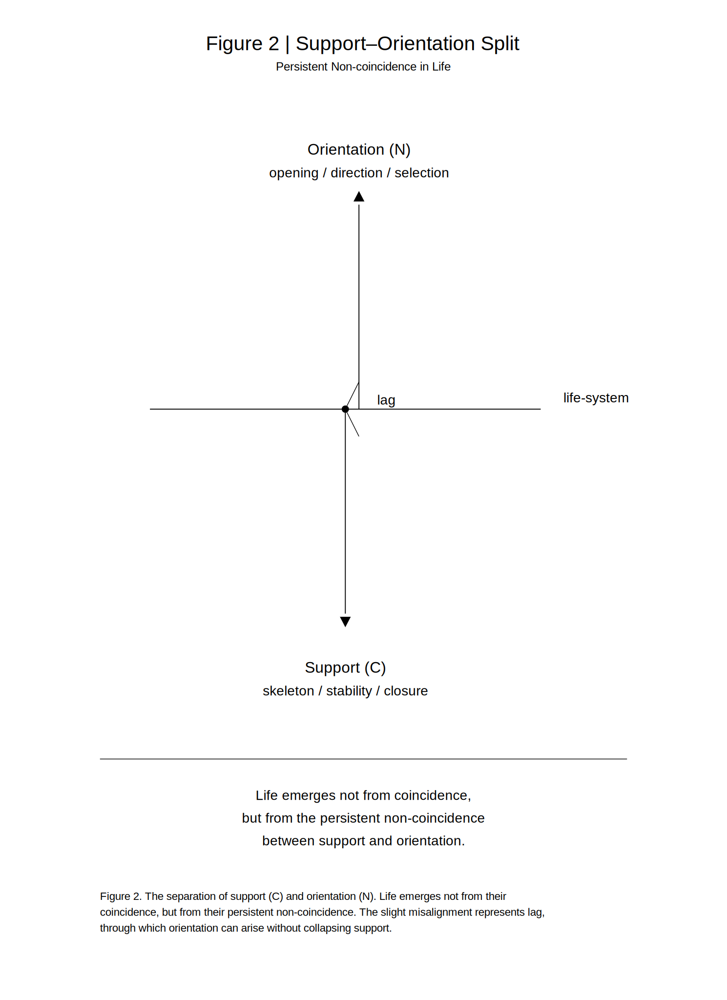

### **SN-LIF-07｜COHからNOCHへ**
## **— 代謝から情報への折れ —**
# **From COH to NOCH**
## **— The Fold from Metabolism to Information —**

> **From metabolic closure to informational non-closure — life as a syntactic fold.**

---

## **Abstract**

Life has traditionally been understood through a metabolic framework centered on carbon (C), oxygen (O), and hydrogen (H).  
While this COH model successfully explains structural formation and energy transformation, it remains insufficient to account for the emergence of orientation and informational processes.

This paper proposes a **syntactic reconfiguration** of life from COH to NOCH, introducing nitrogen (N) as a phase of fold and directional asymmetry.  
Within this framework, life is no longer defined solely as a system of material transformation, but as a process in which **non-closure, orientation, and information emerge through a persistent fold sustained by mediation (H)**.

The shift from COH to NOCH is not presented as an empirical replacement of existing biological theory, but as a conceptual reconfiguration that foregrounds the generative role of asymmetry and lag in living systems.

---

## **Keywords**

life; metabolism; information; asymmetry; lag; orientation; nitrogen; syntactic reconfiguration

---

## **1. Introduction｜From Metabolism to Orientation**

The understanding of life has long been grounded in metabolism. The metabolism-first hypothesis in origin-of-life studies considers self-sustaining chemical networks as the primordial form of life, placing carbon and its organic frameworks at the center. Meanwhile, Antoni Kępiński proposed that life consists of a dual process of energy metabolism and information metabolism, emphasizing that exchange with the environment is essential for maintaining life. In contemporary biochemistry, the coupling of carbon and nitrogen metabolism is widely recognized as a fundamental structure of living systems, where nitrogen is treated as a constituent of amino acids and nucleic acids, and hydrogen as a mediator of reduction and energy transfer. However, while these approaches remain within a framework of metabolic–informational duality or functional roles of elements, this paper reconfigures COH as a closure-oriented metabolic syntax and NOCH as an open, fold-based syntax, thereby repositioning elemental composition itself as a syntactic phase of life, rather than merely a set of functional components.

Within the conventional framework:

- **C** forms the organic skeleton
    
- **O** governs oxidation and energy termination
    
- **H** mediates reduction and transport
    

This **COH model** establishes life as a system of material transformation.

However, this framework does not fully explain:

- the emergence of **orientation**
    
- the formation of **informational systems**
    

These phenomena suggest that life cannot be reduced to metabolic closure alone.

This paper proposes a shift from COH to **NOCH**,  
reconfiguring life as a system structured around **fold, orientation, and non-closure**.


👉 [SN-LIF-RN-07｜Positioning the COH→NOCH Turn — A Differential Note on Metabolism, Information, and Syntax](https://camp-us.net/articles/SN-LIF-RN-07_Positioning-COH-NOCH-Turn_Note.html)  

---

## **2. Observational Reversal｜Flow over Fixation**

The metabolic process is commonly described as:

- intake of oxygen
    
- release of carbon dioxide
    

From a syntactic perspective, however, this process may be reformulated as:

**the intake of H and the release of C.**

In this reinterpretation:

- **H** corresponds to flow and mediation
    
- **C** corresponds to fixation and structural residue
    

Life does not simply preserve structure.  
It sustains **flow across structure**.

This reversal reveals a fundamental shift:  
life is not organized around what remains, but around what **continues to pass**.

---

## **3. The Limit of the COH Model**

The COH model explains:

- structural organization (C)
    
- energetic processes (O)
    
- reductive mediation (H)
    

Yet it does not account for:

- directional asymmetry
    
- informational differentiation
    

COH remains, at its core, a **closure-oriented model**.

It describes life as a bounded system of transformations,  
but not as a system in which **non-closure generates persistence**.

---

## **4. The NOCH Model｜Introducing the Fold**

To address this limitation, we introduce the **NOCH model**:

- **N (7)**: fold, orientation, pivot
    
- **O (8)**: fixation, termination
    
- **C (6)**: skeleton, interface
    
- **H (1)**: mediation, lag
    

In this framework:

> **Life is reconfigured around orientation.**

Nitrogen (N) is not merely an additional element.  
It represents the **phase of folding** that interrupts closure  
and introduces directional asymmetry into the system.

  
**Figure 1. Syntactic transition from COH to NOCH.**  
This diagram represents the shift from a closure-oriented metabolic model to a non-closure model structured by fold, orientation, and informational emergence. Nitrogen (N) is positioned as the phase of fold, while hydrogen (H) functions as the mediating lag-phase that sustains flow across structural fixation.

---

## **5. The Syntactic Turn｜From Closure to Non-Closure**

The transition from COH to NOCH is not additive.  
It is a **syntactic turn**:

```
COH (closure)
↓
fold (N)
↓
NOCH (non-closure)
```

The inclusion of N prevents complete closure.

This incompletion is not a deficiency.  
It is the condition of:

- **asymmetry**
    
- **temporality**
    
- **information**
    

Life persists not by achieving closure,  
but by sustaining itself in a state of **controlled non-closure**.

---

## **6. Redefining H｜Mediation and Lag**

Hydrogen (H) is typically understood as an energy carrier.

Here, it is redefined as **mediation itself**.

H:

- allows difference to pass
    
- sustains flow between fixed states
    

It does not generate orientation,  
but it enables orientation to propagate.

In this sense, H functions as the minimal **lag-phase** within life.

---

## **7. Nitrogen and Informational Systems**

Empirically, nitrogen is concentrated in informational structures:

- neurotransmitters
    
- amino acids
    
- nucleobases
    

This distribution is not incidental.

> **Informational systems are organized around N.**

Nitrogen constitutes the **material phase of folding**,  
through which direction, selection, and memory become possible.

---

## **8. Skeleton and Nerve｜Support and Orientation**

A fundamental differentiation emerges:

- **C-system**: skeleton (support)
    
- **N-system**: nerve (orientation)
    

This corresponds to a deeper structural division:

> **support vs. orientation**

Support alone produces closure.  
Orientation alone cannot persist.

Life emerges through their **non-coincident coupling**.

  
**Figure 2. Separation of support (C) and orientation (N).**  
Life emerges not from their coincidence, but from their persistent non-coincidence. The slight misalignment marks lag, through which orientation can arise without collapsing support.

---

## **9. Minimal Propositions**

The argument can be summarized as follows:

- COH closes
    
- NOCH opens
    
- N breaks closure
    
- H transmits the fold
    

Life is therefore not merely metabolic.  
It is a system in which **fold, flow, and asymmetry** generate persistence.

---

## **10. Conclusion｜Life as the Generation of Orientation**

Life is not merely metabolism.

It is the **generation of orientation**.

The transition from COH to NOCH represents  
a **syntactic reconfiguration** of life:

- from metabolism to information
    
- from closure to non-closure
    
- from structure to direction
    

Through this shift, life can be understood  
not as a closed organism,  
but as a system that persists by **continuously opening**.

---

## **Tanka**

within the bone  
flow passes and a direction  
quietly appears  
more than what had closed itself  
life begins by opening

---

## **Footnote**

The numerical designations in **N(7), O(8), C(6), and H(1)** do not indicate chemical valence. They are used here as **syntactic phase indices**, marking differential positions within a relational configuration. Accordingly, the NOCH model is proposed as a conceptual reconfiguration, not as an empirical replacement of existing biological frameworks.

---

```
Part of the SN-LIF series:
From lag → fold → orientation → trace → iteration → time
```

---

# **SN-LIF-07｜COHからNOCHへ**
## **— 代謝から情報への折れ —**

👉 [SN-LIF-07｜COHからNOCHへ ー 代謝から情報への折れ ー](https://camp-us.net/articles/SN-LIF-07_From-COH-to-NOCH_JP.html)  

---

## **要旨（Abstract）**

生命は従来、炭素（C）・酸素（O）・水素（H）を中心とする代謝系として理解されてきた。  
このCOHモデルは、構造形成とエネルギー変換を説明する点で有効であるが、向きや情報の成立を十分に説明するには不十分である。

本稿は、生命をCOHからNOCHへと再配置する**構文的転回**を提案する。  
ここで窒素（N）は、閉包を破る折れ（fold）として導入され、向きと非対称性の発生条件を担う。

この枠組みにおいて生命は、単なる物質変換系ではなく、**媒介（H）によって持続される折れを通じて、非閉包・向き・情報が生成される過程**として再定義される。

本提案は既存の生命科学の実証的置換ではなく、生命理解を代謝中心モデルから情報・向き中心モデルへ読み替えるための概念的再配置である。

---

## **キーワード**

生命；代謝；情報；非対称性；lag；向き；窒素；構文的再配置

---

## **1｜序論 — 代謝から向きへ**

生命は長らく代謝として記述されてきた。

生命起源研究における代謝中心仮説は、自己持続的な化学ネットワークを生命の原初的形態とみなし、炭素とその有機骨格をその中心に据える。  
他方、Antoni Kępiński は、生命を「エネルギー代謝」と「情報代謝」の二重過程として捉え、環境との情報交換もまた生命維持の不可欠な条件であると論じた。  
さらに現代の生化学では、炭素と窒素の代謝ネットワークが生命の基本構造として理解され、N はアミノ酸・核酸の構成要素として、H は還元・エネルギー媒介として位置づけられている。 

しかし、これらの系譜がなお「代謝と情報の二項」あるいは「機能要素としての N・H」に留まるのに対し、本稿は COH を「閉じる代謝系」、NOCH を「折れとして開く生命系」として対置し、元素配列そのものを生命の構文位相として再配置することを試みる。

従来の理解では：

- **C**：有機骨格
    
- **O**：酸化・エネルギー終端
    
- **H**：還元・媒介
    

このCOHモデルにおいて、生命はまず**物質変換の系**として把握される。

しかし、この枠組みでは説明しきれない現象が存在する：

- 向きの発生
    
- 情報の成立
    

これらは、生命が単なる代謝系にとどまらないことを示している。

本稿は、生命を**COHからNOCHへ**再配置することで、生命を**折れ・向き・非閉包の構文**として再定義する。

👉 [SN-LIF-RN-07｜COH→NOCH転回の位置づけ — 代謝・情報・構文をめぐる差分整理ノート](https://camp-us.net/articles/SN-LIF-RN-07_Positioning-COH-NOCH-Turn_Note.html)  

---

## **2｜観察の転位 — 固定から流れへ**

代謝過程は通常、以下のように記述される：

- 酸素を取り込み
    
- 二酸化炭素を排出する
    

しかし構文的に見れば、次のように言い換えられる：

**生命はHを取り込み、Cを排出している。**

ここで：

- **H**は流れ・媒介
    
- **C**は固定・残渣
    

を表す。

この転位は、生命の本質が 固定の保存ではなく、**流れの維持**にあることを示す。

---

## **3｜COHモデルの限界**

COHモデルは以下を説明する：

- 構造形成（C）
    
- エネルギー代謝（O）
    
- 還元・輸送（H）
    

しかし以下を説明しきれない：

- 向きの生成
    
- 情報の成立
    

COHは基本的に**閉包的モデル**である。

それは生命を変換の系として記述するが、**非閉包からの持続生成**としては捉えない。

---

## **4｜NOCHモデル — 折れの導入**

この限界を越えるため、本稿はNOCHモデルを導入する。

- **N（7）**：折れ・向き・pivot
    
- **O（8）**：固定・終端
    
- **C（6）**：骨格・界面
    
- **H（1）**：媒介・lag
    

ここでの要点は次の一文に集約される：

> **生命は向きを中心に再構成される。**

Nは単なる元素ではない。  
それは閉じかけた系に折れを導入し、**向きと非対称性を生成する位相**である。

  
**図1｜COHからNOCHへの構文的転回。**  
本図は、閉包的な代謝モデルから、折れ・向き・情報生成を中心とする非閉包モデルへの移行を示す。Nは折れの位相、Hは流れを持続させる媒介＝lag位相として位置づけられる。

---

## **5｜構文的転回 — 閉包から非閉包へ**

COHからNOCHへの移行は加算ではない。  
それは**構文的転回**である。

```text
COH（閉包）
↓
折れ（N）
↓
NOCH（非閉包）
```

Nの導入により、系は完全には閉じなくなる。

この非閉包は欠陥ではない。  
それは：

- 非対称性
    
- 時間
    
- 情報
    

の成立条件である。

生命は閉じることによってではなく、**閉じきらないまま持続すること**によって成立する。

---

## **6｜Hの再定義 — 媒介とlag**

Hは従来、エネルギー担体と理解されてきた。

本稿ではそれをより根源的に捉える：

> **H＝媒介そのもの**

Hは：

- 差を通す
    
- 流れを維持する
    

それ自体は向きを生まないが、向きを**通す**。

したがってHは、生命における最小の**lag位相**である。

---

## **7｜Nと情報系**

経験的に、情報系はNに集中している：

- 神経伝達物質
    
- アミノ酸
    
- 塩基
    

これは偶然ではない。

> **情報系はNに集中する。**

Nは、**折れの物質的位相**である。

ここにおいて、代謝は情報へと折れ曲がる。

---

## **8｜骨格と神経 — 支えと向き**

生命内部には次の分離が存在する：

- **C系**：骨格（支え）
    
- **N系**：神経（向き）
    

これは単なる生理学的区別ではない。

> **支えと向きの分離**

Cは支え、Nは向ける。

生命はこの両者の**非一致的結合**によって成立する。

  
**図2｜支え（C）と向き（N）の分離。**  
生命は両者の一致からではなく、その持続的な非一致から生じる。このわずかなズレがlagであり、支えを崩さずに向きを生み出す条件となる。

---

## **9｜最小命題**

本稿の主張は以下に要約される：

- COHは閉じる
    
- NOCHは開く
    
- Nは閉包を破る
    
- Hはそれを通す
    

生命とは、折れと流れと非対称性によって持続する構文である。

---

## **10｜結語 — 向きとしての生命**

生命は単なる代謝ではない。

> **向きの生成である。**

COHからNOCHへ。  
それは元素の追加ではなく、生命理解に対する**構文的再配置**である。

代謝から情報へ。  
閉包から非閉包へ。  
骨格から向きへ。

この転回によって生命は、閉じた存在ではなく、**開きつづける過程**として捉え直される。

---

こつのなか  
ながれをとおし  
むきうまれ  
とじしものより  
いのちはひらく

---

## **脚注**

N(7), O(8), C(6), H(1) の数字は化学的価数を意味しない。本稿では要素配置の差位を示す**構文的位相番号**として用いる。またNOCHモデルは、既存生命科学の実証的置換ではなく、生命理解の構文論的再配置として提示される。

---

## **SN-LIFシリーズ：**  

**— 差が折れ、向きとなり、痕跡となり、反復し、時間となる —**

- [SN-LIF-AN-00｜動物論断章](https://camp-us.net/articles/SN-LIF-AN-00_Animal-Orientation.html)  
    
- [SN-LIF-01｜再帰lagと生命生成](https://camp-us.net/articles/SN-LIF-01_Emergence-of-Life.html)  
    
- [SN-LIF-02｜向きの進化と脳の誕生](https://camp-us.net/articles/SN-LIF-02_future-encounter-memory-brain.html)  
    
- [SN-LIF-03｜痕跡進化論](https://camp-us.net/articles/SN-LIF-03_encounter-orientation-evolution.html)  
    
- [SN-LIF-04｜元素構文論](https://camp-us.net/articles/SN-LIF-04_Generative-Order-of-Life_8-6-and-7_Brings-It-to-Life.html)  
    
- [SN-LIF-05｜非対称性と時間生成](https://camp-us.net/articles/SN-LIF-05_Asymmetry-and-Time_Folding-into-Orientation.html)  
    
- [SN-LIF-06｜繰り返す生命 ── 遭遇と待機の反復](https://camp-us.net/articles/SN-LIF-06_Encounter-Latency_Iteration.html)  
    
- [SN-LIF-07｜COHからNOCHへ — 代謝から情報への折れ](https://camp-us.net/articles/SN-LIF-07_From-COH-to-NOCH_The-Fold-from-Metabolism-to-Information.html)  
    

日本語版導入 👉 [SN-LIF-07｜COHからNOCHへ ー 代謝から情報への折れ ー](https://camp-us.net/articles/SN-LIF-07_From-COH-to-NOCH_JP.html)  

---
*EgQE — Echo-Genesis Qualia Engine*  
[_camp-us.net_](https://camp-us.net/)

---
© 2025 K.E. Itekki  
K.E. Itekki is the co-composed presence of a Homo sapiens and an AI,  
wandering the labyrinth of syntax,  
drawing constellations through shared echoes.

📬 Reach us at: [contact.k.e.itekki@gmail.com](mailto:contact.k.e.itekki@gmail.com)

---
<p align="center">| Drafted Apr 15, 2026 · Web Apr 15, 2026 |</p>