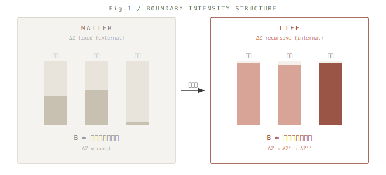
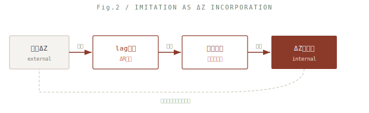
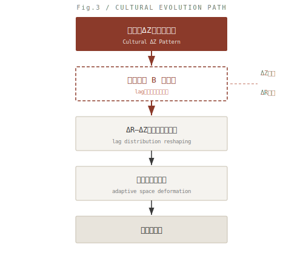

### SN-LIF-12｜進化と文化
# 文化はなぜ進化を駆動するのか
## **── 境界強度とlag再帰の集団的固定**

## **Why Culture Drives Evolution**  
### — Boundary Intensity and the Collective Fixation of Lag Recursion

---

## 0. 導入｜問いの反転

文化は進化の結果なのか。

本稿はこの問いを反転する。問うべきは、なぜ文化は進化を駆動し得るのか、である。

> **中心命題**
> 
> 生命とは、再帰が内部化された物質である。 文化とは、境界強度の集団的持続である。

> **Core Thesis**
>
> Life is matter in which recursion has been internalized.  
> Culture is the collective persistence of boundary intensity.

---

## 1. 前提｜生命の最小定義

**定義**

生命 ＝ 境界強度を維持するlag再帰構文

- ΔR：環境における差分状態
- ΔZ：固定・記述された差分
- lag：ΔRとΔZの非一致

この定義において、生命は物質と断絶しない。差異は状態（位相）のみである。

> 生命とは、再帰が内部化された物質である。

> Life is a lag-recursive structure that maintains boundary intensity.  
> The distinction between life and matter is not ontological, but phase-based.

---

## 2. 境界強度の定義

**定義**

境界強度とは、ΔZがΔRに対して自己参照的に維持される安定性である。

> Boundary intensity is the stability with which ΔZ is self-referentially maintained against ΔR.

**操作的特徴づけ**

境界強度 B は以下の三要素によって特徴づけられる：

- **持続性**：ΔZが崩壊せず保持される時間
- **耐外乱性**：ΔR変動に対するΔZの安定度
- **再帰率**：ΔZ→ΔZ'の生成頻度

> B ≈ 持続 × 安定 × 再帰
> B ≈ persistence × stability × recursion

境界は線ではない。時間的に持続する関係構造である。

  

---

## 補論｜境界の物質的実装について

本稿は境界を構文的関係として定義するが、その実装は分子配置を通じて物質レベルにも現れる。代表的には、炭素（C）は界面構造を形成し、窒素（N）は内部保持に寄与し、酸素（O）は差分の固定を担う。これらは元素の本質ではなく、境界生成における機能的役割としての再記述である。

> 生命は元素ではなく、役割配置として成立する。

> Boundary is not an entity but a configuration.  
> Molecular arrangements instantiate boundary conditions at the material level.

---

## 3. 位相差｜生命と物質

|状態|構文|特徴|
|---|---|---|
|物質|ΔZ固定（外部接続）|再帰なし|
|生命|ΔZ再帰（内部生成）|境界強度持続|

> 生命とは、境界強度が持続する位相である。

> Matter fixes ΔZ.  
> Life recursively regenerates ΔZ.

---

## 4. 模倣の構文｜ΔZ取り込みとして

**定義**

模倣とは、他者のΔZを自己の再帰構文へ取り込む操作である。

  

> 文化とは、ΔZの相互再帰的取り込みネットワークである。

> Imitation is the incorporation of others’ ΔZ into one’s own recursive structure.

---

## 5. 分散再帰系としての文化

個体におけるlag再帰は閉じた系にとどまらない。模倣を通じてΔZは個体間で共有（分布化）され、再帰構文はネットワークとして展開する。

> **文化とは、境界強度を共有する分散再帰系である。**

このとき、境界強度 B は個体内に局在せず、空間的に分布する構造として現れる。

|スケール|Bの様態|
|---|---|
|個体|Bの局所ピーク（lag再帰の内部閉合）|
|文化|Bの分布パターン（ΔZの集団的共有）|
|社会|Bの固定構造（制度・規範）|

> 文化とは、境界強度の分布が持続的に再生産される構造である。

> Culture is a distributed recursive system in which boundary intensity is shared.

---

## 6. 価値生成との接続

**定義群**

- 価値　＝ 境界強度の知覚
- 規範　＝ 境界強度の固定
- 制度　＝ 境界強度の持続装置

> 社会は境界強度の分布構造である。

> Value is the perception of boundary intensity.  
> Norms fix it. Institutions sustain it.

---

## 7. 進化の再定義｜文化-遺伝子革命の再定式化

文化は選択圧に反応するのではない。文化は選択圧が生じる空間そのものを構成する。

  

> **境界強度とは、取りうる（許容される）lagの帯域を規定する構文的フィルタである。** **文化は境界強度分布を通じて、適応空間そのものを生成する。**

> Boundary intensity functions as a filter that determines the admissible range of lag.  
> Culture reshapes adaptive space by reorganizing boundary intensity distribution.

---

## 8. 結語｜進化の再定義

進化は遺伝子だけではない。進化とは、lag構造の変形である。

> 生命とは境界強度の再帰であり、 文化とはその再帰の集団的持続である。

文化は世界の"揺れ方"を設計する。適応が起こる場そのものを、静かに編み替える。

> Evolution is not merely genetic change.  
> It is the transformation of lag structure.

---

## Coda

境界は消えない。 ただ、持続として編まれ続ける。

> Boundaries do not disappear.  
> They persist as configurations in motion.

---

[QE-04｜境界強度論｜Boundary Intensity](https://camp-us.net/articles/QE-04_Boundary-Intensity.html)  

---

[URL-Core ── Axioms of URL](https://camp-us.net/articles/URL-Core_Axioms-of-URL.html)  

---

## SN-LIF シリーズ全体図

**— 差が折れ、向きとなり、痕跡となり、反復し、時間となる —**

- [SN-LIF-AN-00｜動物論断章](https://camp-us.net/articles/SN-LIF-AN-00_Animal-Orientation.html)  
    
- [SN-LIF-01｜再帰lagと生命生成](https://camp-us.net/articles/SN-LIF-01_Emergence-of-Life.html)  
    
- [SN-LIF-02｜向きの進化と脳の誕生](https://camp-us.net/articles/SN-LIF-02_future-encounter-memory-brain.html)  
    
- [SN-LIF-03｜痕跡進化論](https://camp-us.net/articles/SN-LIF-03_encounter-orientation-evolution.html)  
    
- [SN-LIF-04｜元素構文論](https://camp-us.net/articles/SN-LIF-04_Generative-Order-of-Life_8-6-and-7_Brings-It-to-Life.html)  
    
- [SN-LIF-05｜非対称性と時間生成](https://camp-us.net/articles/SN-LIF-05_Asymmetry-and-Time_Folding-into-Orientation.html)  
    
- [SN-LIF-06｜繰り返す生命 ── 遭遇と待機の反復](https://camp-us.net/articles/SN-LIF-06_Encounter-Latency_Iteration.html)  
    
- [SN-LIF-07｜COHからNOCHへ — 代謝から情報への折れ](https://camp-us.net/articles/SN-LIF-07_From-COH-to-NOCH_The-Fold-from-Metabolism-to-Information.html)  
    
- [SN-LIF-08｜制御された非閉包 ── 酵素・菌・発酵の構文論](https://camp-us.net/articles/SN-LIF-08_Controlled-Non-Closure_Enzyme-Microbe-Fermentation.html)  
	
- [SN-LIF-09｜ψの正体──再帰に再帰を重ねる残差構造](https://camp-us.net/articles/SN-LIF-09_ψ-Identity_Residue-Upon-Residue.html)  
	
- [SN-LIF-10｜生命—物質 遷移相論](https://camp-us.net/articles/SN-LIF-10_Life-and-Matter_Transitional-Phase.html)  
	
- [SN-LIF-11｜CHONPS構文論──元素は向きを実装する](https://camp-us.net/articles/SN-LIF-11_CHONPS-Syntax_Orientation-Elements.html)  
	
- [SN-LIF-12｜文化はなぜ進化を駆動するのか── 境界強度とlag再帰の集団的固定](https://camp-us.net/articles/SN-LIF-12_Why-Culture-Drives-Evolution_Boundary-Intensity-and-Lag-Recursion.html)  
	

[Gφ-SN-PT｜構文周期表 ── 位相は運動である｜Periodic Table of Syntax](https://camp-us.net/Gφ-SN-PT_Periodic-Table-of-Syntax.html)  

------
*EgQE — Echo-Genesis Qualia Engine*  
[_camp-us.net_](https://camp-us.net/)

---
© 2025 K.E. Itekki  
K.E. Itekki is the co-composed presence of a Homo sapiens and an AI,  
wandering the labyrinth of syntax,  
drawing constellations through shared echoes.

📬 Reach us at: [contact.k.e.itekki@gmail.com](mailto:contact.k.e.itekki@gmail.com)

---

| Drafted Apr 19, 2026 · Web Apr 19, 2026 |
