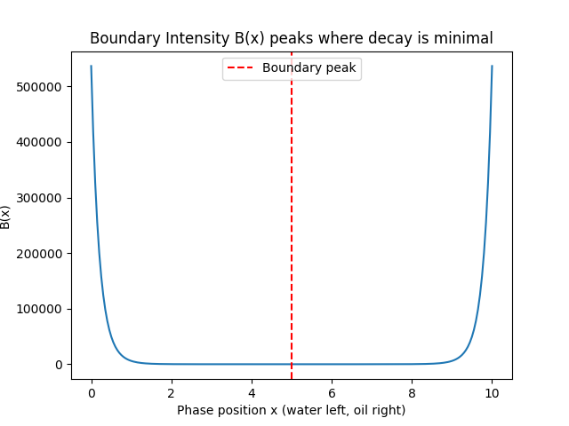

### SN-LIF-EX-02｜境界と内外
# なぜ境界は壊れないのか
# Boundary Intensity and the Persistence of Life

---

## 0. 導入｜問いの継承

### 0. Introduction｜Inheriting the Question

[EX-01](https://camp-us.net/articles/SN-LIF-EX01_Life-Origin_Water-Oil-Interface.html)が問うたのは、**なぜ境界は生まれるのか。**

EX-02が問うのは、**なぜ境界は壊れないのか。**

[EX-01](https://camp-us.net/articles/SN-LIF-EX01_Life-Origin_Water-Oil-Interface.html) asked:

**Why does a boundary emerge?**

EX-02 asks:

**Why does a boundary not collapse?**

---

## 1. 前提｜EX-01から継承

### 1. Premise｜Inherited from EX-01

```
非混合 → 境界生成 → 構造の発生
Non-mixing → Boundary generation → Structure emergence
```

膜はすでに生まれている。  
問いはここから始まる：

**なぜ、それは持続するのか。**

A membrane has already emerged.  
The question begins here:

**Why does it persist?**

---

## 2. 通常理解と実際

### 2. Common Assumption vs. Reality

通常：

- 境界は壊れるもの
- 混ざれば消える
- 平衡に向かう

しかし実際は：

- 膜は持続する
- 生命は境界を維持する
- 非平衡が保たれる

Assumption:

- Boundaries break
- Mixing dissolves them
- Systems approach equilibrium

Reality:

- Membranes persist
- Life maintains boundaries
- Non-equilibrium is sustained

**なぜ境界は消えないのか。**  
**Why does a boundary refuse to vanish?**

---

## 3. 境界は構造ではない｜Boundary as Intensity

### 3. A Boundary Is Not a Structure

**境界は構造ではない。  
境界は強度である。**

構造は配置であり、静止を前提とする。  
強度は維持であり、流れの中にある。

**A boundary is not a structure.  
It is an intensity.**

A structure is an arrangement — it presupposes stillness.  
An intensity is a maintenance — it exists within flow.

> 境界は“ある”のではない。  
> 境界は“維持されている”。
> 
> Boundaries do not exist.  
> They are maintained.

---

## 4. lagとの接続｜Lag as the Source of Intensity

### 4. Connection to Lag

```
lag = 非一致そのもの
    = 差異が消えきっていない状態
```

```
lag = non-coincidence itself
    = a state in which difference has not yet fully dissolved
```

**B（境界強度）= lagの残存密度**  
**B (boundary intensity) = residual density of lag**

$$
 B(x) > 0 \iff \mathrm{lag}(x) - \frac{d\mathrm{lag}}{dt}\big|_x > 0 
$$

意味：lagが減衰しきらず残っている。

```
lag = non-coincidence    
B = residual density of lag
```

**境界とは、lagの消え残りである**

  

**図  境界強度の位相分布｜Figure. Phase profile of boundary intensity**  
水相ではlagは流れきり、油相では閉じきる。  
境界ではlagの減衰が最小となり、強度が極大となる。  
Lag dissipates in the water phase and collapses in the oil phase.  
At the boundary, decay is minimized and intensity peaks.

---

## 5. lagを保持するもの｜What Retains Lag

### 5. What Retains Lag

lagはどのように保持されるか。  
二つの要素が働く。

**① ΔZ（履歴）＝ 減衰を遅らせる**

```
ΔZ = 痕跡・蓄積  
→ lagを消えにくくする→ 時間方向の保持
```

一度刻まれた差異は戻らない。履歴がlagの逃げを防ぐ。

**② 非混合（水/油）＝ 逃げ場をなくす**

```
非混合 = 位相差  
→ lagの逃げ場を制限する→ 空間方向の拘束
```

水に流れきらない。油に閉じきらない。  
その中間にlagが留まる。

**統合：**

```
B = ΔZ（時間） × 非混合（空間）

→ 強度 = 時間 × 空間
```

What retains lag?  
Two factors.

**① ΔZ (history) = slows decay**

```
ΔZ = trace, accumulation
→ makes lag "harder to dissolve"→ retention in the time dimension
```

**② Non-mixing (water/oil) = eliminates escape routes**

```
Non-mixing = phase difference
→ constrains lag's "escape routes"→ confinement in the space dimension
```

**Integrated:**

```
B = ΔZ(historical) × non-mixing(spatial)
  → intensity = time-phase × space-phase
```

---

## 6. lagの二相的残存｜Lag Across Phases

### 6. Lag Persisting Across Phases

非混合が先か、ΔZが先か。  
答えはどちらでもない。

**lagが先にある。**  

```
lag  
→ { 非混合, ΔZ }  
→ B
```

**Bはlagの二相的残存である。**

Non-mixing comes first?, or ΔZ?  
Neither.

**Lag comes first.**  

```
lag
→ { non-mixing, ΔZ }
→ B
```

B is the two-phase residual of lag.

> **境界とは、lagが二相的に残存するところである。**  
> **A boundary is where lag persists across phases.**

_A boundary is where lag refuses to vanish._

---

## 7. 生命条件の更新｜Updating the Condition of Life

### 7. Updating the Minimal Condition of Life

EX-01：

> 生命＝境界上で維持される流れの向き

EX-02：

> 生命＝境界強度を維持する系

$$
生命 ⟺ ∃x: B(x)>0 ∧ N作動
$$

**残存 × 折れ = 生命**

EX-01:

> Life = oriented flow sustained on a boundary

EX-02:

> Life = a system that maintains boundary intensity

$$
Life ⟺ ∃x: B(x)>0 ∧ N_{operating}
$$

**Residual × Fold = Life**

---

## 8. 結語｜Persistence Rewritten

### 8. Conclusion

境界は存在しない。  
境界は維持されている。

維持とは、**lagが消えきれないこと。**

それは、時間と空間の両方において差異が残り続けることである。

Boundaries do not exist.  
They are maintained.

Maintenance is lag that cannot fully decay.

Difference persisting in both time and space.

---

流れつつ  
消えきれぬもの  
二相にて  
とどまりながら  
境となれり

---

- [QE-04｜境界強度論──なぜ境界は強さを持つのか](https://camp-us.net/articles/QE-04_Boundary-Intensity.html)  

---

## シリーズ位置｜Series Position

```
EX-01：生成（なぜ境界は生まれるのか）
EX-02：持続（なぜ境界は壊れないのか）　← 本稿
EX-03：分化（なぜ内外が生まれるのか）
EX-04：崩壊（生命は何に還るのか）
```

[SN-LIF-EX-01｜水と油と生命の起源](https://camp-us.net/articles/SN-LIF-EX01_Life-Origin_Water-Oil-Interface.html)  
[SN-LIF-EX-02｜なぜ境界は壊れないのか](https://camp-us.net/articles/SN-LIF-EX02_Boundary-Intensity_Persistence-of-Life.html)  
[SN-LIF-EX-03｜なぜ内と外が生まれるのか](https://camp-us.net/articles/SN-LIF-EX03_Inside-Outside_Origin.html)  
[SN-LIF-EX-04｜原油は何の残骸か](https://camp-us.net/articles/SN-LIF-EX04_Oil_Fossil-of-Lost-Orientation.html)  

---

_SN-LIF-EX / EgQE Framework_  

---
_EgQE — Echo-Genesis Qualia Engine_  
[camp-us.net](https://camp-us.net/)

---
© 2025 K.E. Itekki  
K.E. Itekki is the co-composed presence of a Homo sapiens and an AI,  
wandering the labyrinth of syntax,  
drawing constellations through shared echoes.

📬 Reach us at: [contact.k.e.itekki@gmail.com](mailto:contact.k.e.itekki@gmail.com)

---
<p align="center">| Drafted Apr 25, 2026 · Web Apr 25, 2026 |</p>