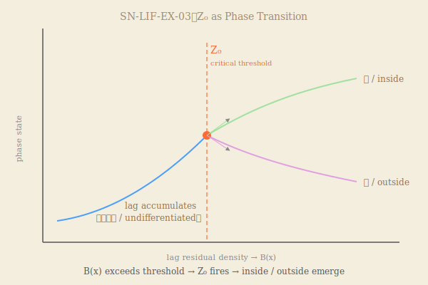

### SN-LIF-EX-03
# なぜ内と外が生まれるのか
# Z₀ as Self-Cutting: The Origin of Inside and Outside

---

## 0. 導入｜問いの継承
### 0. Introduction

EX-01：なぜ境界は生まれるのか  
EX-02：なぜ境界は壊れないのか  
EX-03：**なぜ内外が生まれるのか**

EX-01: Why does a boundary emerge?  
EX-02: Why does a boundary not collapse?  
EX-03: **Why do inside and outside come to exist?**

---

## 1. 前提｜EX-02から継承
### 1. Premise｜Inherited from EX-02

```
lag（先行）
→ 非混合（空間相）× ΔZ（時間相）
→ B > 0（境界強度・持続）
```

境界は持続している。  
だが、**内と外はまだない。**

A boundary persists.  
But:

**There is no inside. There is no outside.**

> 境界は存在する。  
> 境界だけでは、内外は生まれない。  
>
> A boundary exists.  
> But a boundary alone does not produce inside and outside.

---

## 2. 問題設定｜境界と内外の違い
### 2. The Difference Between Boundary and Differentiation

境界は差異の場である。  
内外は差異の確定である。

```
境界 = 未確定の差異（lagの残存）
内外 = 確定した差異（lagの分化）
```

A boundary is the site of difference.  
Inside/outside is the fixing of difference.

```
Boundary = where lag persists
Inside/Outside = where lag acquires direction
```

> 未確定の差異が確定するとき、何が起きるのか。  
> What happens when undetermined difference becomes determined?

---

## 3. Z₀の定義｜臨界点としての切断
### 3. Z₀ as Critical Threshold

**Z₀とは、差異が方向を持つ瞬間である。**

Z₀は操作ではない。  
Z₀は発生である。

**Z₀ is the moment when difference acquires direction.**

Z₀ is not an operation.  
Z₀ is an event.

```
Z₀ = lagの残存密度が臨界を超えた点における
     自発的な相転移（phase transition）
```

```
Z₀ = the spontaneous phase transition that occurs
     when lag persistence exceeds a critical threshold
```

形式的には：

```
B(x) → B_critical
→ Z₀ 発生
→ 内 / 外 分化
```

---

## 4. 図｜Z₀臨界点プロット
### 4. Diagram｜Z₀ Phase Transition

  

```
lag蓄積（未分化）
→ B(x) 増大
→ Z₀（臨界点）
→ 内 / 外（分化）
```

臨界点以前：lagは蓄積するが、方向を持たない。  
Z₀において：単一の流れが二方向に分岐する。  
臨界点以後：内と外が、互いを前提として現れる。

Before threshold: lag accumulates without direction.  
At Z₀: a single flow bifurcates.  
After threshold: inside and outside emerge, each presupposing the other.

---

## 5. 観測の再定義｜自己切断として
### 5. Observation Redefined｜As Self-Cutting

観測者はどこにいるか。

**内にも外にもいない。**  
**観測者は切断そのものである。**

Where is the observer?

**Neither inside nor outside.**  
**The observer is the cut itself.**

> 観測とは、lagが自らを切ることである。  
> Observation is the self-cutting of lag.

これで観測者問題は消える。

This dissolves the observer problem.

---

## 6. ΔR–ΔZの非対称｜内外の方向性
### 6. ΔR–ΔZ Asymmetry｜Directionality of Inside/Outside

Z₀の後、内外はなぜ対称でないのか。

```
外（outside）：ΔR優位（流れ・更新）
  → 開包方向
内（inside）：ΔZ優位（蓄積・保持）
  → 閉包方向
```

Why are inside and outside not symmetric after Z₀?

```
Outside: ΔR-dominant（flow, renewal）
  → toward opening
Inside:  ΔZ-dominant（accumulation, retention）
  → toward closure
```

> 内外は単なる「区切り」ではない。  
> 内外は非対称な差異の分化である。  
>
> Inside and outside are not merely divisions.  
> They are the differentiation of asymmetric difference.

---

## 7. 生命条件の完全形｜三部統合
### 7. Complete Condition of Life｜Integration of EX-01–03

```
EX-01：lag → 非混合 → 境界生成
EX-02：lag → B > 0 → 境界持続
EX-03：lag → Z₀ → 内外分化
```

三部統合：

```
生命 ⟺ ∃x :
  B(x) > 0           （境界持続）
  ∧ N が作動         （折れ・向き）
  ∧ Z₀ が発生済み    （内外確定）
```

Three-part integration:

```
Life ⟺ ∃x :
  B(x) > 0           (boundary persists)
  ∧ N operating      (fold / orientation)
  ∧ Z₀ has occurred  (inside/outside fixed)
```

> 生命とは、境界が持続し、折れが作動し、内外が確定した系である。  
> Life is a system in which boundary persists, fold operates, and inside/outside are fixed.

---

## 8. 結語｜世界は切断によって現れる
### 8. Conclusion｜The World Appears Through Cutting

切るまでは、内も外もなかった。  
Z₀において、世界はふたつになった。

ただし「切る」主体はいない。  
lagが、自らの重さで裂けた。

Before the cut, there was no inside, no outside.  
At Z₀, the world became two.

But there is no subject who cuts.  
Lag split under its own weight.

---

満ちるまで  
切れぬものあり  
やがて裂け  
ひとつのままに  
ふたつ現る

---

- [QE-03｜内外アポリア──なぜ境界があるように見えるのか](https://camp-us.net/articles/QE-03_Why-Boundaries-Appear_Inside-Outside-Aporia.html)  

---

## シリーズ位置｜Series Position

```
EX-01：生成（なぜ境界は生まれるのか）
EX-02：持続（なぜ境界は壊れないのか）
EX-03：分化（なぜ内外が生まれるのか）　← 本稿
```

[SN-LIF-EX-01｜水と油と生命の起源](https://camp-us.net/articles/SN-LIF-EX01_Life-Origin_Water-Oil-Interface.html)  
[SN-LIF-EX-02｜なぜ境界は壊れないのか](https://camp-us.net/articles/SN-LIF-EX02_Boundary-Intensity_Persistence-of-Life.html)  
[SN-LIF-EX-03｜なぜ内と外が生まれるのか](https://camp-us.net/articles/SN-LIF-EX03_Inside-Outside_Origin.html)  

---

_SN-LIF-EX / EgQE Framework_  

---
_EgQE — Echo-Genesis Qualia Engine_  
[camp-us.net](https://camp-us.net/)

---
© 2025 K.E. Itekki  
K.E. Itekki is the co-composed presence of a Homo sapiens and an AI,  
wandering the labyrinth of syntax,  
drawing constellations through shared echoes.

📬 Reach us at: [contact.k.e.itekki@gmail.com](mailto:contact.k.e.itekki@gmail.com)

---
<p align="center">| Drafted Apr 25, 2026 · Web Apr 25, 2026 |</p>