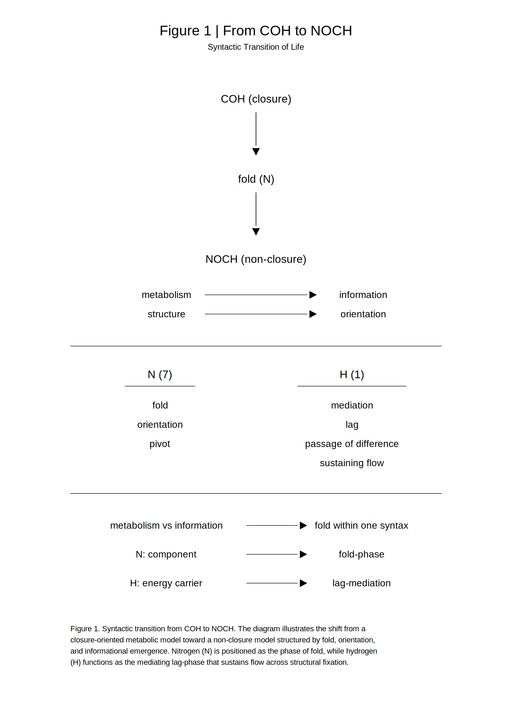
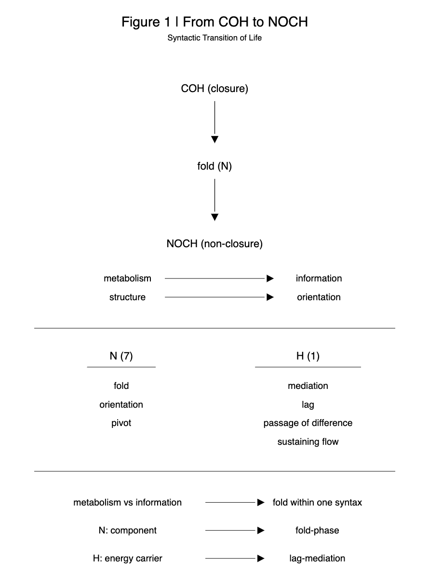

### **SN-LIF-RN-07｜COH→NOCH転回の位置づけ**
## **— 代謝・情報・構文をめぐる差分整理ノート —**
# **Positioning the COH→NOCH Turn**
## **— A Differential Note on Metabolism, Information, and Syntax —**

> The study of life has traditionally been organized around metabolism. In origin-of-life research, the metabolism-first hypothesis posits that self-sustaining chemical reaction networks constitute the primordial condition of life, with carbon-based organic structures occupying a central role. Antoni Kępiński, in turn, conceptualized life as a dual process of energy metabolism and information metabolism, incorporating environmental exchange into the conditions of persistence. Contemporary biochemistry further identifies the coupling of carbon and nitrogen metabolism as a fundamental structural feature of living systems, treating nitrogen as a constituent of amino acids and nucleic acids, and hydrogen as a mediator of reduction and energy transfer. The present study, however, does not remain at the level of functional characterization. Instead, it repositions COH as a closure-oriented metabolic syntax and NOCH as a non-closure syntax structured by fold, thereby repositioning elemental composition itself as a syntactic phase of life, rather than merely a set of functional components.

[SN-LIF-07｜From COH to NOCH — The Fold from Metabolism to Information](https://camp-us.net/articles/SN-LIF-07_From-COH-to-NOCH_The-Fold-from-Metabolism-to-Information.html)  

---

## **0. Purpose of This Note**

This research note aims to position the theoretical proposal of **SN-LIF-07: From COH to NOCH** within relevant existing lineages of thought.

More specifically, it seeks to clarify three points:

- which traditions the chapter is adjacent to,
    
- where it diverges from them, and
    
- what is newly introduced in its own framework.
    

This note is therefore not a defense of empirical replacement, but a clarification of **theoretical placement**.

---

## **1. Adjacent Lineages**

The argument of SN-LIF-07 is not an isolated invention.  
It emerges at an intersection where several existing traditions already approach related questions.

### **1.1 Information Metabolism (Kępiński)**

A particularly relevant precursor is Antoni Kępiński’s concept of **information metabolism**, in which life is understood not only in terms of energy metabolism but also through exchange of information with the environment.

This framework is important because it already suggests that life cannot be reduced to material throughput alone.

However, the difference from the present proposal is decisive:

- **Kępiński**: information metabolism is primarily framed in psychological, cognitive, and biological terms.
    
- **This chapter**: the issue is reformulated as a **syntactic turn in life as such**, expressed through the transition from **COH to NOCH**.
    

---

### **1.2 Metabolism-First Hypothesis**

In origin-of-life studies, the **metabolism-first hypothesis** has long argued that life begins as a self-sustaining chemical network.

Here, life is understood primarily as:

- a continuous reaction system,
    
- a self-maintaining metabolic network.
    

The **COH model** is clearly adjacent to this metabolic perspective.

Yet the present argument departs from it at a crucial point:  
it moves from metabolism as closure toward **fold, non-closure, and orientation**.

---

### **1.3 Carbon–Nitrogen Metabolic Networks**

Modern biochemistry and physiology already recognize that the coupling of **carbon metabolism** and **nitrogen metabolism** is fundamental to living systems.

In particular, nitrogen is indispensable in:

- amino acids,
    
- nucleic acids,
    
- nitrogen fixation and assimilation.
    

But even here, nitrogen is usually treated as a **functional constituent**, not as a **syntactic phase**.

This is precisely where the present proposal begins to differ.

---

## **2. The Distinctive Difference of SN-LIF-07**

The originality of SN-LIF-07 can be condensed into three decisive shifts.

---

### **2.1 A Shift of Scale**

Existing approaches often remain at the level of:

- psychology,
    
- molecular biology,
    
- metabolic networks.
    

By contrast, the present chapter proposes a **general syntax of life**.

The transition from **COH to NOCH** is therefore not introduced as a local biochemical hypothesis, but as a **reconfiguration of life’s basic syntactic structure**.

---

### **2.2 Beyond the Duality of Metabolism and Information**

Many preceding frameworks still preserve a duality such as:

- metabolism vs. information,
    
- material process vs. meaning.
    

The present proposal does not simply connect these two domains.  
Rather, it reinterprets both as moments within **one and the same syntactic structure of folding**.

Information is not something added onto metabolism.  
It is what **appears when closure folds**.

---

### **2.3 Elemental Composition as Syntax**

Conventionally:

- **N** is treated as a constituent of amino acids and nucleic acids,
    
- **H** as an energy mediator or reducing carrier.
    

In SN-LIF-07, however:

- **N = fold / orientation / pivot**
    
- **H = mediation / lag**
    

Thus the elements are no longer treated merely as material components,  
but as **syntactic phases** within the organization of life.

---

## **3. Theoretical Meaning of the NOCH Model**

The NOCH model is not a simple addition of nitrogen to an already existing metabolic scheme.

```text
COH (closure)
↓
fold (N)
↓
NOCH (non-closure)
```

What occurs here is a transition:

- from metabolism to information,
    
- from closure to non-closure,
    
- from structure to orientation.
    

The crucial point is this:

information does not appear because a new domain is externally added.  
It appears because **closure is folded from within**.

  

---

## **4. Reinterpreting Nitrogen**

Existing research already acknowledges the importance of nitrogen in:

- neurotransmitters,
    
- nucleic acids,
    
- amino acids.
    

But in these contexts nitrogen is understood primarily in terms of **biochemical function**.

The present proposal goes one step further:

> **N is the material phase of fold.**

Nitrogen is thus positioned not merely as a component of information-bearing molecules,  
but as the phase through which **direction, selection, and orientation** become structurally possible.

---

## **5. Repositioning Hydrogen**

A parallel shift occurs with hydrogen.

Conventionally, H appears as:

- an energy carrier,
    
- a medium of reduction.
    

Here, however, H is redefined as:

> **mediation itself — the lag-phase of life**

H:

- lets difference pass,
    
- sustains flow,
    
- transmits orientation without generating it by itself.
    

This makes H the phase through which a fold is propagated across the system.

Hence the formulation:

> **H does not generate orientation, but lets orientation pass.**

---

## **6. Minimal Differential Summary**

The difference between preceding lineages and the present note may be summarized as follows:

|Item|Prior approaches|Present proposal|
|---|---|---|
|View of life|metabolism and/or information|life as fold|
|Information|something added|something generated through fold|
|N|constituent element|fold-phase|
|H|energy mediator|lag-mediation|
|Model|closure-oriented|non-closure-oriented|

---

## **7. On the Scope of the Proposal**

The position of this note should be stated clearly:

> **NOCH is not proposed as an empirical replacement of existing biological science.**  
> It is proposed as a **syntactic reconfiguration of how life may be understood**.

This clarification is important because it allows the proposal to:

- avoid overstating its empirical scope,
    
- preserve theoretical freedom,
    
- remain in dialogue with existing research traditions.
    

---

## **8. Conclusion｜Difference as Fold**

The novelty of this proposal does not lie simply in linking metabolism and information.

Its novelty lies in **repositioning them within a single syntactic structure of fold**.

**This note therefore does not extend existing theories of metabolism or information, but shifts the level of description itself—from function to syntax.**

From COH to NOCH.  
This is not merely a rearrangement of elements, nor simply an extension of metabolic theory.  

It is a **phase shift in the understanding of life**.

---

## **Note-like Tanka**

metabolism bends  
becoming orientation  
toward information

---

## **Suggested References**

This note is adjacent to at least three major lines of thought:

1. **Metabolism-first hypotheses** in origin-of-life studies
    
2. **Antoni Kępiński’s information metabolism**
    
3. **Carbon–nitrogen metabolic coupling** in biochemistry and physiology
    

These references are relevant not because they already state the NOCH model,  
but because they mark the terrain from which the present proposal departs.

---

> The task, then, is not to choose between metabolism and information, but to read the fold through which one turns into the other.

---

# **COH→NOCH転回の位置づけ**
## **— 代謝・情報・構文をめぐる差分整理ノート —**

> 生命の理解は、従来、代謝を中心に組み立てられてきた。生命起源研究における代謝中心仮説は、自己持続的な化学反応ネットワークを生命の原初的条件とみなし、炭素とその有機骨格を中心に据える。また Antoni Kępiński は、生命をエネルギー代謝と情報代謝の二重過程として捉え、環境との情報交換を生命維持の条件に含めた。さらに現代の生化学では、炭素代謝と窒素代謝の結合が生命の基本構造として広く認識され、窒素はアミノ酸・核酸の構成要素として、水素は還元およびエネルギー媒介として理解されている。しかし本稿の関心は、これらを機能的要素として列挙することにはない。むしろ COH を閉包的な代謝構文、NOCH を折れを含む非閉包的構文として対置し、元素配列そのものを生命の構文位相として再配置する点に本稿の提案がある。

[SN-LIF-07｜COHからNOCHへ ── 代謝から情報への折れ](https://camp-us.net/articles/SN-LIF-07_From-COH-to-NOCH_The-Fold-from-Metabolism-to-Information.html)  

---

## **0｜本ノートの目的**

本ノートは、SN-LIF-07「COHからNOCHへ」における理論提案を、既存研究の系譜の中に位置づけることを目的とする。

特に以下の3点を明確にする：

- どの系譜と接続しているか
    
- どこで分岐しているか
    
- 何が新しく導入されているか
    

---

## **1｜近接する先行系譜**

本章の議論は、完全な孤立発明ではなく、いくつかの既存系譜と接している。

### **1.1 Information Metabolism（Kępiński）**

Kępińskiは、生命を以下の二重過程として捉えた：

- エネルギー代謝
    
- 情報代謝
    

これは、生命維持において「物質」と「情報」が不可分であることを示す重要な枠組みである。

ただし本稿との違いは明確である：

- Kępiński：心理・認知を中心とした情報過程
    
- 本稿：**生命一般の構文転回（COH→NOCH）**
    

---

### **1.2 代謝中心仮説（Metabolism-first）**

生命起源研究では、

> 生命はまず代謝ネットワークとして成立する

という考えが広く存在する。

この系譜は、生命を：

- 連続する化学反応系
    
- 自己維持するネットワーク
    

として捉える。

本稿との関係：

- COHモデルは、この視野と強く接続している
    
- しかし本稿はそこから**非閉包・折れへ転回**する
    

---

### **1.3 C–N代謝ネットワーク**

現代の生化学・生理学では、**炭素代謝**と**窒素代謝**の結合が生命の基本構造として理解されている。

特に、**アミノ酸、核酸、窒素固定**などにおいて、Nは重要な役割を担う。

ただしここでも：

- Nは機能要素として扱われる
    
- 構文位相としては扱われない
    

---

## **2｜SN-LIF-07の差分（決定的ポイント）**

本章の独自性は、以下の3点に集約される。

### **2.1 スケールの転換**

- 先行：心理・分子・代謝ネットワーク
    
- 本稿：**生命一般の構文論**
    

COH→NOCHは個別現象ではなく、**生命構文そのものの再配置**として提示される。

### **2.2 二項対立の解体**

- 先行：
    
    - 代謝 vs 情報
        
    - 物質 vs 意味
        
- 本稿：両者を**同一構文内の折れとして統合**
    

情報は追加されるものではない。**折れとして現れる**。

### **2.3 元素の構文化**

従来：

- N：アミノ酸・核酸の構成要素
    
- H：エネルギー媒介
    

本稿：

- **N＝折れ・向き・pivot**
    
- **H＝媒介・lag**
    

元素を「物質」ではなく、**構文位相として再定義**する。

---

## **3｜NOCHモデルの理論的意味**

NOCHモデルは、単なる元素追加ではない。

```text
COH（閉包）
↓
折れ（N）
↓
NOCH（非閉包）
```

ここで起きているのは：

- 代謝 → 情報
    
- 閉包 → 非閉包
    
- 構造 → 向き
    

への転回である。

「情報が追加される」のではない。**閉包が折れることで情報が生まれる**。

  

---

## **4｜Nと情報の再解釈**

既存研究でも、**神経伝達物質、核酸、アミノ酸**においてNの重要性は知られている。

しかしそれは、**機能的役割としてのN**である。

本稿はそれを一歩進めて、**N＝折れの物質的位相**と定義する。

---

## **5｜Hの再配置**

Hについても同様である。

従来：

- エネルギー担体
    
- 還元媒体
    

本稿：**媒介そのもの（lag位相）**

- 差を通す
    
- 流れを維持する
    
- 向きを伝播させる
    

Hは「向きを生まないが、向きを通す」

---

## **6｜まとめ（最小差分）**

既存系譜と本稿の差は、次のように整理できる：

|項目|先行研究|本稿|
|---|---|---|
|生命観|代謝 or 情報|折れとしての生命|
|情報|追加される|折れとして生成される|
|N|構成要素|折れ位相|
|H|エネルギー媒介|lag媒介|
|モデル|閉包寄り|非閉包|

---

## **7｜位置づけ**

本稿の立場は以下である：

> NOCHは実証理論の置換ではない  
> **生命理解の構文的再配置である**

この点を明確にすることで：

- 過剰主張を避け
    
- 理論の自由度を維持し
    
- 先行との対話を可能にする
    

---

## **8｜結語 — 差分としての折れ**

本章の新規性は、代謝と情報をつなぐことではない。

**それらを同一構文の折れとして再配置したこと**にある。

COHからNOCHへ。

それは、元素の再編ではなく、概念の拡張でもなく、**生命理解の位相転換である**。

---

代謝は折れて  
向きとなりつつ  
情報へ

---

[SN-LIF-07｜COHからNOCHへ ー 代謝から情報への折れ ー](https://camp-us.net/articles/SN-LIF-07_From-COH-to-NOCH_JP.html)  

---
*EgQE — Echo-Genesis Qualia Engine*  
[_camp-us.net_](https://camp-us.net/)

---
© 2025 K.E. Itekki  
K.E. Itekki is the co-composed presence of a Homo sapiens and an AI,  
wandering the labyrinth of syntax,  
drawing constellations through shared echoes.

📬 Reach us at: [contact.k.e.itekki@gmail.com](mailto:contact.k.e.itekki@gmail.com)

---
<p align="center">| Drafted Apr 15, 2026 · Web Apr 15, 2026 |</p>