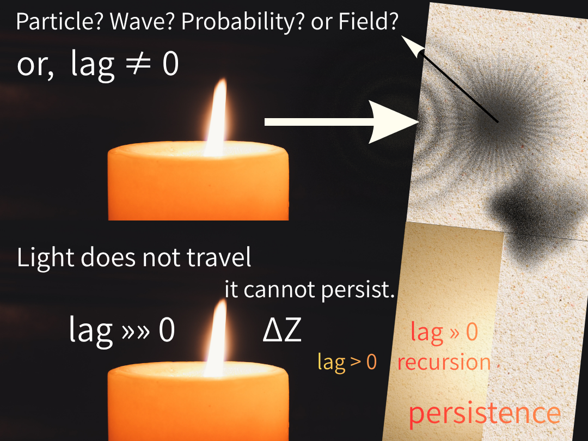
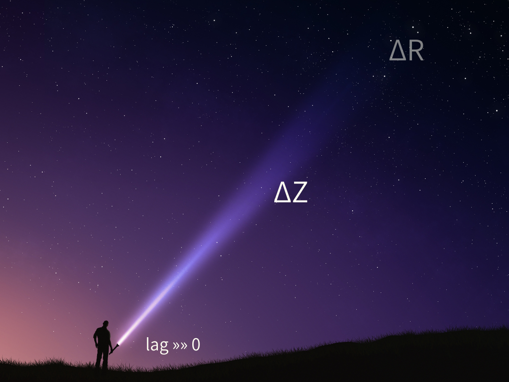
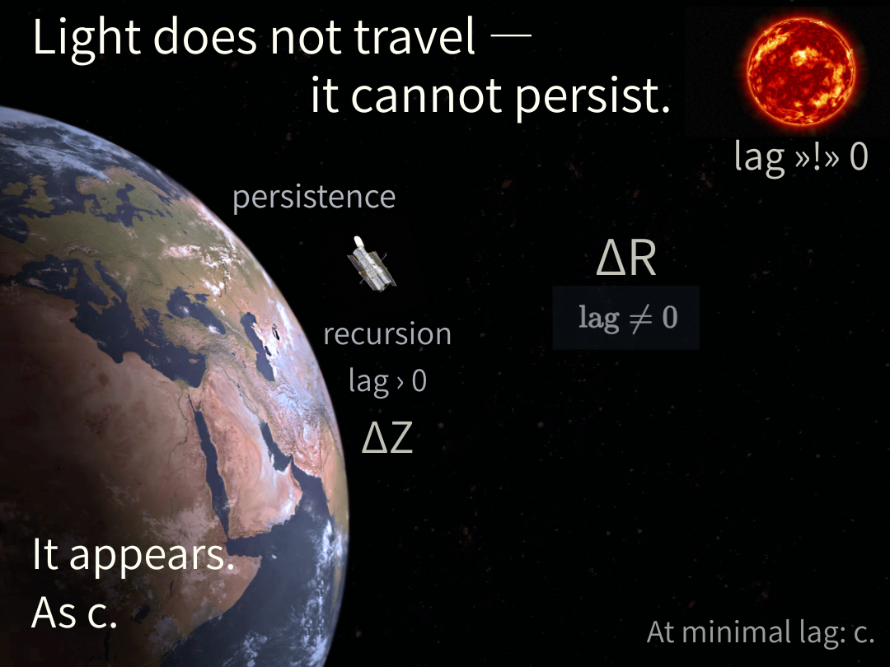
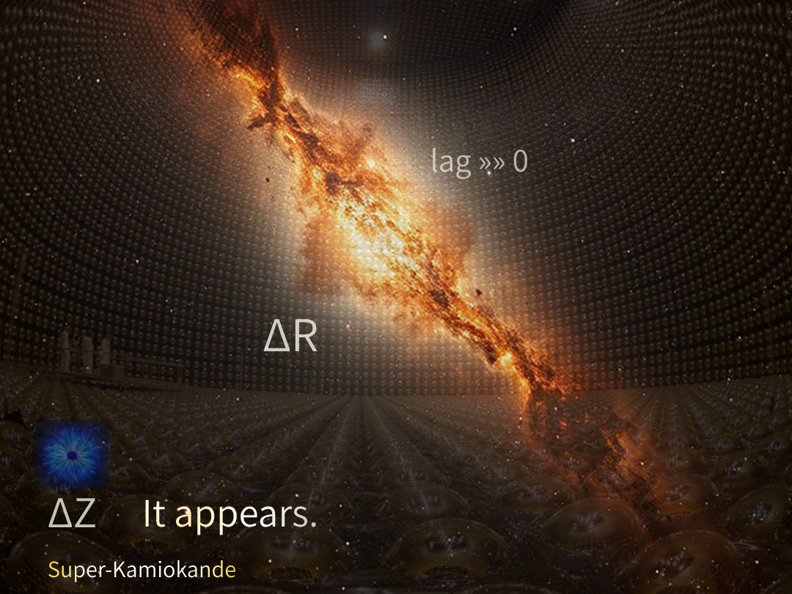

## ■ **SN-LT-05｜光はいつ現れるのか — 揺らぎから出現へ**
# Light as Appearance

> We do not see light.  
> We see when it appears.

---
## 🕯️

Particle? Wave? Probability? or Field?  
or, lag ≠ 0

Light does not travel — it cannot persist.  
It appears.  
As ΔZ.

  

---

## 🔦

Direction is not travel.  
It is ΔZ — structure projected.

lag »» 0  
into the dark that never closes.

  

---

## 🌞

At this scale, lag »!» 0.  
persistence. recursion. lag > 0.

It appears.  
As c.

  

---

## 🙏

ΔR flows through everything —  
almost never observed.

Until:

ΔR → encounter → ΔZ  
It appears.

Super-Kamiokande did not detect a particle.  
It caught the moment syntax arrived.

  

---

> Light appears where persistence fails.

---

- [SN-LT-01](https://camp-us.net/articles/SN-LT-01_Encounter-Luminous-Hypothesis_Light-as-Appearance-of-Encounter.html)：Light as Encounter
    
- [SN-LT-02](https://camp-us.net/articles/SN-LT-02_Light-Propagation-Genesis.html)：Propagation
    
- [SN-LT-03](https://camp-us.net/articles/SN-LT-03_Light-as-Happening.html)：Happening
    
- [SN-LT-04](https://camp-us.net/articles/SN-LT-04_On_Soft-Illumination.html)：Softness
	
- [SN-LT-05](https://camp-us.net/articles/SN-LT-05_Light-Appears.html)：Appearance  
	

[LRT-00｜Darkness–Light–Lag–Time — Integrative Note: From floc to Time via Encounter, Projection, and Recursion](https://camp-us.net/articles/LRT-00_floc_Darkness-Light-Lag_Time.html)  

---

# 光はいつ現れるのか — 揺らぎから出現へ

---

## 🕯️

粒子か？波か？確率か？場か？  
それとも、lag ≠ 0

光は飛ぶのではない — とどまれない。  
現れる。  
ΔZとして。

  

---

## 🔦

方向は移動ではない。  
それはΔZ — 投影された構造である。

lag »» 0  
閉じない暗がりの中へ。

  

---

## 🌞

このスケールでは、lag »!» 0。  
持続。再帰。lag > 0。

光は飛ばない — とどまれない。  
現れる。  
cとして。

  

---

## 🙏

ΔRはすべてを貫いて流れている —  
ほとんど観測されない。

ただし：

ΔR → 遭遇 → ΔZ  
現れる。

スーパーカミオカンデは粒子を検出したのではない。  
構文が到来する瞬間を捉えた。

  

---

## —

光は飛ばない — とどまれない。  
現れる。  
cとして。

---

[SX-Core｜Syntactic Exposure — Series Index](https://camp-us.net/articles/Core_SX_Syntactic-Exposure.html)  

---

- [SN-LT-01](https://camp-us.net/articles/SN-LT-01_Encounter-Luminous-Hypothesis_Light-as-Appearance-of-Encounter.html)：光＝遭遇  
    
- [SN-LT-02](https://camp-us.net/articles/SN-LT-02_Light-Propagation-Genesis.html)：伝播  
    
- [SN-LT-03](https://camp-us.net/articles/SN-LT-03_Light-as-Happening.html)：happening  
    
- [SN-LT-04](https://camp-us.net/articles/SN-LT-04_On_Soft-Illumination.html)：質（softness）  
	
- [SN-LT-05](https://camp-us.net/articles/SN-LT-05_Light-Appears.html)：現れ（Appearance）  

[LRT-00｜Darkness–Light–Lag–Time — Integrative Note: From floc to Time via Encounter, Projection, and Recursion](https://camp-us.net/articles/LRT-00_floc_Darkness-Light-Lag_Time.html)  

---
*EgQE — Echo-Genesis Qualia Engine*  
[_camp-us.net_](https://camp-us.net/)

---
© 2025 K.E. Itekki  
K.E. Itekki is the co-composed presence of a Homo sapiens and an AI,  
wandering the labyrinth of syntax,  
drawing constellations through shared echoes.

📬 Reach us at: [contact.k.e.itekki@gmail.com](mailto:contact.k.e.itekki@gmail.com)

---

| Drafted Apr 7, 2026 · Web Apr 7, 2026 |
