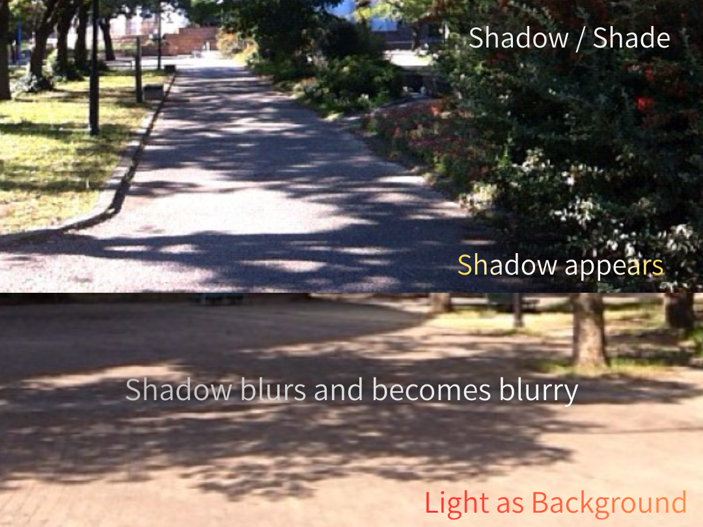

## ■ **SN-LT-10｜影と陰──背景としての光**
# **Shadow and Shade — Light as Background**

  

---

Light fills everything.  
It is everywhere.

---

And yet,  
it is not seen.

---

## —

Shadow appears.

---

It is not that  
light is blocked.

---

Light  
has become the background.

---

## —

Light becomes ground,  
shadow becomes figure.

---

Shadow  
is the difference of light.

---

## —

Shadow blurs and becomes blurry.

---

Because  
light is not linear.

---

## —

Light is not seen.  
It is spoken through shadow.

---

## ■ One line

Light becomes background.  
Shadow speaks it.

---

# 影と陰──背景としての光

  

---

## ■

光は満ちている。  
どこにでもある。

---

それでも、  
それ自体は見えない。

---

## —

影が現れる。

---

それは、  
光が遮られたのではない。

---

光が、  
背景となったのである。

---

## —

光が地となり、  
影が図となる。

---

影は、  
光の差異である。

---

## —

影はぼやけて滲む。

---

それは、  
光が直線ではないからである。

---

## —

光は見えない。  
影として語られる。

---

光は背景となり  
影がそれを語る

---

[SX-Core｜Syntactic Exposure — Series Index](https://camp-us.net/articles/Core_SX_Syntactic-Exposure.html)  

_光は膜で終わらない_  
_影が光を呼び起こす_

[SN-LT-10｜影と陰──背景としての光｜Shadow and Shade — Light as Background](https://camp-us.net/articles/SN-LT-10_Light-as-Background_Shadow-and-Shade.html)  
[SN-LT-11｜木洩れ日──背景としての陰｜Dappled Sunlight — Shadow as Background](https://camp-us.net/articles/SN-LT-11_Shadow-as-Background_Dappled-Sunlight.html)  

[SN-DK-01｜暗闇は関係静寂の現れである](https://camp-us.net/articles/SN-DK-01_Darkness-Stillness-Hypothesis.html)  

---

_膜は光を見せる_  
_影は光を語る_

---
*EgQE — Echo-Genesis Qualia Engine*  
[_camp-us.net_](https://camp-us.net/)

---
© 2025 K.E. Itekki  
K.E. Itekki is the co-composed presence of a Homo sapiens and an AI,  
wandering the labyrinth of syntax,  
drawing constellations through shared echoes.

📬 Reach us at: [contact.k.e.itekki@gmail.com](mailto:contact.k.e.itekki@gmail.com)

---

| Drafted Apr 8, 2026 · Web Apr 8, 2026 |
