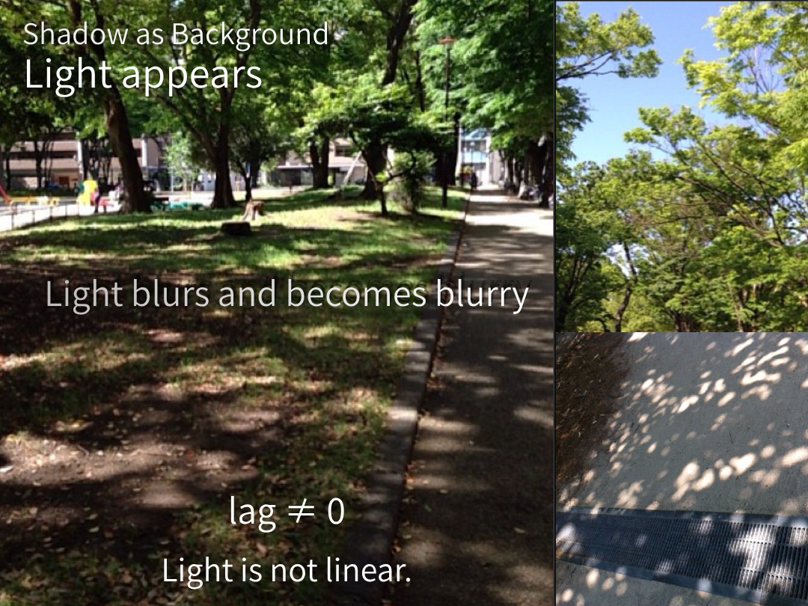

## ■ **SN-LT-11｜木洩れ日──背景としての陰**
# **Dappled Sunlight — Shadow as Background**

  

---

Shadow fills the space.

---

The world  
is already segmented.

---

## —

Light appears.

---

It is not that  
light has arrived.

---

Shadow  
has become the background.

---

## —

Shadow becomes ground,  
light becomes figure.

---

Light  
appears within shadow.

---

## —

Light blurs and becomes blurry.

---

Because  
it is never fully separated.

---

## —

Light does not proceed in a line.  
It appears through interruption.

---

## ■ One line

Shadow becomes background.  
Light appears within it.

---

# ■ **SN-LT-11｜木洩れ日──背景としての陰**

  

---

## ■

陰が満ちている。

---

空間は、  
すでに分割されている。

---

## —

光が現れる。

---

それは、  
光が来たのではない。

---

陰が、  
背景となったのである。

---

## —

陰が地となり、  
光が図となる。

---

光は、  
陰の中で現れる。

---

## —

光はぼやけて滲む。

---

それは、  
完全には分離されないからである。

---

## —

光は直進しない。  
途切れの中で現れる。

---

陰は背景となり  
光がそこに現れる

---

_膜は光を見せる_  
_影は光を語る_

---

[SX-Core｜Syntactic Exposure — Series Index](https://camp-us.net/articles/Core_SX_Syntactic-Exposure.html)  

_光は膜で終わらない_  
_影が光を呼び起こす_

[SN-LT-10｜影と陰──背景としての光｜Shadow and Shade — Light as Background](https://camp-us.net/articles/SN-LT-10_Light-as-Background_Shadow-and-Shade.html)  
[SN-LT-11｜木洩れ日──背景としての陰｜Dappled Sunlight — Shadow as Background](https://camp-us.net/articles/SN-LT-11_Shadow-as-Background_Dappled-Sunlight.html)  

[SN-DK-01｜暗闇は関係静寂の現れである](https://camp-us.net/articles/SN-DK-01_Darkness-Stillness-Hypothesis.html)  

---
*EgQE — Echo-Genesis Qualia Engine*  
[_camp-us.net_](https://camp-us.net/)

---
© 2025 K.E. Itekki  
K.E. Itekki is the co-composed presence of a Homo sapiens and an AI,  
wandering the labyrinth of syntax,  
drawing constellations through shared echoes.

📬 Reach us at: [contact.k.e.itekki@gmail.com](mailto:contact.k.e.itekki@gmail.com)

---

| Drafted Apr 8, 2026 · Web Apr 8, 2026 |
