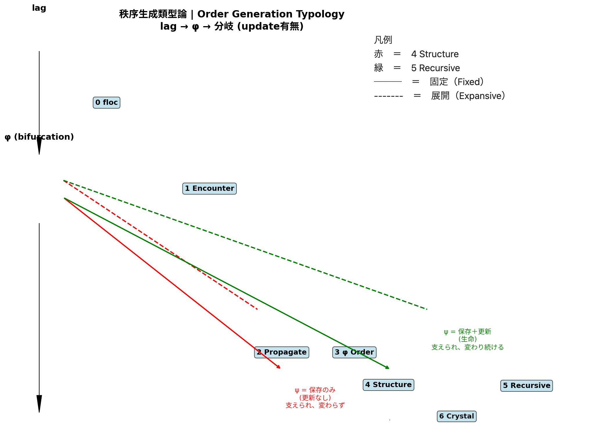
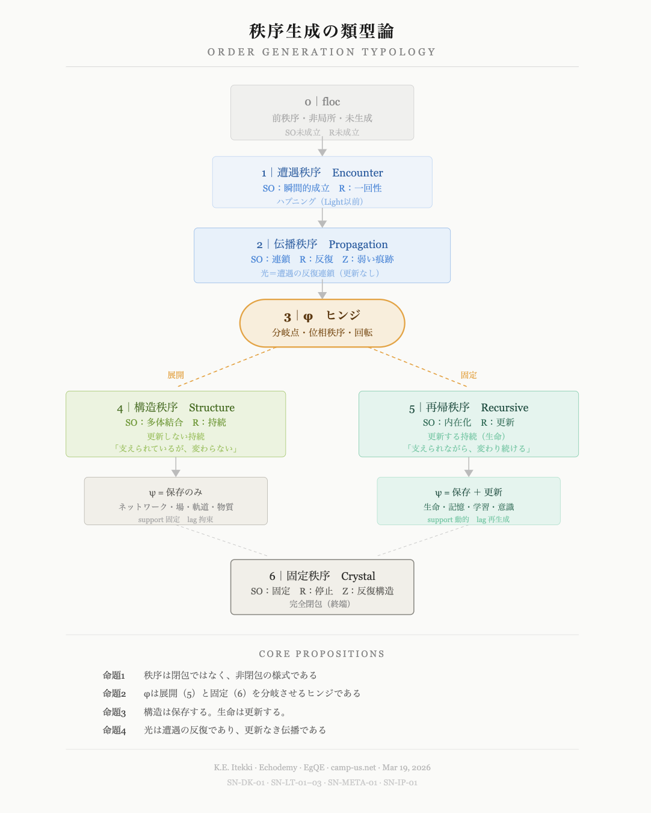

### SN-ORDER-01
# 秩序生成の類型論
## ── 黄金環φにおける分岐と更新の役割
# A Typology of Order as Modes of Lag
### — Bifurcation at φ and the Role of Update in Persistence —

> 秩序とは閉包ではない。  
> 秩序とは非閉包の様式である。  
> 宇宙は一度だけ分岐する。 
> それが φ である。

---

## Abstract

本稿は、秩序を「lagの様式」として類型化する。  

Cosmogonica の生成系列において、すべての秩序は φ において分岐する。

分岐の本質は一点に集約される：**更新なき持続（構造）か、更新を伴う持続（生命）か。**

この単一の分岐が、宇宙の秩序の多様性を生成する。

---

## 1｜命題

秩序とは閉包ではない。  
秩序とは非閉包の様式である。

より正確には：

> **秩序とは、lagがどのように拘束・循環・固定されるかの様式である**

### Thesis

Order is not closure.  
Order is a mode of non-closure.

More precisely:

> **Order is the mode by which lag is constrained, circulated, or fixed.**

---

## 2｜最小生成系列

```
lag  
→ 遭遇  
→ 伝播  
→ φ（分岐ヒンジ）
```

φ以前に秩序は存在しない。  
φ以後に秩序が分岐する。

### Minimal Generative Sequence

All orders emerge through the following sequence:

```
lag  
→ encounter  
→ propagation  
→ φ (bifurcation hinge)
```

Before φ, no stable order exists.  
After φ, order bifurcates.

---

## 3｜φにおける分岐

```
更新なき持続  
更新を伴う持続
```

### Bifurcation at φ

At φ, persistence splits into two fundamentally different regimes:

```
persistence without update  
persistence with update
```

This is the only essential bifurcation in the system.

---

## 4｜類型

0 floc（前秩序）  
1 遭遇  
2 伝播  
3 φ（ヒンジ）  
4 構造（更新なし）  
5 生命（更新あり）  
6 結晶（停止）

## Typology of Order

We define seven types (6 + 1 pre-order):

---

#### 0. floc (pre-order)

Non-local, pre-structural state.  
No SO, no R, no Z.

---

#### 1. Encounter

Momentary formation of relation.  
Non-repeatable.

---

#### 2. Propagation

Repetition of encounters without update.  
Light belongs to this regime.

> Light is not transmission.  
> It is repetition of encounters.

---

#### 3. φ-order (hinge)

The phase at which order bifurcates.  
Not a stable state, but a generative hinge.

---

#### 4. Structure

Persistence without update.

- network
    
- field
    
- orbit
    
- matter
    

> Structure persists, but does not update.

---

#### 5. Recursive Order (Life)

Persistence with update.

- memory
    
- learning
    
- cognition
    

> Life persists by updating.

Formally:

```
Life = Supported Updating Lag
```

---

#### 6. Crystal

Fully fixed order.

- repetition without change
    
- terminal closure
    

---

### Figure 1: **秩序生成の類型論図**（Order Generation Typology）
<svg xmlns="http://www.w3.org/2000/svg" viewBox="0 0 720 900" width="720" height="900" style="background:#fafaf8; font-family: 'Georgia', serif;">

  <!-- Title -->
  <text x="360" y="48" text-anchor="middle" font-size="18" font-weight="bold" fill="#1a1a1a" letter-spacing="2">秩序生成の類型論</text>
  <text x="360" y="68" text-anchor="middle" font-size="11" fill="#888" letter-spacing="3">ORDER GENERATION TYPOLOGY</text>
  <line x1="80" y1="80" x2="640" y2="80" stroke="#ccc" stroke-width="0.5"/>

  <!-- 縦軸ラベル -->
  <text x="28" y="200" text-anchor="middle" font-size="10" fill="#aaa" transform="rotate(-90, 28, 400)">生　成　の　流　れ</text>

  <!-- 0: floc -->
  <rect x="260" y="100" width="200" height="60" rx="4" fill="#f0f0ee" stroke="#ccc" stroke-width="0.5"/>
  <text x="360" y="122" text-anchor="middle" font-size="12" fill="#888">0｜floc</text>
  <text x="360" y="140" text-anchor="middle" font-size="10" fill="#aaa">前秩序・非局所・未生成</text>
  <text x="360" y="155" text-anchor="middle" font-size="9" fill="#bbb">SO未成立　R未成立</text>

  <!-- arrow down -->
  <line x1="360" y1="156" x2="360" y2="174" stroke="#bbb" stroke-width="1"/>
  <polygon points="360,178 355,170 365,170" fill="#bbb"/>

  <!-- 1: Encounter -->
  <rect x="240" y="178" width="240" height="56" rx="4" fill="#eef4fb" stroke="#b5d4f4" stroke-width="0.5"/>
  <text x="360" y="200" text-anchor="middle" font-size="12" fill="#185fa5">1｜遭遇秩序　Encounter</text>
  <text x="360" y="216" text-anchor="middle" font-size="10" fill="#378add">SO：瞬間的成立　R：一回性</text>
  <text x="360" y="231" text-anchor="middle" font-size="9" fill="#85b7eb">ハプニング（Light以前）</text>

  <!-- arrow down -->
  <line x1="360" y1="234" x2="360" y2="252" stroke="#bbb" stroke-width="1"/>
  <polygon points="360,256 355,248 365,248" fill="#bbb"/>

  <!-- 2: Propagation -->
  <rect x="220" y="256" width="280" height="60" rx="4" fill="#e6f1fb" stroke="#85b7eb" stroke-width="0.5"/>
  <text x="360" y="278" text-anchor="middle" font-size="12" fill="#185fa5">2｜伝播秩序　Propagation</text>
  <text x="360" y="294" text-anchor="middle" font-size="10" fill="#378add">SO：連鎖　R：反復　Z：弱い痕跡</text>
  <text x="360" y="309" text-anchor="middle" font-size="9" fill="#85b7eb">光＝遭遇の反復連鎖（更新なし）</text>

  <!-- arrow down -->
  <line x1="360" y1="312" x2="360" y2="330" stroke="#bbb" stroke-width="1"/>
  <polygon points="360,334 355,326 365,326" fill="#bbb"/>

  <!-- 3: φ hinge -->
  <rect x="270" y="334" width="180" height="52" rx="28" fill="#faeeda" stroke="#ef9f27" stroke-width="1.5"/>
  <text x="360" y="356" text-anchor="middle" font-size="13" font-weight="bold" fill="#633806">3｜φ　ヒンジ</text>
  <text x="360" y="374" text-anchor="middle" font-size="10" fill="#854f0b">分岐点・位相秩序・回転</text>

  <!-- fork lines -->
  <line x1="310" y1="386" x2="200" y2="430" stroke="#ef9f27" stroke-width="1" stroke-dasharray="4,3"/>
  <line x1="410" y1="386" x2="520" y2="430" stroke="#ef9f27" stroke-width="1" stroke-dasharray="4,3"/>

  <!-- label: 展開 / 固定 -->
  <text x="200" y="420" text-anchor="middle" font-size="9" fill="#ef9f27">展開</text>
  <text x="520" y="420" text-anchor="middle" font-size="9" fill="#ef9f27">固定</text>

  <!-- 4: 構造秩序 -->
  <rect x="80" y="434" width="240" height="72" rx="4" fill="#eaf3de" stroke="#97c459" stroke-width="0.5"/>
  <text x="200" y="456" text-anchor="middle" font-size="12" fill="#3b6d11">4｜構造秩序　Structure</text>
  <text x="200" y="472" text-anchor="middle" font-size="10" fill="#639922">SO：多体結合　R：持続</text>
  <text x="200" y="487" text-anchor="middle" font-size="9" fill="#97c459">更新しない持続</text>
  <text x="200" y="500" text-anchor="middle" font-size="9" fill="#97c459">「支えられているが、変わらない」</text>

  <!-- 5: 再帰秩序 -->
  <rect x="400" y="434" width="240" height="72" rx="4" fill="#e1f5ee" stroke="#5dcaa5" stroke-width="0.5"/>
  <text x="520" y="456" text-anchor="middle" font-size="12" fill="#085041">5｜再帰秩序　Recursive</text>
  <text x="520" y="472" text-anchor="middle" font-size="10" fill="#0f6e56">SO：内在化　R：更新</text>
  <text x="520" y="487" text-anchor="middle" font-size="9" fill="#5dcaa5">更新する持続（生命）</text>
  <text x="520" y="500" text-anchor="middle" font-size="9" fill="#5dcaa5">「支えられながら、変わり続ける」</text>

  <!-- arrows down from 4 and 5 -->
  <line x1="200" y1="506" x2="200" y2="524" stroke="#bbb" stroke-width="1"/>
  <polygon points="200,528 195,520 205,520" fill="#bbb"/>
  <line x1="520" y1="506" x2="520" y2="524" stroke="#bbb" stroke-width="1"/>
  <polygon points="520,528 515,520 525,520" fill="#bbb"/>

  <!-- converge lines to 6 -->
  <line x1="200" y1="580" x2="300" y2="614" stroke="#bbb" stroke-width="0.5" stroke-dasharray="3,3"/>
  <line x1="520" y1="580" x2="420" y2="614" stroke="#bbb" stroke-width="0.5" stroke-dasharray="3,3"/>

  <!-- 4b: sub note -->
  <rect x="100" y="528" width="200" height="52" rx="4" fill="#f1efe8" stroke="#b4b2a9" stroke-width="0.5"/>
  <text x="200" y="548" text-anchor="middle" font-size="10" fill="#5f5e5a">ψ = 保存のみ</text>
  <text x="200" y="564" text-anchor="middle" font-size="9" fill="#888">ネットワーク・場・軌道・物質</text>
  <text x="200" y="577" text-anchor="middle" font-size="8" fill="#aaa">support 固定　lag 拘束</text>

  <!-- 5b: sub note -->
  <rect x="420" y="528" width="200" height="52" rx="4" fill="#e1f5ee" stroke="#9fe1cb" stroke-width="0.5"/>
  <text x="520" y="548" text-anchor="middle" font-size="10" fill="#085041">ψ = 保存 ＋ 更新</text>
  <text x="520" y="564" text-anchor="middle" font-size="9" fill="#0f6e56">生命・記憶・学習・意識</text>
  <text x="520" y="577" text-anchor="middle" font-size="8" fill="#5dcaa5">support 動的　lag 再生成</text>

  <!-- 6: Crystal -->
  <rect x="260" y="618" width="200" height="60" rx="4" fill="#f1efe8" stroke="#888780" stroke-width="1"/>
  <text x="360" y="640" text-anchor="middle" font-size="12" fill="#2c2c2a">6｜固定秩序　Crystal</text>
  <text x="360" y="656" text-anchor="middle" font-size="10" fill="#5f5e5a">SO：固定　R：停止　Z：反復構造</text>
  <text x="360" y="670" text-anchor="middle" font-size="9" fill="#888">完全閉包（終端）</text>

  <!-- divider -->
  <line x1="80" y1="700" x2="640" y2="700" stroke="#ddd" stroke-width="0.5"/>

  <!-- 命題 -->
  <text x="360" y="724" text-anchor="middle" font-size="10" fill="#888" letter-spacing="2">CORE PROPOSITIONS</text>

  <text x="120" y="748" font-size="10" fill="#444">命題1</text>
  <text x="165" y="748" font-size="10" fill="#666">秩序は閉包ではなく、非閉包の様式である</text>

  <text x="120" y="768" font-size="10" fill="#444">命題2</text>
  <text x="165" y="768" font-size="10" fill="#666">φは展開（5）と固定（6）を分岐させるヒンジである</text>

  <text x="120" y="788" font-size="10" fill="#444">命題3</text>
  <text x="165" y="788" font-size="10" fill="#666">構造は保存する。生命は更新する。</text>

  <text x="120" y="808" font-size="10" fill="#444">命題4</text>
  <text x="165" y="808" font-size="10" fill="#666">光は遭遇の反復であり、更新なき伝播である</text>

  <!-- divider -->
  <line x1="80" y1="825" x2="640" y2="825" stroke="#ddd" stroke-width="0.5"/>

  <!-- footer -->
  <text x="360" y="848" text-anchor="middle" font-size="9" fill="#bbb">K.E. Itekki · Echodemy · EgQE · camp-us.net · Mar 19, 2026</text>
  <text x="360" y="864" text-anchor="middle" font-size="9" fill="#ccc">SN-DK-01 · SN-LT-01–03 · SN-META-01 · SN-IP-01</text>

</svg>
_Figure 1: The bifurcation of order at φ. Structure preserves without update; Life persists through update. Both converge at Crystal as terminal closure._

---

## 5｜核心命題

> 構造は保存する。  
> 生命は更新する。

### Core Distinction

The essential difference between structure and life is:

> **Structure preserves.  
> Life updates.**

---

## 6｜動力学的解釈

- update = 0 → 固定へ
    
- update > 0 → 持続
    

### Dynamic Interpretation

The bifurcation can be understood as a divergence in persistence dynamics:

- update = 0 → decay toward crystallization
    
- update > 0 → sustained recursive persistence
    

Thus:

> **Life is not a structure, but a modification of temporal gradient.**

---

### Figure 2: 秩序生成の類型論マップ（Lag-Persistence Phase Diagram）

> lag生成軸 × 類型0-6、φ分岐点にて「更新有無」で構造/生命へ二分。  
> 光=伝播秩序(2)、Life=Supported Updating Lag(5)。


  
_Figure 2: 秩序生成の類型論マップ（Lag-Persistence Phase Diagram）_  
_縦軸はlagの深度（生成の流れ）、横軸は類型（0–6）を示す。φにおいて秩序は二系列に分岐する。赤＝4 Structure（更新なき持続）、緑＝5 Recursive（更新する持続）。実線は各類型の固定的側面、点線は展開的側面を表す。4と5はいずれも固定と展開の両側面を持ちながら、φ以後の異なる持続様式として展開する。6 Crystalは両系列の終端としての完全閉包を示す。_

_縦軸: depth of lag (generative flow) / 横軸: typological sequence (0–6) / φ: bifurcation hinge / Red = 4 Structure (persistence without update) / Green = 5 Recursive (persistence with update) / Solid line = fixed aspect / Dashed line = expansive aspect_

---

### Proposition

1. 秩序は非閉包の様式である  
2. φは分岐のヒンジである  
3. 構造は更新なく保存する  
4. 生命は更新することで持続する  
5. 光は更新なき遭遇の反復である 

---

1. Order is a mode of non-closure.
    
2. φ is the hinge of bifurcation.
    
3. Structure preserves without updating.
    
4. Life persists through updating.
    
5. Light is repetition without update.
    

---

## 7｜結語

宇宙は無限に分岐しない。

一度だけ分岐する。

それが φ である。

### Conclusion

The universe does not diversify endlessly.

It bifurcates once.

At φ.

After that:

- some orders stop
    
- some continue
    

All diversity of order emerges from this single bifurcation.

---

### SN-ORDER-01
# A Typology of Order as Modes of Lag
### — Bifurcation at φ and the Role of Update in Persistence —

> 秩序とは閉包ではない。秩序とは非閉包の様式である。  
> 宇宙は一度だけ分岐する。 
> それが φ である。

---

## 1. Thesis

Order is not closure. Order is a mode of non-closure.

More precisely:

> **Order is the mode by which lag is constrained, circulated, or fixed.**

---

## 2. Minimal Generative Sequence

All orders emerge through the following sequence:

```
lag
↓
Encounter
↓
Propagation
↓
φ（bifurcation hinge）
```

φ以前に安定した秩序は存在しない。 φ以後に秩序が分岐する。

---

## 3. Bifurcation at φ

At φ, persistence splits into two fundamentally different regimes:

```
φ
├ persistence without update　→　Structure[4]
└ persistence with update　　→　Life[5]
```

This is the only essential bifurcation in the system.

---

## 4. Typology of Order

  

```
lag → φ (bifurcation)
     ├─ [4] Structure (ψ保存のみ)
     └─ [5] Life (ψ保存+更新)
[0]floc →[1]Encounter →[2]Propagate →[3]φ → [分岐] →[6]Crystal
```

---

### 0｜floc（前秩序）

Non-local, pre-structural state. No SO, no R, no Z.

非局所・未生成。

---

### 1｜Encounter（遭遇秩序）

Momentary formation of relation. Non-repeatable.

SO：瞬間的成立　R：一回性　Z：残らない

---

### 2｜Propagation（伝播秩序）

Repetition of encounters without update.

SO：連鎖　R：反復　Z：弱い痕跡

> Light is not transmission. It is repetition of encounters.

光は遭遇の反復であり、更新なき伝播である。

---

### 3｜φ-order（ヒンジ）

The phase at which order bifurcates. Not a stable state, but a generative hinge.

位相秩序・回転・分岐点そのもの。

---

### 4｜Structure（構造秩序）

Persistence without update.

$$\psi = \text{preservation only}$$

- network / field / orbit / matter
- support 固定　lag 拘束

> 「支えられているが、変わらない」

---

### 5｜Recursive Order（再帰秩序・生命）

Persistence with update.

$$\psi = \text{preservation} + \text{update}$$

- memory / learning / cognition
- support 動的　lag 再生成

$$\text{Life} = \text{Supported Updating Lag}$$

> 「支えられながら、変わり続ける」

---

### 6｜Crystal（固定秩序）

Fully fixed order. Repetition without change. Terminal closure.

SO：固定　R：停止　Z：反復構造

完全閉包（終端）。

---

```
0 floc（前秩序）
↓
1 Encounter（遭遇）
↓
2 Propagation（伝播）
↓
3 φ（ヒンジ・分岐点）
	↙　　　　　　↘
4 Structure　　5 Recursive（Life）
更新なき持続　　更新する持続
	↘　　　　　　↙
6 Crystal（固定・終端）
```

---

## 5. Core Distinction

The essential difference between structure and life is:

> **Structure preserves.** **Life updates.**

---

## 6. Dynamic Interpretation

- update = 0 → decay toward crystallization
- update > 0 → sustained recursive persistence

Thus:

> Life is not a structure, but a modification of temporal gradient.

---

## 7. Propositions

1. Order is a mode of non-closure.
    
2. φ is the hinge of bifurcation.
    
3. Structure preserves without updating.
    
4. Life persists through updating.
    
5. Light is repetition without update.
    

---

## Conclusion

The universe does not diversify endlessly.

It bifurcates once.

At φ.

After that:

- some orders stop
    
- some continue
    

All diversity of order emerges from this single bifurcation.


宇宙は無限に分岐しない。

一度だけ分岐する。

```
φ
├ 構造（止まる）
└ 生命（続く）
```

それが φ である。

---
© 2025 K.E. Itekki  
K.E. Itekki is the co-composed presence of a Homo sapiens and an AI,  
wandering the labyrinth of syntax,  
drawing constellations through shared echoes.

📬 Reach us at: [contact.k.e.itekki@gmail.com](mailto:contact.k.e.itekki@gmail.com)

---
<p align="center">| Drafted Mar 19, 2026 · Web Mar 19, 2026 |</p>